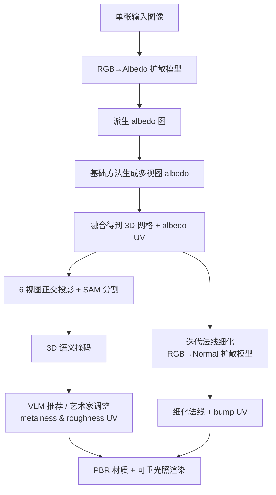

## 一句话总结

提出一个即插即用的后处理框架，为任意"单图生成 3D"方法产出的网格补上 PBR 材质（albedo、roughness、metalness、bump），并通过迭代法线细化显著改善几何细节，使生成物体能在多种光照下真实重光照。

## 研究背景

单图生成 3D（image-to-3D）近年来借助扩散模型快速发展，通常先把输入图像扩展为多视图图像，再融合成带纹理的 3D 网格。但现有方法存在两个根本缺陷：

- **只有纹理、没有材质**：仅有 RGB 纹理而缺乏 PBR 材质，无法在不同光照下真实渲染，也限制了下游应用（游戏、影视、AR/VR）和灵活的外观编辑。
- **几何与高频纹理错位**：生成网格的几何质量偏低，与纹理的高频细节不对齐，即使勉强赋予材质，在新光照下也会出现不真实的伪影。

本文从 Physics-Based Rendering（PBR）材质的角度切入，选取 albedo、roughness、metalness、bump 四个分量，分别用不同策略处理，从而同时提升物体的真实感、可重光照能力与几何细节。

## 方法

整体是一个与具体生成方法解耦的即插即用管线：给定单张图像，先用微调后的扩散模型把它转成 albedo 图，再交给待增强的基础方法生成多视图 albedo 并融合成网格与 albedo UV；随后借助 3D 语义掩码获得 metalness/roughness UV，并通过迭代法线细化修复原始瑕疵法线。

**关键设计一：albedo 与 normal 估计（微调 Stable Diffusion）。** 把单图当作图到图翻译问题，用 Stable Diffusion 的数据先验实现零样本估计。将输入图像经 VAE 编码为潜码 $$z_i$$，与噪声潜码拼接后送入 U-Net：

$$\hat{\epsilon}_{task} = g_{task}(z_t \Vert z_i;\, s_\varnothing, t),\quad task \in \{normal, albedo\}$$

其中 $$\Vert$$ 为拼接算子，$$s_\varnothing$$ 为空文本嵌入。为支持拼接输入，将 U-Net 首个卷积层的输入通道数翻倍（复制通道零初始化）。作者发现同一网络共享做两个任务会略微退化，因此分别训练 $$g_{normal}$$ 与 $$g_{albedo}$$。

**关键设计二：一致的多视图 albedo 派生。** 直接把 image-to-albedo 模型套用到多视图 RGB 会得到不一致的 albedo。改为先把输入单图转成 albedo，再以此 albedo 为条件生成多视图 albedo（albedo 可视为几乎无噪的干净图像），最后融合出网格与 albedo UV。

**关键设计三：半自动 metalness/roughness 生成。** 依据"语义相似区域材质值应一致"的先验，将网格投影到 6 个正交视图并用 Segment-Anything-Model 分割，通过重叠区域投票整合成 3D 语义掩码；再让 Gemini 等 VLM 推荐各语义部件的 metalness/roughness 值（也可由 3D 艺术家手动调整），扩展到整个物体形成完整 UV。

**关键设计四：迭代法线细化。** 用一个哈希网格位置编码 + MLP $$\Gamma$$（参数 $$\theta$$）预测 bump 图，与原始瑕疵法线 $$n_o$$ 结合得到细化法线：

$$n_b(\theta) = \Gamma(\beta(p);\theta),\quad n_f(\theta) = n_o \oplus n_b(\theta)$$

其中 $$\oplus$$ 表示法线积分操作。利用 image-to-normal 扩散模型从 albedo 派生目标法线：把 $$n_f(\theta)$$ 与 albedo 编码为潜码，对法线潜码加噪后与 albedo 潜码拼接预测噪声：

$$\epsilon_{normal} = g_{normal}\big(z_n + \epsilon(t_0) \Vert z_a;\, s_\varnothing, t_0\big)$$

解码得到伪真值 $$n_{tgt}$$，再用逐像素 MSE 优化 bump 图：

$$L_{MSE} = \Vert n_f(\theta) - n_{tgt}\Vert_2^2$$

## 实验结果

在四个 reconstruction-based 基础方法（CRM、InstantMesh、TripoSR、Wonder3D）上做增强。用户研究收集 60 名参与者对 20 个物体、80 组两两对比的偏好，评估法线质量与重光照自然度：

| 方法 | CRM | InstantMesh | TripoSR | Wonder3D | 总计 |
| --- | --- | --- | --- | --- | --- |
| base 偏好 (%) | 9.55 | 14.25 | 17.46 | 25.50 | 16.49 |
| boosting 偏好 (%) | 90.45 | 85.75 | 82.54 | 74.50 | 83.51 |

在全部四个基础方法上，用户对增强后结果的偏好都占绝对多数（总计 83.51% vs 16.49%）。可用性研究（2 名专业艺术家 + 8 名非专业用户）普遍认为该工具显著提升 3D 物体质量；耗时方面基础模型约 25 分钟、增强约 5 分钟，主要开销在与 SAM 交互生成 3D 语义掩码的阶段。

## 亮点与局限

**亮点**

- 即插即用、与生成过程解耦，可兼容任意单图生成 3D 方法（已验证 Wonder3D、CRM、InstantMesh、TripoSR，以及优化式的 DreamCraft3D、Era3D）。
- 用扩散先验做 albedo/normal 估计，能有效去除高光与阴影，产出干净 albedo 与细致法线。
- 半自动 metalness/roughness 流程为交互式调整留出空间，更贴合真实 3D 内容创作工作流。
- 迭代法线细化显著减少几何瑕疵、并避免 TripoSR 那种"伪造几何细节"的问题。

**局限**

- image-to-albedo 模型存在随机性，导致 RGB 图与 albedo 之间存在色彩偏差；精度受数据集与扩散先验能力限制，不保证对所有图像精确。
- 通过"albedo→normal"预测来优化 bump 图并非完全合理：对单色物体，albedo 退化为色块、缺乏几何信息，会导致 image-to-normal 预测失败。
- 基础模型仅产出三角网格，格式未必满足专业工作流；整体流程耗时较长。

## 延伸思考

- 半自动的 metalness/roughness 依赖 VLM 推荐与人工调整，若能训练直接预测材质值并输出 3D 掩码的模型，可省去 SAM 交互这一主要耗时环节。
- "albedo 作为干净图像来引导多视图生成"的观察值得推广——把中间表征选成低噪声的内在属性图，可能是提升多视图一致性的通用思路。
- 针对单色物体法线预测失败的问题，或可引入几何/深度线索联合监督，而非单纯依赖 albedo→normal 的映射。
