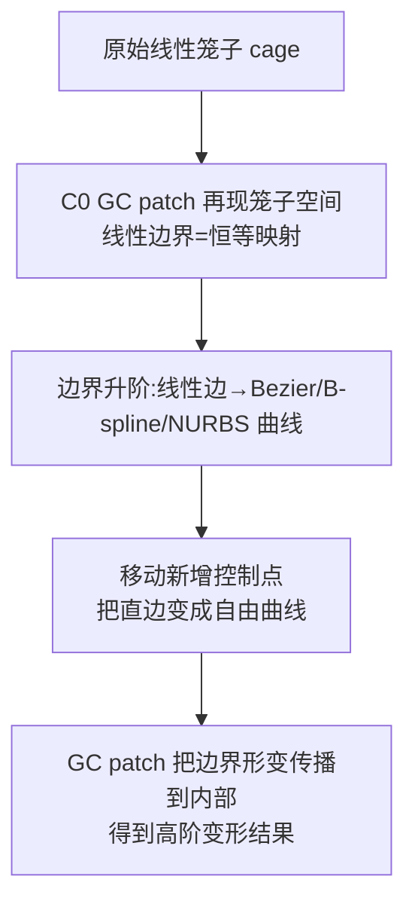

## 一句话总结

提出一种基于广义重心坐标的多边形/多面体参数化透射插值曲面——$$C^0$$ 广义 Coons（GC）patch，它统一并推广了矩形与三角 Coons patch，并以此实现"无内部控制点、支持任意拓扑"的高阶笼形变形（high-order cage-based deformation）。

## 研究背景

空间变形（space deformation）通过变形嵌入空间来间接变形其中的物体，主流有两条路线：

- **自由变形（FFD）**：用张量积 Bézier/B-spline 体包裹物体，天然支持高阶变形，但平行六面体格子难以贴合复杂模型，且带来大量难以操纵的内部控制点。
- **笼形变形（CBD）**：用一个贴合物体的粗控制网格（cage）作为嵌入空间，借助广义重心坐标（GBC）表达，避免了内部控制点；但它在边界上是分段线性（非光滑）的。用户若想增加自由度只能细分笼子，需要重算坐标，且细分后边界仍是分段线性。

论文指出，两条路线其实可以统一看待：2D 的 FFD 可以解释为"对四边形笼子做广义重心插值后再升阶"。沿这个视角，把笼子升阶会得到 S-patch，但 S-patch 会引入大量位于内部的控制点（见下表 S-patch 控制点数），从用户交互角度并不实用。

由于 CBD 本就不需要内部控制，作者转向 CAGD 中的另一类方法——**透射插值（transfinite interpolation）**，其典型代表就是 Coons patch。透射插值"缺乏内部控制"的缺点恰好是 CBD 所需要的。但用于 CBD 的透射插值必须同时满足两个要求：

- **任意拓扑**：笼子形状由模型和用户决定，无拓扑约束。
- **线性再现（linear reproduction）**：在原始（线性）笼子上必须是恒等映射，从而回避原始笼子空间的参数化难题。

已有的透射插值曲面（多为解决曲面孔洞填补而设计，需处理跨边界导数与角点扭矩）无法同时满足这两点。作者的关键观察是：用 **GBC 作为参数** 就能像 S-patch 那样间接满足线性再现（他们称之为"广义重心再现"，generalized barycentric reproduction）。

| S-patch 升阶（5 边形）| 控制点总数 | 内部控制点 |
|---|---|---|
| 线性 | 5 | 0 |
| 二次 | 15 | 5 |
| 三次 | 35 | 20 |

## 方法

### 整体框架

核心思路分两步：先用带**线性边界**的 $$C^0$$ GC patch 精确再现整个笼子空间（恒等映射），再通过修改这些边界曲线来变形笼子空间。

### 关键设计 1：Coons patch 的曲线型 Boolean 和重表达

原始 $$C^0$$ Coons patch 由四条边界曲线通过"曲面型 Boolean 和"构造：

$$
S_{Coons}(u,v) = S_u + S_v - S_{uv}
$$

作者把双线性坐标 $$\lambda_k$$ 代入，将其改写为只依赖边界曲线的**曲线型 Boolean 和**形式（每个角点在两条曲线上被算了两次，故减一次）：

$$
S_{Coons}(x,y) = \sum_{k=1}^{4}(\lambda_k+\lambda_{k+1})\cdot C_k\!\left(\frac{\lambda_{k+1}}{\lambda_k+\lambda_{k+1}}\right) - \sum_{k=1}^{4}\lambda_k\cdot p_k
$$

其中 $$\frac{\lambda_{k+1}}{\lambda_k+\lambda_{k+1}}$$ 可理解为把域内点投影到第 $$k$$ 条边的参数化（需要 GBC 非负以保证落在 $$[0,1]$$）。这个新表达不再依赖具体的双线性坐标，因而可以定义在凹四边形上（用均值坐标 MVC 避免翻折）。

### 关键设计 2：多边形/高维/非流形推广

上式可直接推广到 $$n$$ 边形。给定 $$n$$ 条首尾相连的边界曲线，域 $$\Omega$$ 为 $$n$$ 边形，则 $$C^0$$ GC patch 为：

$$
S_{GC}(x,y) = \sum_{k=1}^{n}(\lambda_k+\lambda_{k+1})\cdot C_k\!\left(\frac{\lambda_{k+1}}{\lambda_k+\lambda_{k+1}}\right) - \sum_{k=1}^{n}\lambda_k\cdot p_k
$$

**广义重心再现定理**：当输入边界恰为域多边形的直边 $$C_k(t)=(1-t)v_k+t\,v_{k+1}$$ 时，GC patch 退化为广义重心插值 $$\sum_k \lambda_k v_k$$（即恒等映射），这正是 CBD 所需的线性再现性质。

进一步推广到高维/非流形拓扑，按边求和并按顶点度数 $$d_k$$ 修正第二项：

$$
S_{GC}(x) = \sum_{e_{i,j}\in E}(\lambda_i+\lambda_j)\cdot C_{i,j}\!\left(\frac{\lambda_j}{\lambda_i+\lambda_j}\right) - \sum_{k=1}^{n}(d_k-1)\cdot\lambda_k\cdot p_k
$$

只要所用 GBC（如谐波坐标 HC）在非流形拓扑上有良好定义，孤立顶点（度数 0）、内部边、内部面都能被正确处理。GC patch 也可看作 Charrot–Gregory patch 和 ribbon-based $$C^1$$ GC patch 在子片/ribbon 退化为曲线时的一般 $$C^0$$ 情形。

### 关键设计 3：用自由曲线做高阶变形 + 伪四边形笼

- **自由曲线变形**：线性边 $$C_k(t)$$ 本质是 1 次 Bézier 曲线，通过 Bézier 升阶获得更多控制点后拖动即可弯曲；也可转成开放均匀节点向量的三次 B-spline（局部支撑），或引入权重得到 NURBS（如把直边变成精确四分之一圆，权重取 $$(1,(1+\sqrt2)/3,(1+\sqrt2)/3,1)$$）。
- **伪四边形笼变形（pseudo-quad CBD）**：多数 3D GBC 依赖三角笼，但四边形笼直接三角化会因分割边（splitting edge）的非光滑而产生三角化伪影。作者只手动更新四边形四个顶点，自动把线性分割边映射到由更新后顶点确定的双线性面的对角曲线，并加位移保证顶点回到初始位置时分割边能退回原线性形态：$$\widetilde{C}_{i_k,i_5}=\widehat{C}_{i_k,i_5}+(e_{i_k,i_5}-C_{i_k,i_5})$$，从而显著减少三角化伪影。

## 实验结果

论文以定性对比为主。下表汇总与已有高阶 CBD 方法的能力对比（忠于原文 Table 1）：

| 方法 | 2D | 高维 | 非流形拓扑 | 笼子/边界类型 |
|---|---|---|---|---|
| Cubic MVC [Li et al. 2013] | 支持 | 否 | 否 | 仅三次曲线 |
| Polynomial Green coord. [Michel & Thiery 2023] | 支持 | 否 | 否 | 仅 Bézier 曲线（无插值性，有共形性）|
| Selective Degree Elevation [Smith & Schaefer 2015] | 支持 | 支持 | 否 | 仅 Bézier 曲线 |
| **$$C^0$$ GC patch（本文）** | 支持 | 支持 | 支持 | 任意自由曲线 |

关键定性结论：

- **2D（裤形/蛇/莲花）**：线性 CBD 边界非光滑；cubic MVC 在凹多边形上因坐标为负产生严重伪影；S-patch 选择性升阶插入的边界控制点对内部控制弱，边界附近出现伪影；GC patch 把边界形变合理地传播到内部，更光滑、伪影更少。
- **有理边界**：GC patch 可处理有理多项式边界，能把直边精确变成四分之一圆，这是 cubic MVC 和 S-patch 做不到的。
- **3D（扭转/弯曲 bar）**：线性 8 顶点笼扭转 $$\pi$$ 时中间塌缩成点，加密到 16 顶点仍显"不光滑"；S-patch 变形会收缩；GC patch 结果更自然平滑。
- **伪四边形笼（Spikybox / Cactus）**：三角化笼的 MVC/HC 有明显三角化伪影，QMVC 在非凸笼上因负坐标出现反直觉伪影；伪四边形 CBD 在两者之间取得更符合预期的折中。

## 亮点与局限

亮点：

- 用一个**极简且优雅的闭式表达**统一了矩形 Coons、三角 Coons，并作为 Charrot–Gregory / $$C^1$$ GC patch 的一般 $$C^0$$ 情形。
- **无内部控制点**，天然契合 CBD 的交互需求；满足广义重心再现，回避了笼子空间的重参数化。
- 维度与拓扑无关：2D/3D/更高维、凸/凹、乃至非流形拓扑均可，只要 GBC 有定义。
- 与 GBC 选择解耦（除非负性外），可直接受益于未来更好的重心坐标。

局限（原文明确指出）：

- 依赖 **GBC 非负性**，负坐标会产生极端伪影（S-patch 在负坐标下仍能工作，但也难免反直觉伪影）。且若坐标非"几何感知"（如 MEC），结果劣于 HC。
- 仅达到 **$$C^0$$ 插值**，不适合需要片间光滑拼接的 cage network。
- **无法保证变形过程的单射性（injectivity）**，可能出现折叠；研究 $$C^0$$ GC patch 的正则性很有挑战（涉及 GBC 的复合函数）。

## 延伸思考

- 论文把"FFD 升阶 = 笼子升阶 = 广义重心插值"这条统一视角讲得很清楚，本质上是在追问：变形的自由度应该放在"内部控制点"还是"边界曲线"上。GC patch 给出的答案是——对贴合式笼子，把自由度全部放到边界曲线更符合用户直觉。
- 一个值得追的方向是作者自己提的开放问题：能否构造既满足广义重心再现、又能达到高阶（$$C^1/C^2$$）插值的透射插值方案？双谐波坐标、移动最小二乘坐标等高阶 GBC 或许是切入点。
- 伪四边形笼是一个务实的工程折中（本质仍在三角化笼上做手脚）；如果能有原生定义在非平面四边形网格上、且非负的 GBC，这一节的技巧就可以省掉。
- 单射性缺失是高阶 CBD 通用难题，把边界曲线的正则性约束（如 Randrianarivony 对多项式边界 Coons 映射的研究）推广到 GBC 复合情形，可能是让该方法走向鲁棒产品级工具的关键一步。
