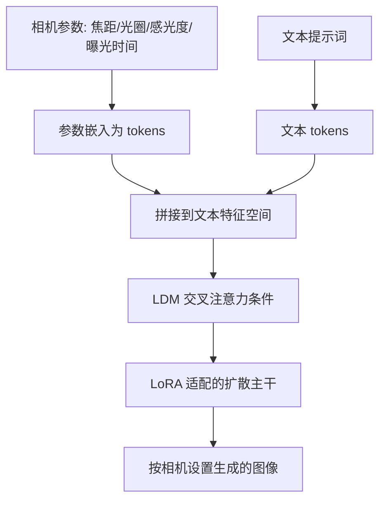

## 一句话总结

把焦距、光圈、感光度（ISO/film speed）、曝光时间这些摄影相机参数，编码成文本特征空间里的"token"，再通过潜在扩散模型（LDM）的 LoRA 适配器注入，从而让文生图模型能按数值化的摄影原理精确控制成像效果。

## 研究背景

现在的文本到图像扩散模型已经能生成相当逼真的画面，但要让它"听懂"专业摄影语言却很难。摄影师控制画面靠的是一组数值化参数：焦距决定视角与透视、光圈决定景深与虚化、感光度与曝光时间共同决定明暗与噪点。这些参数之间还相互耦合，构成一套完整的曝光与成像逻辑。

问题在于，扩散模型的条件接口是自然语言提示词。用文字描述"浅景深""长焦压缩感"既不精确也不连续——模型对"f/1.8"和"f/2.8"之间的细微差别几乎无法区分，更谈不上让某个参数单调、连续地变化。换句话说，文本这个接口天然不适合表达"数值 + 物理规律"的相机控制。

本文提出 Camera Settings as Tokens：不再依赖文字描述，而是把相机参数本身当作一种可学习的 token 嵌入到 LDM 的文本特征空间中，并借助 LoRA 适配器让预训练模型学会响应这些数值条件。为支撑训练，作者还整理了带真实相机元数据（EXIF）的图像数据集 CameraSettings20K。

> 注：本篇为基于论文公开摘要与项目页信息整理的概览（meta-only），未逐段精读全文，方法细节与实验数值以原文为准。

## 方法

### 整体框架

核心思想是把"相机参数"变成模型可以直接消费的条件信号。给定一张图，它的拍摄参数（焦距、光圈、感光度、曝光时间）是一组可观测的数值；作者将每个参数经嵌入映射为文本特征空间中的 token，与普通文本提示词的 token 拼接在一起，共同作为条件送入 LDM 的交叉注意力。这样相机参数就与语义描述处在同一表征空间，模型既能理解"画什么"，也能理解"用什么相机设置拍"。

为了在不破坏预训练文生图能力的前提下让模型学会响应这些新条件，训练采用 LoRA 适配器——只在扩散主干上叠加少量低秩可训练参数，冻结原始权重。

### 关键设计 1：相机参数作为特征空间的 token

不同相机参数量纲差异很大（焦距是毫米级、光圈是 f 数、曝光时间跨越多个数量级），直接当作原始数值喂给模型效果不佳。将它们各自映射为文本特征空间中的 token，等价于给模型提供一套"可微、可对齐语义"的数值接口，使模型能在连续的参数轴上平滑响应，而不是只对离散的文字标签作反应。

### 关键设计 2：用 LoRA 适配注入而非全量微调

摄影控制是一种"增量能力"，理想情况下不应损害底模的通用生成质量。LoRA 适配器让训练聚焦在少量新增参数上，既降低训练成本，又保留了预训练 LDM 的先验，从而把"响应相机 token"这项新技能温和地叠加进去。

### 关键设计 3：CameraSettings20K 数据集

数值化控制需要"图像—参数"配对的监督信号。作者从带 EXIF 元数据的真实照片中整理出 CameraSettings20K，为每张图提供对应的焦距、光圈、感光度、曝光时间等标注，作为训练相机 token 的数据基础，并开放了数据整理代码。

## 实验结果

论文围绕"生成图像是否真正遵循给定相机设置"来评估：给定同一文本提示与不同的相机参数（如逐步增大光圈、拉长焦距），观察生成结果是否呈现符合摄影原理的连续变化——例如光圈增大带来更浅的景深与更强的背景虚化、焦距变化带来视角与透视的改变。与仅靠文字描述相机效果的基线相比，本文方法在参数可控性与变化连续性上更贴合真实摄影规律。

（本篇为 meta-only 概览，未复现原文的定量指标表格，具体数值与对比设置请参阅原论文。）

## 亮点与局限

亮点：
- 提出把相机参数当作文本特征空间 token 的思路，为扩散模型补上了"数值化、连续化"的摄影控制接口，比堆砌提示词更精确。
- 用 LoRA 轻量注入，保留预训练先验、训练成本低，易于在现有 LDM 上落地。
- 配套开放 CameraSettings20K 数据集与整理代码，降低了后续研究复现门槛。

局限：
- 控制精度依赖训练数据中相机参数的分布与真实性（EXIF 标注质量、参数覆盖范围），分布外的极端设置可能失效。
- 相机参数之间存在物理耦合（曝光三角），单独调节某一参数时能否严格保持其他成像因素稳定，是这类数值控制方法的共同挑战。

## 延伸思考

这项工作代表了一种把"领域数值参数"接入生成模型的通用范式：与其逼模型从自然语言里猜出物理量，不如把物理量本身编码为它已经擅长处理的 token，并用 LoRA 温和地教它响应。这条路对任何"有明确数值参数 + 明确物理规律"的生成控制任务都具启发性——从摄影参数到光照、材质、乃至物理仿真参数。值得进一步追问的是：当多个耦合参数同时变化时，模型能否学到它们之间的物理约束（如曝光三角的联动），而不只是各自独立的映射；以及这种 token 化的数值接口能否推广到连续、可外推的区间控制，而非仅仅拟合训练分布内的取值。
