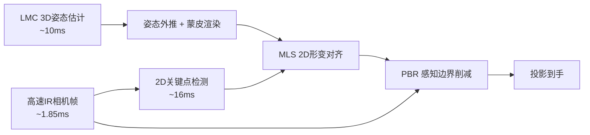

## 一句话总结

用一个"慢但完整"的 3D 手部姿态估计器打底，再叠加两个高速的 2D 屏幕空间校正步骤（MLS 形变对齐 + 感知边界削减 PBR），实现无穿戴、低感知延迟、可任意贴图的手部动态投影映射。

## 研究背景

动态投影映射（Dynamic Projection Mapping, DPM）把内容实时投射到运动物体表面，在游乐园、产品设计、化妆、协作、医疗等场景都有价值。但它对精度和速度要求极高：人眼对投影与目标之间的哪怕轻微错位都非常敏感，而运动物体需要"被 3D 追踪 → 处理成投影图像 → 送入投影仪"，这一过程中物体还在继续移动。

人手是最典型的难点：高度铰接、可变形、运动快而无规律。因此以往针对身体部位的 DPM 大多做人脸或全身，很少做手；少数做手的工作要么依赖可穿戴设备（手套、戒指）、要么用标记点、要么回避手掌区域、要么只能贴可平铺纹理（如 MIDAS 基于 shape-from-shading 只能还原法线）。核心矛盾在于：以当前技术，要在几毫秒内无穿戴地精确重建手的姿态与形状是不现实的。

本文不去硬啃这个核心难题，而是采取"级联（cascaded）"的折中思路：用一个粗糙的 3D 传感器 + 快速的 2D 校正，专门针对手的投影映射及其被人感知的方式来设计。

## 方法

整体框架：在传统的"追踪—渲染—投影"（track-render-project）流水线上，额外插入两个基于高速相机的屏幕空间校正步骤。

- **硬件**：共轴的高速投影仪（Dynaflash，约 1000 FPS）与高速相机（Basler，约 525 FPS，加 850nm 红外通过滤镜），中间用热镜（hot mirror）对齐光路；用一台 Leap Motion Controller（LMC，红外立体相机，约 10ms 延迟）做 3D 姿态估计。相机只看红外反射，投影在可见光波段，从而实现投影光与采集的波段分离。
- **基线流水线**：对每一帧，用 LMC API 把最新姿态外推到"图像真正打到手上的那一刻"，上传 GPU，对预制手部网格（2045 顶点）做线性混合蒙皮（LBS），再施加任意着色/纹理效果，最后投影。直接投影会因各种误差而错位，故引入下面两步校正。

关键设计一：**MLS 屏幕空间形变对齐**。3D 直接重建会累积多种误差（估计器内部误差、LMC 与相机的标定误差、静态模型与真实手的形状差、蒙皮误差），单个虽小但叠加后即使手几乎不动也很明显。作者的观察是：对慢速/静止的手，可以在屏幕空间做一个"慢但准"的校正。用 2D 关键点检测器得到目标点，把外推的 LMC 关节投影到屏幕空间得到源点，用 Moving Least Squares 构造离散形变网格来变形渲染图。之所以在 2D 屏幕空间校正，是因为单目关键点检测器不必输出深度、不受尺度歧义困扰，因此更准，尤其对又细又难追踪的手指效果好。

关键设计二：**时间滤波**。2D 检测器较慢（$$t_L \approx 16\text{ms}$$）且只能在上一次检测完成后才启动，所以时刻 $$T$$ 只能拿到过去的目标点 $$Q_{T-t_L}$$。直接用会产生滞后（lag），反复复用同一个 $$Q$$ 又会因更新稀疏产生抖动（jitter）。作者开发了系统的离散时间仿真来筛选滤波策略，最终选用一个简单而有效的方案：把过去的 $$Q$$ 用 $$P$$ 的变化量向前传播，即

$$\hat{Q}_T = Q_{T-t_L} + (P_T - P_{T-t_L})$$

它利用了"以往 $$P$$ 的变化"而非只看"以往 $$Q$$"，效果可与卡尔曼滤波媲美但计算量小得多（可视为速度测量来自 $$P$$、测量方差很小的卡尔曼滤波）。

关键设计三：**感知边界削减（Perceptual Boundary Reduction, PBR）**。即便对齐了，仍有两个问题：手的边缘区域（尤其因形状不匹配）没被投影覆盖；快速运动时因 LMC 约 10ms 的历史信息造成时间错位。作者的核心论点是：投影与手之间形成的硬性接缝（silhouette edges）是人判断错位的强感知线索。把当前相机帧叠加到渲染图上，画面被分成四个区域：$$\Omega_A$$（相机与渲染都是背景）、$$\Omega_B$$（相机是背景但渲染是前景，需遮除）、$$\Omega_C$$（相机中是手但渲染中是背景，会形成接缝）、$$\Omega_D$$（两者都是前景）。方法是：保留 $$\Omega_D$$、遮除 $$\Omega_B$$、重点填充 $$\Omega_C$$。对 $$\Omega_C$$ 中每个像素 $$p_C$$，用 jump flooding 快速找到 $$\Omega_D$$ 中最近的已渲染像素 $$p_D$$，再关于它做反射得到 $$p'_D$$，取 UV 空间的局部梯度

$$\overrightarrow{D_{uv}} = f(p_D) - f(p'_D)$$

从而外推出 $$p_C$$ 的新 UV 坐标 $$f(p_C) = f(p_D) + \overrightarrow{D_{uv}}$$，像"手表面的自然延伸"一样去采样纹理，把边界接缝用周围信息伪装掉，既扩大覆盖面又降低感知延迟。

## 实验结果

除离散仿真外，作者做了两个用户研究。JND（Just Noticeable Difference，可觉察的最小延迟）研究用预录手部运动 + 合成投影 + 人为注入延迟，衡量开启/关闭 PBR 时被试能觉察的最小延迟；"猜字符"研究在真实系统上让被试完成需要关注指尖细节的任务，对比完整校正（Ours）与基线。

| 实验 | 指标 | 基线 | 本方法 | 显著性 |
| --- | --- | --- | --- | --- |
| JND（10 人） | 可觉察最小延迟 | $$3.08 \pm 1.38\,\text{ms}$$ | $$6.62 \pm 4.54\,\text{ms}$$ | $$t(9)=2.3,\ p<0.05$$ |
| 猜字符（10 人） | 每轮平均用时 | $$3.33 \pm 1.0\,\text{s}$$ | $$2.39 \pm 0.71\,\text{s}$$ | $$t(117)=12,\ p<0.001$$ |

JND 越高说明系统可容忍的延迟越大：开启 PBR 后 JND 显著提升，说明轮廓边缘确实是判断延迟的关键信号；注意力热图也显示本方法把被试视线从轮廓边缘引导到手内部（更难据以判断延迟）。猜字符任务中几乎所有会话下本方法都更快，且被试主观上普遍觉得任务更轻松。此外还展示了 Space Shooter 手部体感游戏，以及 "Projegraphy" 应用——用 GPT-4 识别手势像哪种动物、再用 ControlNet（Canny 边缘条件）实时生成对应图像并烘焙投影，整个周期约 2–8 秒且在独立线程运行。

## 亮点与局限

亮点：
- 首个针对无穿戴人手、具备完整 3D 能力（可贴任意纹理/施加合理效果）的短延迟 DPM 系统。
- 用"粗 3D + 级联 2D 校正"的务实思路绕开了实时精确手部重建这一硬骨头，计算开销很小。
- 首次把感知（perceptual）技巧引入 DPM：利用人对轮廓边缘的注意力，用 PBR 换取可观的延迟"余量"。
- 开发了离散时间仿真器，便于快速试验和淘汰滤波方案，避免反复折腾真实系统。

局限：
- 强依赖尚可的粗 3D 姿态估计，一旦 3D 估计误差过大（手指姿态错误、延迟过大），MLS 与 PBR 都难以补救。
- MLS 形变较简单，极端形变下会产生扭曲与折叠（foldover）。
- 依赖预制且非个性化的 3D 手模，用户间手形/肤色/材质差异会降低投影质量。
- PBR 依赖 UV 外推，对网格 UV 参数化结构敏感；若 UV 接缝穿过屏幕空间向量会采到错误区域，作者通过把接缝藏在不显眼处、并在翻手时热切换 UV 映射来规避。

## 延伸思考

- "级联 + 感知"的组合很有启发：与其追求物理上更快更准的追踪，不如认清人类感知的薄弱环节（这里是轮廓边缘），把有限算力花在最影响主观体验的地方。这一思路作者也指出可推广到刚体/半刚体等系统延迟更突出的动态投影场景。
- 时间滤波中"用 $$P$$ 的变化量修正过去的 $$Q$$"是个巧妙的低成本替代卡尔曼滤波的做法，本质是引入了几乎无噪声的速度先验，值得在其他"检测慢、渲染快"的异步流水线里借鉴。
- 更好的形变模型（避免 foldover）、个性化手模（形状/肤色/材质自适应）、以及对 UV 接缝更鲁棒的填充策略，都是把该系统从"演示级"推向"产品级"的自然方向。
