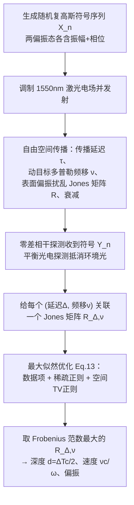

## 一句话总结

把电信行业里跑光纤骨干网、单条链路每秒上万亿比特的现成相干光模块（coherent optical modem）拆出来接上自由空间光路与扫描振镜，配一套时间分辨的成像模型与最大似然重建算法，就变成一台能在每像素 1 微秒、10 mW 人眼安全功率下同时测出毫米级深度、径向速度和偏振变化的全波场激光雷达。

## 研究背景

相干光模块是数字通信时代的产物：它在两个正交线偏振态上以近太赫兹速率可编程地调制并感测光的振幅与相位，靠这种对"完整光波场"的精细控制，让信号能在数千公里光纤上以超过每秒 1 太比特的速率传输。这种极致的收发能力本是为通信设计的，但它同样是自由空间成像的稀缺资源。

现有激光雷达各有短板：

- **非相干激光雷达**（如强度调制的 Kinect、脉冲飞行时间、单光子）对环境光和其它光源的干扰敏感，脉冲系统无法靠相位测速；曝光时间通常在毫秒量级，单光子系统在微秒级短曝光加强环境光下几乎收不到有效信号。
- **相干激光雷达**中最常见的 FMCW 依赖线性扫频，深度分辨率被扫频带宽绑定、测距测速上限被扫频时长绑定，很多扫频激光器只能在少数预设配置间切换，灵活性低，且易受其它调频激光雷达干扰。
- **RMCW（随机调制连续波）激光雷达**抗干扰更强，但传统方案只做二值相位或振幅调制，且要达到毫米级分辨率需要几十 GHz 的调制与采样率，硬件门槛极高，文献中实例很少。

作者的核心洞见是：与其从零造这种超快硬件，不如直接征用现成的商用相干光模块。他们提出**全波场激光雷达（Full-Wavefield Lidar, FWL）**——一种在两个偏振态上对完整相干波场做可编程随机调制的 RMCW 激光雷达，并配一套能同时解出深度与速度、不需专门编码方案也不牺牲带宽的重建算法。

## 方法

### 整体框架

系统把一块 400 Gb/s 的商用相干光模块（Ciena WaveLogic 5n，采样率 $$1/T = 74$$ GHz）接上光纤、环形器、准直器和扫描振镜，逐点栅格扫描场景。模块按已知的随机符号序列调制 1550 nm 激光电场并发射，反射光被同一准直器收回、经环形器送回模块做零差（homodyne）相干探测，得到收到的符号序列。已知发射序列、量测收到序列，问题就变成一个逆问题：从波形被传播信道扭曲的方式反推场景属性。

### 关键设计 1：全波场随机调制与成像观测模型

传输端把数字符号序列 $$\mathbf{X}_n$$（每列两个复符号，指定两个偏振态在第 $$n$$ 个符号周期内的振幅与相位）拼成连续带限波形去调制激光。作者选用从复高斯分布采样的随机振幅与相位——这是高斯噪声下的最优调制方案。

传播回来的电场受三重扭曲：传播延迟带来时移、动目标带来多普勒频移、表面反射带来偏振态旋转与衰减。收到电场建模为：

$$\mathbf{E}_{RX}(t) = \mathbf{R}\,\mathbf{E}_{TX}(t-\tau)\,e^{j\nu t}$$

其中 $$\mathbf{R}$$ 是描述偏振相关衰减与旋转的 $$2\times 2$$ 复值 Jones 矩阵。假设收到的下变频电场在符号积分周期内近似恒定，可把连续模型离散化为符号级关系：

$$\mathbf{Y}_n = \mathbf{R}\,\mathbf{X}_{n-\Delta}\,e^{j\nu t} + \eta$$

$$\Delta = \lfloor \tau/T \rfloor$$ 是延迟对应的整数符号移位，$$\eta$$ 是复高斯噪声。由于同轴光路会引入环形器、准直器玻璃-空气界面等内部反射，还有场景中半透明面的额外反射，进一步把观测泛化为多份延迟、偏振扰乱、可能带频移的信号叠加：

$$\mathbf{Y}_n = \sum_{s=0}^{S-1} \mathbf{R}_s\,\mathbf{X}_{n-\Delta_s}\,e^{j\nu_s t} + \eta$$

内部反射是静态的，不带多普勒频移。

### 关键设计 2：深度/速度/偏振的联合最大似然估计

单次反射、无偏振扰乱、加性高斯噪声时，匹配滤波就是最优估计器，也是 RMCW 激光雷达常规做法：

$$\Delta^{*} = \arg\max_{\Delta}\left| \sum_{\Delta=-\infty}^{\infty} \overline{\mathbf{X}_{n-\Delta}}\,\mathbf{Y}_n \right|^2$$

但匹配滤波在复杂场景失效：偏振扰乱、多普勒频移、多重反射让没有任何单一延迟能解释收到序列，而且它完全给不出速度与偏振信息。作者转而在高斯噪声模型下直接最小化收发符号的均方误差：

$$\arg\min_{\{S,\mathbf{R}_s,\Delta_s,\nu_s\}} \sum_{n=0}^{N-1}\left\| \mathbf{Y}_n - \sum_{s=0}^{S-1} \mathbf{R}_s\,\mathbf{X}_{n-\Delta_s}\,e^{j\nu_s t} \right\|_2^2$$

这个目标因叠加项数目未知而是组合优化、无闭式解。作者的松弛办法是：离散化多普勒频移空间，给每一个可能的 $$(\Delta,\nu)$$ 组合都关联一个待求 Jones 矩阵 $$\mathbf{R}_{\Delta,\nu}$$，数据项写为：

$$\mathcal{L}_{data} = \sum_{n=0}^{N-1}\left\| \mathbf{Y}_n - \sum_{\Delta,\nu} \mathbf{R}_{\Delta,\nu}\,\mathbf{X}_{n-\Delta}\,e^{j\nu t} \right\|_2^2$$

### 关键设计 3：稀疏与空间正则应对散斑

因为真实叠加项很少，作者加稀疏正则鼓励解集中；又因为散斑噪声让相邻像素抖动，加全变差（TV）正则鼓励重建 Jones 矩阵能量的空间平滑：

$$\mathcal{L}_{sparse} = \sum_{\Delta,\nu} \|\mathbf{R}_{\Delta,\nu}\|_F$$

$$\mathcal{L}_{TV} = \sum_{i,j,\Delta,\nu} \sqrt{\left|(\mathbf{D}_v\|\mathbf{R}_{\Delta,\nu}\|_F)_{i,j}\right|^2 + \left|(\mathbf{D}_h\|\mathbf{R}_{\Delta,\nu}\|_F)_{i,j}\right|^2}$$

总目标为 $$\arg\min_{\mathbf{R}_{\Delta,\nu}} \mathcal{L}_{data} + \lambda_{sparse}\mathcal{L}_{sparse} + \lambda_{TV}\mathcal{L}_{TV}$$，用 PyTorch + Adam 优化。解出所有 Jones 矩阵后，取 Frobenius 范数最大（且延迟大于内部反射的最小延迟 $$\Delta_{min}$$）的那个：

$$(\Delta^{*}, \nu^{*}) = \arg\max_{\Delta,\nu} \|\mathbf{R}_{\Delta,\nu}\|_F \quad \text{s.t.}\quad \Delta > \Delta_{min}$$

深度由 $$d = \Delta^{*}\cdot T c/2$$ 得到，速度由多普勒频移 $$\nu^{*}\cdot c/\omega$$ 得到。半透明场景则取范数最大的两个 Jones 矩阵分别恢复两层表面。

### 关键设计 4：硬件原型

原型用 74 GHz 采样率对应约 4 mm 光程分辨率、2 mm 深度分辨率；发射序列长约 $$2^{16}$$ 个符号，无歧义测距范围约 130 米。用一只掺铒光纤放大器（EDFA）把发射功率从 1 mW 提到最高 100 mW，除特别说明外实验均用 2 mW 人眼安全功率；另一只 EDFA 作为前置放大器把回光提升到模块所需电平。

## 实验结果

主定量实验扫描平面靶标、把测量点拟合成平面并统计偏差，评估深度精度，同时与"广义匹配滤波"以及在同一模块上模拟的其它调制方案（仅双偏振相位、仅双偏振振幅、单偏振振幅+相位）对比。为评估逐像素精度，此表关闭了 TV 正则。

| 调制方案 | 平均深度误差 (mm)↓ 联合估计 | 平均深度误差 (mm)↓ 广义匹配滤波 | <2mm 像素占比↑ 联合估计 | <6mm 像素占比↑ 联合估计 |
|---|---|---|---|---|
| **FWL（双偏振振幅+相位）** | **4.43** | 9.93 | **65.20%** | **98.50%** |
| 双偏振仅相位 | 9.31 | 24.99 | 57.16% | 97.91% |
| 双偏振仅振幅 | 19.08 | 39.51 | 58.59% | 95.96% |
| 单偏振振幅+相位 | 30.19 | 46.95 | 47.85% | 93.75% |

结论清晰：用满全部自由度（双偏振 + 振幅 + 相位）的 FWL 精度最高，联合估计一致优于广义匹配滤波。其它演示还包括：曝光缩短到 0.125 微秒时联合估计仍能恢复大部分像素而匹配滤波失败；阳光透窗直射下仍恢复出旋转半球的最大 25 m/s 径向速度（与高速相机一致）；穿透半透明屏障同时重建屏障与后方雕像；扫描点亮的钨卤灯泡（发射谱含 1550 nm）仍稳健成像，得益于零差探测对环境光的抵消；以及房间尺度场景与次表面散射物体的重建。作者还给出用 2 mW 联合估计能达到广义匹配滤波用 80 mW 的相近质量。

## 亮点与局限

**亮点**

- 把电信级相干光模块"跨界"用作激光雷达，绕开了 RMCW 激光雷达最难的超快收发硬件门槛，让相干激光雷达对研究者更可及。
- 系统性能与调制波形高度解耦：深度分辨率只由采样率决定，测距与测速上限由曝光时间决定，二者都可连续调节，比 FMCW 灵活得多。
- 用可编程随机波形做全波场调制，配合 Jones 矩阵建模，天然抗环境光与其它激光雷达干扰，还能同时输出深度、速度、偏振三种信息。
- 联合最大似然重建显式建模多普勒频移、偏振扰乱与多重反射，使得微秒级短曝光、人眼安全低功率下仍能毫米级测距。

**局限**

- 当前硬件接口每次曝光后需约 1 秒把数据传回计算机，单扫描点耗时超过 1 秒，严重限制采集速度与扫描分辨率，尚未实现实时。
- 操作快速光模块需要专门领域知识来编程与读出收发波形，推广有门槛。
- 组合优化被松弛为对每个 $$(\Delta,\nu)$$ 关联 Jones 矩阵，多普勒频移需离散化、还要预先标定内部反射延迟，计算量与先验假设都不小。

## 延伸思考

这篇工作最迷人的地方是一次彻底的"资源重用"：它没有去发明新传感器，而是发现电信产业为了别的目的（长距离高带宽通信）已经把"近太赫兹速率可编程全波场收发"这件极难的事工程化到量产可靠，于是直接把这份成熟工业能力搬到成像里。这提示我们，很多计算成像的硬件瓶颈也许并不需要从零突破，隔壁成熟行业的量产器件可能就是现成答案。

顺着往下想，全波场的可编程性其实还远没被用满——本文用的是随机复高斯调制，但既然波形完全可编程，就可以针对特定任务（散射介质穿透、运动分离、抗特定干扰）做端到端的最优波形设计，把"发什么光"和"怎么重建"联合优化。作者也提到在散射介质中，对运动、深度、偏振的敏感度或许能帮助分离未散射光，这对生物组织成像、雾霾/水下成像都有想象空间。真正的落地障碍还是那 1 秒的数据传输瓶颈，一旦读出实时化，这类"通信器件即成像器件"的思路可能会催生一整类新型传感器。
