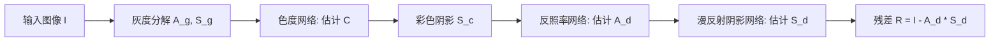

## 一句话总结

通过把高度欠约束的内在分解问题拆解成"估计阴影色度 → 估计漫反射反照率 → 分离漫反射阴影与非漫反射残差"三个更简单的子任务，本文在真实世界图像上实现了包含彩色漫反射阴影与镜面残差的内在残差分解。

## 研究背景

内在图像分解旨在从单张照片中分离表面反射率与光照效应。多数已有工作依赖灰度漫反射模型：

$$
I = A * S
$$

其中 $$I$$ 是线性 RGB 输入，$$A$$ 是三通道反照率，$$S$$ 是单通道灰度阴影。这个模型虽然让问题更易处理，却建立在两个限制性假设之上：

- **朗伯世界假设**：将所有表面建模为漫反射，忽略镜面反射，无法单独编辑漫反射与非漫反射的光照效应。
- **单色阴影假设**：无法表达多光源、相互反射等常见的彩色光照效应，导致颜色信息被错误地"烘焙"进反照率层，限制了颜色编辑应用。

少数工作采用内在残差模型来进一步分解光照：

$$
I = A * S + R
$$

其中 $$S$$ 为反映光照颜色的 RGB 图，$$R$$ 为表示高光、可见光源等非漫反射效应的加性残差层。但该模型把每像素未知量从 4 个增加到 9 个，加剧了问题的欠约束性；再加上缺乏多样化的真实标注数据，此前采用残差模型的方法只能局限于单个物体或人脸等狭窄场景。本文的目标是把内在残差分解推广到真实世界的自然图像。

## 方法

整体框架是一条渐进式流水线：从一个基于灰度漫反射模型的现成分解出发（使用 Careaga 与 Aksoy 2023 的方法生成初始 $$A_g$$-$$S_g$$ 对），先去掉单色阴影假设，再去掉朗伯世界假设，逐步逼近最终的内在残差模型。每一步只估计一个变量（依次为 $$S_g$$、$$C$$、$$A_d$$、$$S_d$$），其余分量按对应的图像形成模型计算得到。

**关键设计一：阴影色度估计。** 首先把灰度阴影 $$S_g$$ 作为彩色阴影 $$S_c$$ 的亮度，只需推断每像素色度。借鉴色彩恒常性文献，色度定义为通道比值：

$$
U = S_c^r / S_c^g,\quad V = S_c^b / S_c^g
$$

由于通道比值无界、难以直接回归，用一个映射把它压到 $$[0-1]$$ 区间，得到二通道目标变量：

$$
C = \left( \frac{1}{U+1}, \frac{1}{V+1} \right)
$$

色度是低频、依赖全局上下文的量，因此用卷积网络在感受野尺度的低分辨率上估计。

**关键设计二：反照率估计。** 灰度模型下的反照率含有来自彩色光照的强烈色偏。用彩色阴影 $$\hat{S}_c$$ 按 RGB 漫反射模型可算出近似反照率 $$\hat{A}_c$$，但仍残留光照伪影。反照率网络以 $$\hat{A}_c$$、$$\hat{S}_c$$ 与输入图像拼接成 9 通道输入，利用反照率的稀疏平滑特性输出干净的三通道漫反射反照率 $$A_d$$。

**关键设计三：漫反射阴影估计与残差。** 有了 $$A_d$$ 后放弃朗伯假设，把 $$S_c = I / A_d$$ 分解为漫反射与非漫反射成分。漫反射阴影网络在逆阴影空间中输出三通道变量 $$D = 1/(S_d+1)$$，最后按残差模型计算：

$$
R = I - (A_d * S_d)
$$

由于估计的漫反射阴影是无界的（HDR），漫反射图像可以超出输入的 $$[0-1]$$ 范围，因而残差同时含正负值：正部对应高光与可见光源，负部对应过曝区域。所有网络采用统一的编码器-解码器结构，用均方误差损失 $$L_{mse}$$ 与多尺度梯度损失 $$L_{msg}$$ 训练。值得注意的是，漫反射阴影网络只在合成室内数据集 Hypersim 上训练，却能泛化到多样的真实场景。

## 实验结果

在真实世界测量反照率数据集 MAW 上，本文方法在反照率强度与色度两个指标上均取得最优。带星号的方法采用灰度阴影假设，色度得分固定。

| 方法 | Intensity (×100) ↓ | Chromaticity ↓ |
| --- | --- | --- |
| Careaga and Aksoy [2023] | 0.57 | 6.56* |
| Kocsis et al. [2024] | 1.13 | 5.35 |
| Chen et al. [2024] | 0.98 | 4.12 |
| Single-Network Baseline | 0.69 | 4.15 |
| Ours ($$\hat{A}_c$$) | 0.56 | 3.50 |
| **Ours** | **0.54** | **3.37** |

单网络基线有 4.85 亿参数，而本文四个网络累计仅 3.37 亿参数。消融实验进一步表明：估计二通道色度比直接估计反照率更有效；在低分辨率彩色分解的基础上估计反照率优于直接估计高分辨率阴影；把漫反射反照率 $$A_d$$ 与 $$S_c$$ 同时喂给漫反射阴影网络能得到最佳结果。完整流水线平均约 1 秒即可生成高分辨率结果，而扩散类方法通常需要超过 10 秒。

## 亮点与局限

**亮点：**
- 将欠约束的内在残差分解拆分为物理动机明确、单一变量的子任务，使神经网络更易建模并显著提升泛化能力。
- 仅用合成室内数据训练漫反射阴影网络，却能泛化到人脸、户外风景等分布外场景。
- 无界（HDR）漫反射阴影使残差能恢复输入图像中被裁剪丢失的信息。
- 解锁多种光照感知编辑应用：高光去除（计算漫反射图像 $$A_d * S_d$$）、逐像素多光源白平衡、以及被裁剪细节的恢复。

**局限：**
- 流水线以现成方法的灰度分解为起点，可能会传播初始模型的严重错误（如把阳台硬阴影错误地纳入反照率）。作者指出这类错误可借助商业软件（如 Photoshop 内容感知修复）修正输入后再让流水线纠正。

## 延伸思考

- 分而治之的物理动机式子任务拆解是本文实现真实世界泛化的核心，这种"用简单子问题绕过标注数据稀缺"的思路对其他欠约束的中层视觉任务同样有借鉴价值。
- 相比扩散生成类方法把内在分解当作概率/风格迁移问题，本文强调真实图像形成的确定性，通过场景上下文消解材质与颜色歧义，在保真度与速度上更有优势。
- 作者提出的方向很有想象空间：内在残差分量有望进一步分解为显式光照、BRDF 参数、单次与多次反弹贡献，从而向可泛化的物理精确逆向渲染迈进，也能改进重光照、闪光摄影、HDR 重建等应用。
