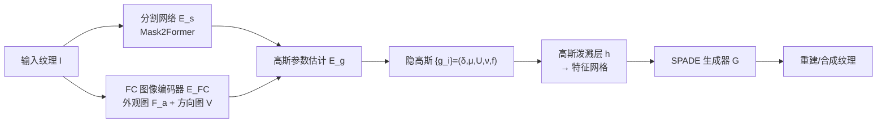

## 一句话总结

本文提出一种全无监督的纹理表示：把纹理分解为一组"纹理基元（texton）"，每个基元用一个 2D 高斯（编码形状与位置）加一个外观特征向量（编码细节外观）来刻画，从而在解耦的神经隐空间里通过编辑这些高斯来实现纹理迁移、插值、变体调节、编辑传播、直接操控等多种编辑，并由生成器前馈式合成结果。

## 研究背景

纹理是照片和渲染图像视觉丰富度的关键来源，但编辑纹理往往意味着对大量重复的局部图案（textons，纹理基元）做繁琐、重复的手工调整。理想情况下，我们希望有一种通用表示，能覆盖多种纹理、支持跨尺度的多类编辑任务。

已有方法大致分三类，各有短板：

- **非参数方法**（基于图像平滑/patch 相似先验）灵活、能适配多种纹理，但结果可预测性差，且通常只服务于某一特定应用。
- **参数方法**建立在明确的数学模型上，可解释、可控，但难以应对细节丰富、空间排布复杂的纹理。
- **深度学习方法**擅长表征纹理，却普遍缺乏编辑所需的可解释性与可控性；用于插值的表示解耦程度不足，难以推广到更多应用；把纹理转成节点图式程序纹理的路线又只适用于窄类纹理，且难以忠实还原输入。

问题的根源在于：现有神经表示大多把外观信息纠缠在一起，几乎没有做结构/外观的解耦。作者主张回到"纹理由重复基元构成"这一本质认识，用一个**组合式（compositional）神经表示**来同时获得表达力与可编辑性。难点在于 texton 概念本身模糊、难以严格定义，且数量众多，不适合用监督分割来提取——因此本文走全无监督路线。

## 方法

整体是一个全无监督训练的自编码器：编码器把输入纹理映射为一组隐空间高斯基元，高斯泼溅层把它们转成特征网格，生成器再前馈重建/合成纹理。为让高斯真正对应"可编辑的纹理基元"，作者先定义了 texton 的 4 条性质，再用网络结构 + 损失把这些性质"注入"进去。

**关键设计 1：texton 的 4 条性质。** 作者用四条性质来把模糊的 texton 概念操作化：（1）离散物体性——基元要么整体存在要么不存在，纹理可由离散基元集完整描述；（2）空间紧致性——每个基元只描述一个局部区域；（3）重排不变性——在同质纹理内随机交换各基元的外观，应得到"同一纹理的另一个版本"而不改变整体外观；（4）变换等变性——对基元施加空间变换，重建图像应体现同样的变换。这四条性质既保证表示能覆盖多样纹理，又保留人类可理解性以便直观编辑。

**关键设计 2：高斯基元表示与编码。** 每个基元表示为 $$g_i = \{\delta_i, \boldsymbol{\mu}_i, U_i, \nu_i, f_i\}$$：$$\delta_i \in [0,1]$$ 是存在权重（近 1 有效、近 0 无效，用于自适应确定有效基元数量），$$\boldsymbol{\mu}_i$$、$$U_i$$ 是高斯的中心与协方差（近似基元形状/位置），$$\nu_i$$ 是补充协方差不足的各向异性方向单位向量，$$f_i$$ 是外观特征向量。编码器含 FC 图像编码器（产出外观图 $$F_a$$ 与方向图 $$V$$）与分割网络（Mask2Former，产出 $$n$$ 个 softmax 分割掩码 $$S$$）。每个基元的空间参数由掩码加权求得，如 $$\boldsymbol{\mu}_i = \frac{\sum_p p \cdot S_i(p)}{\mathfrak{S}_i}$$、方向 $$\nu_i = \frac{\sum_p V(p) S_i(p)}{\mathfrak{S}_i}$$（再归一化），外观特征 $$f_i = \frac{\sum_p F_a(p) S_i(p)}{\mathfrak{S}_i}$$。存在权重通过可微的伯努利采样 $$\delta_i \sim B(p_i)$$ 得到（训练用 Gumbel-softmax 近似硬采样、推理时四舍五入为 0/1），作者发现这种采样机制比直接取 $$\delta_i = p_i$$ 能得到更对齐、更可靠的分割与更高质量的隐高斯。

**关键设计 3：用无监督损失注入性质。** 在中间分割掩码上施加多个损失来落实四条性质：熵损失 $$L_E = -\frac{1}{HW}\sum_p \sum_{i=1}^{n} S_i(p)\log(S_i(p))$$ 鼓励硬分割（离散物体性）；紧致损失 $$L_C = \frac{1}{HW}\sum_p \|p' - p\|_2^2$$ 让每个分割空间上紧凑局部（空间紧致性）；一致性损失 $$L_{Csis}$$ 通过对两组高斯 $$T(E(I))$$ 与 $$E(T(I))$$ 做二部图匹配后求差，强制变换等变性。

**关键设计 4：重排分支落实"重排不变性"。** 训练时随机置换基元的外观特征得到 $$\{\tilde{g}_i\} = \pi(\{g_i\})$$，重排后的特征按 $$\tilde{f}_j = \tau_{i\to j} f_i + (1-\tau_{i\to j}) f_j$$ 混合。为优先在"更像真正 texton"的高斯间做重排，用面积与概率的元组定义重排系数 $$\tau_{i\to j} = \left(\min\left(\max\left(\frac{A_i}{A_j}, \frac{p_i}{p_j}\right), 1\right)\right)^{\gamma}$$（$$\gamma = 0.5$$）。重排后重建的图像 $$\tilde{I}_r$$ 应与输入 $$I$$ 在纹理相似度上一致，用 patch 纹理损失与 patch 级 GAN 损失约束。整体目标叠加重建损失 $$L_R = w_1 L_1 + w_{LPIPS} L_{LPIPS}$$、对抗损失 $$L_{GAN}$$ 以及上述各项，训练中固定部分权重、动态调节 $$w_E, w_C, w_{Csis}$$ 以在相互矛盾的损失间取得平衡。数据集含 37.7 万张合成（Adobe Firefly 生成）与 1.2K 真实图像。

## 实验结果

各类编辑应用无需针对性再训练，均只需"编码为隐高斯 → 编辑高斯 → 前馈生成"，在单张 NVIDIA A10G 上前馈处理一张 256×256 图约 0.16 秒。核心能力汇总如下：

| 应用 | 编辑的高斯参数 | 说明 |
|------|--------------|------|
| 纹理多样化 | 有效基元间重排外观 $$f$$ | 生成同一纹理的多个不同版本 |
| 纹理迁移 | 用 SP 纹理高斯 + AP 纹理外观（对齐 $$f$$ 均值） | 一纹理的结构 + 另一纹理的外观 |
| 图像风格化 | 逐 patch 迁移纹理 | 支持空间控制与尺度控制 |
| 揭示/修改变体 | 编辑 $$f$$ / $$U$$ 相对均值的偏差 | 可减弱或增强外观/几何变化 |
| 纹理插值与形变 | 插值隐高斯（位置/特征/权重） | 系数可空间变化实现 morphing |
| 直接基元操控 | 编辑 $$\boldsymbol{\mu}_i, U_i, \nu_i$$ | 移动/缩放/旋转单个基元 |
| 编辑传播 | 基于提取的基元 | 局部编辑自动传播到相似区域 |

对比实验显示：相较监督训练于 10 亿掩码的 Segment Anything，SA 无法可靠地提取 texton，而本文全无监督方法可以；在纹理迁移任务上，本方法比 Tumanyan 等更好地保留结构、比 Kolkin 等更准确地还原基元外观，且不像基于文生图的方法那样受"抽象语言难以描述细节纹理"所限。消融研究表明损失函数与结构的组合设计对整体性能都很关键。

## 亮点与局限

**亮点：**
- 首个面向纹理的组合式神经表示，把纹理显式分解为"高斯几何 + 外观特征"两组解耦参数，兼顾表达力与可编辑性。
- 一套表示、一次训练即可支撑纹理迁移、插值/形变、变体调节、编辑传播、动画、直接操控等多类应用，无需针对每个应用再训练或微调。
- 用 4 条可操作的性质把模糊的 texton 概念落地，并用熵/紧致/一致性/重排等无监督损失将其注入网络；伯努利采样（Gumbel-softmax）机制被验证比直接回归权重更能收敛出离散、可靠的基元。
- 表示人类可理解、可直接操控，前馈生成高效，且支持任意分辨率输出。

**局限：**
- 方法建立在"重排不变性"假设上，因此更适合基元外观在全图较一致的纹理；对基元外观空间强变化的纹理适配性较弱。
- 对细长、连续结构（如发丝）处理不佳：紧致性约束会把一条连续结构拆成多个局部基元，直接编辑单个基元可能破坏连续结构，也可能无法捕捉用户期望的"最大可能基元"。
- 高斯泼溅特征图的平滑性 + 有限基元数量，可能丢失锐利边缘/尖角等细节，表示在"可编辑性"与"建模保真度"之间存在权衡。

## 延伸思考

- 单层高斯表示是主要瓶颈之一，作者也提到向多层（不同尺寸高斯捕捉不同尺度结构）扩展，这与"多尺度/层级化基元"的经典纹理分析思想天然契合，可能同时缓解细长结构与细节丢失的问题。
- 表示把结构与外观显式拆成不同高斯参数，这种"解耦即可控"的思路可迁移到其他组合式神经表示（图像对象槽、3D 高斯基元）中，用于更细粒度的可控生成。
- "重排不变性"本质是对纹理平稳性（stationarity）的一种可学习刻画，若能自适应地判别纹理的平稳/非平稳区域并局部放松该假设，或可扩展到更广的非均质纹理。
- 全无监督地提取"人类可理解基元"这一能力，超越了通用分割模型（SA）的适用范围，提示在特定结构先验下无监督组合表示相比大规模监督分割仍有独特价值。
