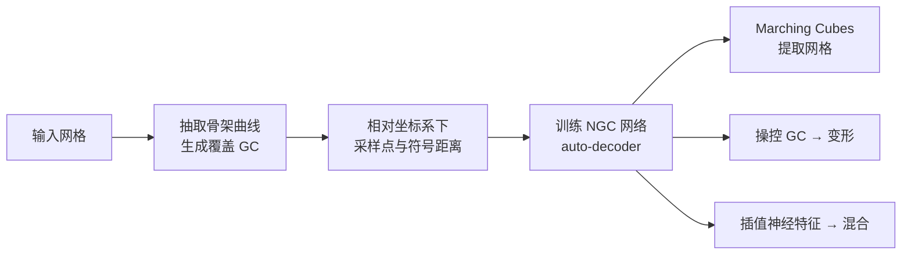

## 一句话总结

通过把神经符号距离场（NSDF）定义在广义圆柱（GC）的相对坐标系上，作者提出神经广义圆柱（NGC）表示，使得直接操控 GC 的中心曲线与截面即可直观、显式地驱动隐式神经形状的非刚性变形与混合。

## 研究背景

神经隐式表示（如 NSDF）因能处理复杂拓扑、任意分辨率而在形状建模中越来越流行，但它以高维特征向量隐式存储形状，用户难以像操控网格顶点、骨架或稀疏控制点那样直观地编辑形状。

传统广义圆柱（GC）用一条中心曲线加若干截面轮廓来描述形状，控制点少、变形灵活，长期用于形状建模与交互式表面重建。但经典 GC 通过在关键帧轮廓之间插值来生成完整形状，当相邻轮廓拓扑不同（非凸、高亏格）时插值极其困难，难以拟合一般形状。

本文的核心想法是把神经方法引入这一显式表示：沿中心曲线定义特征来隐式表示各处轮廓，让骨架曲线天然成为控制手柄，从而回答"能否给神经形状表示提供显式手柄"这一问题。

## 方法

整体框架分为三步：给定输入网格，先抽取骨架曲线并生成覆盖该形状的一组 GC；然后在 GC 的相对坐标系下采样点及其符号距离，训练一个 NSDF 网络；最后用 Marching Cubes 提取网格。由于 NSDF 定义在 GC 的相对坐标上，直接操控 GC 即可变形形状；替换/插值不同形状的神经特征即可实现混合。

**相对坐标系（可变形的核心）**：GC 的轴是一条连续可微曲线 $$C(t)=(x(t),y(t),z(t)),\ t\in[0,1]$$。每个曲线点 $$p=C(t)$$ 上建立局部标架：x 轴取切向量 $$x(t)=C'(t)$$，y、z 轴由给定函数 $$y(t),z(t)$$ 定义。椭圆形截面定义为

$$Profile(t)=\{q\ \vert \ F^t_x(q)=0\ \text{且}\ F^t_y(q)^2+F^t_z(q)^2\le 1\}$$

其中 $$F^t$$ 把世界坐标转换到 $$p$$ 的局部标架，椭圆长短半径由 $$r_y(t)=1/\|y(t)\|$$、$$r_z(t)=1/\|z(t)\|$$ 隐式给出。点的相对坐标 $$(t,a,b)$$ 满足世界坐标 $$q=(F^t)^{-1}([0,a,b])$$，它对 GC 的"形状"不变——当 GC 变形时，定义在相对坐标上的隐式场会随之自然变形，从而形状相对于 GC 保持一致。世界坐标到相对坐标的映射存在多解，作者取曲线上最近点确定 $$t$$ 以消歧。

**神经广义圆柱网络**：为曲线上每点 $$C(t)$$ 定义局部特征 $$f(t)\in\mathbb{R}^{512}$$ 以取代离散轮廓。实践中用一个全局特征 $$z_{glob}\in\mathbb{R}^{512}$$，通过 $$f(0)=MLP_0(z_{glob})$$、$$f(1)=MLP_1(z_{glob})$$ 得端点特征，其余点线性插值 $$f(t)=t f(0)+(1-t)f(1)$$。神经 SDF 定义为

$$F(\bar{p};z)=h(t,a,b,g(f(t)))$$

其中 $$g,h$$ 为 MLP。查询点的符号距离取决于其在曲线上最近点的特征以及它在该截面上的相对坐标。

**拟合、变形与混合**：采用 DeepSDF 式 auto-decoder，每个 GC 有可优化全局特征 $$z_i$$，训练目标为

$$\min_{\forall z_i,\Theta}\ L_{data}+\lambda L_{reg}$$

其中 $$L_{data}=\frac{1}{N_G}\sum_i \mathbb{E}_{\bar{p}\sim G_i}\vert F(\bar{p};z_i)-sdf_i(\bar{p})\vert $$，$$L_{reg}=\frac{1}{N_G}\sum_i\|z_i\|_2^2$$，$$\lambda=0.0001$$。变形时无需改动特征，只需求解满足约束的新 GC（估计刚性变换、化为带长度约束的 Hermite 曲线插值，尽量保持曲线长度与椭圆半径以做到尽量刚性）。部分混合则沿曲线插值两形状特征：$$h(t,a,b,\text{blend}(g(f_A(t)),g(f_B(t)),t))$$，blend 可取截断线性等用户自定义函数。多个 GC 相交处取符号距离最小值以并集。

## 实验结果

在 50 个来自 PSB 与 Objaverse 的形状上训练 auto-decoder，评估表示能力与变形质量。变形对比以体积相对变化误差 $$\epsilon_V=\vert V(\tilde{S})-V(S)\vert /V(S)$$ 衡量，NGC 在保体积上大幅领先经典 ARAP、SR-ARAP 与神经方法 NFGP（数值 $$\times100\%$$）：

| 方法 | Dolphin | CAD | Spoon | Bar1 | Bar2 |
|------|---------|-----|-------|------|------|
| ARAP | 45.594 | 8.641 | 26.040 | 20.061 | 5.391 |
| SR-ARAP | 44.160 | 5.054 | 32.499 | 47.479 | 22.104 |
| NFGP | 7.607 | 5.576 | 305.573 | 39.004 | 5.517 |
| NGC (ours) | 0.325 | 0.147 | 1.597 | 2.614 | 1.873 |

在拟合误差上，NGC 的 CD/HD/EMD 总体优于 DeepSDF，且单 GC 与多 GC 表现相近。运行速度方面，NGC 每个形状平均约 1.413 秒，接近经典 ARAP 的 0.813 秒，而 NFGP 需两小时以上优化。此外方法还能做局部缩放/扭转、部分混合，并可结合隐扩散模型（EDM 设置，在 RaBit 数据集上）实现形状生成。

## 亮点与局限

亮点：
- 首次用广义圆柱实现对神经 SDF 的显式操控，把直观的曲线/截面手柄带入隐式表示。
- 相对坐标系使"变形 GC 即变形形状"，变形几乎无需重新优化网络，速度远快于 NFGP。
- 用连续神经特征取代离散轮廓插值，回避了经典 GC 在不同拓扑轮廓间插值的难题；骨架定义灵活（可用单个大 GC 或多个精细 GC 权衡控制粒度）。
- 保体积能力显著优于对比方法，并支持部分混合与生成建模。

局限：
- 需要人工标注曲线/骨架来实现精确控制，传统骨架抽取算法（如 meso-skeleton）常产生过于复杂、不利于控制的曲线。
- 形状混合在差异极大的形状间（如 dolphin 与 fandisk）过渡可能不平滑，缺乏几何约束。

## 延伸思考

该工作把"显式骨架控制"与"隐式神经表示"缝合起来，核心杠杆是相对坐标系的形状不变性——这一思路与 cage-based 变形的广义重心坐标一脉相承，但用连续曲线替代离散笼网格，减轻了控制点负担。自然的后续问题是能否用可学习的骨架抽取替代人工标注，使整条流水线端到端自动化；作者也指出可把相对坐标系从单条曲线扩展到形状的完整骨架，这有望支持更接近角色骨骼绑定的复杂多分支控制。混合过渡不平滑的问题则提示在特征插值中引入几何/拓扑正则的价值。
