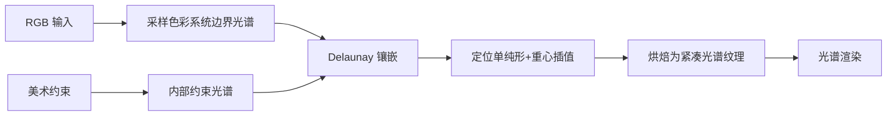

## 一句话总结

提出一种可控的光谱提升（spectral uplifting）方法，通过在色彩系统内部插入约束顶点并结合镶嵌插值，让美术师能在直接与间接光照下精细控制表面的光谱外观，同时用紧凑的光谱纹理格式满足实时渲染。

## 研究背景

光谱渲染在影视制作中日益重要：RGB 只能近似辐射与反射，而准确的跨光源色彩再现需要真实光谱。直接采集光谱反射率成本高、显存开销大，于是"光谱提升"应运而生——从已有 RGB 输入生成反射率光谱。

但这个问题是病态的，根源在于同色异谱（metamerism）：不同反射率在同一光源下可能产生相同的颜色信号。传统提升方法建立一对一映射（例如总是选最平滑的反射率），因此继承了三色渲染的缺陷——生成的反射率往往只在某一种光源下呈现期望外观。

近期的"约束提升"工作开始关注多光源下的外观，但仍存在三方面局限：性能开销大、控制能力有限，以及完全忽略了互反射（间接光照）。而在真实场景中，间接光照引起的同色异谱失配会显著影响外观。本文的目标就是在保持简单高效的同时，把控制能力扩展到间接光照。

## 方法

整体框架是把 RGB 输入视作 $$R^3$$ 空间中的位置，用一个包裹所有输入的凸多面体（色彩系统边界）来重建，多面体经 Delaunay 镶嵌成若干 3-单纯形，每个顶点存一条对应颜色的光谱。提升一个 RGB 值就归结为：定位包围它的单纯形，然后对该单纯形四个顶点的光谱做重心插值。

方法建立在颜色系统的线性性质上：色彩系统是线性变换、保持凸性，因此反射率的线性组合的颜色信号等于各颜色信号的线性组合：

$$\sum w_i \Phi(r_i) = \Phi\left(\sum w_i r_i\right)$$

**关键设计 1：内部约束顶点。** 先前工作（van de Ruit and Eisemann 2023）只能约束多面体边界上的顶点，而这些顶点远离输入，无法直接影响具体 RGB 输入的提升。本文允许在多面体内部插入约束顶点，从而直接改变特定 RGB 输入的提升结果。约束有三类：测量约束（把实测光谱投影到 PCA 基）、直接颜色约束、以及间接颜色约束。直接颜色约束通过线性规划求解满足约束的同色异谱：

$$\min_{w} \|Bw\|, \quad \text{s.t.} \ \forall_j\ \Psi_j Bw = \psi_j,\ \forall_i\ 0 \le (Bw)_i \le 1$$

其中反射率用 PCA 基表示为 $$r = Bw$$，保留 $$m > 3$$ 个主成分（若恰好 $$m=3$$ 则系统被完全确定、失去输出同色异谱的能力）。边界的平滑光谱通过 Mackiewicz 等人的方法采样：球面采样单位向量 $$\hat{u} \in R^3$$，沿投影方向最大化即落在系统边界上。

**关键设计 2：间接颜色系统。** 这是本文核心贡献。针对场景中某约束反射率 $$r$$，用路径积分表达其入射辐射，并把路径上的反射率因子分解出来。定义与反射率无关的函数 $$f_0$$，使得路径贡献可写成

$$f_r(\bar{x}, \lambda) = f_0(\bar{x}) \prod_{i=1}^{n-1} r_i(\lambda)$$

由于每条路径顶点上的光谱要么用到约束 $$r$$、要么不用，可把每个 $$r_i$$ 展开为 $$r_i = a_i r + w_i$$，从而把贡献整理成关于 $$r$$ 的截断幂级数：

$$f_r(\bar{x}, \lambda) = f_0(\bar{x}) \sum_{b=0}^{n-1} t_b(\bar{x}, \lambda)\, r^b(\lambda)$$

经蒙特卡洛积分后，入射辐射估计变为系数光谱 $$c_b$$ 与 $$r$$ 幂次的线性组合：

$$\hat{I}_r(\lambda) = \sum_{b=0}^{n-1} c_b(\lambda)\, r^b(\lambda), \quad c_b(\lambda) := \frac{1}{N} \sum_{i=1}^{N} \frac{f_0(\bar{x}_i)\, t_b(\bar{x}_i, \lambda)}{p(\bar{x}_i)}$$

实践中通过累积 $$N$$ 条路径的入射辐射、并按约束反射率的 $$b$$ 次互反射进行因子分解来估计 $$c_b$$。这样就得到一个非线性色彩系统，再用球面采样 $$\hat{u} \in R^6$$ 沿投影方向最大化求出间接光照下的同色异谱失配体（mismatch volume）边界。

**关键设计 3：紧凑光谱纹理格式。** 不直接存单纯形索引+权重（会遇到冲突约束问题），而是把提升后的反射率"烘焙"成正交基 $$B$$ 下的系数。基被缩放到 $$[-1, 1]$$ 边界，从而可用定点数表示：每像素 128 bit，按 16/10/8 bit 分别打包 8/12/16 个系数。纹理过滤在解包后对系数进行，滤波结果再用于提升。

实现上用 SQP（NLopt）做约束优化、Qhull 做 Delaunay 镶嵌，提升与渲染用 OpenGL，离散光谱用 $$k=64$$ 个波段，色彩体采样用 128 个球面样本，波长范围 400–700 nm。

## 实验结果

在 BabelColor Average 色块（$$D65$$）上评估无约束 RGB 提升的往返误差（CIE $$\Delta E_{00}$$，$$\Delta E \le 1$$ 表示不可察觉差异）。与 sigmoidal（Jakob and Hanika 2019）和 bounded MESE（Peters et al. 2019）对比：

| 方法 | 平均 $$\Delta E_{00}$$ | 最大 $$\Delta E_{00}$$ |
|---|---|---|
| Ours (m=8) | 0.00046 | 0.00588 |
| Ours (m=12) | 0.00056 | 0.00725 |
| Ours (m=16) | 0.01024 | 0.07291 |
| Ours (m=8, packed) | 0.00048 | 0.01079 |
| Ours (m=12, packed) | 0.11862 | 0.87168 |
| Ours (m=16, packed) | 0.60964 | 1.89340 |
| Sigmoidal | 0.01467 | 0.03181 |
| MESE (12) | 0.05829 | 0.17747 |
| MESE (12, packed) | 0.29709 | 1.39676 |

全精度变体的往返误差始终优于先前方法，且均在不可察觉范围内；$$m=16$$ 的打包变体因低比特率对暗色出现可见失配，故后续弃用。在光谱纹理重建实验（HyTexila 数据集）中，随约束样本数 $$n$$ 增加，输出逐渐逼近真实纹理，$$n \ge 16$$ 时所有输出平均 $$\Delta E_{00} \le 1.2$$，优于先前方法。间接颜色约束实验中，折叠灰面上的固定平面片重建误差平均 $$\Delta E_{00} = 0.34$$（部分来自低比特表示），各约束色均能正确再现。性能上：首次放置间接约束时 GPU 追踪 65K 条路径、CPU 端约化为幂级数耗时不到 1 秒；4K 纹理烘焙 12.5 ms，在 RTX 3070 上实现实时光谱编辑。

## 亮点与局限

亮点：
- 首个把间接光照约束整合进光谱提升的方法，把复杂光传输下的同色异谱失配转化为可求解的凸/近凸优化问题。
- 内部约束顶点直接影响具体 RGB 输入的提升，控制力比只能约束边界的先前工作强得多。
- 紧凑光谱纹理（基系数打包）评估成本恒定，即便存在冲突约束或纹理图集混合也不增加渲染负担，达到交互帧率。

局限：
- 理论支持镜面材质，但实现仅针对漫反射表面；通用 BRDF 留作未来工作。
- 由于基包含负分量，间接失配体的凸性不严格成立，实际求得的边界可能位于精确边界内部（作者认为实用上足够）。
- 每个场景使用不同的定制基虽可提升精度，但不便于合并场景，这在制作流程中有实际影响。
- PCA 基在光谱范围边界附近可能引入振荡行为。

## 延伸思考

这项工作把"同色异谱"从渲染中的麻烦变成了可控的创作工具——间接光照约束让美术师能设计"直接光下相同、互反射下不同"的表面外观，是一种新颖的场景外观设计手段。核心思路值得借鉴：把非线性的光传输量按约束变量因子分解成幂级数，从而把控制问题重新表述为线性/凸优化。

作者在展望中提到的方向也很有意思：当前面向精确反射率表示，未来可转向感知层面进一步压缩表示；同时研究揭示了人眼虽有局限，但在场景上下文中仍能区分高维反射率，而材质设计时往往缺乏这种上下文——这为依赖该方法的新型交互界面留下了空间。
