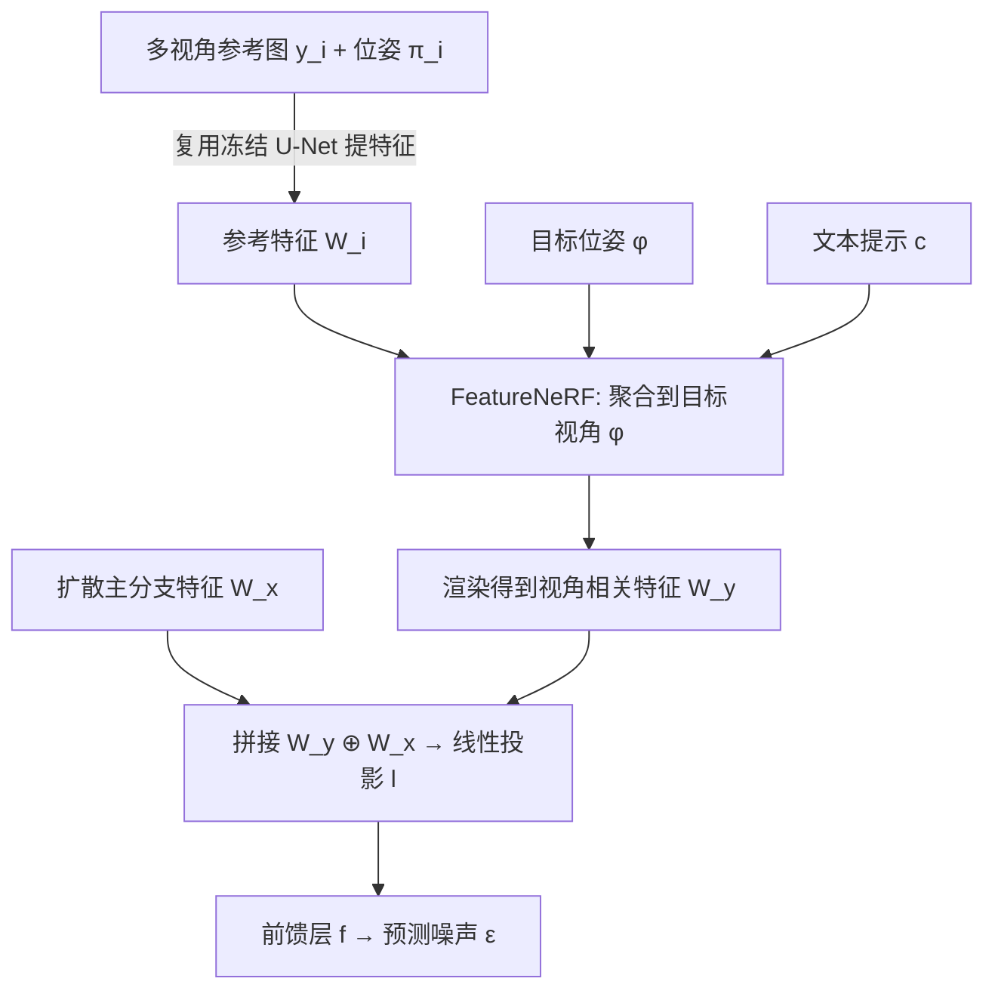

## 一句话总结

给定一个新物体的多视角图片，在定制文本到图像扩散模型的同时，让用户能显式控制该物体的相机视角——通过在 U-Net 中间特征空间里植入可渲染的 FeatureNeRF，把 3D 结构注入 2D 生成过程。

## 研究背景

文本到图像模型的"定制化"（customization/personalization）已经很成熟：给几张自家玩具、爱车的照片，模型就能学会这个概念，并把它放进"公园长椅上的泰迪熊"这类新场景里。但这些方法有一个共同短板——**无法精确控制物体的视角**。因为预训练模型只在 2D 图像上训练，没有相机位姿的真实标注，用户想换个角度只能靠在提示词里加"front-facing""top-view"这类词，既笨拙又不精确。

另一边，神经渲染（NeRF 系）能在给定多视角图片后精确控制已有场景的 3D 视角，但它做的是重建一个多视角一致的场景，而不是把物体"重新想象"到全新的上下文里。

本文提出一个新任务并给出解法 CustomDiffusion360：给定物体的多视角图片及对应相机位姿，定制模型时同时保留视角可控性。推理时可以同时用**目标视角**和**文本提示**两个条件来约束生成，比如"绿色的 V\* 汽车""甲壳虫造型的 V\* 汽车"。核心难点在于——如何把来自多视角图片的 3D 表征，和一个纯 2D 的预训练模型内部特征和谐地融合起来。

## 方法

### 整体框架

方法建立在 Stable Diffusion-XL 上。核心思路是：**不去改动预训练模型的权重，而是在 U-Net 的部分 Transformer 层里插入"位姿条件化"模块**，让扩散过程以从目标视角渲染出的 3D 物体特征为条件。

给定 $$N$$ 张多视角参考图 $$\{y_i\}$$ 及位姿 $$\{\pi_i\}$$、文本提示 $$c$$、目标位姿 $$\phi$$，目标是建模条件分布 $$p(x\mid\{(y_i,\pi_i)\}_{i=1}^N, c, \phi)$$。

### 关键设计 1：位姿条件化 Transformer 层

标准 Transformer 层 $$F_{\text{standard}}(z,c)$$ 由自注意力 $$s$$、与文本的交叉注意力 $$g$$、前馈 MLP $$f$$ 组成。作者把 SDXL 中 70 个 Transformer 层里的 **12 个**改造成位姿条件化层 $$F_{\text{pose}}$$。

在这些层里，主分支先提取 $$W_x = g(s(z_0), c)$$；参考图分支用**同一个预训练 U-Net**（复用而非新增网络）提取参考特征 $$W_i = F_{\text{standard}}(z_i, c)$$，经 FeatureNeRF 渲染出 $$W_y$$。二者拼接后经可学习线性层 $$l$$ 投影回原始通道维度：

$$F_{\text{pose}} = f\big(l(W_y \oplus W_x)\big)$$

关键细节：$$l$$ 被初始化为让 $$W_y$$ 的贡献在训练开始时为零，从而平滑接入而不破坏预训练能力。

### 关键设计 2：FeatureNeRF——在特征空间里的前馈辐射场

它把各视角特征 $$\{W_i\}$$ 聚合成目标视角的特征图 $$W_y$$，基于 PixelNeRF 改造。对目标光线上采样的每个 3D 点 $$p$$，投影到各参考视图取样特征，预测该点特征后用可学习加权平均 $$\psi$$ 聚合：

$$V_i^p = \text{MLP}(\text{Sample}(W_i; \pi_i^p), \gamma(d), \gamma(p)), \quad V^p = \psi(V_1^p, ..., V_N^p)$$

两处相较原始 NeRF 的改进：
- 用**文本交叉注意力更新聚合特征** $$\hat V = \text{CrossAttn}(V, c)$$——这是让生成物体身份对齐的关键（消融显示去掉它 image alignment 明显下降）。
- 用可学习加权平均代替简单平均来融合各参考视图。

随后按预测密度体渲染得到 $$W_y$$。这里的重点是学"2D 扩散模型能用的 3D 特征"，而不是单纯在特征空间里学一个 NeRF。

### 关键设计 3：训练损失与防过拟合

总损失结合扩散重建损失和 FeatureNeRF 的三项损失：

$$L = L_{\text{diffusion}} + \lambda_{rgb}L_{rgb} + \lambda_{bg}L_{bg} + \lambda_s L_s$$

其中扩散重建损失只在物体 mask 区域计算；$$L_{rgb}$$ 是 RGB 重建损失（rgb 仅训练时用于算损失）；$$L_s$$ 是轮廓损失让渲染不透明度贴合物体 mask；$$L_{bg}$$ 是背景抑制损失，强制所有背景光线密度为零。后两项 mask 损失是防止过拟合训练图背景的关键。此外训练时 25% 概率混入同类别的生成图（带 ChatGPT 描述），10% 概率丢弃文本以支持无分类器引导。

推理时组合图像引导与文本引导，用 $$\lambda_I$$（图像引导强度，控制与参考图相似度）和 $$\lambda_c$$（文本引导强度）来平衡两类条件。

## 实验结果

在 CO3Dv2 和 NAVI 数据集选取 14 个物体（汽车、椅子、泰迪熊、摩托车各 3 个实例，加 2 个玩具），每个实例约 100 张图，半训练半评测。对比 2D 图像编辑（SDEdit、InstructPix2Pix、LEDITS++，先渲染 NeRF 再编辑）、3D 编辑（ViCA-NeRF）、以及自建的 LoRA+相机位姿基线。

人类偏好评测（Amazon Mechanical Turk，每对约 1000 份回答），下表为各基线相对本方法被选中的比例（越低说明本方法越受偏好）：

| 对比方法 | 文本对齐（对方/本文） | 图像对齐（对方/本文） | 真实感（对方/本文） |
|---|---|---|---|
| SDEdit | 40.06% / 59.40% | 36.08% / 63.92% | 33.11% / 66.89% |
| InstructPix2Pix | 44.79% / 55.21% | 29.34% / 70.66% | 27.61% / 72.39% |
| LEDITS++ | 32.47% / 67.53% | 35.86% / 64.14% | 26.18% / 73.82% |
| ViCA-NeRF | 27.13% / 72.87% | 24.36% / 75.64% | 12.90% / 87.10% |
| LoRA+相机位姿 | 32.26% / 67.64% | 66.97% / 33.03% | 52.51% / 47.49% |

本方法在几乎所有维度都被更偏好。唯一例外是 LoRA+相机位姿的图像对齐更高——但这是因为它**过拟合了训练图**，换新提示词时并不遵守目标视角。视角准确性上，用 RayDiffusion 预测生成图位姿并与目标比对：本方法角度误差 14.19、相机中心误差 0.080，而 LoRA+相机位姿分别是 41.14 和 0.305，差距明显。

消融显示：去掉文本交叉注意力（更新体特征那一步）会拉低图像对齐；去掉 mask 类损失会导致过拟合训练背景、文本对齐下降。

## 亮点与局限

亮点：
- 提出并定义了"定制化 + 物体视角控制"这一新任务，填补了现有定制方法在精确视角控制上的空白。
- 架构上冻结预训练权重、只训练新增的线性投影层和 FeatureNeRF，计算与存储都很省。
- 因为真正学到了 3D 辐射场，能**外推到训练分布之外的视角**（改焦距、缩放、水平/垂直平移），还能结合 MultiDiffusion 做全景、结合 DenseDiffusion 组合多个不同朝向的实例。

局限：
- 当目标视角严重偏离训练图时会失败，例如焦距缩得太小、或把物体渲染到偏离画面中心处——因为预训练模型偏好把物体放在画面中央。
- 多物体组合场景下，可能无法同时遵守文本提示和精确的物体视角。

## 延伸思考

这项工作的思路很有代表性：**不是去改造 2D 生成模型的权重，而是把一个可微渲染的 3D 结构"缝"进它的中间特征空间**，用零初始化的投影层温和接入。这条路让"3D 可控性"和"2D 生成先验"各司其职，避免了从头训练多视角一致生成模型的高昂代价。值得注意的是文本交叉注意力被下沉到了 NeRF 特征聚合阶段，说明语义条件不只在最终生成层起作用，在 3D 特征构建阶段注入语义同样重要。局限里"物体偏好居中"暴露了预训练先验的偏置，这类先验偏置在把生成模型往可控方向改造时会反复出现，是后续工作需要正面处理的问题。
