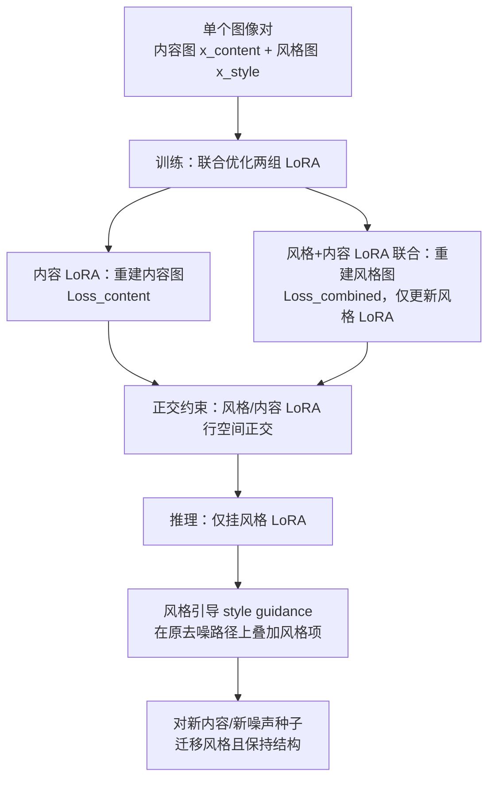

## 一句话总结

给定一对"原图—风格化后"的图像，本文用两组分离的 LoRA 权重分别建模内容与风格，从这**单个图像对**中"抽取"出二者的风格差异，并通过一种新的风格引导（style guidance）把该风格施加到全新内容上，同时保住原始结构与色调。

## 研究背景

- **领域现状**：以 DreamBooth、Textual Inversion、Custom Diffusion 为代表的文生图定制方法，通常用单个概念的 1~5 张图去微调大模型，让模型学会生成用户提供的特定对象或风格。
- **核心痛点**：当只用一张风格图去学"风格"时，模型难以区分哪些是风格、哪些是内容，往往过拟合到该图的具体主体、姿态、色调与布局上。结果就是想要"数字插画风格的狗"，模型却把背景、颜色甚至主体都改掉了，风格和内容纠缠在一起无法解耦。
- **本文 idea**：借鉴艺术中的"再创作"（如梵高对同一场景的多版本重绘）与经典的 Image Analogy 思路——一对配对图像通过**对比**天然地展示了"风格差异"。既然单图会把风格与内容混在一起，那就用一对图（内容图 + 其风格化版本）来显式对比，从差异中把风格单独学出来，从而在不改变结构的前提下迁移风格。

## 方法

整体框架分为训练与推理两个阶段。训练时联合优化两组独立的 LoRA：内容 LoRA 负责重建内容图，风格 LoRA 负责"补上"从内容到风格图的差异；推理时只挂载风格 LoRA，配合专门的风格引导施加风格。

关键设计：

1. **风格—内容双 LoRA 解耦**。基于 Stable Diffusion XL，定义内容 LoRA $$\theta_{content}=\theta_0+\Delta\theta_{content}$$ 与风格 LoRA $$\theta_{style}=\theta_0+\Delta\theta_{style}$$。内容 LoRA 用带稀有 token $$V^*$$ 的内容提示重建内容图；重建风格图时用合并权重 $$\theta_{combined}=\theta_0+\Delta\theta_{content}+\Delta\theta_{style}$$，提示为"{内容提示} in <desc> style"。由于内容已被内容 LoRA 承担，风格 LoRA 就被迫只去"抽取"两图之间的风格差异，避免把内容图泄漏进风格权重。

2. **联合训练目标与梯度截断**。每步同时优化两个损失：内容损失 $$L_{content}$$ 让内容 LoRA 重建内容图；组合损失 $$L_{combined}$$ 用合并模型重建风格图。关键在于重建风格图这一步对内容 LoRA 做 stopgrad，即 $$\theta_{combined}=\theta_0+\text{sg}[\Delta\theta_{content}]+\Delta\theta_{style}$$，只更新风格权重，最终目标为
$$\min_{\Delta\theta_{content},\Delta\theta_{style}} L_{content}+L_{combined}.$$

3. **正交适配（Orthogonal Adaptation）**。把 LoRA 分解为 $$BA$$，将 $$B$$ 初始化为零、$$A$$ 的行取自一组正交基，训练中固定 $$A$$ 只更新 $$B$$，从而让风格与内容 LoRA 响应正交的输入空间。这进一步减少视觉伪影、提升风格捕捉质量。

4. **风格引导（Style Guidance）**。在标准 classifier-free guidance 之外新增一项风格引导，保留原模型的去噪路径：
$$\hat\epsilon(x_t,c,c_{style})=\epsilon_{\theta_0}(x_t,\varnothing)+\lambda_{cfg}\big(\epsilon_{\theta_0}(x_t,c)-\epsilon_{\theta_0}(x_t,\varnothing)\big)+\lambda_{style}\big(\epsilon_{\theta_{style}}(x_t,c_{style})-\epsilon_{\theta_0}(x_t,c)\big).$$
风格项是风格 LoRA 与预训练模型噪声预测之差，$$\lambda_{style}=0$$ 时退化为生成原始内容。相比直接缩放 LoRA 权重，该方式能更平滑地控制风格强度并更好地保持布局。该公式还可推广到多风格线性叠加，实现风格混合。

## 实验结果

作者构建了配对合成数据集（headshots、animals、landscapes 三类，用 LEDITS++、Cartoonization、Stylized Neural Painting、posterization 生成风格化配对），在同类别（Same Category）与跨类别（Different Category）两种设定下评估。指标用 DreamSim 感知距离：既要与真实风格图距离低（风格贴合），又要与原内容图保持合理相似（结构保持）。

在风格相似度 vs. 结构保持的权衡曲线上，本方法在两种设定下均 **Pareto 支配**所有基线（DreamBooth LoRA、Concept Sliders、IP-Adapter、IP-Adapter w/ T2I、StyleDrop），即在同等结构保持下风格更贴近，或同等风格下结构更完整。

在人类偏好研究中（Amazon Mechanical Turk，每组对比约 400 份回答）：

| 对比对象 | 本方法被偏好比例 |
| --- | --- |
| 各基线方法（整体） | ≥ 60% |
| 本方法 vs. 去掉正交约束的消融版 | 更受偏好（尤其在与训练同类别时） |

结论：微调类方法（DB LoRA、Concept Sliders）在此任务上优于免训练的编码器类方法（IP-Adapter），但仍会过拟合训练图内容、丢失结构；本方法能保住原结构并忠实施加风格。将本文的风格引导用到基线上也能改善其结构保持，但基线仍偏向复制训练图内容。

## 亮点与局限

亮点：
- 用"图像对对比"这一新范式定义定制任务，把风格从内容中显式解耦，从**单对图像**就能学风格，缓解了单图定制的过拟合。
- 双 LoRA + stopgrad + 正交约束的组合，结构清晰、思路可解释；风格引导相比 LoRA 权重缩放能更平滑地控制强度并保结构。
- 天然支持多风格混合、真实图像编辑（DDIM 逆映射后施加风格引导）等扩展应用。

局限：
- 依赖能提供"配对"的数据；大规模定量评估主要建立在合成配对上，真实艺术家配对多为定性展示。
- 需要为每种风格训练专属权重（属微调类方法），不像编码器方法那样免训练即用。
- 推理需同时跑预训练与风格模型的噪声预测，风格引导带来额外计算开销，且风格强度、CFG 强度等超参需要人工权衡。

## 延伸思考

- "配对差异即概念"的思路可推广到风格之外：光照、材质、姿态变化等只要能构造"前后配对"，或许都能用同一套双 LoRA + 正交解耦框架去抽取并迁移。
- stopgrad 让某一 LoRA 只承担"残差"的技巧，本质上是一种职责分工的归纳偏置，可能对多概念组合、增量式定制中的干扰抑制有借鉴价值。
- 对配对数据的依赖是双刃剑：现实中高质量配对稀缺，如何用合成配对、或从非配对数据里自动构造伪配对来放大适用范围，是值得探索的方向。
