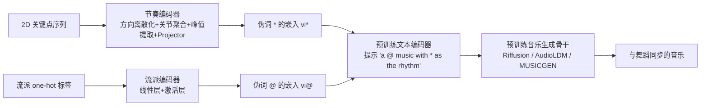

## 一句话总结

提出一种基于编码器的文本反演（encoder-based textual inversion）方法，用节奏和风格两条编码器把舞蹈视频的节拍与流派信息映射成两个可学习的伪词，插入到任意预训练文本到音乐模型中，从而生成与舞蹈动作同步、且仍可用文字自由控制高层属性的音乐。

## 研究背景

音乐与舞蹈动作的无缝配合是舞蹈作品表达艺术意图的核心，也直接影响游戏与动画的沉浸感。为舞蹈视频配乐一直是难题：手工选曲既耗时又涉及版权。

现有的舞蹈配乐方法各有短板：

- **符号表示（MIDI/REMI）类方法**：只能生成钢琴、吉他等少数古典乐器的音乐，音符序列常不连贯、旋律单调，且忽略音色与力度，表现力受限。
- **波形/梅尔谱类方法**：音质普遍偏差、噪声明显，且过度强调鼓点等打击元素而缺乏旋律细腻度；受训练集流派限制，难以适应多样化的野外舞蹈视频。
- **预训练文本到音乐模型**：能生成高质量、多样化的音乐，但大多只能控制流派、情绪等**全局属性**，无法操控节奏这类**局部属性**——而节奏恰恰是舞蹈配乐同步的关键。

传统文本反演（Textual Inversion）用一个伪词表示某个固定概念，但每个伪词的文本嵌入是固定的，而不同视频的节奏千变万化，为每段视频的节奏各训一个模型代价过高。本文要解决的正是"如何让单个伪词表示一类可变属性"的问题。

## 方法

### 整体框架

方法作为一个独立的网络模块（Encoder-based Textual Inversion Module），可挂接到任意文本到音乐骨干上。训练时提示词固定为 "a @ music with * as the rhythm"，其中 "@" 是流派占位符、"*" 是节奏占位符。两条编码器分别产出这两个伪词的文本嵌入，替换掉原提示中对应位置的嵌入，然后通过重建目标音频来联合优化两条编码器。推理时除固定提示外还可加入灵活文字描述，控制音乐的高层特征。

### 关键设计 1：编码器式文本反演

传统文本反演的优化目标是直接更新伪词嵌入以重建单一目标：

$$
v_{i*} = \arg\min_{v}\ \mathbb{E}_{z,y,\epsilon,t}\big[\lVert \epsilon - \epsilon_\theta(z_t, t, c_\theta(y)) \rVert_2^2\big]
$$

由于所有伪词的嵌入是固定的，无法适配可变节奏。本文在文本编码器上引入一条编码器分支，从特定输入（如人体姿态）中提取特征并映射到文本空间，使**同一个伪词能根据输入呈现不同的文本嵌入**。对 Riffusion 与 AudioLDM，编码器损失为：

$$
L_E = \mathbb{E}_{z,x,y,\epsilon,t}\big[\lVert \epsilon - \epsilon_\theta(z_t, t, t_\theta(x, y)) \rVert_2^2\big]
$$

对自回归的 MUSICGEN 则用交叉熵损失：

$$
L_{ce} = \frac{1}{K}\sum_{k=1}^{K} \mathrm{CE}\big(G_\theta(t_\theta(x, y))_k,\ t_k\big)
$$

其中 $$x$$ 为特定类型输入，$$t_\theta$$ 为扩展后的文本编码器，$$G_\theta$$ 为生成模型，$$K$$ 为码本索引。

### 关键设计 2：节奏编码器

将传统特征提取与投影网络结合。基于 LORIS，先对舞者 2D 关键点 $$p(t,j,c)$$ 做时间一阶差分得到运动速度，再做"方向离散化"，把速度按方向分入 $$K$$ 个区间：

$$
v_Q(t,j,k) = V\, l_\theta(t,j,k)
$$

$$
l_\theta(t,j,k) = \begin{cases} 1, & \text{if } k = \left[\dfrac{\theta}{2\pi/K}\right] \\ 0, & \text{otherwise} \end{cases}
$$

$$
V = \sqrt{v_x^2 + v_y^2}, \quad \theta = \arctan\left(\frac{v_y}{v_x}\right)
$$

对 $$v_Q$$ 再做时间一阶差分并沿区间聚合得到离散加速度 $$a_Q$$，保留正加速度并沿关节与方向维求和得到总加速度：

$$
a = \sum_{j,k} a_Q(t,j,k)
$$

在时间窗内取 $$a$$ 的局部极大值，构造节奏序列 $$r$$（极大值处置 1、其余置 0），再用 Projector 把 $$r$$ 映射到文本空间得到 $$v_{i*}$$，替换伪词 "*"。

### 关键设计 3：流派编码器与解耦

若仅从节奏信息重建梅尔谱，流派信息会混入节奏伪词，妨碍属性解耦，也导致无法按舞蹈流派控制生成。为此引入流派编码器：将舞蹈流派用 one-hot 编码，经线性层与激活层映射到文本空间得到 $$v_{i@}$$，替换伪词 "@"。两条编码器在重建目标音频时联合优化、相互增强。

## 实验结果

在 AIST++ 数据集上与四个 SOTA 方法（CMT、CDCD、LORIS、MDM）比较，评价涵盖节奏（BCS/BHS/F1/TD）、音质（FAD）、流派相似度（CLAP）与主观 MOS（连贯性 Coherence、质量 Quality，评分 1 最好到 5 最差；此处按原文数值列出）。

| 方法 | BCS ↑ | BHS ↑ | F1 ↑ | TD ↓ | FAD ↓ | CLAP ↑ | Coherence | Quality |
|---|---|---|---|---|---|---|---|---|
| Ground Truth | - | - | - | - | - | - | 4.26 | 4.25 |
| CMT | 0.3368 | 0.1515 | 0.2090 | 21.74 | 16.54 | 0.4454 | 1.79 | 3.08 |
| CDCD | 0.4233 | 0.2151 | 0.2852 | 19.25 | 16.47 | 0.3032 | 2.02 | 1.35 |
| LORIS | 0.3721 | 0.3371 | 0.3537 | 17.80 | 13.15 | 0.6180 | 2.56 | 2.42 |
| MDM | 0.3798 | 0.4185 | 0.3982 | 22.96 | 4.812 | 0.5793 | 2.97 | 2.58 |
| Ours (AudioLDM) | 0.4419 | 0.3605 | 0.3971 | 22.73 | 8.522 | 0.7030 | 2.95 | 3.02 |
| Ours (MUSICGEN) | 0.4118 | 0.3874 | 0.3992 | 16.06 | 6.014 | 0.4685 | **3.56** | **3.54** |
| Ours (Riffusion) | **0.4761** | **0.4398** | **0.4572** | 20.34 | **3.416** | **0.7680** | 3.24 | 3.15 |

Riffusion 骨干在除 TD 外的所有客观指标上取得最优，MUSICGEN 骨干在主观指标（连贯性、质量）上最佳。作者还在更具挑战性的野外数据集 InDV 上验证，方法在多数指标上同样领先；与按目标节拍生成的 Mustango 相比也显著更优，说明方法提供的是局部适配而非全局节拍控制。消融显示：流派编码器用 one-hot 标签优于用 CLAP 音频嵌入；节奏 Projector 上 Riffusion 更适合 MLP，而 MUSICGEN 对位置编码更敏感（Attn+Pos 更好）。

## 亮点与局限

**亮点**

- 提出"单个伪词表示一类可变属性"的编码器式文本反演范式，突破传统文本反演每个伪词嵌入固定、需逐目标训练的限制。
- 即插即用：可挂接 Riffusion、AudioLDM、MUSICGEN 等多种预训练骨干，且保留其原有的文字引导生成能力，能同时用节奏（视觉）和文字（高层属性）双重控制。
- 只需 O(1k) 规模的小数据集即可驱动（对比 V2Meow 需从零训练 O(100k) 数据），并能适应节拍变化、扩展到跳绳、艺术体操等其他物理活动。
- 贡献了包含中国传统舞等复杂节奏结构、单段视频含多样动作的野外数据集 InDV。

**局限**

- 目前只支持固定长度视频片段配乐，尚不能处理可变长片段，限制了真实场景的适用性。
- 大规模预训练模型带来较长推理时间（如 AudioLDM 骨干约 14.82 s/clip）。

## 延伸思考

- 这项工作把"文本反演"从图像领域的静态概念表示，推广为"用编码器动态生成伪词嵌入以表示可变属性"，这一思路对其它难以用自然语言描述的连续/局部属性（如运镜节奏、材质动态、力度包络）迁移潜力很大。
- 用 2D 关键点的运动加速度局部极大值作为节奏代理，是一种轻量而通用的跨模态对齐信号；后续如作者所言，融合多模态运动信息（3D、光流、事件）可能进一步提升节拍生成的鲁棒性。
- 流派控制目前依赖 one-hot 标签，example-based（以音频示例控制流派）尝试因数据单调而失败，说明该方向仍受限于数据多样性——更丰富的舞蹈-音乐配对数据可能是解锁更灵活控制的关键。
