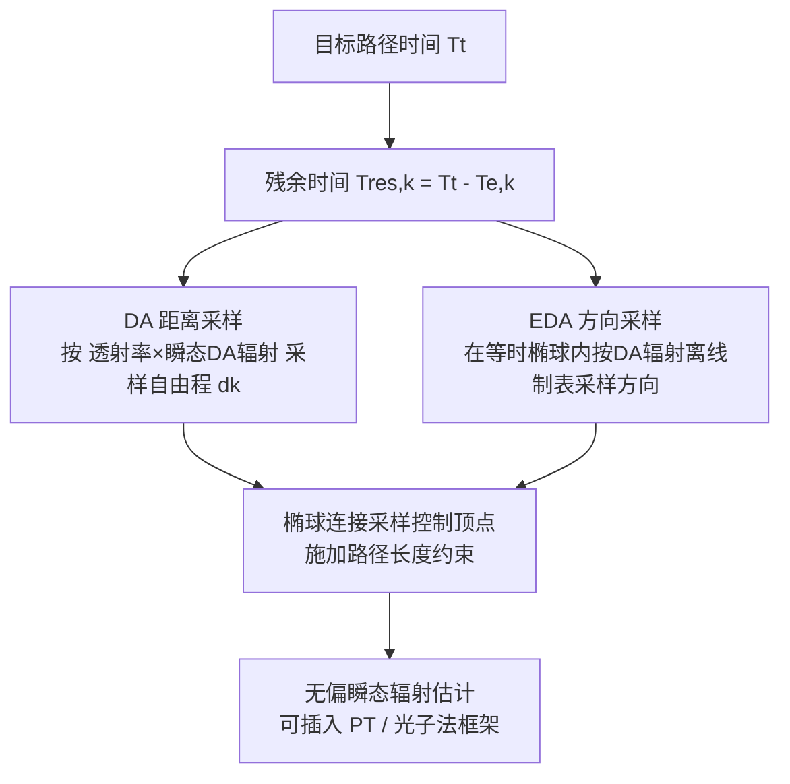

## 一句话总结

DARTS 首次将瞬态扩散近似（diffusion approximation, DA）引入飞行时间（ToF）渲染的路径构造过程，对自由程距离和散射方向按瞬态辐射贡献做重要性采样，并扩展椭球连接实现路径长度控制，在均匀散射介质场景中相比 SOTA 方法实现至少 5 倍的 MSE 降低。

## 研究背景

飞行时间（ToF）成像依赖超快传感器记录光子到达的时间分布，广泛应用于非视域成像、透雾成像、材质估计与深度感知等。为了支撑这些应用的算法开发与数据集生成，需要高质量的 ToF 渲染来模拟时间分辨的光传输。

但在含参与介质（participating media）的场景中，高效 ToF 渲染面临两大核心困难：

- **缺乏对瞬态辐射的重要性采样**。稳态体渲染的空间采样策略无法生成好的瞬态散射路径；已有瞬态方法（如 Jarabo 等）追求路径长度的时间域均匀分布，却忽略了不同路径样本对目标时间区间辐射贡献的差异，导致大量样本贡献极低。要做有效的重要性采样，就必须让距离采样、方向采样这些关键过程感知瞬态辐射信息，而这类信息依赖全局伴随传输而非局部传输函数。
- **难以有效施加路径时间（长度）约束**。已有的椭球连接方法无法直接推广到体渲染（体采样没有可相交的多边形），且其参数化方式阻碍了重要性采样与方向复用；另一类切片高维光子基元的方法在相机弯曲（camera-warped）设置和表面传输下效率低下。

DARTS 针对这两个问题分别提出扩散近似距离采样与椭球扩散近似（EDA）采样，构建完整的瞬态路径并实现无偏、低开销的渲染。

## 方法

### 整体框架

DARTS 建立在瞬态路径积分框架上。像素强度为对路径空间与发射时刻的积分：

$$
I = \int_{\Delta t_0} \int_{\Omega} L_e(x_e \to x_{k-1}, t_e, \Delta t_e) f(x) W(x_1 \to x_0, \|x\|)\, d\mu(x)\, d\Delta t_e
$$

其中响应函数 $$W(\|x\|)$$ 是路径光程 $$\|x\|$$ 的函数，是与稳态估计器唯一不同的部分。在折射率为 $$\eta$$ 的均匀介质中，路径时间与路径长度只差一个标量：

$$
t(x) = \frac{\eta}{c}\|x\| = \frac{\eta}{c}\sum_{i=0}^{k-1}\|x_i - x_{i+1}\|
$$

高方差主要来自两点：重要性采样忽略辐射贡献（多重散射路径无效）、无法有效施加路径长度约束。DARTS 用两大模块对症下药。

### 关键设计一：残余时间估计器与 DA 距离采样

定义到第 $$k$$ 个顶点的残余时间 $$T_{res,k} = T_t - T_{e,k}$$，将入射辐射递归分解为直接与间接分量并统一为残余时间辐射表示。理想的距离采样 PDF 应正比于衰减后的瞬态辐射：

$$
p_t(d_k) = \frac{\sigma_s \exp(-\sigma_t d_k) L'(x_{k+1}, -\omega_{k+1}, T_{res,k+1})}{Z}
$$

由于 $$L'$$ 无解析形式，作者引入无限均匀散射介质中扩散方程的辐射通量解（$$\sigma_s \gg \sigma_a$$ 时成立）：

$$
\Phi(x, t') = \frac{c\, H(t'-\tau)}{\left(4\pi c D (t'-\tau)\right)^{3/2}} \exp\!\left(-\frac{\|x-x_e\|^2}{4cD(t'-\tau)} - \sigma_a c (t'-\tau)\right), \quad D = \frac{1}{3(\sigma_a + \sigma_s(1-g))}
$$

用通量近似瞬态辐射，得到最终距离采样 PDF：

$$
p_t(d_k) = \frac{\sigma_t \exp(-\sigma_t d_k)\, \Phi\!\left(x_k + \omega_k d_k, T_{res,k} - \frac{\eta}{c} d_k\right)}{Z_k}
$$

该 PDF 无法解析求逆，故用重采样重要性采样（RIS）实现：以截断指数分布作为候选分布生成候选样本，用扩散方程与透射率评估 RIS 权重后重采样（$$N_{RIS}=8$$ 兼顾 SIMD 效率与质量），并用预计算的 Sobol 序列表（32×8）避免样本聚集、降低采样器状态更新开销。无因果性（残余时间为负）或超出波前范围的样本权重置零；若所有候选无效则退化为朴素指数采样。

### 关键设计二：EDA 方向采样

扩散通量积掉了方向信息，为捕捉方向性，作者在由当前顶点、目标发射顶点与残余时间定义的椭球内，近似给定方向 $$-\omega$$ 的入射辐射：

$$
L_i(x_k, -\omega, T) \approx \sigma_s \int_0^{t_M} \exp(-\sigma_t t)\, \Phi\!\left(x_k + \omega_k t, T - \frac{\eta}{c} t\right) dt
$$

其中极距 $$t_M$$ 由椭球几何决定：

$$
t_M(\cos\theta) = \frac{S^2 - C^2}{2S - 2C\cos\theta}, \quad S = \frac{cT}{\eta}
$$

该积分无解析形式，故离线制成三维表：前两维 $$C/S$$（有界于 $$[0,1)$$）和 $$S$$ 用于条件化椭球形状，第三维角度维用于逆变换采样（$$\cos\theta$$ 均匀分为 256 格），$$\phi$$ 各向同性均匀采样。制表在单个消费级 GPU 上仅约 5 秒。采样测度等价于立体角测度，可与相位函数采样通过单样本 MIS（平衡启发式）结合。采用自适应参数决定是否用本方法：

$$
\gamma = \frac{C/S}{C/S + \alpha} \in [0, 1], \quad \alpha \ge 0
$$

椭球接近圆（低次散射）时偏好相位函数采样，椭球变扁（多重散射）时偏好本方法。

### 关键设计三：椭球连接的体渲染扩展

朴素阴影连接无法对给定顶点施加路径长度约束。作者改进 Pediredla 等的椭球连接：不再围绕椭球中心参数化，而是以当前顶点（焦点）为原点在极坐标下参数化控制顶点（方向 $$\omega$$ + 极距 $$t$$），从而支持散射介质中的采样、重要性采样与方向复用（复用 EDA 的散射方向，使 $$x_k$$、$$x_{k+1}$$、控制顶点共线，可复用光线求交结果）。距离采样用截断指数分布偏好高透射率（低 $$S$$）路径，并区分「椭球环不相交表面」与「采样范围内遇到表面」两种情形。该连接能给出任意残余时间的距离上界，用于提前识别非因果样本与超时路径（约 1.5 倍加速），并可完全避免因 $$W(\|x\|)$$ 为零导致的样本拒绝——实验中朴素方法有 85.31% 样本因零权重被拒，而本方法拒绝率 <3%。

## 实验结果

作者在 pbrt-v3（单向路径追踪 PT）与 Tungsten（光子点 PP / 光子束 PB）中实现，对比朴素 PT 与 SOTA 渐进式光子法，场景支持完整传输与高达 200 次弹射。以下为时间门控（time-gated）渲染主实验，MSE 以 DARTS PT 归一化为 1（数值忠于原文描述）。

| 场景 | 三角形数 | 散射强度 | DARTS PT 相对 MSE | 朴素 PT 相对 MSE |
|------|---------|---------|------------------|-----------------|
| GLOSSY DRAGON | 87k | 3.2 TMFP | 1（基准） | 约 10–50 倍 |
| STAIRCASE | 262k | 4.3 TMFP | 1（基准） | 约 10–50 倍 |

主要结论：

- DARTS PT 在相同 6k SPP 下显著优于朴素 PT，MSE 降低约 10–50 倍，且渲染时间更短（朴素 PT 约慢 1.5 倍）。
- 得益于无偏特性，DARTS PT 在多数场景已能超过光子法；DARTS PP 进一步拉开差距，光子点法配合 DARTS 可做到近乎无噪、无明显视觉伪影。
- 相比 SOTA 方法整体实现至少 5 倍 MSE 降低。
- 瞬态渲染实验（STAIRCASE，40 帧）中，PT 等 SPP（80k）、光子法等时（1h）对比均显示 DARTS 降低渐近方差、提升质量。
- 参数变化实验表明：散射越浓 DARTS PP 优势越明显，但薄介质下因表面传输不如 PT；门宽越接近稳态，DARTS PT 相对优势越小；数值收敛上 PT 方法 MSE 收敛提升至少一个数量级。
- 消融实验（CORNELL BOX）表明 DA 距离采样与 EDA 采样协同使用时质量提升最显著。

## 亮点与局限

亮点：

- 首个将瞬态辐射贡献纳入完整路径重要性采样的 ToF 渲染方法，突破了以往仅追求时间域均匀分布的思路。
- 将扩散近似同时用于距离采样与方向采样，并用 RIS + 离线制表规避无解析解的困难，额外计算与内存开销可忽略。
- 方法无偏，可作为即插即用模块同时用于路径追踪与光子法两类框架，并公开了两套实现代码。
- 椭球连接的体渲染扩展实现了近乎零拒绝的路径长度控制，尤其适合无时间路径复用的时间门控渲染。

局限：

- 理论推导假设点发射器与 Henyey-Greenstein 相位函数；更复杂发射器（准直、面光源）与强方向性相位函数需近似处理或留待未来工作。
- 依赖扩散近似，异质介质或强方向散射会违反其假设；EDA 的两步方向复用对峰值相位函数理论上次优（实测影响不大）。
- 复杂可见性场景缺乏坚实理论支撑，发射器与顶点间可见性可能未被计入；在单向渲染器中引入可见性项（如对每个 RIS 候选做求交）计算代价可能抵消收益。

## 延伸思考

- DARTS 的核心思路是「用一个廉价的解析物理近似（扩散方程）去引导蒙特卡洛采样」，这与稳态渲染中的路径引导殊途同归，但巧妙之处在于扩散解天然携带时间维度，避免了把路径引导直接推广到时间域时因维数灾难导致的样本稀疏问题。
- 残余时间的递归分解使得「全路径的时间约束」被拆解为每个顶点上的局部状态转移，这种降维思想值得在其他带全局约束的采样问题中借鉴。
- 作者提出的未来方向——可微瞬态渲染与双向/Metropolis 框架的结合——对非视域成像仿真尤其有价值，因为更高的采样效率通常直接转化为更好的反向优化性能。
- 一个自然的疑问是：当扩散近似失效（强各向异性或异质介质）时，能否用神经网络在线学习一个「瞬态辐射代理」来替代解析扩散解，从而保留重要性采样框架而放宽介质假设。
