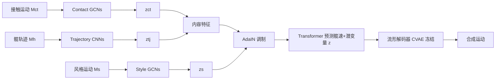

## 一句话总结

通过把"接触"这一难以解耦的要素改用**髋部速度**作为代理去间接控制，并将髋速进一步拆解为**轨迹**与**接触时序**，本文在一个基于 Transformer 的运动流形上实现了对风格、接触时序、轨迹的独立细粒度控制，兼顾风格表现力与运动自然度。

## 研究背景

运动风格迁移的目标是在保留内容的同时替换动作的风格，广泛用于动画与游戏，可显著降低动作捕捉成本。传统做法是把风格从内容中分离，再把风格迁移到新内容上。但角色运动中内容与风格本身难以清晰区分，完全解耦几乎无法做到。

作者提出一个关键追问:既然完全解耦困难,那么"哪个要素无法被完全解耦、却又至关重要"?答案是**接触(contact)**。在移动类运动中,接触是多面的——包含时序、时长、频率、模式、位置等,它同时与内容和风格紧密耦合。以往工作多把接触当作内容的一部分,近来也有工作意识到它与风格相关,但如何显式控制接触以实现细粒度风格迁移仍是空白。

不显式控制接触往往导致某些风格表现力受限,甚至破坏内容本身产生不自然的运动。然而直接约束接触点的速度和位置(朴素做法)由于接触与内容/风格高度耦合,会造成不自然且不可控的结果。因此需要一个既能控制接触、又能与风格/内容解耦的代理量。

## 方法

### 核心洞察:用髋部速度作为接触的代理

作者放弃了 phase 等隐式表示(它同样与风格/内容耦合且难以编辑),转而选用**髋部速度**作为代理。理由是:髋速与表达风格/内容的关键特征(身体姿态、肢体运动)只是松散相关,却容易控制、且与接触高度相关。

经验观察(基于 STYLE100 数据的行走序列)发现:髋速大小本身与接触无直接关系,但**髋速趋势的变化时刻**(如由增趋势转为减趋势)对应着接触的切换时刻。作者用一个卷积网络 $$f_\delta(\cdot)$$ 建模"髋速→接触状态"的关系,输入髋速 $$h \in \mathbb{R}^{T\times 3}$$,预测两条腿的接触状态 $$c_t \in \mathbb{R}^{T\times 2}$$。在两个数据集上均取得高预测精度;并且对髋速序列整体缩放一个因子仍保持高精度,验证了"接触模式更依赖髋速趋势的变化而非速度大小"。

髋速可进一步分解为:**高层特征**决定根轨迹(接触的空间方面,如位置),**低层特征**支配接触时序,二者协同实现细粒度控制。

### 两阶段架构

第一阶段用三个网络分别从风格运动 $$M_s$$、接触运动 $$M_{ct}$$、轨迹运动 $$M_h$$ 提取风格特征 $$z_s$$、接触时序特征 $$z_{ct}$$、轨迹特征 $$z_{tj}$$。第二阶段将接触时序与轨迹合成为内容特征,再由 AdaIN 用风格特征调制;Transformer 预测满足接触与轨迹条件的髋速及编码剩余风格变化的潜变量 $$z$$;最后由运动流形合成运动。

### 运动流形(CVAE)

流形采用以髋部为条件的条件变分自编码器(CVAE)。由于髋速-接触是时序模式,CVAE 编码整段序列的随机性而非逐帧特征,并使用以髋速为 query 的注意力机制强调髋速与运动动态的关系。流形有两个优点:一是合成的腿部运动与髋速兼容,减少滑步伪影;二是把髋速从运动中解耦,从而获得对轨迹与接触时序的强控制力。流形通过 $$\beta$$-VAE 训练,仅靠表示学习捕获髋速-接触关系,无需显式加入相关损失。

### 损失设计

在参考 $$L_{rec}$$ 与循环一致性 $$L_{cyc}$$ 基础上,记 $$G_{sch}=G(M_s,M_c,M_h)$$ 为风格取自 $$M_s$$、接触时序与轨迹分别取自对应运动的合成结果。为分离轨迹引入:

$$L_{tj} = \|H_{scc}-h_c\|_2^2 + \alpha_{tj}\|proj(H_{ssc}) - proj(h_c)\|_2^2$$

其中 $$H_{scc}$$ 为 $$G_{scc}$$ 的髋速,$$proj(\cdot)$$ 把髋位投影到地面提取轨迹,$$\alpha_{tj}=0.2$$ 允许轨迹小幅偏差。为分离接触时序引入接触损失:

$$L_{ctt} = \|f_\delta(H_{scc})-f_\delta(h_c)\|_2^2 + \|f_\delta(H_{ssc})-f_\delta(h_s)\|_2^2$$

风格损失借助 CVAE 编码器:$$L_{style}=\|g(E(G_{scc}))-g(E(M_s))\|_2^2$$,其中 $$g$$ 为 Gram 矩阵。总损失为 $$L=L_{rec}+\alpha_0 L_{cyc}+\alpha_1 L_{style}+\alpha_2 L_{tj}+\alpha_3 L_{ctt}$$,各 $$\alpha_i=0.5$$。

### 细粒度控制方式

- **轨迹控制**:缩放送入 Transformer 前的髋速平均大小可改速度而不影响接触/风格;也可替换髋序列直接换轨迹(此时接触时序随之改变);或插值 $$z_{tj}$$ 实现渐变过渡且保持接触时序。
- **接触时序控制**:在内容与风格运动之间线性插值 $$z_{ct}$$;或无需参考运动,通过优化 $$\arg\min_{\hat h}\ \lambda\|proj(\hat h)-proj(h)\|_2^2 + \|f_\delta(\hat h)-c_t\|_2^2 + \sigma\|\hat h - h\|_2^2$$ 得到满足目标接触时序 $$c_t$$ 又大致保持轨迹的髋速。
- **风格控制**:插值两个风格特征 $$z_s$$ 影响时空变化。

作者还提出 **Contact Precision-Recall** 指标,衡量合成接触与髋速之间的匹配度,比 FMD 和滑步指标更贴合人类对自然度的感知。

## 实验结果

在 STYLE100 数据集上,将本文流形与 MLD、VQVAE、MVAE 及本文的逐帧变体对比。Ct P./Ct R. 为接触精度/召回,FMDvel 为速度域 FMD,Fv 为滑步指标(数据集为 0.68),Percep. 为 20 名参与者(含 5 名专业动画师)打分(1~5,越高越自然)。

| 方法 | Ct P. | Ct R. | FMDvel | Fv | Percep. |
|------|-------|-------|--------|------|---------|
| MLD | 0.4618 | 0.4311 | 0.0265 | 0.92 | N/A |
| MVAE | 0.6129 | 0.4843 | 0.0116 | 0.84 | 1.83 |
| Frame-Level | 0.5613 | 0.6480 | 0.0190 | 0.95 | 2.40 |
| VQVAE | 0.8633 | 0.8554 | 0.0475 | 0.67 | 3.83 |
| **Ours** | **0.8782** | **0.8712** | 0.0157 | 0.79 | **4.46** |

本文流形在人类感知分(4.46)上明显领先,同时在接触精度/召回上超过同为 Transformer 的 MLD 与逐帧变体,验证了髋部条件与整段(long-clip)编码对学习"接触时序-髋速"长程关系的重要性。VQVAE 因用下采样卷积也能编码长序列特征,接触指标接近本文,但其 FMD 表现差却感知分高,说明 FMD 在衡量运动质量上并不可靠;而多数方法滑步指标都接近数据集水平,区分度不足——由此凸显 Contact Precision-Recall 更贴合感知。在风格迁移框架对比(Tab. 2/3)中,本文在风格、接触、轨迹三类实验里综合取得最佳 FMD 与风格识别准确率,两秒序列约 8.9 cm 的轨迹偏差在视觉上难以察觉。

## 亮点与局限

亮点:
- 提出"接触无法完全解耦但至关重要"的视角,用**髋部速度作代理**间接控制接触,再拆解为轨迹与接触时序,实现风格/接触时序/轨迹的独立细粒度控制,这是以往方法做不到的。
- 基于经验证据(髋速趋势变化对应接触切换)设计,并用表示学习让流形自发捕获髋速-接触关系,无需显式损失。
- 流形具通用性:既可直接生成运动,也可作为已有风格迁移方法的后处理来提升质量与接触可控性。
- 提出 Contact Precision-Recall 指标,比 FMD 与滑步更贴合人类对自然度的判断。

局限:
- 接触与轨迹都依赖髋速,同时修改二者会相互干扰(本文流形能较好化解冲突,但这一根本张力仍存在)。
- 方法聚焦于移动类(locomotion)运动中的接触,对与地面接触无关或涉及复杂手部/物体接触的运动是否适用未充分展开。
- 大量实现细节、部分数据集(CMU)结果与消融放在附录,主文对某些设计选择的定量支撑有限。

## 延伸思考

- 把接触视为"不可完全解耦却关键"的要素,并寻找一个松相关、易控、又与目标高度相关的代理量(此处是髋速),是一种可迁移的方法论——它或可推广到手部与物体交互、多角色接触等场景,只是需要为不同接触类型寻找各自合适的代理。
- Contact Precision-Recall 指出了 FMD/滑步等常用指标与人类感知的偏差,提示运动生成领域的评测应更多引入"物理/运动学关系是否被满足"的度量,而非仅比较分布距离。
- 用髋速作条件并整段编码随机性的流形思想,与近期扩散类运动生成的可控性研究可以互补;将这种可解耦流形接入扩散框架,或能兼得多样性与细粒度接触控制。
