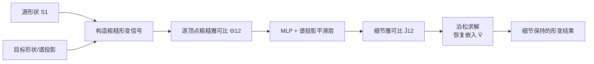

## 一句话总结

不依赖全局形状编码，仅用一环邻域内的"粗糙雅可比"作为局部输入信号，让每个三角面都成为一个训练样本，用共享权重的 MLP 学出细节保持的形变，从而以极少数据（60 对形状）实现跨类别泛化，并统一支撑映射精化、无监督形状匹配与交互式编辑三项任务。

## 研究背景

估计有意义的曲面形变是计算机图形学的经典问题，广泛用于曲面映射与配准、角色重摆姿、基于手柄的编辑等下游任务。近年来数据驱动方法通过学习结构化先验来预测合理形变，但普遍存在两大瓶颈：

- **依赖全局编码**：主流方法（如 Neural Jacobian Fields）用一个全局隐编码表示整个形状，这要求收集覆盖所有合理形变的大规模数据集，且往往把方法绑定到特定形状类别，跨类别泛化需要大量重新训练。
- **构造可行隐空间困难**：即使有数据，构建合适的形变隐空间本身也很棘手，而且这些方法通常要求训练形状之间共享 1:1 对应关系。

作者的关键观察是：在特定场景下，细节保持的形变其实可以**在没有任何全局上下文**的情况下可靠地估计出来。基于这一直觉，他们提出把一环邻域内定义的雅可比矩阵作为形变的粗糙表示，作为网络输入。由于去除了对全局编码的依赖，每个点（局部区域）都变成一个训练样本，使得监督变得极其轻量。作者称该网络为 Local Jacobian Network（LJN）。

## 方法

### 整体框架

给定源形状 $$S_1$$ 和一个粗糙形变输入信号，目标是学出细节形变，用雅可比 $$J_{12}$$ 表示。核心流程如下：

网络的学习过程可写为：

$$
\hat{J}_{12} = I_1^T\, G_6(\ldots(\mathrm{Proj}_1(G_1(\Theta_{12}))))
$$

其中 $$G(\cdot)$$ 是逐顶点应用的 MLP，$$\mathrm{Proj}(\cdot) := \Psi_1 \Psi_1^T M_1 \cdot$$ 把特征投影到 LBO 特征基上，$$I_1$$ 是把面上量平均到顶点的稀疏行随机矩阵。给定预测雅可比后，通过标准泊松求解恢复嵌入：

$$
\Delta_1 V_2 = \nabla_1^T A_1 J_{12}
$$

### 关键设计一：局部雅可比 + 谱投影平滑

与 NJF 的全局编码不同，LJN 的**权重完全共享**，独立作用于每个单纯形。输入是把面上雅可比平均到一环邻域顶点得到的粗糙雅可比场。其中最关键的组件是**谱投影层**：把学到的特征投影到 LBO 算子的特征基上。作者的直觉可视化说明——把单个雅可比看作某顶点上的 Dirac 信号，投影到 LBO 特征基后，特征会平滑地扩散到该顶点周围的小邻域，从而实现局部有效的信息共享。

训练损失包含三项：

$$
L_{Tr} = \alpha_1 \lVert J^*_{12} - \hat{J}_{12} \rVert_F^2 + \alpha_2 \lVert V_2 - \hat{V}_1 \rVert_2^2 + \alpha_3 \lVert J^*_{12} - E_1^{-1}\hat{E} \rVert_F^2
$$

三项分别监督：预测雅可比、恢复的顶点位置、以及"积分回去的雅可比"与真值的一致性（可积性约束）。

### 关键设计二：不同连接性网格的推理（谱投影输入）

真实场景中形状很难保持 1:1 对应。为此在推理时利用 Functional Map 框架：先把目标形状坐标函数的谱投影通过泛函映射"拉回"到源形状：

$$
\bar{V}_1 = \Psi_1 C_{21} \Psi_2^{\dagger} V_2
$$

由于 $$V_1$$ 与 $$\bar{V}_1$$ 共享连接性，即可构造输入信号并前向得到 $$\hat{J}_{12}$$。为解决学习雅可比中的数值误差导致的"曲面对不齐"问题，恢复嵌入时不只解泊松方程，而是引入点对点映射 $$\Pi_{12}$$ 联合求解：

$$
(\Delta_1 + \alpha_4 M_1 + \alpha_5 \Delta_1^T M_1 \Delta_1)\hat{V}_1 = \alpha_4 M_1 \Pi_{12} V_2 + \alpha_5 \Delta_1^T M_1 \nabla_1^T A_1 \hat{J}_{12}
$$

三项分别保证：恢复嵌入几何上贴近目标、尊重学到的雅可比、以及嵌入平滑（最小范数解）。由于左端只依赖拉普拉斯与质量矩阵，可预分解。

### 关键设计三：无监督形变与映射的联合学习

不假设已有 $$C_{21}$$，而是与 $$J_{12}$$ 联合学习。采用双分支 Deep Functional Map，以可微方式估计泛函映射 $$\hat{C}_{21} = \Psi_1^{\dagger} \tilde{\Pi}_{12} \Psi_2$$，其中 $$\tilde{\Pi}_{12} = \mathrm{Softmax}(D_1 D_2^T / \tau)$$，$$\tau = 0.07$$。无监督形变目标为：

$$
L_J(\hat{J}_{12}) = \lVert \mathring{J}_{12} - \hat{J}_{12} \rVert_F^2 + \alpha_6 \lVert \hat{J}_{12} - H_1 \hat{J}_{12} \rVert_F^2 + \alpha_7 \lVert \det(\hat{J}_{12}) - 1 \rVert^2
$$

三项分别是：拟合软映射诱导的雅可比、相邻面雅可比平滑先验、以及体积保持正则。

### 关键设计四：交互式编辑复用同一框架

编辑任务中用户拖动手柄顶点，输入信号可能不对应任何合法形状。作者对真值雅可比做极分解 $$J^*_{12} = Q_{12} W_{12}$$，用正交矩阵 $$Q_{12}$$（最近旋转）作为输入信号，其余训练流程完全一致。推理时类似 ARAP，但用单次前馈直接学出细节保持形变，而非迭代更新雅可比。

## 实验结果

监督实验仅在 SCAPE 前 50 个 + FAUST 前 10 个共 60 对人体形状上训练。下面是映射精化任务的主实验（两种初始化 CDFM/ULRSSM 平均），指标为测地误差 Geod（越低越好）、映射翻转 Inv%（越低越好）、狄利克雷能量 DirE（越低越好）、覆盖率 Cov%（越高越好）：

| 方法 | FAUST Geod | FAUST Cov | SCAPE Geod | SMAL Geod | SMAL Inv | DT4D-Inter Geod |
|------|-----------|-----------|-----------|-----------|----------|-----------------|
| Init（初始映射） | 1.7 | 80.8 | 2.3 | 4.7 | 13.6 | 6.8 |
| ZoomOut (ZO) | 1.7 | 83.3 | 2.2 | 5.6 | 11.9 | 6.6 |
| DZO | 1.8 | 79.8 | 2.4 | 4.9 | 11.1 | 6.3 |
| SmFM | 2.2 | 75.5 | 3.8 | 6.1 | 12.0 | 7.5 |
| **Ours (LJN)** | **1.5** | **83.7** | **1.9** | **4.1** | **10.2** | **6.1** |

LJN 在近等距（FAUST/SCAPE/SHREC-19）与非等距（SMAL/DT4D）基准上均一致优于迭代式基线。尤其值得注意的是，仅在人体形状上训练却能显著泛化到 SMAL 动物形变；即使对比明确以最小化狄利克雷能量为目标的 SmFM，LJN 恢复的映射失真也更小（因其形变在空间域 $$\mathbb{R}^3$$ 中操作，而非受基截断影响）。

其他关键结果：

- **无监督匹配**：在 FAUST-Challenge 真实扫描上，INTRA 平均误差 3.89 cm、INTER 2.62 cm，达到无监督 SOTA 水平（且未针对数据缺陷做特殊处理）。
- **数据效率**：仅 10 对形状训练即可获得与 80 对训练相当的对应精度。
- **消融**（FAUST/SCAPE 上 Chamfer 距离 CD 与测地误差 Geod）：完整模型 FAUST CD=3.9、Geod=1.5；去掉雅可比监督（$$\alpha_1=0$$）、改用位移场、面级离散、去掉平滑层均导致明显下降，其中面级离散最差（CD=7.4）。
- **运行时**：由于单次前馈 + 回代，比迭代式基线快若干数量级。
- **分辨率鲁棒性**：从 2K 到 200K 面片，形变结果始终忠于目标几何。

## 亮点与局限

**亮点**

- 用"局部信号 + 每个面都是训练样本"的思路，把数据需求压到 60 对形状，且天然跨类别泛化，绕开了全局编码方法必须为每个类别重训的痛点。
- 一个统一的形变框架用不同的粗糙输入信号（谱投影雅可比 / 最近旋转矩阵）就能同时服务映射精化、无监督匹配、交互式编辑三类任务，训练数据和监督保持一致。
- 非迭代、全可微、运行速度比迭代基线快数量级，便于嵌入现有 functional map 流水线。
- 谱投影作为特征平滑机制的设计巧妙，兼顾局部性与邻域信息共享。

**局限**

- 虽面向细节形变，仍可能产生不合理结果，如体积收缩、无法产生锐利的弯折。
- 无监督 INTER 挑战中平均误差被三个异常对（对称性混淆，平均误差约 30 cm）拉高，需要对称消歧或后处理才能缓解。
- 依赖 LBO 特征分解与 functional map 质量，对退化网格等极端输入的鲁棒性有限。

## 延伸思考

- 论文明确指出的未来方向是把**基于物理的能量**引入数据驱动框架，以获得更真实的形变——这可能是缓解"体积收缩/弯折不足"的关键，因为纯几何的雅可比监督缺乏材料与力学约束。
- 另一个值得探索的方向是用更好的形变空间近似替代 LBO 特征基，例如离散壳算子（Discrete Shell-Operator）的特征函数，可能更好地编码弯曲能量。
- "去全局化"这一核心思想很有启发性：当任务的信息本质上是局部的，强行引入全局编码反而会牺牲泛化并抬高数据成本。这个观点或许可以迁移到其它需要跨域泛化的几何学习任务（如纹理合成、局部细节生成）。
- 把每个单纯形当作训练样本极大提升了数据效率，但也隐含假设——局部信号到细节形变的映射在不同类别间是共享的。何时该假设成立、何时会失效（例如高度类别特异的形变模式），是值得进一步刻画的边界。
