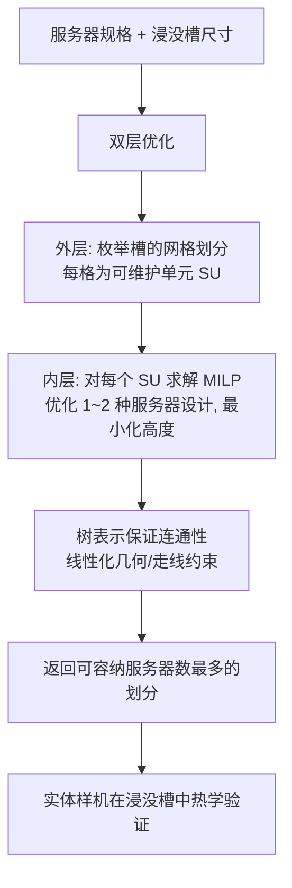

## 一句话总结

面向浸没式液冷数据中心，提出一套计算设计框架，用「树表示 + 混合整数线性规划（MILP）」在三维空间中重排服务器元件（CPU、内存、SSD、GPU、PCB），在满足热学与电学约束的前提下最大化装箱密度，相比传统二维主板设计可将服务器体积缩小 25–52%，并用实体样机在真实浸没槽中验证了热稳定性。

## 研究背景

数据中心约消耗全球 1% 的电力，其散热系统本身又占服务器总功耗的 10–20%。随着 CPU/GPU 功率密度攀升（如 NVIDIA H100 芯片功率密度超过 $$80\ \text{W/cm}^2$$，而风冷高效区间约在 $$60\ \text{W/cm}^2$$ 以内），传统风冷逐渐难以为继，运营商开始转向液体浸没式冷却。

浸没式冷却尤其是两相冷却（2P cooling）具有远高于空气的换热能力：服务器浸入低沸点（50–60°C）介电液体中，热点使液体相变汽化、气泡上浮到冷凝盘管再凝结，可将元件温度维持在液体沸点上下几摄氏度，无需大型散热片、风扇和风道。这带来一个关键机会：既然不再依赖单向气流，元件就不必局限在二维 PCB 平面上，可以在三维空间自由排布，从而大幅提升密度、减少占地与液体用量，进而降低建筑与液体制造的隐含碳排放。

难点在于：一台服务器常有 30+ 个元件，元件与 PCB 的排布组合是组合爆炸的；元件不能自由悬浮，必须挂在 PCB 上并保持整体连通；信号完整性对走线长度、板间连接数有硬约束；而直接用流体仿真评估散热又非常昂贵。这些因素使得问题既像三维装箱（3D-BPP，本身即 NP-hard），又比它复杂得多。

## 方法

整体框架：给定服务器规格（各类元件数量与尺寸）和浸没槽尺寸，方法输出「服务器设计」与「服务器在槽内的装箱方案」，目标是最大化槽内可容纳的服务器数量。

作者先用领域知识把问题化简为可用 MILP 表达的形式，再用双层优化搜索最优网格划分。

关键设计一：用领域知识把热学问题转成几何约束。作者咨询了云厂商的两相冷却专家，得到的经验是「只要元件间留有间隙、不形成困住蒸汽的凹结构，散热即可满足」。于是把昂贵的流体仿真替换为廉价的几何检查：元件之间保持最小间距（实现上把间距直接加到元件的「填充尺寸」里），并约束 PCB 竖直放置以利液体/蒸汽自由流动。同时把制造性、可维护性也化为约束：元件与 PCB 都建模为轴对齐长方体、只允许正交朝向；槽内最多一到两种服务器设计；服务器竖直堆叠成可整体抽出维护的「可维护单元」(SU)，SU 在槽内规则网格平铺。

关键设计二：树表示的设计空间。把一台服务器表示为一棵有根树——内部节点是 PCB、叶节点是元件，父节点表示该元件挂在哪块 PCB 上。树结构天然保证所有元件连成单一装配体、且任意两节点间存在唯一路径。每个非根元素记录相对父坐标系的位置 $$(x, y)$$、是否旋转 90° 的标志 $$r$$、是否在父板另一侧的标志 $$t$$，以及父节点的独热编码 $$par[\cdot]$$；为避免环路，PCB 的父节点只能是编号更小的 PCB。

关键设计三：MILP 形式化与线性化。在 SU 内装箱时，约束全局包围盒的长宽等于 SU 尺寸并最小化高度（正比于体积/密度）：

$$L_N + L_P = L_{SU}$$

$$W_N + W_P = W_{SU}$$

核心约束包括包围盒内约束、任意两元素不重叠（六种相离情形的析取）、元素落在父板范围内，以及走线长度约束 $$D(u, v) \le d_{uv}$$。其中任意两元件间走线长度通过其最近公共祖先（LCA）沿树路径求和得到：

$$D(u, v) = d_{PC}(s, u) + d_{CC}(s, t) + d_{PC}(t, v)$$

由于仿射变换涉及变量相乘、且树结构本身是决策变量，作者用一个「多路选择器」算子把形如 $$b_1 x_1 + \dots + b_K x_K$$（$$b_k$$ 为布尔且和为 1）的表达式线性化，从而可交给现成 MILP 求解器（Gurobi）求解。

关键设计四：捆绑（bundling）降复杂度。服务器往往有大量同类元件（如 20+ 条 DIMM），作者把同类相邻元件成组当作一个新「元件」处理，显著缩小搜索空间、加快收敛，作为近似求解的启发式手段。

## 实验结果

在三种手工规格（1-Socket、2-Socket、2-Socket 8-GPU）上，与二维主板基线（同组件、单块 PCB、元件集中在一侧）对比 standalone 体积：

| 规格 | 2D 基线体积 | 本方法体积 | 体积缩减 |
| --- | --- | --- | --- |
| 1-Socket | 3.37 L | 2.54 L（无捆绑） | 24.6% |
| 1-Socket（最佳，12-DIMM 捆绑） | 3.37 L | 2.31 L | 31.5% |
| 2-Socket | 5.21 L | 3.87 L | 25.7% |
| 2-Socket 8-GPU | 19.88 L | 9.51 L | 52.2% |

所有规格空间效率均达 70% 以上。槽内装箱实验中，用 19 英寸 17U 机架尺寸的槽（$$435 \times 785 \times 482$$ mm），1-Socket 设计可装入 60 台服务器（基线仅 27 台），槽空间效率 64.6%；直接把最优 standalone 设计平铺只能装 54 台，说明端到端装箱算法的必要性。

热学验证：在专家建议的 6 mm 间距下，物理实验表明只要留有间隙（哪怕 1 mm），两块 200 W 加热块稳态温度约 55°C，而零间隙时升至约 60°C。最终用电阻加热器搭建的整机样机（总功率 505 W）在 LiquidStack 浸没槽（3M FC-3284 液体，沸点 50°C）中运行 10 小时，CPU/DIMM/SSD/NIC/液体分别稳定在 59.8 / 47.9 / 53.1 / 51.0 / 47.9°C，均处于安全范围。以 5 万台服务器的数据中心估算，该设计相较基线可减少约 435,591 kgCO2e 的空间相关碳排放。

## 亮点与局限

亮点：
- 首个面向浸没式冷却、在三维空间优化服务器密度的计算设计方法，把组合爆炸的排布与连通/走线约束统一编码进 MILP。
- 树表示「构造即连通」，巧妙规避了直接套用 3D-BPP 启发式无法处理板间依赖的困境。
- 用专家经验把昂贵流体仿真降为廉价几何约束，并首次用可复现的电阻加热器实体样机验证间距/朝向对散热的影响。
- 显式量化碳排放收益，把图形学的计算设计与数据中心可持续性目标联系起来。

局限：
- 可扩展性差，问题规模随元件数指数增长，经验上超过 35 个元件就难在合理时间内求解（90 元件的算例跑了 10 天才得到 20% 空间效率的解）；依赖手工挑选的捆绑来缓解。
- 只优化密度这一单目标，未把可维护性、装配顺序等纳入多目标权衡。
- 设计空间做了较强简化：只允许轴对齐长方体与正交朝向、忽略电压调节器/电容等小元件、未精确建模走线布线，也未直接建模单相冷却/冷板/微流道等其他冷却方式。
- 热约束基于专家经验与 200 W 量级、未充分绝热的实验，尚需更高功率、更严格的实验来完整刻画。

## 延伸思考

这篇工作把「计算制造/形状优化」的图形学方法论迁移到数据中心硬件设计，是一个有趣的跨界样本：它说明当底层物理约束（这里是散热方式）改变时，长期沿用的设计范式（二维刀片服务器）可能存在巨大的重新设计空间，而计算工具正好擅长在这种高维离散空间里替人类探索。

从方法角度，MILP 的精确性换来的是可扩展性瓶颈，未来把遗传/进化算法或学习式方法（如强化学习式在线装箱）与之结合，或自动学习「捆绑」策略，是自然的下一步。多目标建模（密度 vs 可维护性 vs 走线可布线性）会让结果更贴近真实工程需求。

作者自己也提醒了 Jevons 悖论：效率提升可能反而刺激更多数据中心建设，而浸没液体的制造碳足迹与处置毒性仍是未定变量。这提示我们，单点效率优化的「绿色」结论要放到系统与政策层面审视，才能判断净收益。
