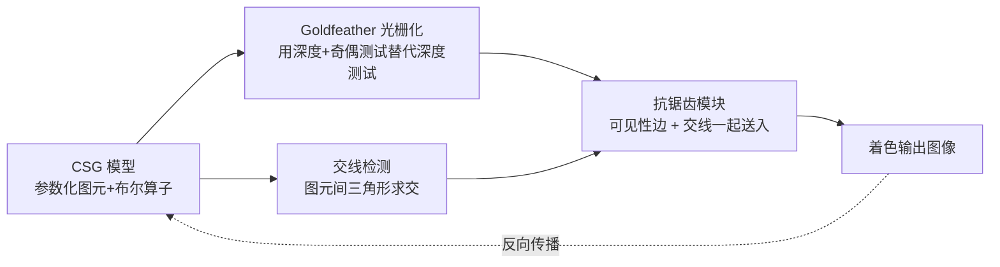

## 一句话总结

DiffCSG 把经典的 CSG 光栅化算法（Goldfeather）搬进可微渲染管线，通过显式检测并抗锯齿处理"图元交线"，让布尔运算结果对图元连续参数可微，从而用图像损失反向优化 CAD 模型参数，且比基于 SDF 的方法快约三个数量级。

## 研究背景

构造实体几何（CSG）用参数化图元（圆柱、立方体、球、草图拉伸等）加布尔算子（并、交、差）来表达 3D 形状，是 OpenSCAD、Fusion360 等 CAD 软件的核心建模范式。它的优势是形状可编辑、尺寸可复用，但复用一个既有设计往往要面对大量彼此难以直观关联的参数，手工调参是繁琐的试错过程。

可微渲染是近年来反演优化的利器：只要每个场景参数经由可微操作影响像素值，就能用图像损失把参数梯度反传回去。问题在于现有可微渲染器都不适合 CSG：

- **基于网格的快速可微光栅化**（如 Nvdiffrast）要求先把布尔运算算成显式网格。而网格布尔运算复杂、昂贵，且每次参数变化都会改变结果网格的拓扑（顶点数、连接关系），既难在自动微分框架里实现，又要在每步优化重新执行。
- **基于 SDF 的方法**能把布尔运算写成 min/max（softmax 平滑）从而可微，但需要为每类图元解析地定义 SDF（复杂图元如贝塞尔扫掠面极难写），且体素级采样与球面追踪渲染代价高昂。

本文的核心 idea：既用网格表示图元（任何有固定三角化的图元都能支持），又**不显式计算网格布尔运算**——转而复活 CSG 光栅化，用深度测试与奇偶（parity）测试直接"显示"布尔结果，同时保留原始图元的三角网格，这样梯度就能从像素反传到图元顶点，再到控制顶点的图元参数。

## 方法

整体框架是在标准可微光栅化管线（浅蓝色部分）上做两处关键改造。

**关键设计 1：用 Goldfeather 算法替代深度测试。** Goldfeather 只需在光栅化时把普通深度测试换成"深度+奇偶测试"，就能实现布尔运算而不改动图元网格。以两个凸图元 $$A$$、$$B$$ 为例：交集 $$A\cap B$$ 只保留被奇数个多边形遮挡的正面片元；差集 $$B-A$$ 保留 $$A$$ 中被 $$B$$ 遮挡奇数次的背面片元、以及 $$B$$ 中被 $$A$$ 遮挡偶数次的正面片元；并集则退化为普通深度测试。这样无需生成新网格即可渲染布尔结果。

**关键设计 2：显式检测并抗锯齿交线。** Goldfeather 渲染会在图元相交处产生原始几何里不存在的不连续边，这些边往往不在物体轮廓上、也不对齐输入网格边，导致标准可微光栅化（只对输入网格的可见性/轮廓边抗锯齿）在这里拿不到有效梯度。而图元相交恰恰是随参数变化最剧烈的视觉特征。作者的做法是：遍历不同图元间的所有三角形对，把交线表示成三角形顶点的函数（用 PyTorch 并行计算，天然可微），再用 OpenGL 带深度测试渲染出被交线穿过的像素，最后把这些像素连同交线端点一起送入抗锯齿模块做像素混合——与轮廓边同样处理。虽然网格布尔运算很难，但"只检测交线"是容易且可并行的任务。

**关键设计 3：像素混合的可微抗锯齿。** 抗锯齿沿用 Nvdiffrast 的思路并扩展到交线：对被交线 $$(p,q)$$ 穿过的相邻像素 $$A$$、$$B$$，按边对像素中心连线的覆盖情况做颜色线性混合，如 $$\text{Color}^{B}_{\text{after}} = \alpha\,\text{Color}^A + (1-\alpha)\,\text{Color}^B_{\text{before}}$$，混合权重 $$\alpha$$ 是交点位置的线性函数（从中点处的 0 到像素中心处的 0.5）。由于混合是交线端点的函数、端点又是图元顶点的函数，梯度得以经自动微分从像素一路反传到图元顶点。

**关键设计 4：顶点到参数的反传。** 为避免逐图元繁琐地把每个顶点写成参数函数，作者用内在缩放因子把顶点绑定到参数（如锥形圆柱的半径/高度对应顶点位置的水平/垂直缩放），外在参数（位置、朝向、整体缩放）则表达为额外变换矩阵；贝塞尔草图拉伸这类图元则用控制点的多项式表达顶点。图元采用较粗的三角化，以效率优先于表面光滑度。

优化目标为多视图图像损失 $$\arg\min_{\{\theta_i\}} \|I(\{\theta_i\}, p_{cam}) - I_{target}\|$$，可用 $$L_1$$ 或 $$L_2$$；实现基于 PyTorch + Adam，学习率 $$10^{-3}$$，损失阈值 $$5\times10^{-4}$$，最多 5000 步，分辨率 512×512。目标图像可用逐像素法向或图元纯色。

## 实验结果

在 50 个 CSG 模型（共 300 个测试样例）的基准上，对默认参数施加随机扰动得到源形状，再优化回默认形状。运行时间分布与代表性形状单次迭代耗时如下：

| 场景 | 三角形数 | 参数数 | Goldfeather | 交线检测 | 优化 | 单步总耗时 |
|------|---------|--------|-------------|---------|------|-----------|
| 自行车 | 2980 | 17 | 0.167 s | 0.072 s | 0.106 s | 0.345 s |
| 赛车 | 4336 | 22 | 0.163 s | 0.150 s | 0.244 s | 0.557 s |
| 月亮 | 128 | 3 | 0.019 s | 0.014 s | 0.028 s | 0.061 s |
| 螺母 | 88 | 16 | 0.022 s | 0.012 s | 0.026 s | 0.060 s |

整体上 62% 的形状可在 10 秒内拟合完成，29% 在 100 秒内，仅约 9% 的复杂形状需要 1 分钟以上（不超过 20 分钟）。与基于 SDF 的 UCSG-Net 相比，本方法快约三个数量级（在多个例子上耗时从上千秒降到几十秒），达到相近的 Chamfer 距离，且在 SDF 方法失败的挖方孔案例上仍能成功——原因是渲染式方法只需二次复杂度的屏幕采样，而 SDF 需在 3D 空间做三次复杂度的密集采样。与无梯度方法 CMA-ES 相比，后者只能处理少参数简单形状。

## 亮点与局限

**亮点：**
- 巧妙地把老算法（Goldfeather CSG 光栅化）与新范式（可微光栅化）嫁接，回避了网格布尔运算这一最难的环节。
- "只检测交线并抗锯齿"这一关键洞察，用一个可并行、可微的轻量步骤补齐了图元相交处缺失的梯度；消融实验显示：不做交线抗锯齿时，只有交线才携带信息的场景优化会完全卡在初始状态。
- 简单、快速、易于接入现代机器学习框架（直接集成到 Nvdiffrast），支持球、圆柱（含锥度）、立方体、草图拉伸等常见图元。
- 支持直接 3D 编辑（编辑导出网格后反解参数）与图像编辑（在渲染图上涂改后反解参数）等下游应用。

**局限：**
- **图元消失不可逆**：某参数（如半径）被优化到 0 会导致图元消失，而方法依赖可见像素取梯度，一旦消失便无法把该图元再拉回优化（可加正则约束，但有时消失冗余图元反而是想要的）。
- **目标形状过远易失败**：源与目标差距太大时优化可能失败（如图像编辑需保证源/目标的孔洞有重叠优化才能推进）。
- **参数化方案影响优化**：把可编辑参数抽象成少量超参数更易优化；共享参数化能让顶栏跟随椅背移动，独立参数化则可能让顶栏消失而非移动到目标。
- Goldfeather 与交线检测的实现尚未优化，仍有提速空间；内部信号方面，插值顶点法向对曲面提供更丰富信号，但对大片同朝向的分片平面无济于事。

## 延伸思考

- 本文只优化连续参数、假定 CSG 离散结构已知。一个自然方向是与迭代式程序综合结合，联合求解离散结构（图元数量/类型、布尔算子类型）与连续参数。
- "图元消失不可逆"本质是可见性驱动梯度的通病，与高斯泼溅等表示中"消失的基元难以复活"的问题同源，或可借鉴周期性重生/克隆等机制。
- 方法对图元的唯一要求是"有固定三角化"，理论上可扩展到更复杂的参数曲面（NURBS、扫掠面），把交线检测推广到曲面片求交将是关键难点。
- 交线检测采用三角形对暴力求交（二次复杂度），对高三角形数场景是潜在瓶颈，用空间加速结构剪枝会是实用改进。
