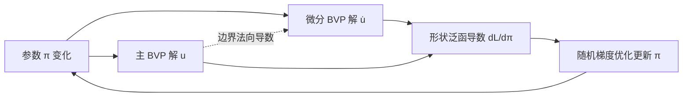

## 一句话总结

本文提出微分版 Walk on Spheres（differential WoS）：一种网格无关的蒙特卡洛方法，可在任意点直接估计 PDE 解对问题参数（域几何、边界条件）的导数，从而把经典 WoS 从"正向求解"拓展到"逆向 PDE 约束形状优化"。

## 研究背景

许多科学与工程问题本质上是逆问题：给定观测的物理行为，反推最能解释它的形状，或设计使某物理量最优的形状。例如通过热测量评估机翼损伤、透过组织推断肿瘤形状、设计最大化散热的电路几何。求解这类问题的核心，是高效且准确地对 PDE 的解关于域形状或边界条件求导。

Walk on Spheres（WoS）是一类网格无关的蒙特卡洛 PDE 求解器，通过模拟独立随机游走对线性椭圆 PDE（如泊松方程）逐点求值，无需体网格生成或全局求解，且几何鲁棒、天然并行、对边界表示（网格、样条、隐式面）无差别对待。但 WoS 一直局限于正向任务，缺乏对逆问题的支持。

一个直接想法是对已有 WoS 算法做自动微分，但如同可微渲染中所述，这条路有诸多问题：会对加速几何查询求导（低效且不切实际）；导致指数级内存与二次计算复杂度；无法对优化中演化的几何计算正确导数；即便在受限场景可用，其微分估计器统计性能也次优。因此本文选择更有原则的方式——直接构造描述导数（敏感度）的 PDE，再用 WoS 去估计它们。论文聚焦于 screened 泊松方程，兼顾一般性与阐述简洁性。

## 方法

整体框架：不去微分"估计器"（算法），而是微分 PDE 本身描述的"泛函关系"。通过隐式微分把"求导"问题转化为求解另一个同类型的边值问题（BVP），再用 WoS 去估计它。

主 BVP（screened 泊松方程，Dirichlet 边界）为：

$$
\Delta u(x) - \sigma u(x) = f(x) \ \text{in}\ \Omega(\pi), \qquad u(x) = g(x,\pi) \ \text{on}\ \partial\Omega(\pi).
$$

优化目标是形状泛函

$$
\mathcal{L}(\pi) = \int_{\Omega(\pi)} M(x)\, L(u(x,\pi))\, dx,
$$

其中 $$ M $$ 是把泛函局部化到感兴趣子域的二值掩膜，$$ L $$ 是可微损失（如平方损失）。

关键设计一：微分边值问题。对主 BVP 两侧关于 $$ \pi $$ 隐式求导。由于拉普拉斯算子、屏蔽系数与源项都与 $$ \pi $$ 无关，导数 $$ \dot{u} $$ 满足齐次 screened 泊松方程，仅在边界上带非齐次 Dirichlet 数据：

$$
\Delta \dot{u}(x) - \sigma \dot{u}(x) = 0 \ \text{in}\ \Omega(\pi), \qquad \dot{u}(x) = D(x,\pi) - V_n(x,\pi)\,\frac{\partial u}{\partial n}(x) \ \text{on}\ \partial\Omega(\pi).
$$

其中 $$ V_n $$ 是边界法向速度（由隐式或显式表示分别给出）。由此得到两点观察：主 BVP 与微分 BVP 是同类型方程，只是源项与边界数据不同（O1）；两者是嵌套的——微分 BVP 的边界数据依赖主 BVP 解的法向导数（O2）。

关键设计二：微分 WoS 估计器与嵌套游走。基于 O1、O2，用一次 WoS 游走估计 $$ \dot{u} $$，当游走到达 $$ \varepsilon $$-壳时，从边界偏移点再启动一次"主游走"来估计所需的法向导数 $$ \partial u/\partial n $$，形成嵌套。关键在于 $$ u $$ 只通过 Dirichlet 边界数据出现，使嵌套变得直接。递归估计器为：

$$
\widehat{\dot{u}}(x_k) = \begin{cases} D(x_k) - \dfrac{V_n(x_k)}{\ell}\big(g(\overline{x_k}) - \widehat{u}(x_k - \ell n_{x_k})\big), & x_k \in \partial\Omega_\varepsilon,\\[2mm] \dfrac{P(R(x_k))}{p_{\partial B(x_k)}}\,\widehat{\dot{u}}(x_{k+1}), & \text{otherwise.} \end{cases}
$$

法向导数用后向差分估计（相比已有 WoS 梯度估计器方差更低）：

$$
\widehat{\frac{\partial u}{\partial n}}(x) = \frac{g(x) - \widehat{u}(x - \ell\cdot n_x)}{\ell}.
$$

单次游走即可同时估计对所有 $$ N $$ 个参数的导数（$$ \dot{u} $$ 是 $$ N $$ 维向量），使成本几乎不随参数量增长。

关键设计三：U 统计量乘积估计器（reverse-mode 导数）。平方损失下导数含乘积 $$ u\dot{u} $$。用不相关游走估计无偏但方差为 $$ O(1/M^2) $$；用相关（共享）游走方差降到 $$ O(1/4M^2) $$ 但有偏。本文借助 U 统计量，取所有 $$ m\neq m' $$ 的两两组合：

$$
\langle u\dot{u}\rangle_{\text{U-stat}} = \frac{1}{2M(2M-1)}\sum_{m=1}^{2M}\widehat{\dot{u}}_m\big(S - \widehat{u}_m\big), \quad S = \sum_{m=1}^{2M}\widehat{u}_m,
$$

在 $$ O(2M) $$ 时间内同时做到无偏与样本高效。

关键设计四：拓展到混合 Dirichlet-Robin 边界（differential WoSt）与噪声梯度优化。对混合边界，用 walk on stars（WoSt）派生微分版本，嵌套仅通过 Dirichlet 条件发生。优化上采用随机梯度：远离极小值时噪声梯度已足够作为下降方向，早期用少量游走、后期按指数退火 $$ \text{WPP}_t = \text{WPP}_0 \exp(\log(\text{WPP}_T/\text{WPP}_0)\, t/N) $$ 逐步增加每点游走数，兼顾效率与稳定收敛。

## 实验结果

论文在多种 PDE 约束形状优化任务上验证方法，覆盖网格、多段线、隐式面、Bézier 曲线等表示。下表汇总各应用的配置与平均每次迭代耗时（除曲线膨胀用 NVIDIA 3090 GPU 外，均在 12 核 i9-10920X CPU 上运行）：

| 应用 | 边界几何 | 参数 | 评估点数 | 微分游走数 | 主游走数 | 迭代数 | 平均迭代耗时 |
|---|---|---|---|---|---|---|---|
| 位姿估计 | 网格（58k 顶点） | 位姿矩阵 | $$128^2$$ | 2 → 64 | 2 | 1.5k | 8s |
| 表面重建 | 网格（2.5k 顶点） | 顶点位置 | $$6\times 64^2$$ | 16 → 256 | 16 | 1k | 82s |
| 热学设计 | 多段线（500 顶点） | 顶点位置 | $$128^2$$ | 4 → 16 | 8 | 250 | 12s |
| 曲线膨胀 | 隐式（32 monopole） | 位置与尺度 | $$128^2$$ | 4 | 4 | 150 | 2s |
| 扩散曲线 | Bézier（14 条曲线） | 位置与切线 | $$128^2$$ | 2 → 64 | 2 | 1k | 3s |

对比有限差分：收敛后两者结果高度一致（验证准确性）；等时间下微分 WoS 的 RMSE 显著更低，且参数越多优势越明显——有限差分需 $$ N+1 $$ 次独立主游走，而微分 WoS 无论 $$ N $$ 多大都只需一次微分游走。消融方面：后向差分法向导数估计器比已有估计器 RMSE 低约 20%；偏移取 $$ \ell = 10\varepsilon $$、$$ \varepsilon = 10^{-3} $$ 取得偏差-方差平衡；U 统计量估计器在保持无偏的同时达到与相关估计器相当的 RMSE。

## 亮点与局限

亮点：以"微分泛函关系而非微分估计器"为核心思想，把求导优雅地转化为求解同类型嵌套 BVP，从而直接复用经典 WoS/WoSt 例程（作者基于开源 Zombie 库实现，未改动其正向求解例程）；输出敏感优化——可只在感兴趣区域（如成像平面）逐点估计梯度，无需全局求解（热学设计中把"ham"改为"jam"仅在字母"j"上优化，平均迭代时间减少 80% 以上）；对边界表示无差别支持并允许大幅拓扑变化；U 统计量估计器兼顾无偏与样本高效，或对可微渲染同样有用。

局限：仅支持闭合边界——开边界会在边界周界引入 Dirac delta 项，WoS 无法重要性采样，需借助反向双向游走求解器解决；仅能优化与 $$ \pi $$ 无关的 Robin 边界，参数化 Robin 边界涉及高方差的二阶空间梯度；聚焦 screened 泊松方程，更一般的物理模型（对流-传导耦合等）仍需拓展；导数估计含噪声（但期望无偏，可通过增加采样提升精度）。

## 延伸思考

该工作把可微渲染中成熟的思想（radiative backpropagation、U 统计量无偏乘积估计、噪声梯度作为正则）系统地迁移到网格无关 PDE 求解，提示"蒙特卡洛 PDE 求解器 + 随机梯度优化"可能成为 PDE 约束逆设计的一条通用范式。由于方法本质是耦合两条 WoS 游走，任何对 WoS 估计器的未来改进（方差缩减、双向/反向游走、变系数与漂移项支持）都能直接惠及微分版本。潜在应用方向包括电阻抗断层成像、shape-from-heat 热成像、以及需要流体-传热耦合的热交换器设计——这些都指向把 Monte Carlo PDE 逆问题推向真实工程场景的下一步。
