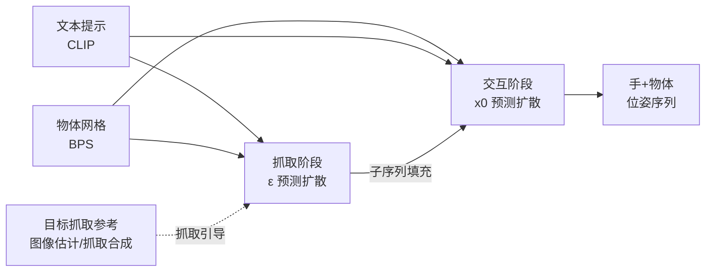

## 一句话总结

DiffH2O 提出一个基于扩散模型的框架，把手-物交互拆分为"抓取"与"交互"两个时序阶段，配合抓取引导与子序列填充，从自然语言文本合成逼真、可控且能泛化到未见物体的灵巧双手操作动作。

## 研究背景

生成三维手-物交互（HOI）对合成数据生成、机器人训练、VR 沉浸式操作等场景很有价值，但难点集中在三方面：几何合理（手与物体尽量少穿透、抓取稳定）、语义合理（尊重物体的自然可供性，如从把手处握杯而非倒置）、时间合理（手与物体运动同步、动态自然）。

更棘手的是数据稀缺：现有手-物数据集规模约为人体动作数据集的十分之一、图像数据集的千分之一。此前的扩散类方法要么忽略物体，要么只处理大物体的粗粒度运动而不预测手指；最接近的 IMoS 先生成上半身动作再后处理优化物体位姿，但它假设物体一开始就在手中、只能处理训练时见过的物体，且常出现手物穿透或不合理接触等伪影。本文目标是学习一个能生成细粒度手-物交互、并泛化到训练中未见物体的模型。

## 方法

整体框架：模型的任务是给定条件信号（文本描述 + 物体网格）生成手与物体位姿序列 $$x = (H_l, H_r, O)$$，即建模条件分布 $$p(x \mid c, G = 0)$$，其中 $$G = 0$$ 是可选的可微目标函数（如到目标抓取的距离）。文本用 CLIP 编码，物体网格用 BPS（Basis Point Set）编码，扩散时间步用 MLP 编码。

关键设计一：规范化的手-物耦合表示。物体位姿由 3D 位置与 6D 旋转组成；手基于参数化 MANO 模型，用全局位置、全局朝向、MANO PCA 空间前 24 个分量的局部姿态，以及每个手关节到物体表面最近点的有符号距离 $$x_{sd}$$（近似 SDF）来表示。关键在于手的位置是相对"抓取/交互阶段分界帧的归一化物体位置"来定义的，而非逐帧物体相对表示——后者会把手紧耦合到训练物体位姿，限制对未见物体的泛化；前者对具体物体形状不敏感、更能跨物体共享，从而提升泛化与精度。

关键设计二：两阶段时序解耦。任何交互都可分为"手接近静止物体完成抓取"的抓取阶段，和"按动作意图操纵物体"的交互阶段。解耦后，抓取阶段可利用数据集中全部运动来训练（不管交互阶段做什么动作），缓解数据稀缺。抓取阶段物体静止、只建模手序列，用直接预测噪声的 $$\epsilon_\theta$$ 扩散模型（更利于推理时引导），损失为

$$\mathbb{E}_{\epsilon \sim \mathcal{N}(0,1), t} \lVert \epsilon_\theta(x^g_t, T, M, t) - \epsilon \rVert^2_2$$

交互阶段建模双手与物体，用直接预测去噪输出 $$x_0$$ 的扩散模型（在无引导场景下运动质量更高），损失为

$$\mathbb{E}_{\epsilon \sim \mathcal{N}(0,1), t} \lVert x^i_{0,\theta}(x^i_t, T, M, t) - x^i_0 \rVert^2_2$$

关键设计三：抓取引导与子序列填充。抓取引导在推理时通过目标函数把抓取阶段导向单帧目标抓取姿态 $$\hat{h}^g_0$$（可来自图像位姿估计器或抓取合成方法），梯度近似为

$$\nabla_{x^g_t} \log p(c \mid x^g_t) \approx -\nabla_{x^g_t} \lVert h^g_{0,\theta}(x^g_t) - \hat{h}^g_0 \rVert^2_2$$

由于扩散过程会把序列各帧相互关联，即便只给一帧稀疏引导，反向传播也能为所有帧生成密集引导信号。为保证两阶段衔接平滑，采用子序列填充：在每个去噪步用抓取阶段输出填充交互序列的起始部分，

$$\tilde{x}^i_{0,\theta} = (1 - M^i_g) \odot x^i_{0,\theta} + M^i_g \odot P^i_g x^g_0$$

其中 $$\odot$$ 为逐元素乘，$$P^i_g$$ 把抓取阶段手姿态在时序与空间上补零投影到交互阶段维度，$$M^i_g$$ 标记填充区域。

此外，作者为 GRAB 数据集补充了细粒度文本标注（"detailed"），由标注者观看真实视频，按动作前/动作中/动作后三个阶段并结合手别与位置信息描述，替代原本仅有的模板化"简单"文本，从而实现更精确的文本控制。

## 实验结果

在 GRAB 数据集交互阶段（Setting 1）与 IMoS 对比，DiffH2O 在两种骨干（Transformer / UNet）下于运动多样性、穿透与动作识别等指标上全面领先。IV 为穿透体积、ID 为最大穿透深度、SD/OD 为样本/整体多样性、CR 为接触率、AR 为动作识别准确率。

| 数据划分 | 方法 | SD [m] ↑ | OD [m] ↑ | IV [cm³] ↓ | ID [mm] ↓ | CR ↑ | AR ↑ |
|---|---|---|---|---|---|---|---|
| 未见受试者 | IMoS (CVAE) | 0.002 | 0.149 | 7.14 | 11.47 | 0.05 | 0.588 |
| 未见受试者 | DiffH2O (Transformer) | 0.088 | 0.185 | 6.65 | 8.39 | 0.067 | 0.810 |
| 未见受试者 | DiffH2O (UNet) | 0.109 | 0.188 | 6.02 | 7.92 | 0.064 | 0.875 |
| 未见物体 | IMoS* (CVAE) | 0.002 | 0.132 | 10.38 | 12.45 | 0.048 | 0.581 |
| 未见物体 | DiffH2O (Transformer) | 0.133 | 0.185 | 7.99 | 10.87 | 0.073 | 0.803 |
| 未见物体 | DiffH2O (UNet) | 0.134 | 0.179 | 9.03 | 11.39 | 0.086 | 0.837 |

补充结论：在完整序列（抓取+交互，Setting 2）中，相比改造自人体动作扩散的 MDM/GMD，DiffH2O 的抓取误差 GE（0.12 vs 0.30/0.38）与手别正确率 HA（0.87 vs 0.58/0.45）显著更优。21 人的感知实验中，63.1% 认为本方法更逼真、72.9% 认为更具运动多样性。消融显示两阶段设计、抓取引导、子序列填充逐步叠加可在过渡速度 Tvel 与穿透 IV 间取得最佳平衡；细粒度文本使手别控制准确率从 59.3% 提升到 86.5%，动作识别准确率从 0.516 提升到 0.887。

## 亮点与局限

亮点：
- 据作者所述是首个从文本描述、并能泛化到未见物体的手-物交互合成方法。
- 两阶段时序解耦巧妙利用"抓取动作与后续意图无关"的观察，把全部数据都用于抓取训练，有效对抗数据稀缺。
- 抓取引导 + 子序列填充让稀疏（单帧）参考也能产生平滑连贯的整段运动，且参考可来自图像位姿估计或抓取合成，实用性强。
- 为 GRAB 贡献了细粒度文本标注，显著提升文本可控性与对未见句子的鲁棒性。

局限：
- 仍存在物理伪影，未显式集成物理约束（可考虑把物理引入扩散过程）。
- 推理速度仍较慢，作者建议转向潜空间扩散提效。
- 失败案例包括：动作与文本不符、抓取引导被忽略、手别线索未被正确捕捉。
- PCA 姿态空间在数据稀疏时有益，但可能限制更精细的手指操作。

## 延伸思考

- 两阶段解耦本质是把"通用技能（抓取）"与"任务意图（交互）"分离，这一思路对更广的具身操作或长程任务规划或许同样适用，值得推广到全身或多物体场景。
- 抓取引导依赖可微目标函数在推理时对扩散模型做梯度修正，与图像估计/抓取合成模块解耦，形成即插即用的接口；若把物理仿真也做成可微引导项，或许能同时解决穿透伪影与稳定性。
- 细粒度文本标注带来的巨大控制增益说明：在数据稀缺领域，提升标注的语义密度可能比单纯扩大数据量更划算。
