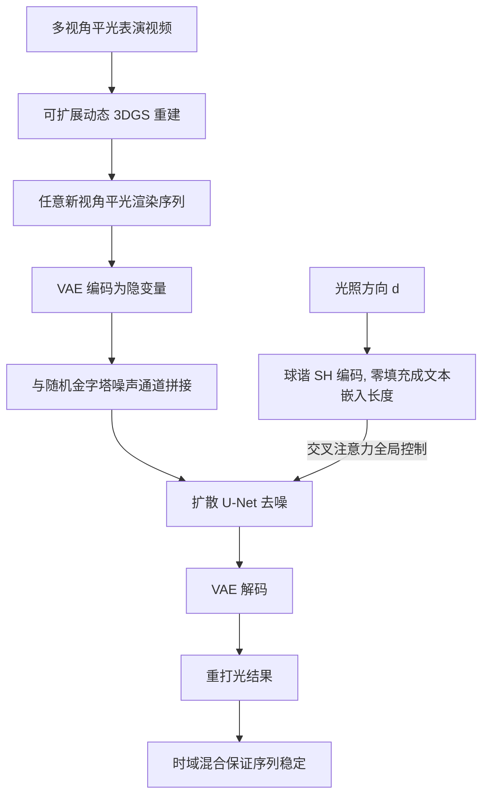

## 一句话总结

给单个演员采一批"平光 + 逐灯（OLAT）"的成对人脸数据，微调一个 Stable Diffusion 的图到图翻译模型，就能把平光拍摄的动态人脸表演在任意视角、任意光照方向下高保真重打光，还原眼球反光、次表面散射、自阴影等复杂光照效果。

## 研究背景

体积表演捕捉（volcap）用一圈内向相机记录三维动态表演，省去传统建模、绑定、动画的麻烦，能从任意角度重渲染进新场景。但大多数捕捉系统只在单一平光下拍摄，导致后期很难打出电影级布光，也很难把角色无缝融进新环境。

已有的重打光路线各有硬伤：参数化反射建模难以应付头发这类复杂材质和动态对象；基于图像的重打光效果好但成本高、对动态对象困难；内在图像分解重打光在复杂着色和细节保留上吃力；基于 NeRF / 3DGS 的神经重打光在新姿态和细节保留上仍有挑战，而做到高质量人脸表演重打光的方法往往需要极密集的采集、精确的面部网格与视线追踪、以及对脸和眼的显式建模，很难泛化。近期基于扩散模型的重打光（如 DiffusionRig、DiFaReli、DiLightNet）多为单图方法，依赖 3D 可变形模型、法线、反照率等估计量，且不一定针对人脸训练。

本文的 idea：与其依赖易出错的物理/内在分解，不如走纯数据驱动路线——采集"光照是唯一变量"的成对数据，借助预训练 Stable Diffusion 的强生成先验，把重打光当成一次以光照方向为条件的图到图翻译来学，从而在少量成对数据下泛化到新光照、新表情、新视角。

## 方法

### 整体框架

流水线分两大块：动态三维表演重建 + 基于扩散的重打光。先在中性（平光）环境下多视角拍摄表演，用一套可扩展的动态 3D 高斯泼溅（3DGS）重建出可变形高斯，从而渲染出任意新视角的平光图像序列；再把这些平光图喂给扩散重打光模型，按指定光照方向生成重打光结果。扩散模型用同一被摄者的"平光—OLAT"成对数据训练，把平光图作为空间条件、把光照方向作为全局条件注入预训练的隐扩散模型。

### 关键设计一：把 Stable Diffusion 改造成光照条件的图到图翻译

采到成对数据 $$\{I_{FlatLit}, I_{OLAT}, d\}$$，其中 $$d$$ 是从舞台中心指向某块 LED 面板中心的方向向量（相机坐标系）。做法上把平光图经 VAE 编码得到的隐变量与随机噪声图在通道维拼接，作为 U-Net 输入——只需把第一层卷积输入通道数翻倍，最大限度保留预训练权重；拼接随机噪声还能让重打光结果与输入的空间结构更好对齐。训练目标就是标准去噪扩散损失：

$$L_{diffusion} = \big\| \hat{\epsilon}\big(z^{(t)}_{OLAT} \oplus \mathcal{E}(I_{FlatLit});\, s_d,\, t\big) - \epsilon \big\|_2^2$$

其中带噪的真值隐变量为 $$z^{(t)}_{OLAT} = \sqrt{\alpha_t}\,\mathcal{E}(I_{OLAT}) + \sqrt{1-\alpha_t}\,\epsilon$$。VAE 编解码器全程冻结，只微调 U-Net，为每个被摄者单独训一个个性化模型。

### 关键设计二：用球谐编码把"光照方向"当文本嵌入注入

光照方向是影响全图的全局信号，作者把它替换掉原本的文本嵌入，经交叉注意力注入 U-Net。为提升条件的频率带宽，用球谐（SH）对方向 $$d$$ 编码，再零填充到与文本嵌入等长：

$$s_d = 0 \oplus \mathcal{Y}(d)$$

其中 $$\mathcal{Y}$$ 是球谐编码。虽然 SH 编码和文本编码器产出的嵌入形态迥异，但微调足以弥合这一域间隙；实验中 SH 阶数取 3 效果最好。

### 关键设计三：金字塔噪声解决暗部色偏

作者发现用普通零均值高斯噪声会带来明显色偏——网络倾向于难以预测很暗的图像。改用金字塔噪声（pyramid noise）后，预测与真值之间的颜色一致性大幅改善（消融里去掉金字塔噪声 PSNR 从约 30 掉到 26.55）。

### 关键设计四：可扩展动态 3DGS 与统一光照控制

为长序列做时域一致的重建，提出两阶段可扩展动态 3DGS：先均匀取 $$K$$ 个关键帧训一个可变形高斯模型作为初始化；再以这些关键帧为过渡点把序列切成 $$K-1$$ 个小段，每段用 $$K$$ 帧模型初始化，并对关键帧的形变偏移加 $$L_2$$ 正则：

$$L_{reg} = \big\| \delta'_{t_{k0}} - \delta_{t_{k0}} \big\|_2 + \big\| \delta'_{t_{k1}} - \delta_{t_{k1}} \big\|_2$$

先只训形变网络热身、再放开高斯的克隆/分裂/裁剪做致密化，从而让各段初始状态时域一致、细节层级相当。此外提出可变尺寸的面光源表示：用因子 $$1-a$$ 缩放光照方向来表示光的展开程度（$$a=0$$ 为单个 OLAT 点光，$$a=1$$ 为平光），并把该尺寸与球高斯（SG）的锐度挂钩，实现从点光到漫射的连续控制。推理时把多个单光照结果按 HDRI 环境图拟合出的系数在线性空间加权求和，即可完成 HDRI 环境光重打光乃至动态光照合成。

## 实验结果

每个被摄者采集 30 个表情、123 个 OLAT、75 个视角（4K 下采样到 1080×1920），基于 Stable Diffusion v2.1、用 Diffusers 实现，8 张 A100 训练 10 万步。与两个基线对比：ControlNet 结构（条件为平光图 + 漫反射着色图）和 U-Net 结构（直接以光照方向为条件）。在四种验证配置上用 PSNR / SSIM / LPIPS / FLIP 评测：

| 配置 | 方法 | PSNR ↑ | SSIM ↑ | LPIPS ↓ | FLIP ↓ |
|---|---|---|---|---|---|
| Novel Light | 本文 | **30.29** | **.8212** | **.1750** | **.0825** |
| Novel Light | U-Net | 23.66 | .7971 | .2988 | .1586 |
| Novel Light | ControlNet | 20.30 | .6708 | .2281 | .2304 |
| Novel Expression | 本文 | **31.55** | **.8281** | **.1585** | **.0689** |
| Novel View | 本文 | **31.77** | **.8254** | **.1601** | **.0689** |
| Novel L+E+V | 本文 | **30.98** | **.8229** | **.1729** | **.0754** |

本文方法在全部四种泛化配置、全部四项指标上都明显领先。ControlNet 基线只用稀疏空间信息，空间细节和色彩最差；U-Net 基线空间对齐尚可但结果偏糊，像素指标好看但 LPIPS 反映的真实感下降。消融显示：去掉金字塔噪声会带来最大退化，预训练权重能显著减少伪影；额外引入着色图条件能再略微提升（PSNR 30.32 vs 30.04），但需要多视角光度法线，采集成本更高，故未作为默认方案。

## 亮点与局限

亮点：
- 用一个巧妙的"最小改动"把文生图 Stable Diffusion 变成光照条件的图到图重打光器——首层卷积翻倍通道拼接平光隐变量、球谐编码顶替文本嵌入，最大化复用预训练先验。
- 纯数据驱动，绕开易错的内在分解与物理着色模型，在少量成对数据下就能还原眼球反光、次表面散射、自阴影、半透等高难光照效果，并保持身份特征。
- 金字塔噪声这一实用发现干净地解决了暗部色偏，是可迁移的工程经验。
- 可扩展两阶段动态 3DGS 让长序列时域一致，配合统一的方向光 + 面光表示与 HDRI 合成，形成完整可用的表演重打光流水线。

局限：
- 每个被摄者需单独采集成对数据并训练个性化模型，虽只需几分钟 OLAT 采集，但泛化到全新被摄者仍是简单扩展、非主线能力。
- 依赖专门的 LED 面板 volcap 舞台采集 OLAT 与平光成对数据，门槛高。
- 图像级扩散仍可能产生时域不一致的高频，需靠关键帧间时域混合缓解，而非模型内建的时序建模。

## 延伸思考

本文最值得借鉴的一点是"把物理量塞进被冻结/微调的大模型条件通道"——光照方向本是几何/物理量，却能通过球谐编码伪装成文本嵌入被交叉注意力吸收，说明预训练扩散模型的条件接口具有相当的可塑性，微调足以弥合模态鸿沟。沿这条线，材质参数、相机内参、BRDF 甚至物理仿真参数或许都能以类似方式注入。另一方面，重打光被拆成"逐 OLAT 推理 + 线性加权合成 HDRI"，把复杂环境光分解成可组合的单光照基元，兼顾了可控性与真实感，这种"生成单光照基 + 线性叠加"的范式对可编辑渲染很有启发。金字塔噪声修复暗部色偏也提醒我们：扩散模型在极端亮度分布上的归纳偏置值得在其他 HDR/低光任务中重新审视。
