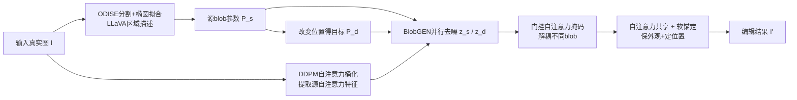

## 一句话总结

DiffUHaul 是一种免训练的图像内物体拖拽方法，它借助带布局理解能力的文生图模型 BlobGEN，通过门控自注意力掩码、软锚定与 DDPM 自注意力桶化三项推理期技巧，把物体无缝移动到新位置，同时保留前景外观与背景，并显著抑制原位残影。

## 研究背景

在一张图里把某个物体"轻轻挪一下位置"看似简单，却是当前生成式图像编辑的一个难点。已有方法各有短板：

- 逐图训练 LoRA（如 DragDiffusion）耗时，且往往拖不动物体；
- 在大数据集上训练专用模型（AnyDoor、PaintByExample）需要大量数据，用于拖拽时常在原位留下残影；
- 基于分类器引导 / 特定目标函数的方法（Diffusion Self-Guidance、DragonDiffusion、DiffEditor）在真实场景下不够鲁棒，容易出现"物体同时出现在原位和目标位"的残影问题。

其根源在于这些方法多以通用扩散模型为底座，缺乏空间推理能力。作者转而利用近期的"局部化文生图模型"——它们用边界框或 blob 等布局表示为生成加入空间可控性。本文选用 BlobGEN 作为骨干，探索能否直接把它的空间理解力迁移到物体拖拽任务上，且无需任何微调或训练。

## 方法

### 整体框架

BlobGEN 用 blob 表示物体级视觉基元：每个 blob 由 blob 参数 $$\tau=[c_x,c_y,a,b,\theta]$$（中心、半长轴/半短轴、朝向角）和 blob 描述 $$S$$（区域级文字描述）构成。它在 Stable Diffusion 每个注意力块里新增了「门控自注意力」（沿用 GLIGEN）和「掩码交叉注意力」两层来注入 blob 信息。

DiffUHaul 的流程是：给定输入图 $$I$$，先抽取其布局的源 blob 参数 $$P_s$$；根据用户指定的目标位置改变布局得到目标 blob 参数 $$P_d$$。随后并行地对源图与目标图的隐变量 $$z_s$$、$$z_d$$ 逐步去噪，在每个自注意力块中插入两项核心操作——门控自注意力掩码与软注意力锚定，最终得到编辑结果 $$I'$$。

### 关键设计 1：门控自注意力掩码（解耦）

作者发现 BlobGEN 生成结果并未真正解耦：一个 blob 的文字描述会"渗漏"到另一个 blob 的空间区域（如"兔子"信息漏到"猫"区域）。根因在于源自 GLIGEN 的门控自注意力层——投影后的文本 token $$T$$ 可以自由注意到所有视觉 token $$V$$，实际上退化成了一个交叉注意力层，且对注意范围没有任何约束。

解决办法是推理期掩码：把 $$n$$ 个输入 blob 参数转成 $$n$$ 个 512×512 的掩码 $$M_1,...,M_n$$，去噪时对每个文本 token $$t_i$$，把掩码缩放到对应层的空间尺寸，屏蔽掉 $$t_i$$ 与区域外视觉 token 的门控自注意力，从而阻止其注意到无关区域，提升解耦度。

### 关键设计 2：自注意力共享 + 软锚定

为保留高层外观，采用常见的自注意力共享：并行生成源图与目标图，把目标图各自注意力层的键值 $$K_d,V_d$$ 替换为源图的 $$K_s,V_s$$。

但仅此不足以保住细粒度细节，故提出软锚定机制，分两阶段：

早期去噪（前 $$\rho$$ 步，控制形状与布局）对源、目标图的自注意力输出做随时间步变化的软融合：

$$O_a = O_s * f + O_d * (1-f); \quad f = \frac{t}{T}$$

即开始时更多取源图外观，后期更多取目标图空间信息。

后期去噪（剩余 $$T-\rho$$ 步，控制细粒度外观）用锚点图 $$O_a$$ 定位新 blob，同时通过最近邻拷贝从源特征取外观：

$$(O_a)_{(j,k)\in B_d} = (O_s)_{\mathrm{NN}(j,k)\in B_s}$$

最近邻按归一化余弦相似度在源 blob $$B_s$$ 内为目标 blob $$B_d$$ 的每个位置寻找匹配。

### 关键设计 3：DDPM 自注意力桶化（面向真实图）

要编辑真实图需先反演，但标准 DDIM 反演在局部化模型上无法忠实重建，即便关闭 CFG 也不行。作者注意到管线中源图信号只需通过其自注意力输出传入，因此无需真正搜索最优隐噪声。DDPM 自注意力桶化的做法是：对真实图独立地加入不同尺度噪声（每个尺度对应 DDPM 前向过程的一个时间步），把这些含噪图连同抽取的 blob 一起送入模型，直接得到各层各步的源自注意力特征。由于噪声独立注入，它不会像逐步反演那样累积重建误差，因而更好地保留真实图细节。此外还融入 Blended Latent Diffusion 以更好保留背景。

真实图的 blob 抽取用 ODISE 得到实例分割，再用椭圆拟合最大化椭圆与掩码的 IoU，最后裁剪区域用 LLaVA-1.5 生成局部描述。

## 实验结果

作者基于 COCO 验证集构建了专门的评测集（筛选单一显著物体，每样本随机采样 8 个目标拖拽位置，共 6,048 个样本），提出三项指标：前景相似度（DINOv2，越高越好）、物体残影（越低越好）、真实感（KID，越低越好）。

| 方法 | 前景相似度 ↑ | 残影 ↓ | 真实感 ↓ |
|------|------------|--------|---------|
| PBE | 0.614 | 0.446 | 0.0029 |
| DiffusionSG | 0.515 | 0.459 | 0.0096 |
| AnyDoor | 0.684 | 0.454 | 0.0035 |
| DragDiffusion | 0.738 | 0.603 | 0.0011 |
| DragonDiffusion | 0.818 | 0.773 | 0.0009 |
| DiffEditor | 0.826 | 0.604 | 0.0008 |
| **DiffUHaul (ours)** | **0.835** | **0.320** | **0.0008** |

DiffUHaul 在残影指标上大幅领先（0.320 对比次优的 0.446），前景相似度也最高，真实感与最佳方法持平。消融显示：去掉 DDPM 桶化会让前景相似度从 0.835 暴跌到 0.675（细节丢失最严重），去掉自注意力共享降至 0.755，去掉软锚定降至 0.780，去掉门控掩码降至 0.823。用户研究（AMT，两选一强制选择）中，DiffUHaul 在拖拽准确性、无残影、真实感、整体质量四项上对所有基线的胜率均超过 50%，对最弱基线胜率超 80%，对最强基线 DragDiffusion 整体胜率约 61%。

## 亮点与局限

亮点：

- 完全免训练、免微调，直接复用预训练局部化模型 BlobGEN 的空间理解力。
- 首次揭示门控自注意力层的纠缠问题并给出推理期掩码解法。
- 软锚定机制巧妙地在时间维度上平衡"取源图外观"与"取目标布局"。
- DDPM 自注意力桶化避免了逐步反演的误差累积，让方法可用于真实图。
- 配套提出自动评测流程与三项指标，并用用户研究交叉验证。

局限（作者明确指出）：

- 无法旋转物体，只能把物体拉伸以适配新 blob 形状而不改朝向。
- 难以缩放物体，尤其大幅缩放时表现不佳。
- 处理拖拽中相互碰撞的物体时会失败，可能产生物体混合或合并。

## 延伸思考

- DDPM 桶化被作者强调是"专为物体拖拽（需保外观）设计"，不适合改变外观/类别的编辑，说明它更像一种保真的特征提取而非通用反演，能否推广到需要外观变化的任务值得探讨。
- 旋转与缩放的失败根源在于 blob 表示与自注意力共享强绑定了源外观的朝向和尺度，若引入几何感知的特征重采样或显式变换，或可解锁更完整的 2D 编辑自由度。
- 方法的天花板受限于底座 BlobGEN 的空间理解质量与解耦程度；随着更强局部化生成模型出现，这类"免训练迁移空间能力"的思路有望持续受益。
