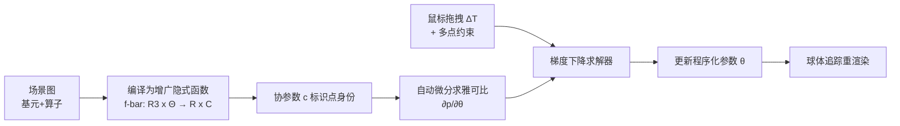

## 一句话总结

针对程序化隐式曲面难以直接编辑的问题，本文提出一种"视口内直接拖拽"的方法：通过为隐式函数增广出一个能唯一标识空间点身份的"协参数（co-parameter）"，再借助自动微分求出点位置对程序化参数的雅可比，从而把用户的鼠标笔画直接反解成对数十个程序化参数的更新，替代逐个拉滑条的繁琐流程。

## 研究背景

程序化隐式曲面（如 BlobTree、解析 SDF）用场景图（scene graph）把基元（球、盒、圆环等）与算子（布尔、光滑布尔、仿射变换、扭曲变形等）层级组合起来，是形状建模中很受欢迎的表示。它天然支持复杂几何操作与拓扑变化，但可编辑性一直是痛点：形状定义纯粹是隐式的，无法直接操控。

传统做法是把节点参数暴露成一堆抽象滑条，让用户逐个调节。这带来两个问题：一是用户必须理解每个参数对模型的影响（一个参数可能影响多个部位），二是编辑一个部位往往需要联动调整多个相互依赖的参数，过程冗长且不直观。

网格类参数化建模已有直接操控的成功方案（如 Michel and Boubekeur 2021、Gaillard 2022、Cascaval 2022），但它们都依赖网格提供的显式参数化来追踪曲面上某个点。隐式曲面缺乏曲面参数化，参数变化后无法追踪"语义上同一个点"，因此这些方法无法直接迁移。这正是本文要解决的核心难点。

## 方法

### 整体框架

给定一个描述隐式曲面的场景图，方法分三步（见流程图）：

形式化地，一次编辑就是用户在曲面上选若干点 $$p_i$$ 并给出它们期望的屏幕空间位移 $$\Delta T_i$$（位移为零则表示"该处保持不动"的约束）。求解器要更新参数 $$\theta$$ 使形状匹配用户意图，同时保持它仍是程序化形状 $$\Phi(\theta)$$ 的一个合法实例。优化的每点损失为：

$$L_i := \tfrac{1}{2}\left\| \Delta \mathrm{Proj}(p_i) - \Delta T_i \right\|_2^2$$

其中 $$\Delta \mathrm{Proj}(p) = \mathrm{Proj}(p_{\theta+\Delta\theta}) - \mathrm{Proj}(p_\theta)$$ 是点在参数更新后投影到屏幕上的实际位移。

### 关键设计一：协参数（co-parameterization）

隐式函数 $$f(p,\theta)$$ 只输出到曲面的标量距离 $$s$$，无法在参数变化后判断"这还是不是原来那个点"。作者提出增广隐式函数 $$\bar f:(p,\theta)\mapsto(s,c)$$，额外输出一个协参数 $$c\in C$$ 唯一标识该位置在实例 $$\Phi(\theta)$$ 中扮演的角色。其定义性质是：

$$\bar f(p,\theta) = \bar f(p',\theta') \iff p,p' \text{ 在不同参数下是同一几何元素}$$

于是拖拽后的新位置由 $$\bar f(p_{\theta+\Delta\theta},\theta+\Delta\theta)=\bar f(p_\theta,\theta)$$ 唯一确定。协参数空间取 $$C = \mathbb{R}^3\times\mathbb{N}$$，即 $$c=(a,\ pid)$$：可微部分 $$a$$（例如把点映射回基元的规范空间坐标）+ 路径索引 $$pid$$（标识该点在场景图中经过的求值路径）。

### 关键设计二：增广的 eval / pre / post 编译

场景图编译时，每个基元提供 eval（位置→标量），每个算子提供 pre（准备喂给子节点的位置）与 post（归约子节点返回值）。作者只需为每种基元/算子各写一次增广版本：

$$\mathrm{eval}: \mathbb{R}^3 \to \mathbb{R}\times C, \quad \mathrm{pre}: \mathbb{R}^3 \to \mathbb{R}^{3m}\ (\text{不变}), \quad \mathrm{post}: (\mathbb{R}\times C)^m \to \mathbb{R}\times C$$

编译算法（递归 $$n.\mathrm{post}\circ \mathrm{map}(\text{Compile},\text{children})\circ n.\mathrm{pre}$$）保持不变，就能同时算出距离与协参数。基元的 $$pid$$ 恒为 0；对于会合并输入或复制几何的多输入算子，通过 $$pid$$ 偏移（2 输入算子把第二输入的 $$pid$$ 加上"第一输入最大 $$pid$$ + 1"）避免多点共享协参数产生歧义。全文支持 29 种节点类型。

### 关键设计三：雅可比评估、归一化与过滤，及求解

由隐式函数定理，位置对参数的雅可比可由 $$\bar f$$ 的雅可比得到：

$$\frac{\partial p}{\partial \theta} = -\left(\frac{\partial \bar f}{\partial p}\right)^{+}\cdot \frac{\partial \bar f}{\partial \theta}$$

其中 $$(\cdot)^+$$ 为伪逆，整体用自动微分求得。为解决不同参数量纲/尺度不一致，作者从六个规范视角随机采样 50 条光线，用每个参数对应雅可比列的最大幅值作归一化因子 $$m_i$$。为提升鲁棒性，在鼠标光标周围的屏幕空间圆盘内采样 16 个点求平均雅可比 $$J(p,\theta)$$，并做列过滤：每个列 $$j_i$$ 需至少满足三条中的两条——归一化幅值 $$\|j_i\|/m_i > \lambda_{mag}=0.35$$、跨点标准差 $$< \lambda_{std}=0.2$$、与视线方向夹角项 $$< \lambda_{view}=0.4$$，从而只保留真正相关的参数。

求解阶段每帧做若干步梯度下降，最小化多点损失（含正则项 $$L_{reg}=\|\Delta\theta\|^2,\ \lambda=0.2$$）：

$$L = \sum_i L_i + \lambda L_{reg}$$

更新规则（梯度按归一化因子逐分量缩放）：

$$\Delta\theta := -\eta\, \nabla L / m, \quad \theta \leftarrow \theta + \Delta\theta, \quad p_i \leftarrow p_i + J(p_i,\theta)\cdot\Delta\theta$$

当协参数漂移 $$\|\Delta c\|$$ 超过阈值 $$e_c=0.7$$ 时，用其缩小梯度以抑制点身份漂移。

## 实验结果

方法用 C++/GLSL 实现，以 libfive 树作为编译目标（提供符号优化与自动微分），球体追踪渲染，运行于 AMD Ryzen 5 + NVIDIA GTX 1050。在 11 个复杂度各异的程序化隐式模型上测试，节点数 19~265、参数量 4~45，全流程交互式帧率运行；梯度下降最多 50 步，雅可比每 4 帧更新一次。各步骤耗时（毫秒）如下：

| 场景 | 参数数 #θ | 编辑参数 #θe | 节点数 | 协参采样 tc | 雅可比 tj | 求解 ts |
|---|---|---|---|---|---|---|
| Roller | 8 | 1 | 265 | 1.524 | 2.365 | 9.903 |
| Cup | 5 | 3 | 39 | 2.523 | 0.151 | 0.548 |
| Fridge | 3 | 1 | 19 | 2.325 | 0.214 | 0.381 |
| Sofa | 13 | 1 | 77 | 2.319 | 0.678 | 1.652 |
| Webcam | 5 | 1 | 206 | 1.628 | 0.935 | 3.503 |
| Cheese | 27 | 2 | 158 | 1.897 | 1.932 | 3.145 |
| Robot Arm | 6 | 1 | 243 | 2.061 | 0.732 | 2.831 |
| Pipes | 6 | 2 | 249 | 1.559 | 1.510 | 4.152 |
| Toaster | 4 | 1 | 256 | 1.904 | 1.126 | 4.811 |
| House | 20 | 4 | 244 | 2.137 | 0.999 | 2.313 |
| Rabbit | 45 | 5 | 188 | 1.484 | 3.980 | 5.928 |

与 libfive 的直接操控方案对比：libfive 只保证曲面经过新鼠标位置（沿法向回投影），无法识别用户想改哪个部位，对切向运动表现差；本文方法因为追踪了点身份，能在相机镜头位置、开口高度等切向编辑中正确映射参数（libfive 则误改深度）。方法还天然支持 CSG 引起的拓扑变化（靠 $$pid$$ 保证点追踪），并支持光滑布尔的平滑度参数编辑。

用户研究（20 名背景各异的被试，5 个"照参考图达到目标"任务）：95% 认为工具对输入响应灵敏，55% 表示很少/从不更偏好滑条；100 次测试中仅 8 次未达成目标（多发生在含变形的模型上）；多数用户更偏好直接操控，全部被试表示若换新场景仍愿用直接操控。主要抱怨是"有时多个参数同时变化、难以隔离想调的那个"。

## 亮点与局限

亮点：
- 用"增广隐式函数 + 协参数"优雅解决了隐式曲面缺乏参数化、无法追踪点身份的根本难题，且协参数随隐式函数自动编译构建，每种节点只需写一次。
- 借助隐式函数定理 + 自动微分求雅可比，把用户鼠标笔画直接反解为几十个参数的联动更新，交互式帧率，且天然兼容拓扑变化与光滑布尔等复杂算子。
- 雅可比归一化与自动过滤机制无需用户干预，缓解了"一次编辑牵动多参数"的歧义；多点约束进一步增强表达力。

局限：
- 每种基元/算子都需人工推导可注入的协参数，且要求协参数保持单射，某些边界情形不满足（例如盒子尺寸变为 0 时多点重合）。
- 不支持域重复（domain repetition）算子（需为每个实例产生不同 $$pid$$）与形状 morph 算子（协参数插值不一致）；也不支持本质离散的参数（如在两种完全不同基元间切换的"基元类型"）。
- 当过多参数影响同一区域时雅可比过滤效果下降，需靠多点固定约束缓解；当前梯度下降可换用 ADAM 或自然梯度下降进一步改进。

## 延伸思考

这项工作的核心洞见——"为纯隐式表示附加一个可微、可追踪的身份标签"——可能比直接操控本身用途更广。作者也指出，评估参数对每个点的局部影响这一能力，可用于直接操控之外的其他优化流水线，例如逆向程序化参数估计、形状匹配或可微渲染下的拟合。

协参数思想与近年神经隐式场（neural SDF）的可编辑性研究形成有趣对照：本文依赖场景图的显式语义结构来构造身份标签，而神经隐式场缺乏这种结构化语义，如何为其定义类似的可追踪协参数是一个开放问题。此外，用户反馈中"难以隔离目标参数"的痛点，指向了更智能的参数降维/意图推断方向，或许可结合学习式先验来预测用户最可能想改的参数子集。
