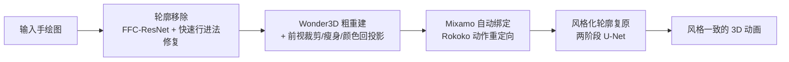

## 一句话总结

给定一张业余角色手绘图，DrawingSpinUp 通过"先移除、后复原"的轮廓策略与骨架驱动的瘦身变形，重建可动的 3D 代理模型，从而把任意 3D 动作重定向到手绘角色上，生成风格一致、具有立体感的动画。

## 研究背景

手绘角色是艺术创作中极受欢迎的媒介，尤其对儿童等业余用户而言。如何让一张静态手绘"动起来"，比如奔跑、跳跃甚至跳舞，一直是有趣但困难的任务。

已有方法主要有两条路线，各有局限：

- **2D 动画方法**（如 Smith et al.、Hornung et al.）通过 as-rigid-as-possible（ARAP）在 2D 图像空间变形角色，只能表现投影到平面的运动，无法处理身体转向、低头等超出图像平面的 3D 动作，缺乏立体感。
- **图像到 3D 重建方法**（如 DreamGaussian、Wonder3D、One-2-3-45）可提供 3D 代理，但它们都在写实照片上训练，与业余手绘之间存在明显的领域鸿沟，重建结果在外观和几何上都不理想。

作者的关键观察是：手绘图中普遍存在**轮廓线（contour lines）**。与代表纹理的内部线条不同，轮廓线描绘的是角色边界，具有**视角依赖和运动依赖**的特性，且在写实照片中不存在。预训练的图像到 3D 模型会把这些轮廓线误当作内部纹理，导致外观退化甚至影响形状重建。此外，**单线轮廓**（如火柴人的细长四肢）所表示的纤细结构在训练数据中罕见，难以被正确重建。

## 方法

整体框架分为三大阶段：轮廓移除 → 3D 角色生成 → 风格化轮廓复原。系统输入为单张手绘图、前景分割掩码、预测的关节关键点和目标 3D 动作。

### 1. 轮廓移除（Contour Removal）

由于轮廓粗细与风格在不同画作甚至同一画作内差异巨大，固定参数的距离变换无法通用。作者将轮廓预测建模为图像到图像的翻译问题：给定输入图 $$I$$ 及前景掩码 $$M$$，用 **FFC-ResNet** 预测轮廓掩码 $$M_c$$。选择 FFC 是因为快速傅里叶卷积具有覆盖整幅图像的大感受野，比普通卷积更能准确定位边界处的轮廓。

得到 $$M_c$$ 后，先并入背景区域构造修复掩码：

$$M_{inpaint} = M_c \cup (1 - M)$$

再用快速行进法（Fast Marching）用邻域内部纹理修复被移除区域：

$$I'_{inpaint} = FastMarching(I, M_{inpaint})$$

$$I_{inpaint} = I'_{inpaint} \cdot M + I \cdot (1 - M)$$

训练数据来自 3DBiCar，用 Blender 渲染不同粗细的正视轮廓并随机上色，模仿业余画风。

### 2. 3D 角色生成与形状精化

- **粗重建**：用 Wonder3D（正交相机设置，泛化性好）生成多视法线图和彩色图，IS-Net 分割前景，再用 Instant-NSR 重建带纹理几何。但结果常出现纤细结构变粗、表面粘连、纹理模糊等问题。
- **前视裁剪（Shape Cutting）**：用正视掩码 $$M$$ 对 SDF 做裁剪，取 0 水平集：

$$\mathcal{G} = \{(x,y,z) \in \mathbb{R}^3 \mid f(x,y,z) \le 0,\ M(X,Y) = 1\}$$

其中 $$f(\cdot)$$ 是 SDF，$$(X,Y)$$ 为投影到正视平面的 2D 坐标。裁剪只能改正视轮廓，不能改侧面厚度。

- **骨架驱动瘦身变形（Skeleton-based Thinning）**：将其建模为双调和（bi-harmonic）问题，对顶点 $$v$$ 施加形变场：

$$v' = v + d, \quad d = B(v, f, h, dh)$$

通过从 $$M$$ 提取距离图 $$D$$ 与骨架 $$S$$，用阈值 $$\theta_1 > \theta_2$$（实验取 $$\theta_1 = 11$$、$$\theta_2 = 6$$）区分需固定与需移动的顶点，只对细长区域瘦身而不改变正视边界。

- **颜色回投影**：将正、背视彩色图回投到 3D 顶点上色，不可见区域用邻域加权修复。

### 3. 绑定、重定向与风格化轮廓复原

用 Mixamo 基于 8 个正视关节点自动绑定，Rokoko 重定向 3D 动作，Blender 计算蒙皮权重，渲染出无轮廓的动画帧序列 $$\mathcal{F}$$。

随后用**两阶段几何感知风格化网络**复原原画风格：第一个 U-Net $$U_{texture}$$ 复原内部纹理，第二个 $$U_{contour}$$ 复原外部轮廓线。网络输入四类引导通道：彩色帧 $$F$$、前景掩码 $$G_{mask}$$、位置提示 $$G_{pos}$$（静止姿态归一化坐标，提供视角无关信息）、边缘图 $$G_{edge}$$（从 Z-depth 用 Canny 提取，补偿视角相关信息）。为应对倾斜、低头等动作，$$U_{texture}$$ 用**旋转不变坐标卷积（RIC）**替换普通卷积以增强稳定性。训练采用基于 $$32 \times 32$$ 小块的 patch-based 策略，损失为 L1 + 对抗 + VGG 损失。

## 实验结果

作者从 Smith et al. 收集的业余手绘数据集中选取 120 个代表性样本作为测试输入，并进行了 53 人参与、15 组结果的感知用户研究，用 5 分制评估两个指标：运动一致性（MC）与风格保持（SP）。

| 方法 | 运动一致性 MC | 风格保持 SP |
|------|:---:|:---:|
| Smith et al. | 3.85 | 4.18 |
| DreamGaussian | 4.30 | 3.65 |
| Wonder3D | 4.30 | 3.50 |
| **Ours** | **4.55** | **4.53** |

单因素 ANOVA 检验显示四种方法在运动一致性（F=28.84, p<0.001）和风格一致性（F=71.83, p<0.001）上均存在显著差异。配对 T 检验（p<0.001）表明本方法在两项指标上均显著优于其余方法。

消融实验验证了各组件的作用：无轮廓移除时轮廓会被误当作内部纹理；无裁剪瘦身时细长结构（头发、四肢）会臃肿膨胀；无 RIC 卷积时低头动画帧质量下降。

运行时（单张 RTX 4090）：轮廓移除 0.1s、3D 生成 2-3min、在线绑定 1-2min、风格网络训练 5-10min，单角色总训练 10-15min；训练完成后每帧推理约 0.3s，可复用于不同动作。

## 亮点与局限

**亮点：**
- 首个面向业余手绘角色、支持真正 3D（非平面）动画的系统。
- 核心洞见抓得准：识别并单独处理视角依赖的轮廓线，用"移除-复原"策略巧妙绕开图像到 3D 模型的领域鸿沟。
- 骨架驱动瘦身变形专门解决单线轮廓表示的纤细结构，是对通用重建先验的有效补丁。

**局限：**
- 假设角色近似正面 A/T 姿态且无自遮挡；交叉手臂等自遮挡会导致几何粘连或部件融合。
- 边缘提取阈值不当会产生轮廓伪影。
- 输入轮廓线过粗时结果会出现伪影。
- 对高度抽象、远离双足形态的画作可能失败。
- 非实时（单角色需数分钟建模）。

## 延伸思考

- 该工作本质是"用通用大模型先验 + 领域特定后处理"的范式：不重训昂贵的 3D 生成模型，而是在输入端（去轮廓）和输出端（风格化复原）做适配，这种思路对数据稀缺领域很有借鉴价值。
- "移除-复原"策略把视角依赖信息剥离出重建管线、最后再逐帧渲染回来，隐含地把 3D 几何一致性与 2D 风格表现解耦，这一分工值得在其它非真实感渲染任务中复用。
- 作者展望向实时化、通用化（如四足动物）和文本驱动的叙事动画扩展；自遮挡与非双足形态是最主要的能力边界，后续若能引入更强的多视一致重建或可变形先验有望突破。
