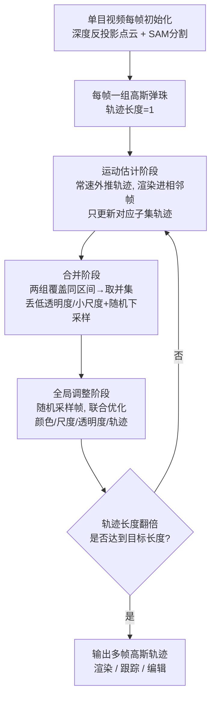

## 一句话总结

面向"随手拍"的单目视频，本文用各向同性的高斯"弹珠"、自底向上的分治式学习策略以及一组来自现成 2D 模型的先验，把动态高斯从多相机受控采集扩展到欠约束的单目场景，既能做高质量新视角合成，又能精确捕捉场景的 3D 运动轨迹。

## 研究背景

高斯泼溅（3DGS）凭借高效渲染、高质量重建以及可编辑的组合性，已经成为静态场景新视角合成的主流表示。很多工作把它扩展到 4D 动态场景，用一组随时间运动的高斯轨迹来追踪几何，效果不错——但这些方法几乎都假设**多相机同步视频**作为监督，只能用在专门搭建的采集环境里。

问题在于，日常最常见的素材是单目视频：一个人拿着相机在动态场景里平滑移动。作者发现，现有的动态/4D 高斯方法在这种单目设定下会**严重失败**，因为缺少多视角信息使得优化高度欠约束：

- Dynamic 3D Gaussians 会立刻偏离场景几何，过拟合训练视角，换个视角就崩。
- 4D Gaussians 则陷入局部最优，把所有帧的静态信息平均掉，学不到正确的运动。

本文的核心判断是：单目设定本身信息不足，但可以通过**精心设计的优化策略、现成的深度与运动估计、以及基于几何的正则**来补上缺失的约束。由此提出 Dynamic Gaussian Marbles（Gaussian Marbles），从表示、学习策略、目标函数三个层面做改造，把优化引向能泛化到新视角的解。

## 方法

整体框架是：把输入视频的每一帧初始化成一组高斯弹珠（轨迹长度为 1），然后用自底向上的分治合并策略，不断把时间相邻的两组弹珠合并成轨迹长度翻倍的一组，逐步把"短轨迹"拼成"长轨迹"。每次合并由一段短优化驱动，用渲染损失、跟踪损失和几何正则把两组弹珠拉到对应位置。推理时用覆盖该时刻的高斯轨迹渲染出对应帧。

**1. 各向同性的高斯弹珠**
不同于原版可各向异性的高斯，弹珠的朝向固定为单位矩阵、尺度退化为一个标量 $$s\in\mathbb{R}^1$$，形状是纯球形。动机是：各向异性高斯表达力更强，但在欠约束的单目设定里，多出来的自由度反而有害——在单张单目图上训练 100K 次迭代，各向异性高斯能完美拟合训练视角却在新视角出现明显伪影，而弹珠能泛化。此外每个弹珠还带一个语义实例标签 $$y\in\mathbb{N}$$，以及一条把初始位置映射到各时刻的平移序列 $$\Delta X\in\mathbb{R}^{T\times 3}$$，让它"动"起来。

**2. 分治式运动估计**
不去一次性优化整段视频，而是把长视频切成短子序列，迭代地把子序列拼起来。每次迭代分三步：
- **运动估计**：对相邻的一对弹珠集 $$(\mathcal{G}^a, \mathcal{G}^b)$$，用常速假设把轨迹外推一帧，把 $$\mathcal{G}^a$$ 渲染进 $$\mathcal{G}^b$$ 覆盖的帧，只对 $$\mathcal{G}^a$$ 的轨迹平移施加梯度（反之亦然），每帧优化 $$\eta$$ 步，直到轨迹覆盖对方全部帧。
- **合并**：两组已覆盖同一区间后直接取并集 $$\mathcal{G}_{ij}=\mathcal{G}^a_{ij}\cup\mathcal{G}^b_{ij}$$，再丢掉低透明度/小尺度高斯并随机下采样，保持集合规模恒定。
- **全局调整**：对合并后的集合随机采样区间内某帧、渲染全部高斯，联合更新颜色、尺度、透明度、轨迹，做 $$\beta$$ 步。

作者的直觉是：运动估计受益于"一次只加一帧"的局部性与平滑性（类似 Dynamic 3D Gaussians），全局调整贡献全局一致性（类似 4D Gaussians），交替两者取两家之长。

**3. 跟踪损失（利用现成点跟踪）**
用 CoTracker 在 $$[j-w, j+w]$$（实践中 $$w=12$$）估计一组 2D 点轨迹 $$P$$，随机取源帧 $$i$$，对每个跟踪点找 2D 上最近的 $$K=32$$ 个高斯，惩罚它们与该点距离的变化：

$$L_{\text{track}}=\sum_{p\in P}\sum_{g\in \mathcal{N}(p_i)}\alpha'_i\left\vert  D_i\lVert\mu'_i-p_i\rVert_2 - D_j\lVert\mu'_j-p_j\rVert_2\right\vert $$

其中 $$\mu'_i, D_i$$ 是高斯投影后的位置与深度，$$\alpha'_i$$ 是它对像素 $$p_i$$ 的不透明度贡献。

**4. 几何正则（等距 + 3D 对齐）**
局部等距损失约束局部邻域近似刚性运动，实例等距损失让同一语义实例整体近似刚性移动：

$$L_{\text{iso-local}}=\sum_{g_a\in\mathcal{G}}\sum_{g_b\in\mathcal{N}(g_a)}\left\vert \lVert\mu^a_i-\mu^b_i\rVert-\lVert\mu^a_j-\mu^b_j\rVert\right\vert $$

合并两组弹珠时还需在 3D 空间对齐（否则训练视角清晰、新视角却"云雾状"）。由于两组可能观察到场景不同部分，不能直接算 Chamfer；作者把每组按"来自单帧"拆成子集、随机洗牌后各取前 25% 组成 $$\mathcal{G}_1$$ 与 $$\mathcal{G}_2$$，再算双向 Chamfer 距离：

$$L_{\text{chamfer}}=\sum_{g_1\in\mathcal{G}_1}\min_{g_2\in\mathcal{G}_2}\lVert\mu_1-\mu_2\rVert^2+\sum_{g_2\in\mathcal{G}_2}\min_{g_1\in\mathcal{G}_1}\lVert\mu_1-\mu_2\rVert^2$$

引入的随机性让高斯彼此靠拢，又不会过拟合到两组观测内容的差异。此外还有对图像、视差图、分割图的 L1 渲染损失与 LPIPS 损失。

## 实验结果

在 Nvidia Dynamic Scenes、DyCheck iPhone、Total-Recon 上评测。其中 Nvidia 数据集特意用单相机（camera 4）视频流训练，避免以往"传送式单目相机"带来的虚假多视角信息。下面是与高斯类基线的新视角合成对比（mPSNR↑ / LPIPS↓，均值，数字忠于原文）：

| 方法 | iPhone（无位姿） | iPhone（有位姿） | Nvidia Dynamic Scenes |
|------|------------------|------------------|-----------------------|
| Dynamic 3D Gaussians | 7.60 / 0.704 | 7.29 / 0.692 | 12.07 / 0.517 |
| 4D Gaussians | 13.11 / 0.726 | 13.64 / 0.428 | 17.59 / 0.292 |
| **Gaussian Marbles（本文）** | **15.79 / 0.428** | **16.72 / 0.418** | **22.32 / 0.129** |

Gaussian Marbles 在两个数据集上都大幅超过高斯类基线，尤其在多视角信息更少的场景（iPhone 无位姿、Nvidia）优势明显。与 NeRF 类方法（Nerfies、HyperNeRF、T-NeRF）相比总体持平（三数据集均值 18.28 / 0.325），但保留了高斯的快渲染（推理 >200Hz）、更好的跟踪（iPhone PCK-T@5% 达 0.806，略超 CoTracker 的 0.803，远超其它高斯/NeRF 方法）以及可编辑性。消融显示每个组件都有贡献，其中**运动估计**和**全局调整**两个阶段最关键：去掉后 LPIPS 从 0.110 恶化到 0.136 / 0.223。

## 亮点与局限

亮点：
- 直面"随手拍单目视频"这个最贴近真实素材、却被主流动态高斯方法回避的设定，明确指出现有方法在此欠约束下会崩，并给出可行方案。
- "少即是多"的表示选择：用自由度更低的各向同性弹珠反而换来更好的新视角泛化，配合分治学习把"长序列跟踪"转化为"拼接相邻子序列"的可控问题。
- 充分复用现成 2D 基础模型（SAM/TrackAnything、CoTracker、DepthAnything）把 2D 先验注入 3D 优化，同时保留高斯在跟踪、渲染速度、组合式编辑上的固有优势（例如给老虎上色并沿视频一致传播）。

局限：
- 强依赖 2D 图像先验，深度、分割或跟踪一旦出错就会把优化带偏（如 "Space Out"、"Wheel" 深度不准时跟踪反而落后于 CoTracker）。
- 几何先验在快速、非刚性运动的场景可能给出错误引导。
- 训练开销随视频长度增长（iPhone 上 5~9 小时、峰值显存 13~22GB），并未彻底解决开放世界动态单目新视角合成这一难题。

## 延伸思考

这篇工作的价值不只在于"又一个动态高斯方法"，而在于系统地论证了"约束"本身就是单目重建的核心资源：当监督信号不足时，与其堆更强的表示，不如主动削减自由度（各向同性弹珠）、切分优化难度（分治合并）、并从外部模型借来先验（深度/跟踪/分割）。这与近来一批 casual monocular 4D 重建工作（如 MoSca、RoDyGS）殊途同归，都在"如何把 2D 基础模型的知识可靠地蒸馏进 3D/4D 优化"上下功夫。一个自然的追问是：当 2D 先验本身不可靠时，能否让 3D 一致性反过来校正 2D 预测，形成闭环？本文在深度可靠时"跟踪略超 CoTracker"已经露出这种双向增益的苗头，值得沿着"3D 表示与 2D 基础模型互相监督"的方向继续挖。
