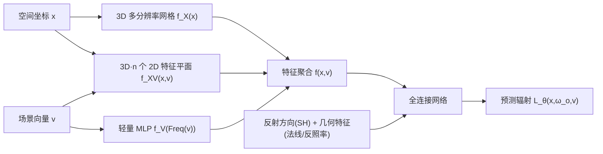

## 一句话总结

把 Neural Radiosity 从静态场景扩展到高维动态场景：用一个显式"场景向量"参数化各类动画变量，再把随之膨胀的高维特征网格分解成 3D 网格 + 2D 特征平面 + 轻量 MLP，从而以近似线性的显存/算力代价实现可交互编辑的动态全局光照渲染。

## 研究背景

- 领域现状：神经渲染建模全局光照大体分两派——屏幕空间生成式方法，以及结合神经场景表征的方法；后者往往网络结构复杂、训练/推理开销大，且都依赖大量预渲染图像做训练数据。Neural Radiosity [Hadadan et al. 2021] 另辟蹊径，把渲染方程当作先验直接优化网络残差，用轻量网络 + 可训练空间特征网格就能建模视角一致的辐射场，无需预渲染图像。
- 核心痛点：Neural Radiosity 只适用于**静态场景**。一旦场景有动画（网格、材质、光源变化），就需要频繁重训，无法进入实时管线。直接把动画状态拼进网络输入会欠拟合；而把动画变量当作坐标额外维度、用高维特征网格编码，又会因**维数灾难**导致显存 $$O(k^n)$$、算力 $$O(2^n)$$ 爆炸。
- 本文 idea：用一个 $$n$$ 维显式场景向量 $$v$$ 参数化 $$n$$ 个动画分量，把高维特征网格**分解**为低维表示——空间专属的 3D 网格、耦合空间与场景变量的 2D 特征平面、以及建模变量两两相关性的轻量 MLP，从而把开销压到关于场景维度**线性**。

## 方法

整体 pipeline：先用显式场景向量 $$v\in\mathbb{R}^n$$（每个分量 $$v_i\in[0,1]$$ 编码一个动画分量的插值状态）描述动态场景；网络在渲染方程残差先验下优化，预测给定 $$(x,\omega_o,v)$$ 的出射辐射 $$L_\theta$$。核心是用"神经特征分解"替代不可行的高维网格编码。

关键设计：

1. **显式场景向量与可训练编码**。把每个动画分量（旋转的盒子、平移的球、变化的反射率、旋转环境光等）用一个标量 $$v_i\in[0,1]$$ 表示，合成场景向量 $$v$$，它与动画状态构成双射，支持交互编辑与跨状态插值。空间输入 $$x$$ 用多分辨率 3D 网格三线性插值编码。理论上可用 $$(n{+}3)$$ 维网格编码 $$L_\theta(x,\omega_o,v)$$，但维数灾难让它不实用。

2. **神经特征分解（核心）**。把 $$(n{+}3)$$ 维网格分解为三部分并聚合：
$$f(x,v) = f_X(x)\oplus f_{XV}(x,v)\oplus f_V(v)$$
其中 $$f_X$$ 是只管空间的 3D 多分辨率网格；$$f_{XV}$$ 是 $$3n$$ 个 2D 特征平面，建模空间坐标各分量与场景变量的耦合；$$f_V$$ 是对频率编码后的 $$v$$ 过一个轻量 MLP。关键洞见：多数场景变量之间相关性低，用**一个 MLP** 建模 $$O(n^2)$$ 的两两相关即可，避免了 k-plane 类方法的二次开销；辐射场主要仍依赖空间位置 $$x$$。

3. **渲染方程残差优化**。沿用 Neural Radiosity 思路，最小化残差
$$L(\theta) = \left\lVert L_\theta(x,\omega_o,v) - L_e - \int_{H^2} f_r\, L_\theta\,(n\cdot\omega_i)\,d\omega_i \right\rVert_2^2$$
在场景空间 $$V$$、表面 $$S$$、半球 $$H^2$$ 上用蒙特卡洛积分估计。RHS 光线数 $$M$$ 采用**自适应**策略（初始 32，每训练 1/5 翻倍），平衡质量与速度。额外输入反射方向（SH 编码）与几何特征（反照率、法线）。

4. **工程实现**。基于 Mitsuba3 + PyTorch + tiny-cuda-nn；训练用 RTX 4090、渲染用 RTX 3090，全程数据留在 GPU、无 CPU-GPU 拷贝。1spp 网络查询配 FXAA 抗锯齿（每帧 <1ms）。镜面等 Dirac delta 波瓣不靠网络建模，而是追次级光线直到命中非镜面表面。

## 实验结果

在 5D~7D 的 Dining Room / Living Room / Veach Door / Bedroom 等动态场景上评测，与等时 path tracing、其去噪版（Oidn）、SOTA 神经方法 Active Exploration (AE) [Diolatzis et al. 2022]、NeLT [Zheng et al. 2023]、Coomans et al. [2024] 对比。主要对比结论：

| 对比对象 | 本文相对表现 | 关键数据 |
|----------|--------------|----------|
| Active Exploration [2022] | 视觉质量更好、训练更省 | 帧率约 **3.5× 提升** |
| NeLT [2023] | MAE 接近，帧率更高 | 帧率约 **4×**；NeLT 需数天多卡训练 |
| Coomans et al. [2024]（仅 1D 动画/4D 网格）| 4D 场景下质量/效率相当，显存更省 | **118.41 MB** vs 157.71 MB |

维度可扩展性（高维 23D 场景，RTX 3090）显示开销随场景维度近似线性、质量几乎不退化：

| 维度 | 总推理时间 | 总显存 | MAPE |
|------|-----------|--------|------|
| 7 | 34.6 ms | 120.4 MB | 0.069 |
| 12 | 50.1 ms | 130.5 MB | 0.086 |
| 16 | 62.2 ms | 138.6 MB | 0.107 |
| 23 | 82.7 ms | 152.8 MB | 0.085 |

整体在 1080×920 / 1280×720 下达约 10 fps。消融显示 $$f_{XV}$$ 与 $$f_V$$ 两类分量都对质量有贡献（$$f_{XV}$$ 在特定动画状态影响更大）、自适应 RHS 采样在不增训练时间下显著降 MAPE、FXAA 以极小开销缓解走样。

## 亮点与局限

- 亮点：
  - 把 Neural Radiosity 首次扩展到**多变量高维动态场景**（不局限于单一时间/1D 维度），支持自由视点 + 交互编辑。
  - 特征分解把维数灾难的指数开销降到**线性**，兼顾显存与算力，效果与效率同时优于既有 SOTA。
  - 继承 Neural Radiosity 优点：无需预渲染图像数据集，训练更省。
- 局限：
  - 每个场景仍需 5~10 小时训练（1 小时可达可接受质量），是"预计算式"方案，换场景要重训。
  - 镜面/多 Dirac 波瓣需靠追次级光线处理，网络本身难以建模；多波瓣情形留作未来工作。
  - 动画分量需预定义起止状态并参数化，属受控编辑而非任意动态。

## 延伸思考

- 与 Coomans et al. [2024] 的对照点出一条清晰脉络：动态神经辐射的关键矛盾是"支持多少自由度的动画" vs "开销可控"。本文用"低维分解 + MLP 建相关"把可承载的动画维度从 1D 推到 20+ 维，思路和 NeRF 动态化里的 k-planes/HexPlane 一脉相承，但用 MLP 取代显式高维平面来压二次项，是值得借鉴的取舍。
- "把动画变量当额外坐标维度 + 显式场景向量"这套参数化，天然适合做可控编辑与插值，或可与生成式方法结合，探索由文本/语义驱动的场景状态编辑。
- 镜面与高频 BSDF 仍是残差型神经辐射的共同软肋，如何让网络直接建模而不靠追加光线，是这条线后续的核心难点。
