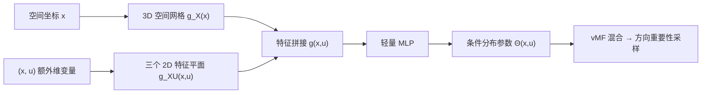

## 一句话总结

把局部路径引导（path guiding）的目标分布从纯 3D 空间扩展到 4D，用神经特征分解让引导分布额外条件于时间、波长等积分维度，从而在运动模糊、光谱渲染这类分布式光线追踪（distributed ray tracing）效果上得到更好的重要性采样质量。

## 研究背景

- 领域现状：路径引导在渲染过程中收集辐射样本，拟合出更贴近被积函数形状的采样分布来降低蒙特卡洛积分方差。局部引导方法通常把每个着色点的方向分布存进 3D 空间加速结构（kd-tree、octree），近来则改用隐式神经表示，例如把分布解码成 vMF 混合模型的神经参数混合（NPM）方法。
- 核心痛点：不少真实感渲染应用的路径积分本身还带有额外维度。运动模糊要在时间域 $$T$$ 上积分、光谱渲染要在波长域 $$\Lambda$$ 上积分。此时理想的零方差目标分布会额外依赖这些变量，而以往的局部引导基本忽略这层相关性，学到的是在额外维度上被边缘化（平均掉）的分布，难以捕捉短时间片内的瞬态效果或波长相关效果。直接把 3D 结构升成 4D 又会撞上维数灾难：网格存储正比于额外维分辨率 $$D$$、查询开销翻倍，显式树结构同样要 $$D$$ 倍存储和 $$\log D$$ 倍算力，都不实用。
- 本文 idea：用紧凑的神经表示来高效地建模这个额外维度。把高维时空分布通过神经特征分解拆成若干低维表示，同时给出一个更省的近似——只用低维表示配合渐进式训练去建模子空间，从而在可接受的计算开销下逼近零方差目标。

## 方法

整体框架：目标分布现在条件于 3D 空间坐标 $$\mathbf{x}$$、出射方向 $$\omega_o$$ 以及额外维变量 $$\mathbf{u}$$（运动模糊里是快门时间 $$t$$，光谱渲染里是波长 $$\lambda$$），即
$$p(\omega_i \mid \mathbf{x}, \omega_o, \mathbf{u}) \propto f_s(\mathbf{x}, \omega_o, \omega_i, \mathbf{u})\, L_i(\mathbf{x}, \omega_i, \mathbf{u}) \cos\theta_i$$ 。
为避免直接上 4D 网格的高昂代价，本文把 4D 特征表示正交分解成"一个 3D 空间网格 + 三个 2D 特征平面"，查询得到的特征拼接后送入一个轻量 MLP，解码出条件于 $$\mathbf{u}$$ 的引导分布参数 $$\hat{\Theta}(\mathbf{x}, \mathbf{u})$$。本文聚焦一个额外维（$$N=1$$）的情形，实验发现建模两个以上额外维时算力代价通常盖过收益。

关键设计：

- **神经特征分解**：把高维特征拆成两个正交分量。3D 特征网格 $$g_X(\mathbf{x}) = G(x,y,z)$$ 专注建模与额外维解耦的纯空间特征；三个 2D 特征平面 $$g_{XU}(\mathbf{x}, \mathbf{u}) = P_{XU}(x,u) \oplus P_{YU}(y,u) \oplus P_{ZU}(z,u)$$ 负责建模额外维和空间坐标之间的相关性。最终编码 $$g(\mathbf{x}, \mathbf{u}) = g_X(\mathbf{x}) \oplus g_{XU}(\mathbf{x}, \mathbf{u})$$，其中 $$\oplus$$ 是特征聚合，实验里简单拼接就够用。之所以保留 3D 网格而非全用 2D 平面分解，是因为空间相关性对重建质量更关键，值得单独用一个 3D 网格承载。
- **渐进式训练方案（低成本变体）**：观察到扰动额外维 $$\mathbf{u}$$ 时目标分布只会部分变化，相邻 $$\mathbf{u}$$ 处的分布很相似。于是用分层采样把额外维切成 $$M$$ 个小区间 $$[u_i, u_{i+1}]$$，渲染当前区间时只建模该区间内的分布——直接关掉 $$g_{XU}$$，让 $$g_X(\mathbf{x})$$ 去拟合该小区间上被边缘化的目标分布，同时把 $$\mathbf{u}$$ 作为辅助输入喂给网络。跨区间时用迁移学习复用上一区间的网络权重做微调，前 $$K$$ 个区间设为 burn-in 阶段用更多样本训练。这样用比完整 4D 更紧凑的表示，就能引导整个渲染过程且质量相当。
- **在线优化目标**：沿用估计 K-L 散度的训练思路，把目标扩展到额外维张成的空间。用蒙特卡洛积分估计梯度
$$\nabla_\Theta D_{KL}(\mathcal{D} \Vert \mathcal{V}; \Theta) \approx -\frac{1}{N} \sum_{j=1}^{N} \frac{\mathcal{D}(\omega_j) \nabla_\Theta \mathcal{V}(\omega_j \mid \hat{\Theta})}{\tilde{p}(\omega_j \mid \hat{\Theta}) \mathcal{V}(\omega_j \mid \hat{\Theta})}$$ ，
训练与推理逐帧交织进行。
- **实现与防御性采样**：基于 NPM 在 CUDA + OptiX 的 GPU 渲染器上实现，改造 tiny-cuda-nn 完成特征分解。MLP 为 3 层、每层 64 神经元、ReLU，最后映射到 8 个 vMF 分量。由于学到的混合难以拟合极尖锐的 BSDF 波瓣，用多重重要性采样（MIS）做防御，以固定比例 $$\lambda_B = 0.5$$ 在网络分布和 BSDF 之间选择，并对目标分布施加 MIS 补偿；同样策略也施加到 NPM 上以保证公平比较。

## 实验结果

与 Practical Path Guiding（PPG）和 Neural Parametric Mixtures（NPM）两个基线在运动模糊、光谱渲染两个应用上做对比，指标为相对均方误差（relMSE，越低越好）并给出渲染时间。下表取自论文首图的等质量/等时对比，两个变体分别是完整 4D 表示（Ours-4D）和渐进式训练变体（Ours-Prog.）：

| 方法 | 运动模糊 relMSE↓ | 运动模糊 时间 | 光谱渲染 relMSE↓ | 光谱渲染 时间 |
|------|------------------|---------------|------------------|---------------|
| PPG | 0.6235 | 190s | 0.4338 | 125s |
| NPM | 0.0907 | 210s | 0.3393 | 137s |
| Ours-4D | 0.0428 | 261s | 0.2108 | 200s |
| Ours-Prog. | 0.0425 | 233s | 0.2326 | 166s |

可以看到两个应用上本文方法都明显压低了误差，且运动模糊上的相对提升远大于光谱渲染。论文分析：光谱场景里发射体的光谱功率分布（SPD）和纹理反射谱多是平滑、能量守恒的（从 RGB 上采样得到），使得目标分布与波长 $$\lambda$$ 的相关性较弱；加上 HeroMIS 这类正交的光谱 MIS 一旦生效也会削弱这种相关性，因此学一个 $$\lambda$$ 相关分布带来的收益不如动态场景那么显著。

其余实验用文字补充：在 Living-Room、Tower、Veach-Egg、Interior、Liquids 等场景的等时对比中，本文两个变体在多数场景 relMSE 均优于 PT 和 NPM；两个变体在等样本率下质量相近，而 Ours-4D 因不必用 $$g_{XU}$$ 建模相关性往往效率更高。消融对比了另外两种建模额外维的替代方案——把条件变量直接频率编码后作辅助输入（3D+Aux）、以及用带哈希表的 4D 多分辨率网格（4D+Hash），结果显示参数化特征网格方案（Ours-4D）重建质量略好但算力开销更大，在网格几乎不动或光谱这类简单场景里 3D+Aux 这种更简单的编码也可行。性能分解（Living-Room，RTX 4080S 等时 97s）显示 NPM 编码 34.9MB、推理 10.8ms/帧、relMSE 0.0547，而 Ours-Prog. 用 37.2MB、推理 11.0ms/帧就把 relMSE 降到 0.0366，代价适中。作者还验证了预训练 30s 后不再训练直接渲染动画序列的场景，本文方法能降噪而 NPM 只能学到时间上被平均的分布。

## 亮点与局限

- 亮点：
  - 首次把局部路径引导系统性地扩展到 4D，抓住了以往被忽视的"目标分布与额外积分维度相关"这一空白，并在运动模糊、光谱渲染上验证有效。
  - 神经特征分解（3D 网格 + 三个 2D 平面）巧妙规避了 4D 网格的维数灾难，思路借鉴自动态 NeRF 的 K-planes 分解，落到路径引导上很自然。
  - 渐进式训练变体用迁移学习复用相邻区间权重，以更紧凑的表示达到接近完整 4D 的质量，且推理开销几乎与 NPM 持平。
- 局限：
  - 收益强依赖目标分布与额外维的相关强度。在运动很短、几何/光照变化很少等简单场景，本文方法可能不敌基线甚至更简单的频率编码。
  - 相比基线有明显的额外计算与内存开销，需要在质量提升和代价间权衡。
  - 额外维数目难以扩展，理论上支持多于一维，但实验发现多维时性能收益难以抵消算力成本，因此目前只适合单独引导某一种分布式效果，多效果同时引导留作未来工作。

## 延伸思考

- 方法建立在神经参数混合（NPM）这条显式混合模型的引导路线上，作者也推测同样的 4D 建模思路可迁移到基于归一化流的神经重要性采样，用更强表达力换取质量，是值得尝试的方向。
- 显式结构（PPG 嵌套二叉树或换成 4D K-D 树）在 4D 下会因样本落入细分区域过稀而训练预算暴涨，这凸显了神经表示"快速自适应"的优势，也说明如何缓解 4D 显式结构的样本稀疏仍是开放问题。
- 与额外维上的自适应采样（如自适应分层采样）结合是自然的下一步，可进一步降低嵌套积分方差、把样本分配到重要子空间。
- 更长远看，为一般的 4D 分布发展出实用的学习与自适应采样方法，有望惠及运动模糊、光谱之外更广的分布式渲染乃至其它重要性采样场景。
