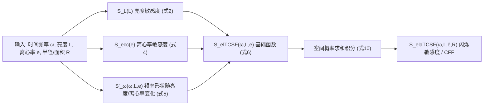

## 一句话总结

本文提出 elaTCSF——一个把亮度(luminance)、离心率(eccentricity)、面积(area)三个维度纳入时间对比敏感度函数(TCSF)的闪烁检测模型,并结合空间概率求和模型,能够统一预测各种对比度下的闪烁可见性,尤其擅长处理可变刷新率(VRR)显示器产生的低对比度闪烁。

## 研究背景

闪烁(时间光调制,TLM)在照明与显示领域已被关注一个多世纪,会引起眼疲劳、头痛乃至神经不适。传统的临界闪烁频率(Critical Flicker Frequency, CFF)是最经典的度量,指闪烁光与稳定光变得无法区分的频率,但它默认闪烁是"全亮-全灭"的高对比度调制,无法覆盖低对比度场景。

一个典型的低对比度场景就是 VRR 显示器。GPU 以变化的帧率渲染,显示器通过在不同时长内保持像素强度来适配帧率,不同刷新率之间的细微亮度差在傅里叶域产生低频成分,从而形成人眼可见但对比度很低的闪烁,无法用 CFF 模型解释。

国际显示计量委员会(ICDM)在 IDMS 标准中纳入了 Watson 的 $$TCSF_{IDMS}$$,但它只考虑时间频率,忽略了亮度、离心率与面积。现有的 CSF 模型(如 Barten's CSF、stelaCSF、castleCSF)虽包含这些因素,却在高时间频率处精度不足,也无法解释覆盖大片视场的大面积刺激的闪烁可见性。此外,"闪烁在周边视野是否比中央视野更明显"这一争论已持续 120 年,不同实验结论相互矛盾。本文旨在扩展 $$TCSF_{IDMS}$$,同时给出对上述争论的解释。

## 方法

整体框架:以 IDMS 的时间对比敏感度函数为基底,依次引入亮度、离心率两个维度得到 elTCSF,再通过空间概率求和模型整合面积维度,得到最终的 elaTCSF。计算流程如下:

关键设计一:亮度维度。基底函数取 IDMS 标准形式

$$S_{\omega,IDMS}(\omega) = \xi\left[(1 + 2i\pi\omega\tau)^{-n_1} - \zeta(1 + 2i\pi\omega\kappa\tau)^{-n_2}\right]$$

亮度对敏感度的影响借用 castleCSF 瞬态通道公式 $$S_L(L) = k_{1,L}\left(1 + \frac{k_{2,L}}{L}\right)^{-k_{3,L}}$$,兼顾暗光下的 DeVries-Rose 定律(敏感度正比于视网膜照度平方根)与亮光下的 Weber 定律。亮度升高还会把 TCSF 峰值推向更高时间频率,通过对频率轴做 $$S_\omega(\omega, L) = S_{\omega,IDMS}\left(\frac{\omega}{b_{1,\omega} + k_{1,\omega}\log_{10}L}\right)$$ 建模。

关键设计二:离心率维度与 120 年争论的调和。作者依据 fMRI 证据(瞬态通道在旁中央凹权重最大、周边视野对高频更敏感)推断:高时间频率敏感度应随离心率增大,而 CSF 峰值随离心率下降——两者只有在 TCSF 随离心率"变平"(斜率变低)时才能同时成立。离心率对敏感度整体影响用 $$S_{ecc}(e) = 10^{-k_{1,ecc}e}$$,对频率形状的影响则通过修改频率轴实现,合成基础函数 $$S_{elTCSF}(\omega, L, e) = S_L(L)\,S_{ecc}(e)\,S'_\omega(\omega, L, e)$$。

关键设计三:面积与空间概率求和模型。以往模型把面积与离心率当作独立参数,这在全屏闪烁这类跨越大范围离心率的刺激上不成立。本文把视场视为对比度的连续函数,对敏感度在窗口上积分:

$$E = \int_{-w/2}^{w/2}\int_{-h/2}^{h/2} (c(x,y)S(x,y))^\beta\, dx\, dy$$

其中 $$\beta$$ 是概率求和指数。对圆盘刺激用极坐标简化,当积分达到阈值 $$E_{thr}$$ 时闪烁可被检测,最终敏感度为

$$S_{elaTCSF}(\omega, L, \hat{e}, R) = \left(\frac{\int_0^{2\pi}\int_0^R S_{elTCSF}^\beta(\omega, L, d(\hat{e},r,\theta))\,r\,dr\,d\theta}{E_{thr}}\right)^{1/\beta}$$

CFF 定义为敏感度等于 1 的时间频率,由于该式无法解析求逆,作者在 8 到 200 Hz 区间用数值求根获得 CFF。

数据与拟合:作者用 LG OLED G1 55" 电视测量了 VRR 闪烁,通过让观察者调节亮度间接控制对比度(亮度越低对比度越高),配合 QUEST 自适应采样与两区间强迫选择法,建立了首个 VRR 闪烁检测数据集(32 个数据点)。连同 7 个公开数据集共 8 个数据集,用 Matlab 的 fminunc 拟合参数,损失函数含数据拟合项与每数据集缩放因子的正则项。

## 实验结果

在所有数据集上做五折交叉验证并与现有模型对比,报告对比敏感度的 RMSE(S-RMSE,单位 dB)与 CFF 的 RMSE(CFF-RMSE,单位 Hz)。elaTCSF 在两项指标上均优于现有先进 CSF 模型(下表为全数据集结果):

| 模型 | S-RMSE $$E_s$$ [dB] | CFF-RMSE $$E_\omega$$ [Hz] |
| --- | --- | --- |
| $$TCSF_{IDMS}$$ | 10.33 | 13.52 |
| Barten's CSF | 5.79 | 15.36 |
| stelaCSF | 6.13 | 11.47 |
| Barten's CSF (HTF) | 4.58 | 9.06 |
| stelaCSF (HTF) | 6.05 | 11.75 |
| castleCSF | 5.45 | 13.07 |
| elaTCSF (ours) | **3.50** | **8.95** |

模型在 Hartmann 与 Krajancich 数据集上正确预测了旁中央凹(离心率 10 到 30 度)的 CFF 峰值,而 Barten's CSF (HTF) 虽也尝试建模该峰但预测的峰值位置偏低。在自建 VRR 数据集上,模型对大小刺激的敏感度预测都表现良好,验证了空间概率求和模型的有效性。

## 亮点与局限

亮点:首个把亮度、离心率、面积统一纳入闪烁检测 TCSF 的模型,扩展并更新了工业标准 $$TCSF_{IDMS}$$;用空间概率求和模型解决了大面积刺激跨离心率的难题;基于既有心理物理模型(Watson TCSF、概率求和)构建而非黑箱拟合,减少过拟合、利于外推;并对困扰领域 120 年的"周边视野闪烁是否更明显"给出了可解释的模型。三个应用场景颇具实用价值:预测 VRR 显示器的无闪烁刷新率范围、预测 VR/AR 头显低余晖(low-persistence)闪烁的最低刷新率、以及为照明设计提供比 IEC 标准更贴合人眼的闪烁指数。

局限:模型不考虑空间频率,只适用于低空间频率或大面积图案(这是为兼顾定量与定性预测精度做出的取舍);目前只在 VRR 闪烁数据上训练与验证,VR 头显低余晖闪烁与照明设计两个应用尚未经过实验验证;在 Chapiro 等人的数据集上出现不一致(其中央凹 CFF 反而高于旁中央凹),原因未知因而无法建模。

## 延伸思考

该工作把"感知模型"直接转化为工程标准与设计工具,是感知驱动显示设计的典型范式:模型不追求最优拟合的神经网络,而是坚持可解释的心理物理结构以保证外推能力,这在数据稀疏的心理物理领域是务实且值得借鉴的选择。VRR 与低余晖头显是当下高刷新率显示与 XR 设备的核心痛点,elaTCSF 给出的"无闪烁刷新率范围随亮度变化"结论,直接回应了厂商目前只能靠经验手工调参的现状。值得进一步探索的是:如何在保持可解释性的前提下把空间频率维度重新引入,以覆盖高空间频率图案;以及模型在真实动态内容(而非均匀闪烁场)上的表现,毕竟实际显示内容的时空复杂度远高于实验刺激。
