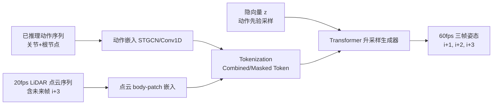

## 一句话总结

ELMO 是首个基于单台 LiDAR 的实时"升采样"动作捕捉框架，用条件自回归 Transformer 把 20fps 的点云序列实时生成为 60fps 的高质量全身动作，推理延迟仅 5ms。

## 研究背景

实时动作捕捉在虚拟化身、元宇宙、直播和互动游戏等场景需求快速增长。现有方案各有短板：

- 光学与惯性（IMU）系统精度高，但需要穿戴设备、成本高、标定繁琐，且 RGB 相机、IMU 缺乏显式的全局平移信息，容易产生漂移（drifting）。
- 深度传感器（RGB-D、LiDAR）能提供更好的全局跟踪能力，但 RGB-D 视场角与分辨率受限、噪声大；LiDAR 虽提供精确的 3D 点云，却帧率偏低（典型 20fps），在实时应用中会引入姿态不连续与抖动，而交互应用通常要求 60fps 以上。

作者的核心思路是：既然单 LiDAR 精于全局跟踪但帧率低，那么就用一个生成式模型把低帧率点云"升采样"成高帧率动作，同时利用点云的空间结构提升姿态质量。ELMO 针对单 LiDAR 的自遮挡问题引入动作先验，并通过 LiDAR 仿真数据增强改善全局根节点跟踪。

## 方法

### 整体框架

ELMO 的运行时输入是：过去到当前已推理出的 60 帧（1 秒）动作序列，以及以间隔 $$s=10$$ 采样的点云序列（时间戳 $$i-5s, i-4s, i-3s, i-2s, i-s, i$$）外加一个未来帧 $$i+3$$ 的新点云；输出是未来三帧 $$i+1, i+2, i+3$$ 的升采样姿态（60fps）。由于 LiDAR 为 20fps，使用一个未来帧带来的延迟相当于 60fps 系统下的 2 帧（约 33ms）。

模型是自回归条件 Transformer：训练时动作分布编码器 $$E$$ 从动作序列产生服从高斯分布的隐向量 $$z$$；生成器 $$G$$ 以过去/当前动作、点云序列与 $$z$$ 为条件生成三帧姿态。推理时丢弃 $$E$$，改为随机采样 $$z$$ 输入 $$G$$，用于在遮挡场景下生成合理姿态。

### 关键设计 1：动作与点云的分离嵌入

姿态被拆为关节向量与根节点向量分别处理。关节向量 $$x_i = [x_t, x_r, \dot{x}_t, \dot{x}_r] \in \mathbb{R}^{n_j \times 15}$$ 含局部位置、旋转、线速度与角速度；根节点向量 $$r_i = [r_t, r_r, \dot{r}_t, \dot{r}_r, c] \in \mathbb{R}^{17}$$ 含全局坐标信息与足部接触标签。

- 关节特征用时空图卷积（ST-GCN）以保留骨架图结构：$$f^x_i = \mathrm{TempAvgPool}(\mathrm{ST\text{-}GCN}([x_i]^i_{i-(s-1)})) \in \mathbb{R}^{n_j \times C}$$
- 根节点特征用 1D 时间卷积：$$f^r_i = \mathrm{TempAvgPool}(\mathrm{Conv1D}([r_i]^i_{i-(s-1)})) \in \mathbb{R}^{C}$$

### 关键设计 2：body-patch 点云嵌入 + 自注意力

受 PointBERT 启发，用最远点采样（FPS）选出中心点，再对 k 近邻分组得到 $$n_g$$ 个局部"身体块"（body-patch），减去中心坐标以解耦结构与空间位置，再用 Mini-PointNet 投影为点特征：$$f^p_i = \mathrm{Mini\text{-}PointNet}(\mathrm{body\text{-}patch\ grouping}(p_i)) \in \mathbb{R}^{n_g \times C}$$

生成器通过 Combined Token（动作+点云）、Masked Token 与 Predicted Token 三类 token，利用自注意力学习"身体块点群"与"人体关节"之间的关联。实验中的注意力图显示右臂关节与靠近手腕、肘部的点群（索引 5、13）呈现高注意力值，验证了这一设计。

### 关键设计 3：LiDAR 仿真数据增强 + 一次性骨架标定

- **数据增强**：为让全局坐标覆盖整个 4×4 米捕捉空间，采用镜像与旋转（90°/180°/270°）。因固定 LiDAR 对旋转后主体会拍到不同侧面，作者用 Unity3D 搭建虚拟 LiDAR（模拟 Hesai QT128 规格），对拟合的 SMPL 网格计算激光碰撞点生成合成点云。
- **骨架标定模型**：一个 6 层 MLP，输入 A-pose 单帧点云（384 个 3D 点，按高度排序），预测初始髋高与 20 个关节偏移 $$y \in \mathbb{R}^{1+20 \times 3}$$。用 LiDAR 仿真合成 50000 对数据（SMPL 形状参数在 [-2,2] 采样，覆盖 95% 形状空间）训练。

### 损失函数

端到端训练，包含重建损失、速度损失与 KL 散度：

$$L_{total} = L_{rec}\vert ^{i+3}_{i+1} + w_{vel} L_{vel}\vert ^{i+3}_{i+1} + w_{kl} L_{kl}$$

其中重建损失同时约束局部与全局（前向运动学 $$FK$$）坐标及根节点：

$$L_{rec}_i = \|\tilde{x}_i - x_i\|_1 + \|FK(\tilde{x}_i) - FK(x_i)\|_1 + \|\tilde{r}_i - r_i\|_1$$

## 实验结果

作者构建了 ELMO 数据集（20 名受试者、单 LiDAR + 光学动捕 + 视频同步，点云 20fps / 动捕 60fps），并在 ELMO 与 MOVIN 数据集上与图像方法（VIBE、MotionBERT、NIKI）及点云方法 MOVIN 对比。主实验（ELMO 数据集）关节与骨盆误差如下（越低越好）：

| 方法 | MJPE(cm) | MJRE(°) | MJLVE | MJAVE |
|---|---|---|---|---|
| NIKI | 14.30 | 18.04 | 1.41 | 2.35 |
| MOVIN† w/ dup | 7.03 | 11.87 | 1.32 | 1.65 |
| MOVIN† w/ interp | 7.05 | 11.87 | 1.08 | 1.45 |
| **ELMO (Ours)** | **4.86** | **10.41** | **0.38** | **0.77** |

| 方法 | MPPE(cm) | MPRE(°) | MPLVE | MPAVE |
|---|---|---|---|---|
| MOVIN† w/ dup | 8.88 | 6.27 | 1.55 | 1.31 |
| MOVIN† w/ interp | 8.73 | 6.56 | 0.67 | 1.54 |
| **ELMO (Ours)** | **4.08** | **5.08** | **0.20** | **0.38** |

相比最强基线（MOVIN 插值升采样），ELMO 在 MJPE 上降低 2.19cm、MPPE 降低 4.65cm；速度/角速度指标提升幅度从最低 47%（MJAVE）到最高 75%（MPAVE），体现其在非线性姿态过渡上的优势。

**推理速度**：在笔记本（i9-13900HX + RTX4080）上，ELMO 推理仅 5ms，端到端（含点云采集处理与延迟）总耗时约 44ms；对比 NIKI 需 454ms 的边界框检测、MOVIN 端到端 54ms（勉强达 20fps），ELMO 更适合 60fps 实时应用。

**消融**：加入 1 个未来帧输入普遍降低误差（MJPE 6.33→5.33cm），再加数据增强进一步改善位置与旋转误差（MJPE→4.86cm）。**骨架标定**：在 7 名不同身高受试者上，平均关节长度误差 1.52cm、方向误差 0.22°。**全局漂移**：受试者从原点出发运动 1-2 分钟返回，ELMO 与 MOVIN 都能准确回到起点，而 Xsens 出现明显漂移。

## 亮点与局限

**亮点**
- 首个单 LiDAR 实时升采样动捕框架，用 in-betweening 式升采样（利用 1 个未来帧）在延迟与精度间取得良好平衡。
- body-patch 点云嵌入 + 自注意力显式建立"点群—关节"对应关系，既提升质量又大幅降低推理耗时（5ms）。
- 动作先验（VAE 式隐向量）帮助在自遮挡场景生成合理姿态；LiDAR 仿真数据增强改善全局跟踪。
- 贡献了 20 人的高质量 LiDAR-动捕-视频同步数据集与评测代码。

**局限**
- 自遮挡（尤其侧身）时会生成"看似合理但不精确"的姿态，作者认为多 LiDAR 是可行方向。
- 当动作显著偏离训练分布，动作先验只能给出最接近的合理动作，难以精确跟踪真实姿态；输入退化（丢帧、稀疏采样）时同样如此。
- 多人场景依赖聚类分离点云，要求各受试者处于互不重叠的专属区域，点云聚合成一簇时会失效。

## 延伸思考

- ELMO 把"升采样"框定为一个条件生成问题，本质上是时间维度的运动 in-betweening。这种"用生成模型补齐低帧率传感器"的思路，对其他低帧率/低成本传感器（如廉价深度相机、事件相机）同样有借鉴意义。
- 用动作先验兜底遮挡，是精度与鲁棒性的折中：好处是永远输出合理动作，代价是遮挡下会"编造"看似正确的姿态。在需要严格保真的场景（如医疗、体育分析）中，如何量化并暴露这种不确定性值得进一步研究。
- 数据增强完全依赖 LiDAR 仿真器（Unity + SMPL 碰撞点），说明高保真传感器仿真正成为动捕训练数据的重要来源；仿真与真实之间的域差异（outfit、发型、噪声）是持续挑战，作者用随机噪声与随机位姿偏移来缓解。
- 多人限制来自点云聚类的可分性，若引入实例分割或身体部件分割（如文中提到的 Human3D）替代简单聚类，或许能支持更紧密的多人交互。
