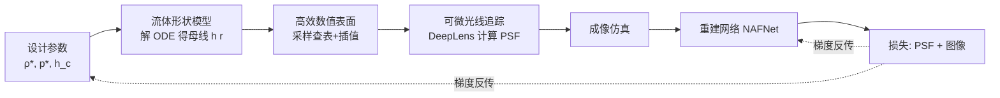

## 一句话总结

针对"流体成形（fluidic shaping）"这一低成本透镜制造方式，提出一个更精确且可微的透镜形状模型，并将其接入可微光线追踪流水线，与图像重建网络端到端联合优化，从而以廉价方式设计并制造定制成像透镜。

## 研究背景

定制成像级透镜的小批量原型制造既昂贵又耗时，尤其是复杂的非球面：球面镜靠磨削抛光，非球面玻璃需要单点金刚石车削加磁流变抛光，塑料镜的注塑又依赖高精度模具，这些工艺都不易获得。3D 打印虽被大量尝试，但增材工艺的分辨率不足以直接得到光学级表面，往往仍需人工抛光或转印。

流体成形提供了另一条路线：把 UV 固化树脂注入浸没在另一种液体中的环形模具，两种液体界面天然具有原子级平滑度，界面形状由相对密度、注入体积与边界条件共同决定；用紫外光固化树脂即可"冻结"该形状，得到光学级表面而无需抛光。

但已有工作（Elgarisi 等）的形状模型存在两个致命问题：一是为求解析解做了"高度差远小于半径"的近似，在较大曲率时严重不准——例如中性浮力（两液体等密度）下正确解应为球面，其模型却只能给出抛物面，无法精确拟合；二是形状空间仅以偏微分方程形式描述，无法接入现有光学设计流程。本文要同时解决"精度"与"可微、可集成"两个问题。

## 方法

整体框架：设计参数 → 物理形状模型（解 ODE 得到透镜母线）→ 可微光线追踪（DeepLens）成像仿真 → 重建网络恢复图像 → 在 PSF 与图像上计算损失并反向传播，联合更新透镜参数与网络权重。

关键设计一：基于系统能量的形状 ODE。系统能量由表面能、浮力失衡能与体积约束（拉格朗日乘子）三部分组成：

$$
\Pi = \iint_S \left( \gamma\sqrt{1 + \left(\tfrac{\mathrm{d}h}{\mathrm{d}r}\right)^2} + \tfrac{1}{2}\Delta\rho\, g\, h^2 + \lambda h \right) r\, \mathrm{d}r\, \mathrm{d}\theta
$$

对其做欧拉-拉格朗日变分，得到描述母线 $$h(r)$$ 的二阶常微分方程。引入两个约化参数 $$\rho^{*} = \Delta\rho\, g / \gamma$$（关联密度差）与 $$p^{*} = \lambda / \gamma$$（关联注入体积），并利用边界条件 $$h_r(0)=0$$、$$h(R_0)=h_0$$ 求解。该模型不再依赖小高度差近似，可达任意精度；在中性浮力 $$\rho^{*}=0$$ 时更有闭式球面解：

$$
h(r) = \frac{\tfrac{p^{*}}{2} r^{2}}{1 + \sqrt{1 - \left(\tfrac{p^{*}}{2} r\right)^{2}}}
$$

这正是标准球面母线形式，首次让流体成形模型自然包含球面。

关键设计二：可微 ODE 求解与形状空间性质。作者证明该 ODE 具有平移不变性，可把两点边值问题转化为初值问题 $$h^{*}(0)=0,\ h^{*}_r(0)=0$$ 再平移回去；求解采用 torchdiffeq 的 dopri5（自适应步长 Runge-Kutta），并用伴随敏感度法反向再解一条 ODE 来算梯度，从而以低显存获得 $$h$$ 对 $$\rho^{*}, p^{*}, h_c$$ 的导数。他们还给出并证明了若干实用性质：体积参数上的对称性 $$h^{*}(\rho^{*}, p^{*}\mid r) = -h^{*}(\rho^{*}, -p^{*}\mid r)$$（$$p^{*}<0$$ 凸、$$p^{*}>0$$ 凹）、浮力方向的影响（向上净力更高更瘦、向下净力更平），以及尺度重映射规律 $$\rho^{*}_s = \rho^{*}/s^{2},\ p^{*}_s = p^{*}/s$$——意味着要放大/缩小同形状透镜，除调整注入体积外还须改变水/甘油配比。

关键设计三：高效数值表面。光线追踪中大部分开销在用牛顿法反复求交点，需频繁在不同位置取 $$h$$ 与 $$h_r$$，若每次都重解 ODE 代价极高。作者在每次更新透镜参数后仅解一次 ODE，把 $$h$$ 与顺带得到的 $$h_r$$ 采样存表（约 1k 个采样点），追踪时用可微线性插值查表（最近邻会导致梯度消失故不可用）。单个优化步采样约 10 万条光线却只解一次 ODE，在其设定下带来约 500 倍加速。

关键设计四：端到端优化目标。重建网络采用轻量 U-Net 结构的 NAFNet，与透镜联合训练；用 656/589/486 nm 三个波长模拟 RGB 以刻画像差。总损失为

$$
\mathcal{L}_{\text{Total}} = \mathcal{L}_{\text{PSF}} + \mathcal{L}_{\text{Image}}, \quad \mathcal{L}_{\text{Image}} = \mathcal{L}_{\text{MSE}} + \mathcal{L}_{\text{perceptual}} + \mathcal{L}_{\text{SSIM}}
$$

其中 PSF 损失压缩各波长下光斑尺寸，图像损失优化最终重建质量。训练分两阶段：先固定透镜只训网络至稳定，再开启透镜参数与网络联合训练。制造侧则从优化得到的 $$\rho^{*}, p^{*}, h_c$$ 反算密度差、注入体积与环高，用水/甘油配比控制密度（误差 <0.05%），SLA 打印环模，紫外固化成形，双曲面透镜分两次成形拼接。

## 实验结果

作者在仿真与实拍两侧，围绕三种复杂度递增的经典透镜系统进行端到端重建，与市售现货透镜对比，评价指标为 PSNR 与 SSIM（均越高越好，逐图与全数据集平均，精确数值见补充材料）。

| 透镜系统 | 结构 | 优化面数 | 仿真端到端结果 |
| --- | --- | --- | --- |
| AL2550 | 平凸（一非球面+一平面） | 1 | 现货镜本身已较锐，优化流体镜表现相当 |
| Best form | 双凸（两球面） | 2 | 优化镜传感器成像更锐，重建后差距更明显 |
| Cooke | 球面三片（双凹夹于两双凸间） | 6 | 优化镜成像更锐，端到端重建整体质量提升 |

仿真训练约 24 小时：平凸/双凸用单张 V100，三片镜因 6 面联合优化更重，用 2 张 A100。实拍侧对 20 mm 直径原型进行制造与网络微调（约 6 小时），发现实测性能与仿真预期存在差距；加入 F 数约 10~11 的光阑滤除边缘（受环模误差影响最大的区域）光线后画质改善，但双凸原型仍未超过现货镜。作者将差距归因于制造精度（微米级环模精度、二次成形的水平校准等）。

## 亮点与局限

亮点：首次把流体成形透镜的形状空间做成精确且可微的物理模型，天然包含球面并能很好逼近常见非球面（仅 3 维参数）；通过采样查表+可微插值实现约 500 倍加速，让 ODE 形状顺利接入端到端光线追踪；系统性分析了对称性、浮力方向、尺度重映射与有效参数区间等实用性质，为制造提供直接指导。

局限：形状空间仅 3 维且限于圆形边界，理论上无法拟合所有非球面；仿真与实拍存在明显差距，实拍原型未能稳定超越现货镜；制造对环模精度与水平校准高度敏感，双曲面拼接易产生非对称；三片镜优化算力需求较大，且整体制造流程的自动化与可重复性仍待完善。

## 延伸思考

这项工作的价值不在于"拟合已有透镜"，而在于把一种廉价制造工艺的物理可行域直接编码进优化空间——设计出的每个解天然可制造。这与传统"先设计理想面型再想办法加工"的思路相反，是"制造约束前置"的端到端范式。仿真与实拍的差距提醒我们：可微仿真再精确，最终瓶颈仍在制造闭环。若能把固化收缩、界面张力随时间漂移、环模误差等纳入可微前向模型，或引入实拍反馈的在线校准，或许能真正让流体成形从"原型验证"走向"可复现的定制光学生产"。此外，形状空间的低维性虽限制了表达力，却也意味着设计变量少、优化稳定，适合与更强的重建网络配合，在特定专用场景（如偏重离轴性能）以专精取胜。
