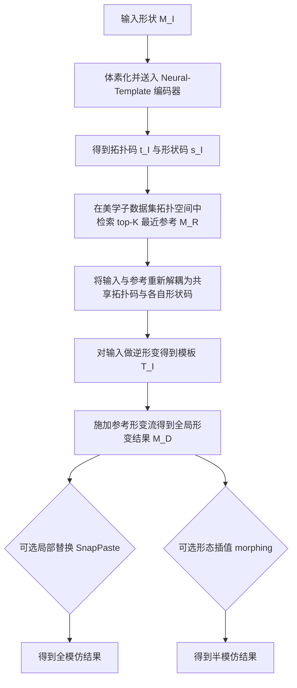

## 一句话总结

给定一个不够美观的 3D 形状，本文通过在自建的"美观形状子数据集"中检索拓扑相近的美观参考形状，用共享神经模板与各自形变流对输入做全局形变、可选的局部替换与形态插值，从而自动把一般 3D 形状变得更美观。

## 研究背景

自动美化在 2D 图像领域已有大量成果（色彩增强、构图调整、人脸/素描美化等），也建立了可量化的美学度量。但在 3D 领域，工作大多集中在美学评估上，而对"美化"的探索仅限于特定域，如 3D 人脸、3D 布局、3D 草图笔画，这些方法依赖预定义的对称性、角度、比例、对齐等几何约束。对于结构与几何都更加多样的一般 3D 形状，至今没有自动美化几何形状的通用方法。

作者认为对新手建模者而言，把一个丑陋模型变美是有价值的，而且用户通常希望在美化的同时保留原形状的部分固有属性。已有的 3D 美学数据集（如 Dev 和 Lau 2022）在美观样本数量与结构多样性上都有限，例如仅包含 277 把结构单一的"餐椅"。因此需要更充分标注的 3D 美学数据集，以及一套面向一般形状的美化框架。

本文的"美化"含义是数据驱动的：输出形状会整体上与被用户判定为美观的形状相似，且每个输出的美学评分高于对应输入。

## 方法

### 整体框架

方法分为三步：数据收集、参考检索、参考引导编辑。核心思想是"参考引导美化"——让输入去模仿一个已被判定为美观、且拓扑相近的参考形状。

整体流程如下：

方法建立在 Neural-Template 之上。Neural-Template 把每个形状解耦为拓扑感知的神经模板与保拓扑的形变流：拓扑码 $$\boldsymbol{t}\in\mathbb{R}^{128}$$ 经拓扑模块 $$f$$ 生成隐式模板 $$T=f(\cdot,\boldsymbol{t})$$（用 BSP-Net 实现，可转为显式凸多面体），形状码 $$\boldsymbol{s}\in\mathbb{R}^{128}$$ 经形变模块 $$g$$（用神经常微分方程 NODE 实现，是模板空间与形状空间之间的微分同胚）生成形变流，重建为 $$M=g(T,\boldsymbol{s})$$。

### 关键设计一：拓扑感知的参考检索

如果参考与输入拓扑差异过大，全局形变结果会很差。因此把输入的拓扑码 $$\boldsymbol{t}_I$$ 作为检索特征，在美学子数据集中找拓扑码在 $$l_2$$ 距离下与 $$\boldsymbol{t}_I$$ 最近的 top-$$K$$ 个美观形状作为参考，保证输入和参考具有可比拓扑，从而支持自然连续的形变。

### 关键设计二：共享联合模板 + 逆形变得到输入模板

直接把参考的形变流套到输入模板上（Neural-Template 的 shape mixing）效果很差：显式模板不超过 32 个凸体会丢失细节，且两者模板不对齐会导致失真。为此把输入 $$M_I$$ 与参考 $$M_R$$ 重新解耦为共享拓扑码 $$\tilde{\boldsymbol{t}}$$ 与各自形状码 $$\tilde{\boldsymbol{s}}_I,\tilde{\boldsymbol{s}}_R$$，共享联合模板 $$T=f(\cdot,\tilde{\boldsymbol{t}})$$。重建损失用于监督解耦：

$$
\mathcal{L}_{recons}=\frac{1}{N}\sum_{i=1}^{N}\big[o_I^i\cdot O(p_I^i,M_I)+(1-o_I^i)(1-O(p_I^i,M_I))\big]+\frac{1}{N}\sum_{j=1}^{N}\big[o_R^j\cdot O(p_R^j,M_R)+(1-o_R^j)(1-O(p_R^j,M_R))\big]
$$

其中占用预测 $$O(p,M_I):=f(g^{-1}(p,\tilde{\boldsymbol{s}}_I),\tilde{\boldsymbol{t}})$$。关键点在于不从 $$\tilde{\boldsymbol{t}}$$ 直接解码显式模板，而是对输入做逆形变得到保留细节的输入模板：

$$
\tilde{T}_I=(g^{-1}(V_I,\tilde{\boldsymbol{s}}_I),F_I)
$$

再施加参考形变流得到全局形变结果：

$$
M_D=g(\tilde{T}_I,\tilde{\boldsymbol{s}}_R)=(g(g^{-1}(V_I,\tilde{\boldsymbol{s}}_I),\tilde{\boldsymbol{s}}_R),F_I)
$$

由于 NODE 的微分同胚性质，$$M_I$$ 与 $$M_D$$ 互为微分同胚，形变连续光滑、保持输入拓扑与局部细节。

### 关键设计三：曲线几何约束

借鉴 IWIRES，提取局部平面特征环，对连续边的三重积（约束局部平面性）与夹角（约束轮廓形状）进行局部与全局两个层级的惩罚：

$$
\mathcal{L}_{tri}=\frac{1}{n}\sum_{i=0}^{n-1}\big|e_i\cdot(e_{i+1}\times e_{i+2})-\tilde{e}_i\cdot(\tilde{e}_{i+1}\times\tilde{e}_{i+2})\big|
$$

$$
\mathcal{L}_{ang}=\frac{1}{n}\sum_{i=0}^{n-1}\big|e_i\cdot e_{i+1}-\tilde{e}_i\cdot\tilde{e}_{i+1}\big|
$$

全局版本以步长 $$k=\lfloor n/6\rfloor$$ 定义 $$\mathcal{L}'_{tri},\mathcal{L}'_{ang}$$ 避免局部误差累积，总几何损失 $$L_{geo}=\mathcal{L}_{tri}+\mathcal{L}'_{tri}+\mathcal{L}_{ang}+\mathcal{L}'_{ang}$$。总优化目标为：

$$
\arg\min_{\theta,\tilde{\boldsymbol{t}},\tilde{\boldsymbol{s}}_I,\tilde{\boldsymbol{s}}_R}\mathcal{L}=\mathcal{L}_{recons}+\lambda L_{geo}
$$

$$\lambda$$ 对车取 0.7、其余类别取 0.2，训练 300 epoch，单形状约需 8 分钟（Tesla V100）。

### 关键设计四：局部替换与形态插值

局部替换用 SnapPaste（Soft-ICP）把参考上预标注的美观局部区域移植到已对齐的 $$M_D$$ 上。形态插值用于"半模仿"：用插值形状码 $$\boldsymbol{s}'=\alpha\cdot\tilde{\boldsymbol{s}}_R+(1-\alpha)\cdot\tilde{\boldsymbol{s}}_I$$ 驱动形变流，$$\alpha$$ 越接近 0 越保留输入的全局属性。

## 实验结果

在与目标驱动形变方法的定量对比中，用 Chamfer 距离（CD，衡量与参考的对齐误差，越小越好）与余切拉普拉斯差异（CotL，衡量相对输入的形变量）评估。CD、CotL 单位均为 $$10^{-3}$$。

| 方法 | Chair CD | Chair CotL | Table CD | Table CotL | Car CD | Car CotL |
|------|----------|------------|----------|------------|--------|----------|
| DeepMetaHandles | 3.407 | 0.344 | 16.851 | 0.331 | 1.115 | 0.208 |
| Neural-Cages | 4.290 | 0.127 | 10.964 | 0.279 | 1.412 | 0.474 |
| Neural-Template | 1.292 | – | 1.321 | – | 0.630 | – |
| Ours | **0.867** | 0.697 | **0.723** | 0.632 | **0.624** | 4.677 |

本方法在所有类别上取得最低的对齐误差 CD。CotL 更高是因为要把输入真正变形到参考需要更大的形变量，作者强调 CotL 只衡量相对输入的差异，并不代表出现视觉上不自然的失真。

此外，用已有学习型美学度量评估：全局形变后 71.8% 的椅子、78.4% 的灯、72.5% 的桌子美学评分高于输入；进一步局部替换后椅/灯/桌分别有 87.9%/90.5%/89.7% 高于其形变结果。用户研究中（48 个形状、144 对、每对 8 人评判），各类别多数形状对都有至少 6/8 用户认为输出更美观。与文本引导编辑方法（Text2Mesh、X-Mesh、TextDeformer，提示词"a beautiful X"）对比表明，基于 CLIP 的方法难以处理"美观"这类抽象概念。

## 亮点与局限

亮点：
- 首个面向一般 3D 形状几何的自动美化框架，摆脱了对称、比例等预定义约束，改用数据驱动的参考引导策略。
- 新颖之处在于同时考虑输入与参考、构造联合神经模板、组合使用正向/逆向/混合形变流；逆形变得到输入模板的设计有效保留了输入细节。
- 构建了含椅、灯、飞机、车、桌五类、每类数百个美观样本的美学子数据集，可增广已有 3D 分析数据集。

局限：
- 受美学子数据集覆盖范围限制，若输入结构异常且找不到合适参考则失败；细节保持的形变也会保留不规则部分；对缺失子类（如没有卡车的美观样本）会失败。
- 单形状美化需约 8 分钟（作者认为离线场景可接受）。
- 若找到的参考并不比输入更美观则无效，无法处理本就美观的输入。
- 只修改几何形状，未考虑纹理信息。

## 延伸思考

作者提出的若干方向都很有价值：让输入同时模仿多个参考而非单个、学习以美学为条件的 3D 生成网络、以及几何与纹理联合美化。更根本的问题是"美观"本身高度抽象且因人而异，本文用"参考代理 + 众包评分共识"巧妙绕开了显式美学度量的定义难题；但这也意味着框架的上限完全由数据集的多样性与质量决定。若能把可学习的美学度量与生成式方法结合，或许能超越"只能模仿已有形状"的天花板，走向真正的美学条件生成。此外，本文对 Neural-Template 微分同胚性质的利用值得借鉴：它在保拓扑、保细节的形变任务中提供了一个既灵活又稳定的中间表示。
