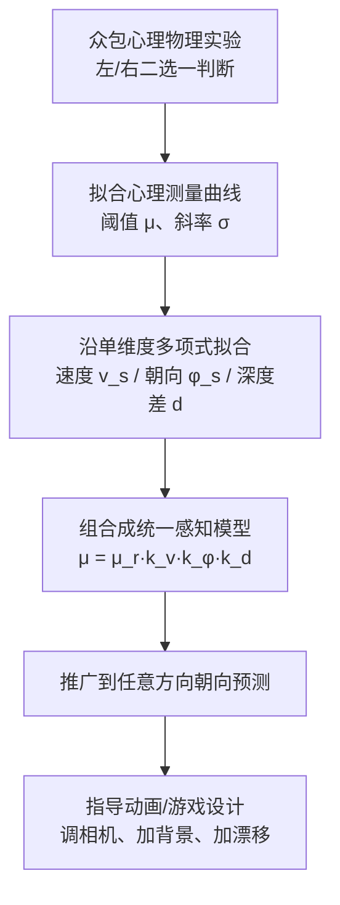

## 一句话总结

在观察者自身也在运动的动态 3D 场景中，人眼从屏幕光流估计物体运动方向时会系统性地"低估"（中心偏差）；本文通过大规模众包心理物理实验量化了这一偏差，并建立了可预测的感知模型，用它来指导动画/游戏的场景与相机设计以减小观众的运动误判。

## 研究背景

在开车、打游戏、看动画等场景中，人需要准确判断物体在 3D 空间中的运动方向。但屏幕显示的图形内容只提供有限的线索：观察者主要依靠屏幕上的光流来推断运动。当观察者自身也在移动时，屏幕上呈现的是"场景运动"与"物体运动"叠加的混合光流，人必须从中把物体的场景相对运动分解出来。

这一分解本质上是有歧义的。已有研究指出，缺乏前庭线索、立体视觉、调焦等深度线索时，人对运动方向的估计会出现偏差，尤其表现为"中心偏差"（对朝向角的低估）。但过去研究多集中于静止观察者、单一物体的设置，缺乏对不同场景动态条件下误差如何变化的定量刻画，也没有给下游图形应用提供可用的设计指导。本文正是要填补这一空白：测量并建模人在动态环境中对物体运动方向的感知精度。

关键量的记法（贯穿全文）：

$$
\vec{v}_t = \vec{w}_t + \vec{v}_s
$$

其中 $$\vec{w}_t$$ 是物体相对场景的真实运动，$$\vec{v}_s$$ 是场景（自运动）在屏幕上的运动，$$\vec{v}_t$$ 是屏幕上观察到的物体相机相对运动。"完美"观察者能准确分解二者，而真实的人会因为对场景朝向 $$\varphi_s$$ 的低估（$$\varphi'_s \le \varphi_s$$）而产生误判。

## 方法

整体框架分为三步：先做心理物理实验测量单条件下的感知阈值，再把多个单维度拟合组合成一个统一模型，最后把模型推广到任意方向的运动并用于指导设计。

### 关键设计 1：心理物理实验与阈值定义

通过众包平台 Prolific 招募被试，用严格的两层筛选（注意力筛选 + 任务理解筛选）保证数据质量。每个 trial 播放 2 秒视频：先呈现带 Perlin 噪声纹理的地面以传达前向自运动，1 秒后加入一个黄色探针（目标物体），被试最终判断探针相对场景是向左还是向右移动。

核心是拟合心理测量曲线，求出被试认为目标"既不左也不右"（$$\vec{w}'_t = 0$$）的临界目标朝向 $$\mu$$：

$$
f(\varphi_t; \mu, \sigma, \lambda) = \lambda + (1 - 2\lambda) \times 0.5 \left[ 1 + \mathrm{erf}\left( (\varphi_t - \mu) / \sqrt{2\sigma^2} \right) \right]
$$

其中 $$\mu$$ 是阈值（偏差/不准确度），$$\sigma$$ 是斜率（判断的一致性/精度），$$\lambda$$ 是失误率。

### 关键设计 2：多维度可分离的组合模型

以参考条件 $$\{v_s = 1\,\text{m/s},\ \varphi_s = 15^\circ,\ d = 0.7\}$$ 为锚点，分别沿场景速度 $$v_s$$、场景朝向 $$\varphi_s$$、目标-场景深度差系数 $$d = h_t/h_s$$ 三个维度做多项式拟合（$$\mu$$ 用二次、$$\sigma$$ 用线性）。将参考阈值 $$\mu_r$$ 因子分离后，采用一阶近似、假设无跨条件耦合，组合成统一模型：

$$
\mu(v_s, \varphi_s, d) = \mu_r\, k_v(v_s)\, k_\varphi(\varphi_s)\, k_d(d)
$$

且满足归一化 $$k_v(1) = k_\varphi(15^\circ) = k_d(0.7) = 1$$。主要趋势：场景速度越大偏差越大但判断更一致；偏差大致与场景朝向 $$\varphi_s$$ 成正比；深度差 $$d$$ 越大误差越大。

### 关键设计 3：推广到任意方向并用于设计指导

利用 $$\vec{w}_t = \vec{v}_t - \vec{v}_s$$ 的耦合关系，观察者对场景相对目标运动的误判等价于对场景运动的反向误判：

$$
\vec{w}'_t = \vec{v}_t - \vec{v}'_s
$$

将阈值结果代入，得到感知到的场景朝向 $$\varphi'_s = \mu(v_s, \varphi_s, d)$$，进而推出感知到的场景相对目标运动：

$$
\vec{w}'_t = (\vec{w}_t + \vec{v}_s) - (R_\mu \hat{z}) v_s
$$

其中 $$R_\mu \hat{z}$$ 是前向单位向量按 $$\mu$$ 侧向旋转后的结果。据此可预测误差并反向优化设计（调相机位姿、加静态/动态背景几何来改变深度差或伪造场景朝向）。

## 实验结果

主研究纳入 38 名被试（从 78 人中筛出），共 6,688 个有效 trial。参考条件下阈值 $$\mu = 6.2^\circ$$、斜率 $$\sigma = 5.7^\circ$$，中心偏差在所有条件下都持续存在。模型鲁棒性验证（半数据拟合、半数据评估，重复 20 次）：$$R^2$$ 均值 0.95、最低 0.61，全数据自拟合 0.98。跨人群泛化研究（$$n=23$$）测得 $$\mu_{\text{avg}} = 4.6^\circ \pm 1.1^\circ$$、$$\sigma_{\text{avg}} = 6.2^\circ \pm 1.4^\circ$$，与主研究无显著差异。

下表为应用案例研究的主结果：真实场景相对目标朝向恒为 $$\psi_t = -20^\circ$$，各设计条件下被试感知到的目标朝向 $$\psi'_t$$（越接近 $$-20^\circ$$ 越准）：

| 场景 | 条件 | 感知目标朝向 $$\psi'_t$$ |
| --- | --- | --- |
| SPORTS（高尔夫） | 控制组 | $$9.1^\circ \pm 0.91^\circ$$ |
| SPORTS | 调整相机位姿 | $$4.8^\circ \pm 0.60^\circ$$ |
| SPORTS | 相机位姿 + 场景内容 | $$-5.5^\circ \pm 1.2^\circ$$ |
| FLIGHT（飞行模拟） | 控制组 | $$6.5^\circ \pm 0.71^\circ$$ |
| FLIGHT | 静态场景（加云） | $$-1.8^\circ \pm 1.5^\circ$$ |
| FLIGHT | 动态场景（云漂移） | $$-7.5^\circ \pm 1.8^\circ$$ |

重复测量 ANOVA 显示两个场景内各条件对平均响应均有显著影响（SPORTS：$$F_{2,42} = 94.0,\ p < .01$$；FLIGHT：$$F_{2,42} = 65.6,\ p < .01$$），即模型指导的设计改造显著提升了判断准确度。值得注意的是，本文基于 2D 显示器的实验测得的偏差比先前 VR 环境下同类刺激（$$\varphi_s = 15^\circ$$ 时约 $$12^\circ$$）更强，印证了立体线索对运动感知的作用。

## 亮点与局限

亮点：
- 首次在"观察者自身也在运动"的动态 3D 场景下，用超过一万个 trial 的大规模众包心理物理实验，定量刻画了物体运动方向感知的系统性偏差。
- 提出的可分离组合模型形式简洁、可解释，且经半留出验证与跨人群验证证明鲁棒、可泛化。
- 把感知模型落地为可执行的动画/游戏设计指导（改相机、加背景、加漂移），并用真实场景的用户实验验证有效。

局限：
- 只研究了横向（transverse 平面）运动，完整问题是自运动与物体运动共 12 个自由度，旋转、垂直运动等未覆盖。
- 采用一阶近似、显式假设无跨条件耦合，真实的跨维度交互效应未建模。
- 更真实的刺激会引入高阶认知线索（身体姿态、阴影、路径信息等），导致模型的精确数值预测偏差，只能给出一阶趋势近似。
- 本文只提供测量与设计指导，未给出自动优化用户表现的算法。

## 延伸思考

本文把"感知误差"当作一种可测量、可预测、进而可补偿的系统性质，这与视觉敏锐度感知（如注视点渲染、色彩/闪烁感知）的研究思路一脉相承——都是先量化人眼的"不完美"，再据此优化图形系统。有意思的是这里的目标不是节省算力，而是反过来"补偿"误差以提升安全性与任务准确度。

一个自然的延伸方向是把这套模型接入实时渲染管线，做成自动的相机/场景优化器（本文明确留作未来工作）。另一方面，随着立体显示、注视点追踪、前庭反馈等 3D 显示技术成熟，补充这些缺失线索本身可能就能减小偏差，这也提示"改进显示"与"补偿设计"是两条互补的路径。若能结合大规模第一人称运动数据集刻画随时间移动的 FOE（扩张焦点），有望把模型推广到任意方向的复杂运动。
