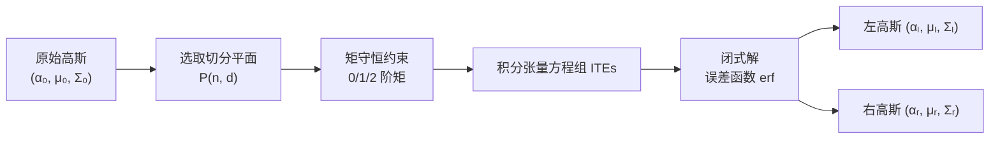

## 一句话总结

EVSplitting 用"零阶/一阶/二阶矩守恒"把一个 3D 高斯沿任意平面切成两个视觉一致的高斯，并给出闭式解，从而让 3DGS 在显式编辑、点云提取和训练时都更均匀、更贴合表面、更少毛刺。

## 研究背景

3D Gaussian Splatting（3DGS）作为一种新的显式 3D 表示，兼具快速可微光栅化渲染和显式可编辑的优势，被广泛用于编辑、仿真与 3D 生成。但它存在两类"非均匀性"问题：

- **尺度非均匀（scale inhomogeneity）**：部分高斯在所有主方向上的尺度都远大于其他高斯，编辑时会形成明显凸起，点云提取时会留下大空洞。
- **结构非均匀（structural inhomogeneity）**：单个高斯不同主方向的尺度差异很大，导致表面附近出现针状（needle-like）伪影。

这些非均匀性使得直接编辑 3DGS 时物体边界模糊、杂乱，累积编辑会导致整个场景崩坏；同时大面积无纹理区域被"压扁"成极稀疏点云，影响法线估计、点云分割等下游任务。原始 3DGS 通过"复制 + 缩放 + 随机平移"来增密高斯，会破坏视觉一致性、造成训练损失不稳。因此需要一种**无需重新训练、保证视觉一致**的高斯切分方法。

## 方法

### 整体框架

核心问题被规约为：如何用一个 3D 平面把一个高斯切成两个，既保持切分前后的 3D 视觉一致，又让两个新高斯尽量分处平面两侧。平面表示为：

$$P(\mathbf{n}, d) = \{\mathbf{x} \in \mathbb{R}^3 \mid \hat{P}_{(\mathbf{n},d)}(\mathbf{x}) \triangleq \mathbf{n}\cdot\mathbf{x} + d = 0\}$$

切分算子把原高斯 $(\alpha_0,\mu_0,\Sigma_0)$ 变为左右两个高斯 $(\alpha_l,\mu_l,\Sigma_l)$ 与 $(\alpha_r,\mu_r,\Sigma_r)$，优化目标是两个新高斯之间的重叠最小，同时各自与原高斯在对应半空间内尽量相似。

### 关键设计 1：三阶矩守恒保证视觉一致

为了让切分前后从任意视角看不出差别，作者要求切分前后保持三个守恒量。零阶矩守恒保证累计不透明度不变：

$$\int_{\mathbb{R}^3} \alpha_0\, \text{pdf}_0(\mathbf{v})\, dV = \int_{\mathbb{R}^3} \alpha_l\, \text{pdf}_l(\mathbf{v})\, dV + \int_{\mathbb{R}^3} \alpha_r\, \text{pdf}_r(\mathbf{v})\, dV$$

一阶矩守恒保证高斯中心位置视觉不变：

$$\int_{\mathbb{R}^3} \alpha_0\, \mathbf{v}\, \text{pdf}_0(\mathbf{v})\, dV = \int_{\mathbb{R}^3} \alpha_l\, \mathbf{v}\, \text{pdf}_l(\mathbf{v})\, dV + \int_{\mathbb{R}^3} \alpha_r\, \mathbf{v}\, \text{pdf}_r(\mathbf{v})\, dV$$

二阶矩守恒保证分布形状（协方差）尽量一致：

$$\int_{\mathbb{R}^3} \alpha_0\, \mathbf{v}\mathbf{v}^T \text{pdf}_0(\mathbf{v})\, dV = \int_{\mathbb{R}^3} \alpha_l\, \mathbf{v}\mathbf{v}^T \text{pdf}_l(\mathbf{v})\, dV + \int_{\mathbb{R}^3} \alpha_r\, \mathbf{v}\mathbf{v}^T \text{pdf}_r(\mathbf{v})\, dV$$

这三个约束把切分问题转化为一组积分张量方程（ITEs）。

### 关键设计 2：闭式解

作者取一个特解——让每个新高斯在其半空间上与原高斯的各阶矩相匹配，即对 $k\in\{l,r\}$：

$$\int_{V_k} \alpha_0\, \text{pdf}_0(\mathbf{v})\, dV = \int_{\mathbb{R}^3} \alpha_k\, \text{pdf}_k(\mathbf{v})\, dV$$

结合高斯二阶中心矩关系 $\Sigma_i + \mu_i\mu_i^T = \int_{\mathbb{R}^3}\mathbf{v}\mathbf{v}^T\text{pdf}_i(\mathbf{v})\,dV$，可解出闭式：

$$\alpha_k = \alpha_0 C_k,\quad \mu_l = \mu_0 - \frac{\mathbf{L}_0 D}{\tau C_l},\quad \mu_r = \mu_0 + \frac{\mathbf{L}_0 D}{\tau C_r}$$

$$\Sigma_l = \Sigma_0 + \frac{\mathbf{L}_0\mathbf{L}_0^T}{\tau^2}\left(\frac{d_0 D}{\tau C_l} - \frac{D^2}{C_l^2}\right)$$

其中权重与投影量为：

$$C_l = \tfrac{1}{2}\left(1 - \text{erf}\left(\frac{d_0}{\sqrt{2}\,\tau}\right)\right),\quad D = \frac{1}{\sqrt{2\pi}}\exp\left(-\frac{d_0^2}{2\tau^2}\right)$$

$$\mathbf{L}_0 = \Sigma_0\mathbf{n},\quad \tau = \sqrt{\mathbf{n}^T\Sigma_0\mathbf{n}},\quad d_0 = \hat{P}_{(\mathbf{n},d)}(\mu_0)$$

由于是解析表达式，切分可对任意 3DGS 模型直接使用，且能并行计算，几乎不增加耗时。

### 关键设计 3：一致性评价指标与鲁棒实现

作者定义两个误差衡量视觉一致性：**区间误差** $E_i$ 衡量各高斯在自身半空间内相对原高斯的偏差；**外溢误差** $E_e$ 衡量高斯越过切分边界的部分（对应模糊与针刺）。二者不能同时为零，好的切分应让两者都较小。

实现上还做了四点处理：用阈值 $\eta = 3\times\max((R\cdot\mathbf{n})\odot\text{Tri}(S))$ 跳过离平面过远的无效切分；给 $C_l,C_r,D$ 加 $\epsilon=10^{-20}$ 偏置避免浮点下溢；用 $\Lambda_{ti}=\text{ReLU}(\Lambda_i)$ 保证特征值正定；用 $R_{ti}=R_i\det(R_i)$ 修正左右手系导致的非正常旋转问题。

## 实验结果

在 NeRF 合成数据集的 chair 物体上，用不同编辑策略对比区间误差 $E_i$ 与外溢误差 $E_e$（均越小越好）。基线中 move 会在缝隙留下可见成分（$E_e$ 大），remove 会造成大量空洞（$E_i$ 大），filter 会产生伪影，而本方法在两个指标上都取得较小值：

| 场景 | 策略 | $E_i\downarrow$ | $E_e\downarrow$ |
|------|------|------|------|
| plane split | move solution | 0.0000 | 0.5836 |
| plane split | remove solution | 3.4121 | 0.0000 |
| plane split | ours once | 0.5828 | 0.0009 |
| plane split | ours twice | 0.5830 | 0.0006 |
| polygon delete | filter solution | 0.0000 | 0.0668 |
| polygon delete | ours 3 times | 0.3610 | 0.0005 |
| curve delete | filter solution | 0.0000 | 0.0710 |
| curve delete | ours 3 times | 0.3027 | 0.0015 |

在 3DGS 训练中集成切分（阈值 $\eta_\gamma$ 控制何时切分不均匀高斯），在整个 NeRF 合成数据集上渲染质量三项指标全面提升：PSNR 从 36.9356 提升到 37.1908，SSIM 从 0.9825 提升到 0.9839，LPIPS 从 0.0236 降到 0.0216。点云提取上，本方法把大面积无纹理区域切成更均匀的高斯，得到更稠密、空洞更少的点云。

## 亮点与局限

**亮点**：
- 用矩守恒把"视觉一致切分"这一直觉转化为可解析求解的积分张量方程，得到简洁闭式解，无需额外训练即可用于任意 3DGS 模型。
- 一套方法同时服务三类任务——显式编辑（平面切分/多边形删除/曲面删除）、训练增质、点云稠密化。
- 提出 $E_i$、$E_e$ 两个可量化的视觉一致性指标。
- 计算可并行，几乎不增加训练开销。

**局限**：
- $E_i$ 与 $E_e$ 存在固有权衡，受高斯单峰对称形状限制无法同时最小化。
- 多次编辑会累积浮点误差，需要额外的数值修补手段。
- 复杂曲面/多面体删除需组合多次判定或射线投射，切分阈值 $\eta_\gamma$ 等超参需按任务调节。

## 延伸思考

这项工作把 3DGS 的"增密/切分"从原始的启发式复制升级为有明确数学守恒意义的算子，本质上是在问：一个各向异性高斯基元该如何在保持外观积分不变的前提下被重新划分。作者在结尾指出存在对偶的"合并"算子（在同样守恒约束下 $\alpha_0=\alpha_l+\alpha_r$ 等），可用于压缩存储，这提示切分—合并可以构成一套完整的高斯基元重分布工具，未来或能与网格/点云互转、LOD、表面重建等几何处理管线更紧密地结合。
