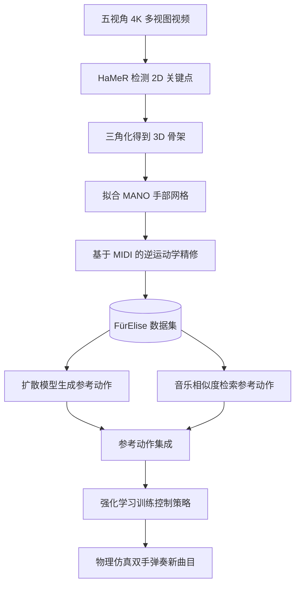

## 一句话总结

本文构建了首个大规模钢琴演奏三维手部动作数据集 FürElise，并提出一套"扩散模型生成 + 音乐相似度检索 + 强化学习"的混合流水线，让物理仿真的双手能够弹奏训练集之外的新曲目。

## 研究背景

钢琴演奏对手部控制提出了极高要求：既要在正确时刻按下正确的键，又要敏捷协调地同时按多键，还要在长序列中流畅衔接并预判后续音符。这类高精度双手灵巧控制的手部动作模型在角色动画、具身智能、生物力学与 VR/AR 中都有广泛用途。

已有工作存在两方面不足。一是数据缺口：现有手部动作数据集多聚焦抓取、物体操作或双手交互，鲜有覆盖钢琴演奏这一更复杂动态场景的数据；少数含钢琴动作的数据集曲目有限或缺少音频。二是合成方法受限：以往钢琴动作合成要么依赖人工标注的指法信息（哪根手指按哪个键），要么只能处理简化钢琴或较容易的曲目。本文认为，要构建更好的模型需要更深入地理解人类如何弹琴，因此从"捕捉真实精英钢琴家动作"入手补足数据，再据此驱动合成方法。

## 方法

整体分两大部分：先用非侵入式无标记动捕流水线采集并精修数据集，再用混合数据驱动与物理控制的流水线合成新曲目的演奏动作。

**数据采集与重建**。在真实钢琴工作室用五台标定 GoPro 相机以 59.94 FPS、3840×2160 分辨率环绕录制多视图视频；钢琴为 Yamaha Disklavier，内置录音器以 MIDI 格式高精度记录按键与踏板事件。重建时用最新姿态估计模型 HaMeR 预测每视角 21 个关节的 2D 位置，由于其预测深度不可用，仅取投影 2D 关键点做三角化得到 3D 关节位置，配合 RANSAC 剔除遮挡点、Butterworth 滤波增强时序平滑，再拟合 MANO 参数得到手部网格。

**基于 MIDI 的逆运动学精修**。视觉重建常见按错键或漏键伪影。利用 MIDI 记录的每个音符精确按下与释放时刻，假设指尖在音符持续期间保持接触琴键，通过 IK 强制两个属性：当 MIDI 显示某键被按下时，至少一个指尖须落在该键顶面并低于触发阈值深度；当某键未被按下时，任何指尖都不应把它按到触发深度。为避免大幅改动，只优化局部关节旋转与腕部朝向，并限制指尖最大位移 1cm，同时加入平滑项。

**扩散模型生成参考动作**。基于 EDGE 的 transformer 架构训练条件扩散模型，把双手动作表示为 $$K \in R^{M \times 2 \times 21}$$ 的关节位置轨迹（$$M=120$$ 帧，即 2 秒）。乐谱先量化为二值矩阵 $$C \in \{0,1\}^{N \times 88}$$，再按按键持续时长归一化编码为条件向量 $$C_{i,p} = \frac{1}{t_{ip} - t^{start}_{ip} + 1}$$。扩散模型能生成视觉自然的轨迹与指法，但常出现悬浮不按或按错键的接触错误，无法直接用于训练策略。

**音乐相似度检索 + 强化学习**。为补足精度，将数据集全部音符量化为二值矩阵并用长 30、步长 1 的滑动窗口切分，对目标曲目每个窗口按 L2 距离检索最相似的数据集窗口：$$c_j = \arg\min_{i \in \{1,...,N_w\}} \|W_i - W'_j\|_2$$，取回对应真实手部动作并拼接。将扩散生成动作与检索动作组成参考集成，在 IsaacGym 中训练物理控制策略：每只手 17 连杆、27 自由度，由 PD 伺服驱动。采用 GAN 式模仿学习并将左右手解耦，各用独立判别器；同时设计目标奖励，对目标键鼓励正确按压、对非目标键惩罚误触，整体目标奖励为 $$r_t = \prod_k r^+_{t,k} - 0.15\sum_\kappa r^-_{t,\kappa} + 0.5 r_{correct} - 0.05 r_{energy}$$。策略在多目标框架下优化，目标驱动目标权重 0.9、左右手模仿目标各 0.05。

## 实验结果

在 14 首训练集外曲目（涵盖古典、流行、爵士，片段平均 20.72 秒）上用 F1 评测。完整流水线在所有曲目上 F1 均超过 0.8，显著优于仅用扩散模型的结果。四首曲目上的消融显示扩散生成与检索动作互补且缺一不可：

| 方法 | For Elise | Rondo Alla Turca #3 | Clementi Op.36 | Sleep Away |
|------|-----------|---------------------|----------------|------------|
| Ours（完整） | 98.15 | 94.65 | 96.21 | 83.75 |
| RL+Retr（仅检索） | 78.17 | 81.94 | 95.00 | 53.33 |
| RL+Diff（仅扩散） | 85.77 | 78.73 | 94.17 | 64.13 |
| RL+Whole（整库模仿） | 80.37 | 88.51 | 79.10 | 49.38 |
| RL（仅目标奖励） | 73.20 | 34.36 | 75.28 | 49.97 |

仅目标奖励的 RL 表现最差且动作不自然，说明模仿学习对动作自然度与任务执行都必要；缺少扩散指导（RL+Retr、RL+Whole）会因缺指法信息导致姿态不自然、动作冗余；仅用扩散动作（RL+Diff）则会过拟合其错误指法而降低按键精度。策略能处理和弦、双音、琶音与大幅腕部运动。数据集本身重建质量为精确率 88.55、召回率 92.53、F1 86.49。

## 亮点与局限

亮点在于：首个大规模钢琴演奏三维手部动作数据集，约 10 小时、15 位精英钢琴家、153 首古典曲目，且带同步 MIDI 音频；无标记非侵入式采集配合 MIDI 驱动的 IK 精修保证接触精度；用扩散模型自动提供指法、用检索动作补足物理精度，二者集成再经 RL 训练，无需任何额外人工指法标注即可弹奏新曲目。

局限方面：不建模音量（按键力度），生成音乐为恒定音量；让模型自行决定指法，可能在换指等基本技巧上受困；用逐帧平均 F1 评测与人类听觉感知不完全一致，对破和弦、节奏不稳等瞬时错误不敏感；仿真手可施加不自然的大关节力矩或不可行加速度。

## 延伸思考

数据集记录的按键速度信息为将来建模音量与力度表现留出了空间，这可能是让合成从"音符正确"迈向"音乐表现力"的关键。将常见指法规则作为高层先验注入策略学习，或引入真实肌肉骨骼手部模型通过肌肉激活生成动作，都可能同时提升自然度并服务于生物力学与损伤预防研究。此外，"扩散生成负责自然度与语义、数据检索负责物理精度、RL 负责物理可行"的分工范式，对其他高精度接触型灵巧操作任务（如乐器、精细装配）具有借鉴价值。
