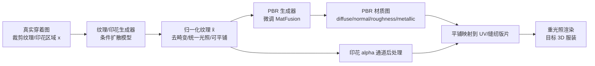

## 一句话总结

FabricDiffusion 把"从真实穿着图给 3D 服装贴图"重新定义为"提取无畸变、可平铺的纹理材质再映射到 UV 空间"，用纯合成数据训练一个条件扩散模型来校正输入图中的几何畸变与光照，进而生成可直接对接 PBR 材质管线的高保真纹理、印花与材质贴图。

## 研究背景

虚拟试穿、游戏、VR/AR 对高质量 3D 服装资产的需求快速增长，而网络上的服装图像大多是 2D 的。把 2D 图像的外观迁移到任意形状的 3D 服装网格是一个难题：真实穿着图中的布料会因褶皱、身体形状、遮挡以及一般光照变化而产生强烈的几何畸变和阴影。

已有方法主要走两条路线：一是学习 2D-to-3D 配准做纹理映射，二是用预训练 2D 生成模型做深度感知的多视角修复(inpainting)。这两类方法受限于配准误差和生成过程的随机性，往往产生不规则、低质量的纹理，难以忠实还原纹理细节，也无法解耦服装上的畸变，导致纹理连续性和质量明显下降。

本文的核心洞察来自时尚工业的真实制衣流程：大多数 3D 服装都是由带有归一化、可平铺纹理贴图的 2D 缝纫版片(sewing pattern)拼接而成。因此，只要能从单张穿着图里恢复出这种"归一化"纹理贴图(去除几何畸变、光照变化和阴影的规范纹理空间)，就能把它平铺到服装的 UV 空间，实现跨姿态、跨光照的真实渲染。

## 方法

整体框架把纹理迁移拆成四步：(a) 从输入图的裁剪区域生成归一化纹理和印花；(b) 由归一化纹理生成 PBR 材质与透明印花；(c) 将材质与印花平铺、叠加到目标 3D 网格；(d) 在新光照下重光照渲染。

**问题建模为条件分布映射。** 给定输入服装图 $$I$$ 及其一个带畸变、带光照变化的纹理捕获块 $$x$$，目标是学一个映射 $$g$$ 输出对应的归一化纹理 $$\tilde{x}$$，同时保留原始区域的颜色、图案和材质属性。这被建模为生成过程 $$\tilde{x}\sim G_\theta(x,\epsilon),\ \epsilon\sim\mathcal{N}(0,I)$$，即以捕获块 $$x$$ 为条件、从高斯噪声采样生成规范空间中的无畸变纹理。

**关键设计一：用合成数据构造配对训练样本。** 真实服装几乎不可能获得配对(畸变—归一化)数据。作者利用较易获取的 PBR 材质，把材质图既贴到 22 类原始服装网格上(用环境贴图渲染得到畸变图 $$x$$)，又贴到平面网格上(用顶部定点光、正交相机渲染得到无畸变真值 $$x_0$$)，从而自动生成配对样本。印花则映射到网格随机位置并与纯色背景混合作为畸变图，原始透明背景印花作为平面真值。

**关键设计二：伪 BRDF 数据扩容。** 真实 BRDF 数据集仅 3.8k，图案多样性不足。作者额外收集 10 万张织物色彩图作为 albedo，roughness 从 $$\mathcal{N}(0.708,\,0.193^2)$$ 采样(均值/标准差取自真实 BRDF 统计)，metallic 取 $$\max(\beta,0),\ \beta\sim\mathcal{U}(-0.05,0.05)$$，normal 保持平坦，生成伪 BRDF 材质。真实(3.8k)+伪(100k)组合共同构造训练对。

**关键设计三：潜空间条件扩散 + 可平铺 + 透明印花。** 基于 Stable Diffusion v1.5 的 LDM，在潜空间加噪 $$x_t=\sqrt{\gamma(t)}\,\mathcal{E}(x_0)+\sqrt{1-\gamma(t)}\,\epsilon$$，训练目标为 $$L(\theta)=\mathbb{E}_{\mathcal{E}(x),\epsilon,t}\big[\lVert\epsilon-\epsilon_\theta(x_t,t,\mathcal{E}(x))\rVert^2\big]$$，把畸变块的潜编码 $$\mathcal{E}(x)$$ 拼接到首层卷积作为条件，并去掉文本条件(仅以图像为提示)。为保证可平铺，对所有常规卷积层施加循环填充(circular padding)。为生成透明印花，对 RGB 输出做后处理近似二值 alpha：像素值 $$\ge 0.1$$ 判为全不透明，否则按 $$\tilde{x}(i,j)/0.1$$ 缩放为透明背景。最后由微调后的 MatFusion 生成 PBR 材质，并用比例感知或用户引导两种策略确定平铺尺度。

## 实验结果

在合成测试集上做图像到服装的纹理迁移对比，FabricDiffusion 在各项指标上全面优于 Material Palette，尤其在衡量分布相似度的 FID 上优势明显：

| 方法 | FID ↓ | LPIPS ↓ | SSIM ↑ | MS-SSIM ↑ | DISTS ↓ | CLIP-s ↑ |
|---|---|---|---|---|---|---|
| Material Palette | 34.39 | 0.20 | 0.75 | 0.73 | 0.28 | 0.94 |
| FabricDiffusion (ours) | **12.44** | **0.16** | **0.79** | **0.77** | **0.19** | **0.97** |

在真实 BRDF 测试样本上的 PBR 材质提取中，微调后的 FabricDiffusion 在 diffuse、normal、roughness 大多数指标上超过 Material Palette 与原始 MatFusion(如 diffuse 的 MSE 0.0287、SSIM 0.3157)。消融显示：循环填充把 TexTile 可平铺分数从 0.47 提升到 0.62(Material Palette 为 0.54)；加入伪 BRDF 数据后 FID 从 19.17 降到 12.44、其余指标同步改善。方法虽完全用合成数据训练，却能零样本泛化到真实穿着图，并支持多材质服装与 AI 生成图像作为输入。

## 亮点与局限

亮点：把纹理迁移巧妙转化为"畸变块→归一化纹理"的有监督分布映射，训练目标简单直接；通过合成渲染+伪 BRDF 完全绕开真实配对数据的采集难题，却实现对真实图像的零样本泛化；输出的规范化纹理天然对接现成 SVBRDF 管线(MatFusion)，从而能生成 diffuse/normal/roughness/metallic 完整材质并支持重光照；循环填充与 alpha 后处理这类轻量技巧有效解决了可平铺与透明印花问题。

局限：对非重复性图案的重建易出错；难以精确还原复杂印花/logo 的精细细节，方法聚焦于背景均匀、复杂度和畸变适中的印花；对皮革等困难布料类别仍有提升空间；平铺尺度依赖比例估计或用户介入，缺乏完全自动的最优方案。

## 延伸思考

这项工作最有启发性的地方是"表示选择胜过网络容量"的判断——作者明确指出生成纹理质量的差距主要不来自生成网络能力，而来自从参考图到 3D 网格的纹理表示选择不当。把问题投影回缝纫版片这一制衣领域的自然表示，就把一个病态逆问题化简成了有监督映射。这种"借助领域先验重构问题表示"的思路值得迁移到其他 2D-to-3D 外观建模任务。

另一条值得深挖的线是合成到真实的迁移：仅靠受控渲染的畸变—平面配对，加上统计驱动的伪 BRDF 采样，就获得了真实图像上的零样本能力，说明只要合成数据精准建模了"畸变与光照"这一核心变化因子，就能覆盖真实分布的关键部分。未来若把透射(transmittance)等更多材质通道、以及非重复图案的结构约束纳入，方法有望扩展到更广的织物与服装类型。
