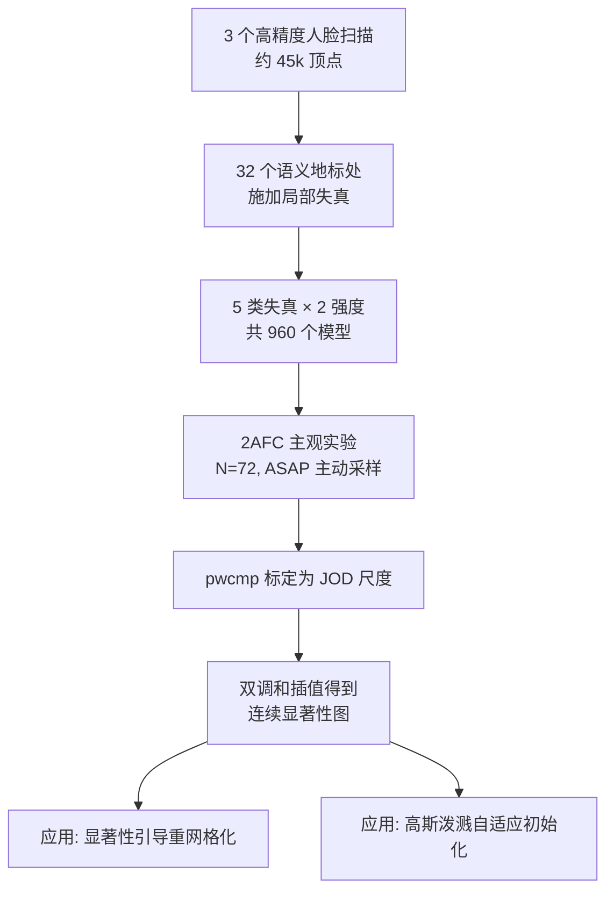

## 一句话总结

本文通过大规模心理物理实验，首次量化了人脸不同区域对几何与纹理失真的感知敏感度，构建出一张"人脸感知显著性地图"（FaceMap），并证明它能指导网格简化和高斯泼溅等渲染任务实现更优的资源分配。

## 研究背景

人类对人脸异常敏感，识别人脸细节在社交认知与身份辨识中至关重要。艺术家与动画师凭经验会对眼睛、嘴巴等区域投入更多精力，但学界一直缺少定量数据来回答"人脸哪些区域在视觉计算场景下最重要"。

已有的显著性研究大多面向二维图像的自底向上注意力建模，或用曲率等几何量度描述网格显著性，但几何量度未必对应感知重要性（例如眼睛在曲率上很平坦，耳朵却很复杂，直觉上眼睛却更显著）。此前 Geo-metric 等人脸失真数据集只在整头上均匀施加几何失真，且使用无纹理网格，无法分析区域间的相对重要性。本文的核心思路是：以"失真在不同区域的可见程度"为透镜，来度量人脸区域的相对感知重要性，并让结果独立于任何特定渲染技术。

## 方法

整体框架分为四步：构造局部失真数据集 → 2AFC 主观实验（配合主动采样）→ 将成对比较标定为 JOD 感知尺度 → 插值得到连续显著性图并落地到应用。

**关键设计一：局部失真的构造。** 数据集覆盖两类纹理失真（模糊、JPEG 压缩）和三类几何失真（噪声、平滑、简化）。为了把全局失真"局部化"，在地标 $$L$$ 的 5% 球形邻域内标记顶点，再用径向基函数 $$f$$ 将原始纹理 $$T_i$$ 与失真纹理 $$T_d$$ 平滑混合，避免硬边：混合结果为 $$(1-f)\ast T_i + f\ast T_d$$。几何噪声用沿法向的 Perlin 噪声（2 cycles/mm），平滑用受约束的双调和平滑，简化则在 UV 域内用 Triangle 算法局部重三角化。每类失真强度经过预实验调校，使每级在总体上约对应 1 个 JOD。

**关键设计二：2AFC 实验范式。** 采用两选一强制选择（选出相对参考图"更接近/失真更小"的一个），因为成对比较比 Likert 打分更精确，且参考图居中呈现能抵消模型自身瑕疵的影响。被试可水平旋转模型（左右各 60°），测试网格与参考同步旋转以便直接对比。

**关键设计三：主动采样压缩实验规模。** 若朴素两两比较，960 个模型需要 $$\binom{960}{2}=460320$$ 次比较，不可行。作者用 ASAP 主动采样（基于期望信息增益调度下一次试次），每人每个失真只需 1 次比较；再结合"每次只测 1 个基础模型""左右对称失真视为等价"，将唯一失真数降到 $$1\times5\times2\times(6+13)=190$$，每位被试完成 250 次试次，平均耗时 49.6 分钟。

**关键设计四：JOD 标定与显著性图生成。** 用 pwcmp 库把成对比较数据转成"恰可觉察差异"（JOD）尺度，参考条件按惯例置为 0。稀疏地标上的 JOD 值再通过双调和插值扩展为定义在整个表面上的连续标量场，即最终的显著性图。

## 实验结果

主实验为 $$N=72$$ 的心理物理研究，共采集超过 18,000 次主观比较（去除 3 名离群被试），并做 N-way 方差分析（ANOVA）。结果确认失真类型、强度、位置均为显著因素，而失真所在的左右侧、以及基础模型均不显著——后者说明所得显著性图有望泛化到其他人脸模型。

| 因素 | 显著性 | 结论 |
| --- | --- | --- |
| 失真类型 | $$p\ll0.01$$ | 显著 |
| 失真强度 | $$p\ll0.01$$ | 显著 |
| 失真位置 | $$p\ll0.01$$ | 显著 |
| 人脸左右侧 | $$p=0.36$$ | 不显著（可对称等价处理） |
| 基础模型 | $$p=0.66$$ | 不显著（暗示可泛化） |

关键发现：眼睛、鼻子、嘴巴等区域的失真可见度远高于上颌、下颌关节、前额等区域；且不同失真类型偏好不同——鼻尖对几何简化/平滑最敏感，而眼睛对模糊（纹理失真）最敏感。在重网格化验证研究（$$N=9$$）中，FaceMap 引导的自适应网格显著优于均匀采样和自动谱显著性方法（$$p\ll0.01$$），例如 8% 密度的 FaceMap 网格得分接近 20% 密度的均匀网格；在高斯泼溅验证（$$N=11$$，5 个密度等级的 2AFC）中，FaceMap 初始化同样被显著更多地偏好（$$p\ll0.01$$）。

## 亮点与局限

亮点：
- 首个以"失真可见度"为透镜、量化人脸区域相对感知重要性的定量研究，填补了人脸感知显著性数据的空白。
- 实验设计刻意独立于具体渲染技术，聚焦通用失真类型，使结论具有更长的适用期。
- 用 ASAP 主动采样把不可行的 46 万次比较压缩到人均 250 次，工程上很巧妙。
- 结果以 JOD 为单位，可解释、可扩展，并开源了数据与分析脚本。

局限（作者自述）：
- 仅研究了中性表情的人脸，表情变化（如微笑增强嘴部显著性）可能改变区域重要性。
- 未考察性别/种族对感知的潜在影响，也未涉及胡须、眼镜等面部特征与配饰。
- 几何与纹理失真的相互作用（互相掩蔽）未深入建模。
- 将 FaceMap 迁移到新模板需要一次半手动的地标匹配（约 5 分钟）。

## 延伸思考

这项工作把"感知优先级"变成了可量化、可插入图形管线的先验，思路上与前景/背景重要性引导的渲染资源分配一脉相承，但把粒度细化到了人脸的语义区域。它天然适合作为面向头显 avatar 的压缩与 LOD 策略的感知锚点。值得延伸的方向包括：把 JOD 显著性先验直接嵌入可微渲染或高斯泼溅的优化目标（而非仅用于初始化），以及把该实验范式推广到动态表情序列，得到"时空显著性图"，用于驱动动画与视频编码中的比特/计算分配。
