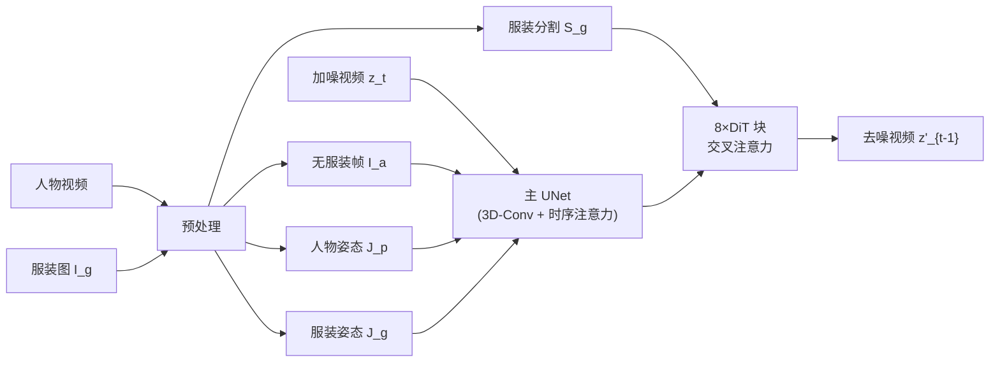

## 一句话总结

Fashion-VDM 用一个统一的视频扩散模型，给定一张服装图和一段人物视频，端到端生成保留人物身份与动作的高质量试穿视频，并通过分离式无分类器引导（split-CFG）、渐进式时序训练与图像-视频联合训练，实现单次前向 64 帧、512px 的时序一致视频虚拟试穿。

## 研究背景

图像虚拟试穿（image virtual try-on）已经取得很好的效果，但视频虚拟试穿（VVT）仍面临两大问题：服装细节缺失和帧间时序不一致。VVT 本身很难，需要在不同视角下合成真实的试穿帧，还要生成真实的织物动态（褶皱、飘动），并保持帧间一致；当人物与服装姿态差异较大时，还会出现被遮挡区域需要"脑补"的问题。

已有方法主要有两类局限：

- **基于光流的 warping 方法**：显式地把源服装像素扭曲到目标人物帧上，但遮挡、大幅姿态形变和光流估计误差会带来伪影，且无法生成真实的织物动态细节。
- **逐帧套用图像试穿方法**：直接把图像扩散试穿模型逐帧应用会造成严重闪烁和时序不一致；而"先生成单张试穿图再做动画"的两阶段方案不是端到端训练，图像试穿的误差会在整段视频中累积。

此外，试穿视频数据稀缺——理想的真值数据（两个不同人穿同一件衣服、以完全相同方式运动）几乎不可能采集，可用的人体视频数据远少于图像数据。作者主张：一个单一的 VVT 模型通过显式注入人物与服装条件、并采用端到端训练目标，可以克服上述问题。

## 方法

### 整体框架

Fashion-VDM 是首个能合成时序一致、高质量试穿视频的单网络扩散方法。它在图像试穿模型 M&M VTO（VTO-UDiT）架构基础上"膨胀"（inflate）出时序能力，通过 3D 卷积块与时序注意力块维持时序平滑。

网络在 v-space 参数化，预测去噪结果：

$$\hat{x}_0 = x_\theta(z_t, t, c_{tr})$$

其中 $$\hat{x}_0$$ 是网络 $$x_\theta$$ 在扩散时间步 $$t$$ 预测的试穿结果，$$z_t$$ 是加噪视频，$$c_{tr}$$ 是条件输入。

输入预处理：从人物视频提取无服装帧 $$I_a$$、人物姿态 $$J_p$$ 和人物 mask；从服装图提取服装分割图 $$S_g$$、服装姿态 $$J_g$$ 和服装 mask $$M_g$$。主 UNet 编码加噪视频，条件信号 $$S_g$$ 与 $$I_a$$ 由独立 UNet 编码器编码；在 UNet 最低分辨率的 8 个 DiT 块中，服装条件特征与加噪视频特征做交叉注意力，而空间对齐的无服装特征直接与加噪特征拼接；姿态 $$J_g$$、$$J_p$$ 经线性层编码后拼接到所有 2D 空间层。

### 关键设计 1：时序块膨胀

在 VTO-UDiT 两个最低分辨率的上/下采样块中，于 2D-Conv 层之后插入 3D-Conv 块、时序注意力块和时序混合块。时序混合块用可学习权重 $$\alpha$$ 线性组合空间特征 $$z_s$$ 与时序特征 $$z_t$$：

$$z'_t = \alpha \cdot z_s + (1 - \alpha) \cdot z_t$$

在 64 帧训练阶段，还额外插入因子为 2 的时序下/上采样块以降低显存开销。

### 关键设计 2：分离式无分类器引导（Split-CFG）

标准 CFG 无法对多个条件信号做解耦引导。作者提出 split-CFG，是 dual-CFG 的推广，可对多个条件信号独立控制。算法从无条件预测起步，按顺序逐个加入条件子集 $$c_i$$，把当前条件预测与上一条件预测之差加权累加到最终预测上：

$$\hat{\epsilon}_\theta(z_t, C) \leftarrow \hat{\epsilon}_\theta(z_t, C) + w_i(\hat{\epsilon}_i - \hat{\epsilon}_{i-1})$$

条件分组顺序为：(1) 空集（无条件）、(2) 无服装图像、(3) 全部服装相关输入 $$(S_g, J_g, M_g)$$、(4) 剩余人物姿态输入，对应权重 $$(w_\varnothing, w_p, w_g, w_{full})$$。Split-CFG 不仅提升逐帧服装保真度，还提高真实感（FID）和帧间一致性（FVD）。

### 关键设计 3：渐进式时序训练 + 联合图像-视频训练

- **渐进式时序训练**：先从零在 512px 图像数据上训练基础图像模型（$$T=1$$，1M 次迭代）；再膨胀出时序块，用 $$T=8$$ 的视频批次继续训练；收敛后把长度翻倍到 16，如此重复直到 64 帧。每个时序阶段训练 150K 次迭代。这样能加快训练速度并获得更好的多帧一致性。
- **联合图像-视频训练**：时序阶段若只用视频数据，会牺牲图像质量换取时序平滑。作者用 50% 图像批次 + 50% 视频批次联合训练，通过条件网络分支（对图像批次跳过更新时序块）实现。相比单纯视频训练，这提升了服装保真度和被遮挡区域的多视角真实感。

## 实验结果

数据集：1700 万成对图像 + 5.2 万条公开时尚视频（390 万帧）用于训练，另有 5K 视频测试集，同时在公开 UBC 测试集（100 视频）上评估。指标为 FID（真实感）、FVD（时序一致性）、CLIP（服装保真度）。

与 SOTA 扩散式试穿/动画方法的定量对比（16 帧视频）：

| 方法 | UBC FID↓ | UBC FVD↓ | UBC CLIP↑ | Ours-Test FID↓ | Ours-Test FVD↓ | Ours-Test CLIP↑ |
|---|---|---|---|---|---|---|
| TryOn Diffusion | 94 | 1019 | 0.739 | 95 | 960 | 0.663 |
| Magic Animate | 155 | 1861 | 0.702 | 97 | 694 | 0.642 |
| Animate Anyone | 118 | 819 | 0.727 | 112 | 468 | 0.629 |
| **Ours (Full)** | **86** | **515** | **0.752** | **71** | **377** | **0.669** |
| Ours (UBC-Only) | 39 | 172 | 0.749 | 129 | 949 | 0.657 |

在自建多样化测试集上，Fashion-VDM 在三项指标上全面领先。仅用 UBC 训练的版本在 UBC 指标上更优（FID 39 / FVD 172），但作者定性观察到其存在过度平滑和服装细节保留变差的问题。消融实验（Table 1）显示 split-CFG、联合训练、渐进训练和时序块四个组件均对 FID/FVD/CLIP 有贡献，缺一不可。

## 亮点与局限

**亮点**：

- 首个能合成时序一致高质量试穿视频的单网络、非级联扩散方法，单次前向即可生成最长 64 帧、512px 视频，降低显存和推理时间。
- Split-CFG 提供对多条件信号的解耦控制，同时提升服装保真度、真实感和时序一致性，且在低资源（有限视频数据）设定下也有效。
- 渐进式时序训练 + 联合图像-视频训练有效缓解了视频数据稀缺问题，端到端训练避免了两阶段方案的误差累积。

**局限**：

- 存在身体形状不准、伪影、被遮挡服装区域细节错误等问题；由于输入服装图只展示单一视角，未见区域可能被"脑补"出不合理细节。
- 精细图案存在轻微走样（aliasing）。
- 方法只做真实感的视频试穿可视化，不模拟精确的物理布料动力学。

## 延伸思考

- 作者提出的未来方向包括多视角条件（multi-view conditioning）和个体人物定制，以改善服装与人物保真度；引入物理布料模拟也是有价值的下一步——这将把"看起来真实"推进到"物理正确"。
- Split-CFG 是一个通用性较强的采样技巧，其"按顺序解耦多条件引导"的思路可迁移到其他多条件生成任务（如多属性图像编辑、多模态可控生成），且对条件顺序敏感这一点值得进一步研究其理论依据与最优排序策略。
- 渐进式时序训练把"短视频一致性易学、再迁移到长窗口只需少量训练"作为核心假设，这与 LLM 的上下文长度扩展思路类似，提示了一种低成本扩展生成长度的通用范式。
- 数据层面依赖大规模私有图像/视频数据（1700 万图 + 5.2 万视频），这也是复现门槛所在；作者计划发布基准数据集，对社区公平比较有帮助。
