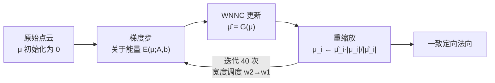

## 一句话总结

本文从缠绕数（winding number）公式中挖掘出一条新性质——缠绕数法向一致性（Winding Number Normal Consistency, WNNC）：用正确法向计算出的缠绕数场，其负梯度应与输入法向同向；据此设计出一个"梯度步 + WNNC 更新 + 重缩放"交替迭代的极简算法，并用 GPU 上的 treecode 加速，实现了对原始点云快速、可扩展且全局一致的法向定向。

## 研究背景

点云是图形学中最常用的 3D 表示之一，而大多数下游任务（尤其是表面重建）都要求点携带全局一致定向的法向。局部法向估计可以用 PCA 等简单技术完成，但让这些法向全局一致定向一直是出了名的难题。

已有方法大致分三类：

- **传播类**：先局部估计无向法向，再从种子点沿邻域（如最小生成树）传播定向。速度快，但对噪声、薄结构、尖锐边缘不鲁棒，且对邻域大小、翻转准则等参数敏感。
- **体积类**：把空间划分为内/外区域，法向即由内指向外。近年一批方法利用缠绕数场的性质：缠绕数场在物体内部为 $$1$$、外部为 $$0$$。代表工作 PGR 利用"输入点上场值应为 $$1/2$$"构造线性系统求解法向；GCNO 用双势阱损失让场几乎处处趋于 $$0$$ 或 $$1$$。它们精度达到 SOTA，但计算代价高昂——PGR 的稠密线性系统规模为 $$N\times N$$（4 万点约需 8 GB 显存），GCNO 求解 1 万点需约一小时。
- **深度学习类**：直接回归法向，鲁棒性好但泛化受训练数据限制。

本文观察到 PGR 与 GCNO 已经用尽了缠绕数公式三行定义（内/边界/外）的一阶信息，于是转而挖掘其**高阶性质**，提出 WNNC 来提供全新且更"定"的约束。

## 方法

### 整体框架

记无向输入点为 $$\mathcal{P}=\{x_j\}_{j=1}^{N_{\mathcal{P}}}$$，目标是求解一致定向的法向 $$\mu_j$$（严格来说是带面积权重的定向面元，但主要关心方向）。缠绕数公式的离散形式为

$$F(y;\mu)=\sum_{j=1}^{N_{\mathcal{P}}}\big((\nabla\Phi)(y-x_j)\big)\cdot\mu_j,\qquad \nabla\Phi(y)=-\frac{y}{4\pi|y|^3}.$$

**WNNC 核心观察**：若 $$\mu_j$$ 是一致朝外的正确法向，则 $$F(y;\mu)$$ 就是该形状的指示函数，其在输入点处的负梯度应与 $$\mu_i$$ 同向：

$$\mu_i=\lambda_i\big(-\nabla F(x_i;\mu)\big)=\lambda_i\,G(\mu)_i,\qquad \lambda_i>0.$$

其中梯度可由 Hessian 核直接解析计算：

$$\nabla F(y;\mu)=\sum_j\big((H\Phi)(y-x_j)\big)\cdot\mu_j.$$

映射 $$\mu\mapsto\hat\mu=G(\mu)$$ 只依赖点位置。WNNC 提示 $$\mu$$ 应是 $$\mu\mapsto G(\mu)$$ 的不动点（相差逐点缩放）。

### 关键设计一：WNNC 更新与 PGR 能量交替

单独用 WNNC 不动点迭代无法收敛，因为：(a) $$\mu=0$$ 是平凡不动点；(b) 一致朝内与一致朝外法向都在 WNNC 更新下不变，无法解决内/外歧义；(c) 缩放因子 $$\lambda_i$$ 经验上在 $$10^4\sim10^{10}$$ 之间，会迅速数值爆炸。

为此引入 PGR 的能量项（能够解决内/外歧义、鼓励朝外定向）：

$$E(\mu;A,b)=\|A(\mu)-b\|^2,\qquad b=(1/2,\cdots,1/2)^T,$$

其中 $$s_i=A(\mu)_i=F(x_i;\mu)$$。算法从 $$\mu=0$$ 出发，每次迭代先对 $$E$$ 做一步梯度下降（因 $$A$$ 是线性算子，$$E$$ 是二次型，步长可解析求得），再做 WNNC 更新，最后把每个 $$\mu_i$$ 重缩放回更新前的长度以保证数值稳定。消融显示：**零初始化 + 梯度步**两者缺一不可，且去掉 WNNC 更新会在凹区域产生显著角度误差。

### 关键设计二：奇异性处理与宽度调度

$$\nabla\Phi$$ 与 $$H\Phi$$ 在 $$x_i\to x_j$$ 时奇异。沿用前人做法，当 $$\|x_i-x_j\|<w$$ 时将核置零，$$w$$ 称平滑宽度。小 $$w$$ 保留细节但抗噪差，大 $$w$$ 过度平滑。本文提出**线性宽度调度**：从大 $$w_2$$ 线性递减到小 $$w_1$$：

$$w=w_2\frac{n-i}{n-1}+w_1\frac{i-1}{n-1},$$

使早期迭代稳定、后期迭代增强细节。默认 $$w_1=0.002,\ w_2=0.016$$，共 40 次迭代。

### 关键设计三：GPU treecode 加速

三个核心算子 $$A$$、$$A^T$$、$$G$$ 的朴素计算复杂度为 $$O(N_{\mathcal{P}}^2)$$。由于核函数随距离快速衰减，远场中一群邻近源点可用一个"代表点"近似（Barnes–Hut treecode 思想）。用八叉树划分空间，每个节点按属性模长加权得到代表点位置

$$x_{B,\nu}=\sum_{x_i\in\mathcal{P}_B}\frac{|\nu_i|}{\sum_{x_j\in\mathcal{P}_B}|\nu_j|}x_i,\qquad \nu_B=\sum_{x_i\in\mathcal{P}_B}\nu_i,$$

远场用代表点、近场用原始点，通过树遍历完成求和，复杂度降为 $$O(N\log N)$$。作者自研 CUDA 核并集成进 PyTorch（$$A^T$$ 恰为 $$A$$ 的反向传播算子，因此支持可微编程）。

## 实验结果

在无噪均匀采样模型上与 Dipole、iPSR、PGR、GCNO 对比（PGR 降采样到 5 万点标记 †，GCNO 降采样到 5 千点标记 ‡）。指标含 Chamfer 距离 CD、网格法向角误差 $$AE_\text{mesh}$$、点云法向角误差 $$AE_\text{pcd}$$、正确定向百分比 $$P_\text{co}$$。

大规模基准（Huang et al. 2022，1387 个模型，每个采样 16 万点）平均结果：

| 方法 | CD (×10⁻⁴) | AEmesh (×10⁻²) | AEpcd (×10⁻²) | P_co (%) |
|------|-----------|----------------|---------------|----------|
| Dipole | 7.7909 | 5.3215 | 5.0029 | 95.2759 |
| iPSR | 1.9306 | 0.9215 | 0.6108 | 99.8208 |
| **Ours** | **1.1274** | **0.8104** | **0.3097** | **99.9328** |
| PGR† | 2.6093 | 1.3621 | 3.1033 | 99.3609 |
| Ours† | 2.5337 | 1.0878 | 0.5418 | 99.8683 |

效率方面（Armadillo 模型，RTX 3090）：处理 $$10^6$$ 点时，本文 GPU 版仅需 86 秒、1.5 GB 显存；相比之下 PGR 估计需 >1 天、>3000 GB 显存，GCNO 需数周。本文方法首迭代即可得到整体正确定向，约 40 次迭代完全收敛，5 万点约 1 秒、50 万点约 30 秒。此外在薄结构、尖锐边缘、高亏格曲面、稀疏点/3D 草图、含噪数据、以及百万级真实扫描（Armadillo/Bunny/Dragon/Lady）上均取得优于或持平基线的结果。

## 亮点与局限

**亮点**

- 从缠绕数公式挖掘出被前人忽略的高阶性质 WNNC，提供了比 PGR 更"定"的法向方向约束，理论新颖且形式极简。
- "梯度步 + WNNC 更新 + 重缩放"的迭代算法出奇地简单，全流程只需反复评估缠绕数公式及其导数。
- treecode 把复杂度从 $$O(N^2)$$ 降到 $$O(N\log N)$$，自研 CUDA 核集成 PyTorch 并支持可微，可扩展到百万级点云，速度、显存全面超越同类缠绕数方法。
- 宽度调度机制同时兼顾全局一致性与细节保留，还能作为用户可调的平滑度旋钮。

**局限**

- 依赖 PGR 能量 $$E$$ 解决内/外歧义，WNNC 单独无法翻转错误定向；收敛严格依赖零初始化。
- 迭代次数固定为 40（高亏格需 300），不采用早停以免停在大 $$w$$ 造成过度平滑；对极稀疏、极薄层几何（如降采样到 5 千点的垃圾桶模型）仍会失败。
- 不使用估计的局部面积，实验表明固定面积会使可行域非线性、反而带来定向误差；求解出的 $$|\mu_i|$$ 并不收敛到真实局部面积（本文也不需要面积收敛）。

## 延伸思考

- WNNC 揭示"缠绕数场负梯度自洽"这一不动点结构，本质上是把定向问题转化为一个近似不动点迭代。这类"用场的自洽性反解生成场的参数"的思路，或可推广到其它隐式场（如 SDF、占据场）的一致性正则中。
- $$A^T$$ 即 $$A$$ 的反向算子、天然可微，意味着该 treecode 求解器可作为可微模块嵌入更大的学习管线，例如把缠绕数评估作为神经网络的一层，用于端到端的重建或生成任务。
- 宽度调度类似于优化中的由粗到细/退火策略，把它与噪声水平、点密度自适应耦合，或能进一步减少手动调参并提升对真实扫描的鲁棒性。
