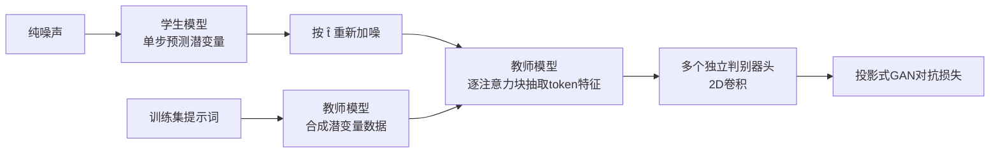

## 一句话总结

提出潜空间对抗扩散蒸馏（LADD），用预训练扩散模型自身的生成式特征替代 ADD 中固定的 DINOv2 判别器，从而摆脱像素解码、支持高分辨率多长宽比训练，并把 80 亿参数的 Stable Diffusion 3 蒸馏成仅需四步采样即可媲美教师质量的 SD3-Turbo。

## 研究背景

扩散模型在图像与视频合成上表现优异，但迭代式采样需要几十次网络前向，推理慢，难以支撑实时应用。为此出现了大量蒸馏方法，目标是把多步采样压缩到单步或少步；其中依赖对抗训练的方法（把输出分布逼向真实图像流形）在一步、少步区间效果最好。

此前的代表是对抗扩散蒸馏（ADD），它用预训练的 DINOv2 特征网络作为判别器骨干，把 SDXL 蒸馏成单步实时文生图模型。但 ADD 存在几个结构性缺陷：

- DINOv2 固定预训练，把判别器训练分辨率限制在 $$518 \times 518$$；
- 无法方便地控制判别器的反馈层级（全局形状 vs 局部纹理）；
- 蒸馏潜扩散模型时必须解码回 RGB 空间（判别器不在潜空间训练），严重阻碍 $$> 512^2$$ 的高分辨率训练。

更根本的是，对抗模型不像语言模型和扩散模型那样严格遵循缩放规律：扩大生成器常收益递减，甚至更小的判别器特征网络反而表现更好，这让规模化开发缺乏可预测性。LADD 正是要提供稳定、可缩放、直达百万像素级的对抗蒸馏方案。

## 方法

LADD 的整体思路是：完全在潜空间内做对抗蒸馏，把"判别器"和"教师模型"统一为同一个预训练扩散模型，并用教师生成的合成数据进行训练。相比 ADD，它省去了昂贵的潜空间到像素空间解码。

关键设计一：以生成式特征统一教师与判别器。学生从噪声生成潜变量后，在从 logit-normal 分布采样的时间步 $$\hat{t}$$ 上重新加噪，再送入教师模型，抽取每个注意力块后的完整 token 序列，并在每条序列上施加独立的判别器头（同时以噪声水平与池化后的 CLIP 嵌入为条件）。这沿用了投影式 GAN 范式，但用的是生成式特征而非判别式特征，带来四点好处：免解码更省显存、可通过噪声水平调控反馈（高噪声偏全局结构、低噪声偏纹理细节）、天然支持多长宽比、以及生成式特征具有更接近人类的形状偏好。

关键设计二：从 1D 卷积改为 2D 卷积判别器。把 token 序列还原回原始空间布局后使用 2D 卷积，避免在多长宽比场景下 1D 判别器对不同长宽比处理不同步长而损害效果。

关键设计三：用合成数据训练、去掉蒸馏损失。分类器无关引导（CFG）在单步场景下只会让样本过饱和而非改善文本对齐，因此改由教师模型在固定 CFG 值下生成合成数据。合成数据的图文对齐度更高（SD3 在 COCO 提示上的 CLIP 分约 0.35，而自然图像约 0.29），实验证明用合成数据训练时仅靠对抗损失即可，无需额外的蒸馏损失。由于免解码，可直接用教师生成潜变量，连真实数据的编码步骤也省去。

关键设计四：多步推理与偏好对齐。训练跨四个离散时间步 $$t \in [1, 0.75, 0.5, 0.25]$$，配合一致性采样器支持 2/4 步推理；高分辨率下先用低噪声预热再转向全噪声。此外用 Diffusion DPO（引入 rank 256 的 LoRA 微调）做人类偏好对齐，DPO 版对非 DPO 版单步取得 56% 胜率。

## 实验结果

在文生图人类偏好研究中，SD3-Turbo 单步即在图像质量和提示对齐上超越所有基线；四步版本进一步逼近教师 SD3——用四步而非五十步即可达到同等图像质量，仅在提示对齐上略有下降，但仍胜过 Midjourney v6 等强基线。方法同样适用于图像编辑与图像修复：蒸馏后的学生单步即可与五十步的教师持平。

图像修复任务在 COCO 上的定量结果：

| 模型 | FID ↓ | LPIPS ↓ |
| --- | --- | --- |
| LaMa | 27.21 | 0.3137 |
| SD1.5-inpainting | 10.29 | 0.3879 |
| SD3-inpainting（教师，50 步） | 8.94 | 0.3465 |
| SD3-inpainting Turbo（1 步） | 9.44 | 0.3416 |

单步蒸馏模型的 FID/LPIPS 与五十步教师非常接近；LaMa 虽在 LPIPS 上最优，但在大面积、非均匀掩码区域的 FID 明显落后。

## 亮点与局限

亮点：用生成式特征替代判别式特征，让对抗蒸馏彻底进入潜空间，训练更简单、显存更省、天然支持高分辨率与多长宽比；通过噪声采样分布可直接调控判别器的全局/局部反馈；系统性研究了缩放行为，发现学生模型规模的影响最大，教师与数据质量收益会饱和，为显存受限下的资源分配提供了策略（优先放大学生、允许较小教师）；相比 LCM 一致性蒸馏，LADD 训练稳定得多，几乎无需超参搜索。

局限：四步保持教师图像质量的代价是提示对齐下降，带来物体重复/融合、细粒度空间提示、否定语义等常见难题；图像编辑中因缺少可调的图像与文本引导强度而失去了可控性。

## 延伸思考

LADD 把"判别器"重新定义为教师扩散模型的中间特征，本质是让教师同时承担数据生成、蒸馏监督与对抗判别三重角色，这种自洽结构值得在视频、3D 等其他生成域复用。噪声水平作为一个可调旋钮来平衡全局结构与局部纹理，是一个通用且优雅的思路，可能启发更细粒度的判别反馈控制。另一方面，速度与提示对齐、可控性之间的权衡尚未被量化，如何在少步模型中恢复引导强度的可调性、并守住复杂语义对齐，是后续值得深入的方向。
