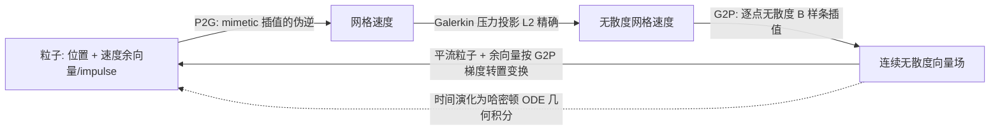

## 一句话总结

本文提出 CO-FLIP（Coadjoint Orbit FLIP）——一种高阶精度、结构保持的混合欧拉-拉格朗日不可压欧拉方程求解器：从欧拉方程的哈密顿表述出发，用局部、显式、任意阶的无散度（mimetic）B 样条插值构造离散哈密顿系统，并配合几何时间积分，使离散流动在数学上"演化于一条 coadjoint orbit（共轭轨道）上"，从而同时精确保持能量与环量（Casimir 不变量），即便在极低网格分辨率下也能生成丰富的分形涡结构。

## 研究背景

在计算流体与图形学的流体动画中，如何在离散化后仍然稳定、准确地保持涡结构（即环量守恒 / circulation conservation）一直是核心难题。涡结构是烟雾特效和湍流视觉的主要视觉元素，但传统数值方法在平流与投影分裂、网格插值中会引入大量人工粘性，导致能量和涡量随时间迅速耗散。

经典 FLIP（Fluid Implicit Particles）用大量粒子的位置与速度表示流体状态，辅以背景网格完成 P2G 传输、压力投影和 G2P 插值。它作为"长时间特征线方法"优于 PIC/APIC（后者会用低分辨率网格速度覆盖粒子速度），但 FLIP 也以不稳定著称，实践中往往要与 PIC/APIC 速度混合来换取稳定性。

本文回到涡量守恒的数学根基：用李代数与哈密顿表述刻画不可压流体，得到一个精确判据——"环量状态始终停留在一条 coadjoint orbit 上"。作者据此设计的离散框架，其自然导出的算法恰好与 FLIP 同构，因此命名为 CO-FLIP。它继承了哈密顿表述的守恒性质，在低分辨率网格上仍能保持能量与环量。

## 方法

### 整体框架

连续理论中，不可压欧拉方程是一个哈密顿系统：相空间是无散度向量场的对偶空间（一个 Poisson 空间），哈密顿量为速度场的动能。CO-FLIP 通过 mimetic 插值取出一个有限维的无散度向量场子空间作为"网格速度"，在原始连续对偶空间上定义离散欧拉方程，从而在离散层面继承能量守恒与环量守恒。

从数值实现看，CO-FLIP 相对经典 FLIP 做了五点关键修改：

连续欧拉方程刻画无散度速度场 $$\vec{v}(t)\in\mathfrak{X}_{\mathrm{div}}(W)$$ 的演化。守恒量方面，2D 中每个 $$k$$ 阶涡量矩

$$\iint (\mathrm{curl}\,\vec{u})^{k}\,dA,\quad k=1,2,3,\dots$$

在欧拉方程下守恒；3D 中螺旋度（helicity）

$$\iiint \vec{u}\cdot(\mathrm{curl}\,\vec{u})\,dV$$

守恒。这些量称为 Casimir 不变量，它们在 coadjoint orbit 上为常数，是环量守恒的定量度量。

### 关键设计一：速度余向量（impulse）+ mimetic G2P 插值

粒子速度存储为速度余向量（velocity covector / impulse）。当粒子沿 G2P 速度场平流时，其速度余向量按 G2P 速度梯度的转置进行变换（Lie 平流）。G2P 插值是 mimetic 的：离散无散度的 MAC 网格速度会插值成"逐点连续无散度"的向量场。作者用一类特定的 B 样条实现了这一插值——它是局部、显式、任意高阶的，且不需要任何全局线性求解（区别于近期需要全局求解的无散度插值方法）。这直接消除了传统 FLIP 中的粒子结团（clumping）现象。

### 关键设计二：伪逆式 P2G，与 G2P 精确互逆

P2G 传输被定义为 mimetic G2P 插值的伪逆（pseudoinverse）：如果粒子速度本就来自某个网格速度的 G2P 插值，则 P2G 能精确重构该网格速度，即

$$\hat{\mathcal I}^{+}\circ\mathcal I = \mathrm{id}$$

在网格速度空间上成立；若粒子速度不在 G2P 值域内，P2G 就把它正交投影到 G2P 的像空间上。因此插值精度直接由 B 样条阶数决定，无需 APIC/PolyPIC 那样在粒子上附加 Taylor 展开模式。作者证明这一精确伪逆可用标准的预条件共轭梯度（PCG）高效求解。

### 关键设计三：Galerkin 压力投影（弱意义下精确）

离散压力投影不再求解简化的中心差分 Poisson 方程，而是采用 Galerkin 形式，尊重由 mimetic 嵌入所诱导的连续 $$L^2$$ 内积结构。这使得压力投影是映射到 B 样条无散度子空间的精确 $$L^2$$ 投影，得到最近点近似：

$$\text{（离散投影结果）} = \arg\min \; \| \mathcal I(P_{\mathfrak B_{\mathrm{div}}}f) - \text{（精确投影）} \|$$

即它给出对精确压力投影的最近点逼近，这一选择对离散能量守恒至关重要。

### 关键设计四：哈密顿几何时间积分 + 能量修正

粒子的时间演化方程是哈密顿 ODE，因而可用结构保持的几何积分器。传统结构保持积分器多为隐式、需昂贵的高维 Newton 求根；本文表明可以从简单显式积分器出发，通过若干不动点迭代"自举"（bootstrap）到隐式格式。作者进一步引入基于能量的修正项（Algorithm 2）：利用在网格数据 $$\mathfrak B$$ 上可得精确 $$L^2$$ 范数的事实，最小限度地修改投影后的网格速度，使动能严格守恒

$$\vert f^{(n+1)}\vert ^{2}_{\mathfrak B}=\vert f^{(n)}\vert ^{2}_{\mathfrak B}\quad \forall n,$$

具体做法是把原始差分投影到中间网格速度 $$\tilde f^{*}$$ 的正交补上。实验中 CFL 数取约 0.5，不动点迭代 4–6 次即收敛（2D 容差 $$10^{-9}$$，3D 容差 $$10^{-7}$$），且由于复用上一次迭代结果作初值，后续迭代耗时指数下降，相比显式二阶方法整体仅增加约 50% 计算量。

## 实验结果

作者用一系列标准涡流基准（涡环 leapfrogging、Trefoil / unknot 环结、扭转环、涡片细化）和视觉演示（Rayleigh-Taylor、烟羽、火山灰云、喷墨、火箭尾迹、Spot 障碍绕流）验证方法，并与 PolyPIC、PolyFLIP、CF+PolyFLIP、R+PolyFLIP、NFM 等方法对比。守恒性方面的定量结果（数据取自论文正文）如下：

| 实验 | 分辨率 | CO-FLIP 表现 | 其他方法最佳表现 |
|------|--------|--------------|------------------|
| 2D 涡环 leapfrogging（能量）| 2D | 能量守恒接近浮点精度 | 随时间显著损失能量 |
| 2D leapfrogging 涡量二阶矩 $$W_2$$ 相对误差 | 2D | 2% | 60% |
| 2D leapfrogging 涡量四阶矩 $$W_4$$ 相对误差 | 2D | 17% | 97% |
| 3D 扭转环螺旋度误差 | 3D | 能量精确守恒，螺旋度误差约 5% | 约 13%（R+PolyFLIP）|
| 3D 涡环 leapfrogging 跳跃次数 | 128 × 64 × 64 | 5 次后才混合 | 2 次（R+PolyFLIP）|
| 3D 涡环 leapfrogging（更低分辨率）| 64 × 32 × 32 | 近 3 次跳跃 | — |

补充观察：

- **3D (1,5)-unknot 与 Trefoil 环结**：CO-FLIP 在 $$64^3$$ 的低分辨率下即能干净地完成涡重联（reconnection）事件并保持涡强度，其他方法在同分辨率下无法实现清晰分离。
- **2D 涡片细化**：无论时空分辨率如何，CO-FLIP 能量保持恒定；分辨率提高时持续产生更丰富、更湍流化的级联涡结构。
- **视觉演示**：火山灰云仅在 $$96\times192\times96$$、烟羽在 $$64\times128\times64$$（甚至 $$32\times64\times32$$）等以往被认为"太粗"的分辨率下，仍能产生密集、有能量的涡细节，效果可比拟传统方法两倍分辨率的结果。
- **代价**：性能瓶颈在 P2G 的伪逆求解；总时间随网格单元数近似线性增长，比传统方法慢。

## 亮点与局限

亮点：

- 首次把"环量守恒 = 状态停留在 coadjoint orbit"这一几何判据，落地为一个与 FLIP 同构、可实操的高阶结构保持求解器，同时精确保持能量与 Casimir 不变量。
- 五项修改（余向量、mimetic 无散度插值、伪逆 P2G、Galerkin 压力投影、哈密顿几何积分）彼此自洽，且整体精度只由插值 B 样条阶数决定，可"按需调阶"。
- mimetic 插值局部显式、无需全局线性求解；伪逆 P2G 可用标准 PCG 精确求解；隐式积分可由显式格式自举——把一批理论上已知但难落地的技巧真正整合进了流体模拟。
- 极低分辨率下仍能保持集中涡丝与分形涡结构，稳定性远优于经典 FLIP。

局限：

- 计算成本较高，主要瓶颈在 P2G 的伪逆求解；虽然随网格单元数线性扩展，但相比传统方法整体更慢。
- 目前面向无粘不可压欧拉方程，对自由表面流的扩展尚未完成（需在自由表面边界处小心处理 Galerkin Hodge star）。
- 向粒子加回压力力时，若采用 divergence-consistent 插值，理论上可能轻微改变 coadjoint orbit（实测影响很小）；curl-consistent 方案更严格但更复杂。

## 延伸思考

- 把连续 Poisson 结构与仅依赖网格分辨率的哈密顿量"解耦"，是低分辨率下仍保真的数学根源——这一思路提示：结构保持离散化的关键或许不在于把整套动力学都离散，而在于精准保留决定守恒律的那部分几何结构。
- CO-FLIP 的模板化推导（给定一个 divergence-consistent 插值即可展开出完整求解器）具有很强的可推广性，作者也提到可换用不同 mimetic 速度表示与辅助辛空间派生新求解器，值得探索面向粘性、多相、磁流体等场景的变体。
- 伪逆 P2G 的高成本与几何多重网格预条件之间的权衡，是把该方法推向交互速率的关键；能否设计更廉价的近似伪逆而不破坏守恒性，是一个务实的后续方向。
