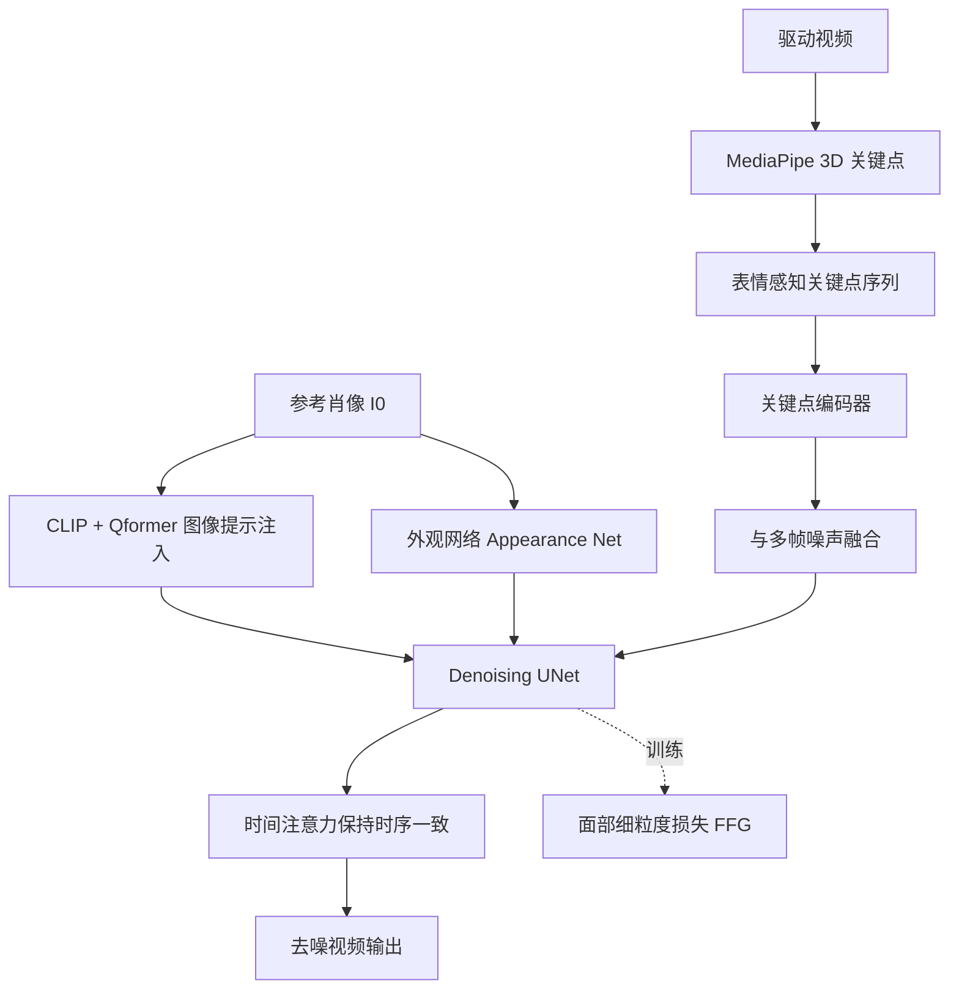

## 一句话总结

Follow-Your-Emoji 用一个「表情感知关键点 + 面部细粒度损失」增强的 Stable Diffusion 框架，把驱动视频的表情与姿态迁移到任意风格的参考肖像（真人、卡通、雕塑乃至动物）上，同时保持身份一致与时间连贯，并借助渐进式策略扩展到长视频生成。

## 研究背景

肖像动画的目标是把驱动视频里的姿态与表情序列迁移到一张参考肖像上，可用于视频会议、虚拟角色、增强现实等场景。既有方法存在两类局限：

- **GAN 类方法**：采用「特征扭曲 + GAN 渲染」的两阶段流程，但受限于 GAN 的生成能力与光流运动表示的不精确，结果常出现失真与明显伪影。
- **扩散类方法**：借助 Stable Diffusion 的强先验，用外观网络、CLIP、时间注意力等即插即用模块建模身份与时序，但在训练域之外的非常规肖像（卡通、雕塑、动物）上容易失真。作者归因于两点：
  1. 运动表示不够鲁棒——2D 关键点在推理时会导致参考肖像面部特征与目标运动错位，进而引发身份泄漏；而直接用运动图像本身作信号又需第三方方法转换身份，破坏原始的细微表情。
  2. 训练仍沿用扩散模型原始损失，缺乏对面部外观与表情变化的针对性约束。

## 方法

整体框架沿用扩散式肖像动画常见的外观网络（Appearance Net）与时间注意力（Temporal Attention），并在此基础上引入三项关键设计：表情感知关键点、面部细粒度损失、渐进式长视频策略。

训练时随机取一帧 $$I_0$$ 作为参考肖像，从输入视频提取表情感知关键点序列 $$\{L_1, L_2, ..., L_N\}$$，用关键点编码器提取特征并与多帧噪声融合；参考图像经 CLIP 图像编码器编码后由 4 层 Qformer 融合成图像 token，通过交叉注意力注入 UNet。

**1. 表情感知关键点（Expression-Aware Landmark）**
用 MediaPipe 提取肖像 3D 关键点后投影为 2D 关键点。投影时**丢弃面部轮廓、只保留面部特征**，避免大幅表情变化时轮廓不准而破坏参考身份；同时计算虹膜在眼窝中的相对位置并在投影后保留，从而捕捉瞳孔运动。由于关键点建立在 3D 之上，推理时可在 MediaPipe 的规范空间里自然地把目标关键点序列对齐到参考肖像（motion alignment），有效避免身份泄漏。

**2. 面部细粒度损失（FFG Loss）**
针对肖像动画需要聚焦表情生成与身份保持，作者在原始损失外增加区域约束。用关键点膨胀得到表情掩码 $$M_e$$，用投影并连接 MediaPipe 面部轮廓关键点得到面部掩码 $$M_f$$，在这两块区域计算真值潜变量 $$z$$ 与预测潜变量 $$\hat{z}$$ 的空间距离：

$$
L_{FFG} = \mathbb{E}\left[\, \lVert M_e \cdot (z - \hat{z}) + M_f \cdot (z - \hat{z}) \rVert^2 \,\right]
$$

总损失为原始潜扩散损失与细粒度损失之和：

$$
L = L_{LDM} + L_{FFG}
$$

**3. 渐进式长视频策略**
既有方法靠拼接重叠片段 + 高斯平滑生成长视频，会降低时间一致性。本文改为「由粗到细」：先生成关键帧，再用关键帧插值出长序列。具体做法是除首末潜帧外覆盖其余输入视频潜帧，将该覆盖序列与 UNet 输入拼接去噪；训练时以 0.5 概率在两种覆盖策略间切换（其中一种以 0.5 概率覆盖每个潜帧），使模型学会先生成关键帧内容再插值。

## 实验结果

作者构建了 EmojiBench 基准（410 张多风格肖像、45 段驱动视频，含动物），在 $$256 \times 256$$ 上与 GAN 类与扩散类方法对比，自重演（Self Reenactment）与跨重演（Cross Reenactment）均取得最优：

| 方法 | L1 ↓ | SSIM ↑ | LPIPS ↓ | FVD ↓ | ID 相似度 ↑ | 图像质量 ↑ |
|------|------|--------|---------|-------|------------|-----------|
| Face Vid2vid | 0.043 | 0.792 | 0.258 | 232.1 | 0.614 | 37.295 |
| DaGAN | 0.057 | 0.711 | 0.301 | 267.4 | 0.271 | 36.901 |
| TPS | 0.037 | 0.823 | 0.211 | 196.3 | 0.481 | 35.172 |
| MCNet | 0.032 | 0.835 | 0.198 | 211.7 | 0.373 | 32.154 |
| FADM | 0.048 | 0.693 | 0.274 | 191.4 | 0.672 | 32.493 |
| MagicDance | 0.046 | 0.749 | 0.174 | 156.2 | 0.679 | 56.804 |
| **Ours** | **0.029** | **0.849** | **0.136** | **96.8** | **0.702** | **66.287** |

消融实验表明：去掉表情掩码或身份掩码、去掉渐进式策略、改用 2D 关键点、保留面部轮廓点、去掉瞳孔点，均会导致自重演与跨重演指标下降，验证了各设计的有效性。

## 亮点与局限

**亮点**
- 表情感知关键点兼顾运动对齐（避免身份泄漏）与夸张表情表达（如瞳孔运动），支持真人、卡通、雕塑、动物等自由风格肖像。
- 面部细粒度损失用表情与面部双掩码，把模型注意力引向表情与外观区域，同时提升身份保持与表情生成。
- 渐进式策略以关键帧插值方式扩展到稳定长视频，缓解拼接平滑带来的时序退化。
- 提出 EmojiBench 填补该领域基准空白。

**局限**
- 运动表示依赖 MediaPipe 关键点检测，其鲁棒性有限（面部轮廓有时贴合不准，作者也因此丢弃轮廓），对检测失败或极端姿态可能受限。
- 训练依赖自建的 18 种夸张表情 + 115 名受试者数据，且需 32 张 A800 训练，成本较高。
- 评测分辨率限制在 $$256 \times 256$$，高分辨率下的表现未充分展示。

## 延伸思考

- 表情感知关键点本质是「规范空间对齐 + 特征子集裁剪」，这种思路能否推广到全身动画或手势迁移，用更精细的关键点子集抑制身份泄漏？
- FFG 损失在潜空间加区域掩码约束，与像素空间的感知损失或注意力监督相比效果如何，是否可组合？
- 后续工作 Follow-Your-Emoji-Faster 已针对扩散框架长视频的效率与稳定性瓶颈改进，说明推理效率是该类方法落地的关键方向。
- 关键点作为显式运动信号可控性强，但相比隐式运动潜码（如 LIA-X 一类）在表达细腻连续运动上的上限如何，值得进一步比较。
