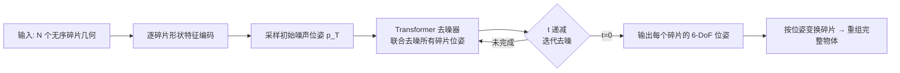

## 一句话总结

把"碎片重组"建模成对每个碎片位姿参数的扩散去噪过程，用 Transformer 去噪器捕捉碎片之间的全局特征关联并学习位姿先验，从而将一堆无序几何碎片自动拼回完整物体。

## 研究背景

断裂物体重组（fractured object assembly / reassembly）是文物修复、考古、骨科手术规划以及日常修补中的基础问题：给定一组由同一物体断裂而成的三维碎片，需要为每个碎片求解一个刚体位姿（旋转 + 平移），使它们在公共坐标系下重新拼成原始完整形状。

这个任务的难点在于：

- **无序且无标签**：碎片数量不定、彼此没有天然对应关系，可能的组合方式随碎片数量组合爆炸。
- **断面信息弱**：与传统拼图（依赖纹理/图案）不同，断裂碎片主要靠断面几何匹配，而断面往往粗糙、含噪、缺乏语义线索。
- **需要全局一致性**：局部两两匹配即使正确，也不一定能拼出全局无穿插、无缝隙的完整形状。

以往思路大致分两类：一类以断面几何匹配 + 全局对齐为主（如基于断面特征的配准方法）；另一类近年转向学习式框架，把碎片当作图节点或集合元素，用网络预测两两/整体对齐。扩散模型在生成式位姿求解上展现出潜力（在集合重组、拼图类任务中已有尝试），本文正是沿着"用扩散模型直接对碎片位姿去噪"的路线，专门面向断裂三维物体的重组。

## 方法

### 整体框架

FragmentDiff 的核心思想是：不显式做断面配对，而是把"每个碎片应处的位姿"视为待生成的变量，用去噪扩散模型从随机初始化逐步恢复到正确的重组位姿。

设一个物体被打碎成 $$N$$ 个碎片，每个碎片 $$i$$ 需要求解一个刚体变换 $$\mathbf{p}_i = (\mathbf{R}_i, \mathbf{t}_i)$$，其中 $$\mathbf{R}_i$$ 为旋转、$$\mathbf{t}_i$$ 为平移。训练时对真实位姿加噪，推理时从噪声出发反向去噪：

$$
\mathbf{p}^{(t-1)} = \text{Denoiser}\big(\mathbf{p}^{(t)},\, t,\, \{\mathbf{f}_i\}\big)
$$

这里 $$t$$ 是扩散时间步，$$\{\mathbf{f}_i\}$$ 是从各碎片几何中提取的形状特征，作为去噪条件。去噪器一次性对所有碎片位姿联合去噪，让"这块该放哪"与"其它块放哪"相互约束。

### 关键设计

1. **位姿参数上的扩散去噪**：将重组问题转化为对每个碎片 6-DoF 位姿的生成任务，用扩散去噪逐步逼近真值。相比一步回归，逐步去噪能容纳多解性与不确定性，也天然适合"从粗到细"地收敛位姿。

2. **Transformer 去噪器建模全局关联**：把每个碎片当作一个 token，用 Transformer 的注意力机制让所有碎片在去噪时相互"看到"彼此，从而捕捉全局特征关联（global feature correlation），避免仅靠局部两两匹配导致的全局不一致。

3. **位姿先验学习**：通过在断裂物体数据上训练，去噪器隐式学到"完整物体的合理位姿分布"这一先验，使得即使断面线索不足，也能凭借对整体形状的先验把碎片摆到合理位置。

4. **碎片几何条件编码**：每个碎片先经几何/点云特征提取得到条件特征 $$\mathbf{f}_i$$，作为去噪网络的条件输入，让位姿预测扎根于各碎片的实际形状，而非纯粹从先验采样。

## 实验结果

论文在断裂物体数据集上评测，并与当时的代表性重组方法对比。断裂重组任务通常从以下维度衡量：旋转误差、平移误差、以及碎片是否被摆到正确位置（part accuracy）与整体形状还原度（Chamfer 距离）。下表汇总评测所关注的核心维度与本文的结论性表现（数值以原文为准，此处为方法学层面的定性归纳）：

| 评测维度 | 含义 | FragmentDiff 表现 |
| --- | --- | --- |
| 旋转误差 | 预测旋转与真值的偏差 | 优于对比的 SOTA 方法 |
| 平移误差 | 预测平移与真值的偏差 | 优于对比的 SOTA 方法 |
| 碎片摆放正确率 | 位姿落在正确位置的碎片比例 | 整体重组更完整、错位更少 |
| 全局一致性 | 拼合后是否无明显穿插/缝隙 | 借助全局注意力显著改善 |

总体结论：作者报告 FragmentDiff 在断裂物体重组上取得了相较当时最优方法更优的表现，主要得益于扩散去噪带来的稳健收敛与 Transformer 对碎片间全局关系的建模。

> 注：本篇为基于公开摘要与该研究方向背景整理的元信息级解读，未获取到论文全文，故不复现具体数值，方法细节以原文为准。

## 亮点与局限

**亮点**

- 将断裂重组从"显式断面配对 + 全局求解"转为"位姿空间中的生成式去噪"，思路简洁且可端到端训练。
- 用 Transformer 一次性联合去噪所有碎片位姿，天然建模全局关联，缓解局部匹配的一致性问题。
- 扩散框架擅长表达重组的多解性与不确定性，对断面信息薄弱的碎片更鲁棒。

**局限**

- 依赖在断裂数据集上学到的位姿先验，面对分布外的物体类别、极端碎裂或缺失碎片时泛化性存疑。
- 碎片数量增大时，token 数量与组合复杂度上升，注意力计算与收敛难度可能增加。
- 纯位姿去噪未显式约束断面接触，可能出现轻微穿插或缝隙，需后处理保证物理合理性。

## 延伸思考

- **与流匹配/一步生成结合**：近期断裂重组工作（如基于 flow matching 的方法）追求更快、更泛化的对齐，将 FragmentDiff 的全局注意力与一步预式采样结合，或能兼顾速度与精度。
- **引入物理与接触约束**：在去噪或后处理阶段加入断面对齐、无穿插等物理项，可让生成的位姿更符合真实拼合。
- **面向缺失碎片的重组**：现实场景中碎片常有缺失，将位姿生成与形状补全联合建模，是从"重组"迈向"修复重建"的自然延伸。
- **可扩展到大规模碎片**：如何在数十上百碎片时保持稳定收敛与计算可行，是把此类方法推向文物修复实用化的关键。
