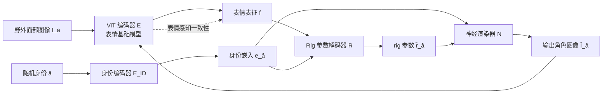

## 一句话总结

FreeAvatar 完全抛弃几何约束，仅依赖一个自学习的"表情基础模型"来驱动 3D 虚拟角色，通过对比学习构建连续、细粒度的表情特征空间，配合可微神经渲染器与动态身份注入模块，在野外图像上实现高保真、多角色的面部动画迁移。

## 研究背景

视频驱动的 3D 面部动画迁移旨在把演员的表情复刻到数字角色上，广泛应用于数字人、CG 游戏、VR/AR 等场景。现有方法通常同时使用面部几何先验（如面部关键点）和表情特征来维持源脸与目标脸之间的情感语义一致性，但在野外数据上往往难以生成高保真表情，原因有二：

- 基于关键点的几何约束难以捕捉细微表情变化，例如轻微皱眉、嘴唇收紧等。
- 表情特征通常在有限类别的离散情感分类任务上训练，而人类情感是连续且多样的，因此这些特征无法刻画细粒度的情感差异。

FreeAvatar 的核心思路是：先学习一个连续、语义可区分的表情表征，使其能从任意面部图像中提取；再设计一个动画迁移模型，把该表征精确解码为目标角色的表情控制参数。

## 方法

整体框架分两大部分：**表情基础模型**（构造细粒度、连续的表情隐空间）和**表情驱动的多角色动画器**（把表情表征解码为角色 rig 参数并施加感知一致性约束）。

### 1. 表情基础模型：MAE 预训练 + 三元组对比学习

分两步构建。第一步做**面部特征空间构建**：把面部图像切成 16×16 的 patch，遮盖 75% 区域，用 ViT 编码器 $$E$$ 编码为隐特征 $$f_E$$、ViT 解码器 $$D$$ 重建原图，用 L2 损失在约 450 万张无标注面部图像（含真人与风格化卡通）上训练，得到强泛化的面部特征提取器。

第二步做**表情特征空间优化**：在表情比较三元组数据集上微调。给定三元组 $$\{I_a, I_p, I_n\}$$（相比 $$I_n$$，$$I_a$$ 与 $$I_p$$ 的表情更相似），用加权三元组损失把 $$f_a$$ 与 $$f_p$$ 拉近、把 $$f_a$$ 与 $$f_n$$ 推远：

$$L_{tri} = w \cdot \mathrm{Max}\left(0, \|f_a - f_p\|_2 - \|f_a - f_n\|_2 + m\right)$$

其中 $$w$$ 为置信度（标注一致比例），$$m$$ 为间隔。三元组数据集共 914K，约 500K 来自 FEC 数据库高一致性样本，约 414K 由无标注真人/卡通图像随机构造并重新标注，并额外补充非对称表情样本以刻画面部不对称性。

### 2. 动态身份注入：单网络联合训练多角色

不同于以往为每个角色训练独立解码器的做法，FreeAvatar 在每次迭代随机选取目标角色 $$\hat{a} \in \{1,...,K\}$$，用嵌入层身份编码器提取身份嵌入 $$e_{\hat{a}} = E_{ID}(\hat{a})$$，动态注入到 rig 解码器与神经渲染器中，从而在一个网络内联合训练多个角色。

### 3. Rig 解码器 + 可微神经渲染器

Rig 参数解码器 $$R$$ 由 MLP 构成，把表情表征 $$f$$ 与身份嵌入拼接后解码为角色 rig 参数：

$$\hat{r}_{\hat{a}} = R(f, e_{\hat{a}})$$

为让训练可微并捕捉高频细节，采用 DCGAN 生成器结构的神经渲染器 $$N$$ 模拟 3D 渲染引擎，把 rig 参数翻译为角色图像：

$$\hat{I}_{\hat{a}} = N(\hat{r}_{\hat{a}}, e_{\hat{a}})$$

### 4. 半监督训练目标

训练数据含"带 rig 参数的角色图像"和"无标注野外图像"两部分，故采用半监督训练。感知损失约束输入与输出表情一致：

$$L_{expr} = \|f - E(\hat{I}_{\hat{a}})\|_2$$

同时引入对抗损失 $$L_{GAN}$$、循环一致性损失 $$L_{cycle} = \|\hat{r}_{\hat{a}} - R(E(\hat{I}_{\hat{a}}), \hat{a})\|_2$$ 以缩小域间隙。关键的**身份条件损失**仅在输入身份与目标身份相同时施加监督：

$$L_{IDC} = \begin{cases} \|I_a - \hat{I}_{\hat{a}}\|_2 + \|r_a - \hat{r}_{\hat{a}}\|_2, & \text{if } a = \hat{a} \\ 0, & \text{otherwise} \end{cases}$$

总损失为：

$$L = \lambda_1 L_{expr} + \lambda_2 L_{GAN} + \lambda_3 L_{cycle} + \lambda_4 L_{IDC}$$

其中 $$\lambda_1 = 100$$，$$\lambda_2 = \lambda_3 = 1e{-3}$$，$$\lambda_4 = 1$$。

## 实验结果

作者在四个不同角色（每角色 10 万对 rig-图像）上训练，并与商业系统 Faceware、MetaHuman Animator 及多种单目人脸重建方法对比。核心定量证据来自用户研究（39 名参与者、21451 个问题）与表情比较任务的消融：

| 评估维度 | 对比设置 | 结果 |
| --- | --- | --- |
| 用户研究（高置信 ≥0.99，表情一致性偏好） | Ours vs Faceware | 84% vs 5% |
| 用户研究（高置信 ≥0.99，表情一致性偏好） | Ours vs MetaHuman Animator | 77% vs 21% |
| 多角色 vs 单角色解码器偏好 | 联合训练 vs 独立训练 | 51.6% vs 48.4% |
| 表情比较任务准确率（三元组优化消融） | 有三元组优化 vs 无 | 87.73% vs 34.06% |

消融进一步表明：去掉表情模型（随机初始化 ViT）无法从野外图像捕捉情感；去掉 MAE 预训练会显著削弱对风格化卡通角色的泛化；去掉半监督学习则对野外测试数据泛化很差。与 EmoNet（EMOCA 所用情感识别模型）替换对比，本文表情基础模型在表情细节保真度上明显更高。

## 亮点与局限

亮点：
- 首个仅依赖表情表征、完全不引入几何约束即可完成 3D 面部动画迁移的方法，在野外与风格化角色上鲁棒性突出。
- "MAE 自重建 + 三元组对比学习"构建的表情基础模型具备连续、细粒度、跨域（真人到卡通）的表达能力，弥补了离散情感分类的粒度不足。
- 动态身份注入 + 身份条件半监督损失让单个网络可同时驱动多角色，在移动游戏等资源受限场景很实用。
- 当人脸重建方法因检测不到关键点而失败时（如卡通角色），本方法仍能稳定迁移表情。

局限：
- 训练不含时序信息，需依赖后处理缓解人脸抖动。
- 在光照、遮挡、侧脸剧烈变化的极端情况（如完全遮挡眼部）下只能近似估计。
- 每引入新角色时，rig 解码器和神经渲染器都需重新训练。

## 延伸思考

FreeAvatar 展示了"表情基础模型"这一范式的价值：把表情表征当作可迁移的通用底座，而非绑定到具体分类任务或几何模板。这与视觉领域基础模型的思路一致——先用海量无标注数据自监督预训练，再以对比学习注入任务语义。若能把时序建模（如时间三元组或序列级对比）纳入基础模型训练，或用类似 LoRA 的轻量适配替代整套解码器重训，可能进一步降低新角色接入成本。此外，仅靠感知一致性而无几何约束能取得高保真，也提示我们：在表征足够强的前提下，显式几何先验未必是必需品，这对更广义的运动/姿态迁移任务有借鉴意义。
