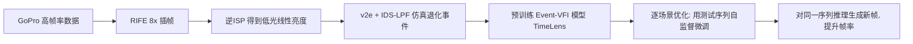

## 一句话总结

针对低光条件下事件相机存在的拖尾伪影与信号延迟，提出一种**逐场景优化（per-scene optimization）**策略：直接用测试序列自身的统计信息在推理前微调预训练插帧模型，使其适应当前光照与相机设置，从而在无需昂贵真实数据采集的情况下，实现可泛化的低光事件驱动视频插帧。

## 研究背景

视频帧插值（VFI）广泛用于视频增强、帧率提升和慢动作生成。事件相机能以微秒级时间分辨率异步记录逐像素亮度变化，配合传统 RGB 相机可显著提升对高速、非线性运动的插帧能力（Event-VFI）。

但在低光条件下，事件信号会出现明显的**拖尾伪影（trailing artifacts）**和延迟，导致现有 Event-VFI 方法（如 TimeLens、CBMNet）出现重影和边缘变形，难以直接应用与泛化。

现有两条应对思路都有局限：

- **改进事件仿真**：用 v2e、ESIM 等仿真器建模泄漏噪声、不应期、散粒噪声等退化因素，但仿真数据与真实数据之间仍存在显著差距。
- **采集真实数据集**：能弥合仿真-真实差距，但采集成本高，且针对特定相机固定设置的数据集无法泛化到其他相机或其他参数设置（如 ON/OFF 阈值）。

由此提出核心问题：如何低成本地让 Event-VFI 方法泛化到具有不同相机设置的真实低光场景？关键洞察是：拖尾与退化主要由光照、相机硬件、拍摄设置决定，而这些因素在单个视频内部相对恒定，因此可以针对每个场景做自适应。

## 方法

整体框架分为三个阶段：**基于仿真数据的预训练 → 逐场景优化 → 推理**。

### 低光事件建模

标准事件相机在相对亮度变化超过对比阈值 $$c$$ 时触发事件。但低光下需引入延迟因子。光电二极管的截止频率与光电流成正比：

$$f_c = \frac{1}{2\pi C}\frac{I_{ph}}{U_t}$$

由此把用于事件生成的测量强度建模为一阶低通滤波：

$$I'_t = \alpha I_t + (1-\alpha) I_{t-\Delta t}, \quad \alpha = 1 - e^{-\Delta t/\tau},\ \tau = 1/(2\pi f_c)$$

亮度降低时 $$f_c$$ 随之下降，$$\alpha$$ 变小，当前强度更多受历史值影响（等效 RC 低通滤波），从而产生时间延迟和空间拖尾。相应地，低光 Event-VFI 的合成关系为：

$$I_{t+\Delta t} \approx \frac{1}{\alpha}\left(I_t\cdot \exp\left(\int_t^{t+\Delta t} c\cdot E_\tau\, d\tau\right) - (1-\alpha)I_t\right)$$

### 关键设计一：逐场景优化

不再仅依赖两帧连续噪声 RGB 与事件预测中间帧，而是利用**整段测试序列**微调预训练模型。直接从测试序列构造训练对：用时刻 $$t$$ 的去噪 RGB 图像 $$D(I_t)$$ 作为监督目标，用相邻时刻的两帧 $$I_{t-n}, I_{t+n}$$ 及其间事件信号插值重建：

$$\hat{I}_t = \Phi(D(I_{t-n}), D(I_{t+n}), E_{t-n,t}, E_{t,t+n})$$

其中时间间隔 $$n$$ 从 1 到 7 随机采样（概率 [0.632, 0.232, 0.086, 0.032, 0.012, 0.004, 0.002]）以丰富训练数据。微调后在同一序列上推理生成新帧 $$\hat{I}_{t+\Delta t}$$。骨干网络 $$\Phi$$ 采用 TimeLens，去噪器 $$D$$ 采用 Restormer。

### 关键设计二：优化损失

重建损失采用 Charbonnier 惩罚并加入 Sobel 边缘项：

$$L_r = \sqrt{\lVert \hat{I}_t - D(I_t)\rVert^2 + \epsilon^2} + \lambda\sqrt{\lVert S(\hat{I}_t) - S(D(I_t))\rVert^2 + \epsilon^2}$$

其中 $$\lambda = 0.1$$，$$\epsilon = 0.001$$。另加感知损失：

$$L_p = \beta\sqrt{\lVert \mathrm{VGG}(\hat{I}_t) - \mathrm{VGG}(D(I_t))\rVert^2 + \epsilon^2}$$

其中 $$\beta = 0.1$$。

### 关键设计三：低光事件仿真管线（IDS-LPF）

为得到更鲁棒的预训练模型，改进仿真流程：以 GoPro 数据经 RIFE 做 8× 插帧得到高帧率视频，通过逆 ISP（逆色调映射、逆伽马、逆颜色校正、逆白平衡）转到线性亮度域，再用校准过参数的 v2e 生成事件。为建模拖尾，提出**强度相关随机低通滤波（IDS-LPF）**：

$$I'_t = R(\alpha, r) I_t + (1 - R(\alpha, r)) I_{t-\Delta t}$$

其中 $$R(\alpha, r) = \alpha\cdot \mathbb{I}(r > P) + 1\cdot \mathbb{I}(r \le P)$$，$$r$$ 为 0 到 1 之间随机数，$$P = 0.5$$。通过随机重置部分事件像素来模拟稀疏、非对称的低光拖尾模式。

### 数据集 EVFI-LL

采用分光棱镜对齐 Prophesee EVK4-HD 事件相机（1280×720）与 MER2-301-125U3C RGB 相机（2048×1536），几何标定与触发同步。在 35 Lux 以下低光环境采集，含 10 个非线性运动场景，并首次以不同 ON/OFF 阈值（-20 / 0 / 20 三档）采集，用于评估跨阈值泛化能力；另设更大运动的挑战子集 EVFI-LL-C。

## 实验结果

在 EVFI-LL 上跨不同偏置阈值与插帧倍率评测（PSNR/SSIM/LPIPS）。下表节选 bias=0 设置下的结果：

| 方法 | 4× PSNR↑ | 4× SSIM↑ | 4× LPIPS↓ | 8× PSNR↑ | 8× SSIM↑ | 8× LPIPS↓ |
|------|----------|----------|-----------|----------|----------|-----------|
| SuperSloMo | 31.105 | 0.8857 | 0.1264 | 28.724 | 0.8626 | 0.1632 |
| RIFE | 32.242 | 0.8901 | 0.1301 | 29.462 | 0.8687 | 0.1706 |
| TimeLens | 30.729 | 0.8647 | 0.1584 | 29.891 | 0.8542 | 0.1728 |
| CBMNet | 30.323 | 0.8662 | 0.1878 | 29.320 | 0.8552 | 0.2100 |
| Our Pretrained | 31.218 | 0.8836 | 0.1380 | 30.338 | 0.8730 | 0.1505 |
| **Our Per Scene Opt.** | **32.762** | **0.8972** | **0.1172** | **32.135** | **0.8879** | **0.1215** |

主要发现：

- 在小倍率（4×）下，事件方法（TimeLens、CBMNet）反而弱于纯 RGB 方法，因低光事件退化与仿真-真实域差距损害了其性能；在更难的 8× 下事件方法凭借额外运动信息重新占优。
- 逐场景优化在所有插帧倍率与偏置设置下均领先，在整个 EVFI-LL 上比次优方法约提升近 2 dB。
- 消融（8×）：仿真管线让 Our Pretrained 比原始 TimeLens 提升约 0.5~1 dB；逐场景优化在 TimeLens 上从 30.343 提升到 31.808 dB。策略迁移到 CBMNet 骨干也带来约 1.8 dB 提升，说明具备跨骨干泛化性。
- 运行开销可控：736×576、8× 插帧下，TimeLens 推理约 0.16 秒，逐场景优化约 0.22 秒，与推理同数量级（远小于从头训练所需的约三天）。

## 亮点与局限

**亮点**

- 用逐场景优化把"难以在训练阶段建模的退化"转化为"推理前的自适应微调"，从测试序列自身构造监督对，无需额外真实标注数据即可泛化到不同相机与设置。
- 从事件相机电路原理出发推导拖尾成因，并提出 IDS-LPF 仿真管线，使仿真事件更贴近真实低光拖尾。
- 构建首个面向低光、且覆盖多档 ON/OFF 阈值的 RGB-Event 插帧基准 EVFI-LL。
- 优化耗时与推理同量级，且策略可迁移到其他 Event-VFI 骨干。

**局限**

- 当前优化未考虑运动模糊的影响，现有数据集靠短曝光降低模糊，限制了更广泛场景的适用性。
- 数据集仅使用单一型号事件相机采集，跨设备泛化性有待进一步验证。

## 延伸思考

- 逐场景优化本质上是"测试时训练（test-time training）"在事件插帧上的实例化，利用了单视频内退化统计恒定的先验。这一思路是否可推广到事件驱动的去模糊、超分、HDR 重建等同样受传感器退化困扰的任务？
- 该方法把去噪（Restormer）与插帧（TimeLens）解耦，去噪后的 RGB 作为"伪真值"监督。若把去噪与插帧联合端到端优化，或引入更强的无参考质量约束，是否能进一步减少去噪算法对评测与训练的偏置？
- 拖尾建模依赖 $$\alpha$$ 这一由光照/硬件决定的隐变量，逐场景优化隐式吸收了它。若能显式估计每个场景的 $$\alpha$$/截止频率，或许能在极端光照变化的序列内部实现更细粒度的自适应。
