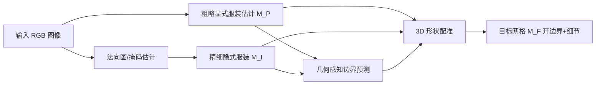

## 一句话总结

通过构建一个带"细节层级(LOD)"的高质量 3D 服装数据集，并配套一个由粗到细的分层重建框架，从单张自然场景图像中鲁棒地重建出拓扑正确、贴合输入、带细粒度褶皱的独立 3D 服装网格。

## 研究背景

高质量的独立 3D 服装模型是影视特效、物理仿真、VR/AR 等应用的核心资产。相比整件"着装人体"模型，独立可分离的服装件更受欢迎——它允许与内层人体网格做分层组合，从而保证物理运动的真实性和服装迁移的灵活性。但从单张图像重建高保真独立服装始终困难：

- 服装风格高度多样、单张输入信息稀缺，问题本身高度病态(ill-posed)；
- 布料动力学带来的复杂形变让推断更加困难；
- 独立服装建模对拓扑正确性要求严格，通常只能靠形变带开边界的参数化模板来做，无法像着装人体那样直接套用隐式表示。

现有方法主要有两条路线，各有短板：

- 线性混合蒙皮(LBS)类方法(如 BCNet、ClothWild)聚焦预测人体姿态引起的形变，但难以刻画环境/物理动力学导致的复杂形变和褶皱等细节；
- 特征线(feature-line)类方法(如 ReEF)从 SMPL 表面重建并拟合服装的流形边界，形变建模更灵活，但单图边界估计本身因严重遮挡和 2D-3D 歧义而困难。

此外，学习类方法还受制于 3D 数据集的数量和质量：现有数据集缺乏局部几何细节，ReEF 仅标注了 400 个模型的特征线，规模不足导致泛化差。本文因此同时从"数据"和"算法"两端发力。

## 方法

整体思路是把这个高度欠约束的问题**按几何粒度解耦**，用一个带 LOD 的数据集支撑一个由粗到细的三步推断，每一步的解空间都被显著缩小。

### 数据集：GarVerseLOD

数据集有四个特点:广泛多样性(5 类常见服装:连衣裙、半身裙、外套、上衣、裤子)、细节层级(LOD)、拓扑一致性(同类共享统一模板拓扑)、以及大量配对图像。由艺术家手工制作 6000 件带细粒度几何细节的高质量服装，并拆分为三个基础数据库:

- **Garment Style Database**:T 姿态、无细节的粗略服装，刻画整体形状;
- **Local Detail Database**:成对的 T 姿态模型 $$(L_C, L_F)$$，分别为无细节与带细节版本，刻画局部几何细节;
- **Garment Deformation Database**:成对的 T 姿态服装 $$D_T$$ 与带全局形变的服装 $$D_F$$，刻画服装形变。

由于同类拓扑一致，可从配对模型中抽取局部细节与全局形变并逐层叠加，合成 **Fine Garment Dataset**:

$$M_L = M_C + L_F - L_C$$

$$M_D = LBS(M_L + T)$$

$$T = LBS^{-1}(D_F) - D_T$$

即先把局部细节偏移加到采样的粗形状 $$M_C$$ 上得到 $$M_L$$，再用 SMPL 的逆 LBS 把 $$D_F$$ 的形变转到静止姿态空间得到偏移 $$T$$，叠加后再正向 LBS 得到同时具备细节与复杂形变的精细服装 $$M_D$$。

为了让模型泛化到自然图像，作者用 ControlNet 与 T2I-Adapter 作为"数据模拟器"，把单调的渲染图经 Canny 条件的 Stable Diffusion 转成外观多样的照片级图像，并通过 canny 边缘的 $$L_1$$ 损失和人工筛选保证图像与 3D 服装一致，还手工标注像素级对齐掩码以支持细节推断。

### 重建流程

### 关键设计 1:由粗到细的显式粗略服装估计

用 PCA 为每一类构建 T 姿态粗略服装的参数化模型(Garment Shape Blend Shapes):

$$G(\alpha) = T_g + B_g(\alpha)$$

其中 $$\alpha \in \mathbb{R}^{32}$$ 为 PCA 系数。给定图像先用轻量分类器判定服装类别、选对应统计模型，再用 CNN 编码器回归 $$\alpha$$。随后把 SMPL 的形状/姿态 blend shape 与 LBS 迁移到服装上，得到带姿态形变的粗略服装:

$$T_G(\alpha, \beta, \theta) = G(\alpha) + \tilde{B}_s(G(\alpha), \beta) + \tilde{B}_p(G(\alpha), \theta)$$

$$M_P(\alpha, \beta, \theta) = W\left(T_G(\alpha, \beta, \theta), J(\beta), \theta, \tilde{W}\right)$$

服装的蒙皮权重 $$\tilde{W} = w(G(\alpha)) W$$ 通过对每个服装顶点 KNN 搜索最近的人体顶点从 SMPL 扩展而来。

### 关键设计 2:精细隐式服装重建

对输入图像估计掩码与法向图，用 Hourglass 滤波器提取图像特征，对任意 3D 点 $$p$$ 投影取像素对齐特征 $$I_F(p) = F(\pi(p))$$，用 MLP 隐式函数解码占据(occupancy):

$$f(F(\pi(p)), z(p)) = s : s \in (0, 1)$$

以 $$L_1$$ 损失监督占据值，得到带细节的闭合边界隐式服装 $$M_I$$。

### 关键设计 3:几何感知的边界预测

服装边界是难以被隐式函数捕捉的细 3D 曲线。仅靠 2D 像素对齐特征存在深度歧义。作者用圆柱结构表示边界，并把 2D 图像特征与从精细服装 $$M_I$$ 得到的 3D 几何特征融合:点云投影到三平面(triplane)经 3D-aware UNet 编码，查询点在三平面上双线性插值得到 $$G_F(p) = (F_{xy}, F_{xz}, F_{yz})$$，再由 MLP 解码边界占据:

$$f_i(F(\pi(p)), F_{xy}, F_{xz}, F_{yz}) = o_i : o_i \in (0, 1)$$

### 关键设计 4:3D 形状配准

最后把粗略服装边界带拟合到预测的边界圆柱，再用非刚性 ICP 把粗略模板配准到精细服装，从而把细节迁移到拓扑正确、开边界的目标网格 $$M_F$$。边界拟合与配准的目标函数为:

$$L_{boundary} = \lambda_c L_c + \lambda_{lap} L_{lap} + \lambda_{edge} L_{edge} + \lambda_{normal} L_{normal}$$

$$L_{nicp} = \lambda_d L_d + \lambda_b L_b + \lambda_s L_s + \lambda_{reg} L_{reg}$$

其中 $$L_c$$ 为 Chamfer 损失，$$L_{lap}$$、$$L_{edge}$$、$$L_{normal}$$ 分别为拉普拉斯平滑、边长与法向一致性正则，$$L_s$$ 为刚度项约束相邻顶点变换矩阵的差异。

## 实验结果

在合成数据集上按 8:2 划分训练/测试，用 Chamfer Distance、Normal Consistency、IoU 评估;自然图像上做定性对比。与主流单视图服装重建方法的定量对比如下:

| 方法 | Chamfer Distance ↓ | Normal Consistency ↑ |
| --- | --- | --- |
| BCNet | 18.742 | 0.781 |
| ClothWild | 16.136 | 0.812 |
| Deep Fashion3D | 17.159 | 0.793 |
| ReEF | 11.357 | 0.838 |
| 本文 | **7.825** | **0.913** |

本文方法在两项指标上均显著领先。在边界预测的对比中，本文相对 ReEF 也全面更优(Chamfer 10.571 vs 16.428、Normal Consistency 0.862 vs 0.809、IoU 69.775 vs 55.425)。消融实验进一步验证:使用 GarVerseLOD 数据(而非 ReEF 数据)、用参数化模型做粗略估计(而非从 SMPL 裁剪)、以及采用占据场+配准(而非 UDF)都能带来指标提升——完整版 Chamfer 7.825、Normal Consistency 0.913 为最佳。

## 亮点与局限

亮点:

- 首个带三级解耦细节层级(LOD)的大规模手工 3D 服装数据集(6000 件、5 类)，同类拓扑一致，便于构建参数化模型与跨实例插值;
- 用条件扩散模型把渲染图转照片级图像的数据模拟流程，显著提升对自然图像的泛化;
- 把 LBS 与特征线两条路线的优点结合，用由粗到细的分层推断把病态问题拆成搜索空间更小的子任务;
- 几何感知边界预测融合 2D 与 3D 三平面特征，缓解了单靠 2D 特征的深度歧义。

局限:

- 依赖单层占据场与单层参数化模型，无法表示连衣裙/半身裙的多层结构;
- 对带开衩(slits)的裙装重建困难，主要因训练数据中此类样本不足。

## 延伸思考

- 该工作的核心启示是"用数据的解耦结构降低学习难度":把形状、局部细节、全局形变拆成可独立采样、可组合的层级，本质上是用数据设计去缩小每个子网络的解空间。这一范式或可迁移到头发、鞋子等其他难以单视图重建的可形变资产。
- 用扩散模型反向把干净渲染"污染"成真实照片来制造配对监督，是一种规避真实标注稀缺的实用思路;但其上限受限于人工筛选与对齐掩码的成本，如何自动化质量控制值得进一步探索。
- 多层结构与开衩的失败案例指向一个更根本的表示问题:占据/隐式场天然偏向单层闭合曲面。要真正支持多层、带缝隙的服装，可能需要引入基于缝纫图样(sewing pattern)或参数化面片的显式表示与之结合。
