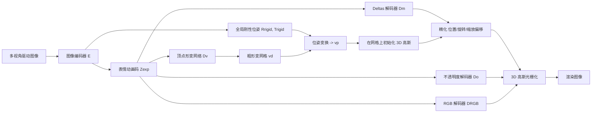

## 一句话总结

GaussianHeads 提出一个端到端、由粗到细的可驱动高斯头像框架：先用图像编码器估计头部刚性位姿与表情动画码，驱动模板网格做粗形变并初始化 3D 高斯，再由细化步精调高斯位置与外观，从而在实时（75 FPS）下高保真渲染毛发、口腔内部等强形变区域。

## 研究背景

真实感人头建模与实时渲染是虚拟临场、游戏、影视等应用的核心需求。现有方法通常陷入两难：基于显式网格的表示（如 Lombardi 等、MVP）能实时渲染，但难以刻画头发、胡须、口腔内部等精细结构；而追求高保真的方法（如 HQ3DAvatar 等隐式/NeRF 类方法）渲染速度慢，且在强形变区域容易模糊。

具体来说：网格模板受限于拓扑固定与分辨率，难表达细节；MVP 用弱附着于网格的立方体体元建模动态场景，但立方体元表达精细结构能力有限；HQ3DAvatar 用隐式规范空间可交互速度渲染高清图像，却在大形变区域产生模糊。此外，很多方法依赖显式的全局刚性位姿跟踪，容易引入抖动。

本文目标是在实时速率下，从多视角图像出发生成高动态、可形变、可由视频驱动的人头像，兼顾精细细节与大幅度运动（如伸舌、口腔与牙齿在大幅头动下的结构）。

## 方法

### 整体框架

方法以 3D Gaussian Splatting 为底层表示，采用"由粗到细"的层级化头模型，端到端联合学习头部位姿、几何与外观。核心流程：多视角驱动图像输入图像编码器，分离出局部表情动画码与全局刚性位姿；动画码驱动模板网格做逐顶点形变（粗），再用全局位姿变换到世界空间；在此网格上初始化 3D 高斯，由细化步精修其位置/旋转/缩放；另有解码器在模板 UV 空间预测每个高斯的不透明度与 RGB；最终经高斯光栅化得到渲染图。测试时只需一次前馈。

### 关键设计 1：图像编码与位姿分离

编码器 $$E_{\gamma}$$ 以 $$I_d=3$$ 张多视角 RGB 图为输入，分支式地分别输出局部表情动画码 $$Z_{exp}\in\mathbb{R}^{256}$$ 与全局变换参数（旋转 $$R_{rigid}\in SO(3)$$、平移 $$T_{rigid}\in\mathbb{R}^3$$，旋转输出归一化为单位四元数）。将全局刚性位姿设为可学习参数，使方法在测试时无需外部显式位姿跟踪，仅凭驱动图像即可工作，从而对跟踪抖动更鲁棒。

### 关键设计 2：由粗到细的几何形变

粗步：以动画码为输入，用轻量 MLP 网络 $$D_v$$ 在中性模板网格顶点 $$v_t$$ 上预测逐顶点偏移 $$\delta_v$$，得到形变网格顶点

$$v_d = v_t + \delta_v$$

该网格与 FLAME 拓扑一致，共 5023 个顶点。随后用全局位姿刚性变换到世界空间：

$$v_p = R_{rigid}(v_d) + T_{rigid}$$

高斯初始化：在模板 UV 空间以 $$512\times512$$ 分辨率均匀采样 $$N_G=N_g^2$$ 个高斯，位置 $$p_{in}$$ 由形变网格上的重心插值得到，首帧缩放 $$s_{in}$$ 按距离变换初始化，初始旋转 $$r_{in}$$ 置零，并用二值掩码滤除不在模板 UV 参数化内的采样点。

细步：用 2D CNN 解码器 $$D_m$$ 将动画码解为偏移 $$(\delta_p,\delta_r,\delta_s)$$，输出网格尺寸为 $$N_G\times N_G\times 10$$，得到最终高斯属性

$$p = p_{in} + \delta_p,\quad r = r_{in} + \delta_r,\quad s = s_{in} + \delta_s$$

位置偏移 $$\delta_p$$ 允许高斯移动到模板未覆盖的区域（如毛发、口腔内部），刻画精细结构。

### 关键设计 3：UV 空间的高效外观解码

不透明度与颜色均在模板 UV 空间用 2D CNN 解码，便于高效卷积。不透明度解码器 $$D_o$$ 将动画码解为 $$N_G\times N_G\times 1$$ 的不透明度图；RGB 解码器 $$D_{RGB}$$ 结合动画码与物体中心视线方向 $$v$$，解出 $$N_G\times N_G\times 3$$ 的颜色图以表达视依赖外观。图像形成沿用 3DGS：高斯 $$g(x)=e^{-\frac{1}{2}(x-p)^T\Sigma^{-1}(x-p)}$$，协方差 $$\Sigma=RSS^TR^T$$，投影 $$\Sigma'=JW\Sigma W^TJ^T$$，再做点式合成得到像素颜色。

### 关键设计 4：端到端多损失联合监督

总目标函数为

$$\mathcal{L} = \lambda_1\mathcal{L}_1 + \lambda_2\mathcal{L}_{SSIM} + \lambda_3\mathcal{L}_{geo} + \lambda_4\mathcal{L}_{perc} + \lambda_5\mathcal{L}_{temp} + \lambda_6\mathcal{L}_{lmk} + \lambda_7\mathcal{L}_{reg}$$

其中几何项将形变顶点约束到跟踪顶点 $$v_s$$：

$$\mathcal{L}_{geo}(v_d, v_s) = \frac{1}{N_v}\sum_{i=1}^{N_v}(v_d[i]-v_s[i])^2$$

作为软先验保持面部结构，同时允许顶点向口腔等强形变区域自由移动。地标对齐项以少量刚性地标（$$N_L=4$$，每眼 2 个）弱监督全局位姿：

$$\mathcal{L}_{lmk} = \frac{1}{N_L}\sum_{i=1}^{N_L}\lVert M_{p,i} - M_{r,i}\rVert$$

时序平滑项约束相邻帧高斯偏移的连续性：

$$\mathcal{L}_{temp} = \frac{1}{N_G}\sum_{i=1}^{N_G}\left(\lVert\delta_p^{(t+1)}-\delta_p^{(t)}\rVert + \lVert\delta_s^{(t+1)}-\delta_s^{(t)}\rVert + \lVert\delta_r^{(t+1)}-\delta_r^{(t)}\rVert\right)$$

正则项 $$\mathcal{L}_{reg}$$ 对缩放、位置偏移、旋转偏移施加 L1 惩罚以稳定训练。权重取 $$\lambda_1=0.8,\lambda_2=0.2,\lambda_3=0.1,\lambda_4=0.01,\lambda_5=0.1,\lambda_6=0.8,\lambda_7=0.1$$。训练在单张 NVIDIA A40 上迭代 300k 次，约 24 小时。

## 实验结果

数据来自 24 相机稀疏环绕的多视角人脸捕捉（默认 23 相机训练、留 1 相机评测，分辨率 $$960\times540$$），在 4 位受试者上评测（含 1 位来自 NeRSemble 数据集），并留出 300 帧做定量/定性评估。与 HQ3DAvatar、GaussianAvatars、MVP 比较，指标包括 PSNR、L1、SSIM、LPIPS（4 位受试者留出帧平均）：

| 指标 | HQ3DAvatar | GaussianAvatars | MVP | Ours |
|------|-----------|-----------------|-----|------|
| PSNR ↑ | 30.78 | 32.22 | 32.50 | **32.89** |
| L1 ↓ | 13.68 | 8.90 | 9.03 | **7.33** |
| SSIM ↑ | 0.77 | 0.79 | 0.78 | **0.81** |
| LPIPS ↓ | 0.14 | 0.15 | 0.15 | **0.11** |

本方法在全部图像质量指标上均优于对比方法，在口腔内部、发丝、牙齿、胡须等细节上更清晰锐利。消融实验进一步验证：去掉粗形变难以还原口腔结构；去掉细形变缺失牙齿等精细细节；去掉地标对齐损失导致口腔表情错位；去掉感知损失整体模糊；去掉时序损失在大幅运动结构（如牙齿）上细节退化。驱动视角数消融显示 3 视角优于 1/2 视角（PSNR 由 30.94/31.78 提升至 33.11）。推理速度可达 75 FPS。

## 亮点与局限

亮点：
- 由粗到细的层级化表示（可形变模板网格 + 3D 高斯）显式解耦大尺度形变与精细细节，显著改善强形变区域（口腔内部、伸舌、牙齿）的真实感。
- 将全局刚性位姿作为可学习参数并由图像端到端估计，测试时无需外部显式位姿跟踪，对抖动更鲁棒。
- 高斯属性、不透明度、颜色均在模板 UV 空间以 2D CNN 高效解码，配合光栅化实现 24 小时训练与 75 FPS 实时推理。

局限：
- 图像编码器以整张面部为输入，无法独立驱动局部区域（如脸颊），且对眼部细微运动处理不佳，会产生鬼影伪影（失败案例）。
- 采样方式仍偏低效，采用稠密均匀采样而非学习稀疏高斯的初始布点。
- 训练依赖多视角相机装置，且对光照变化的鲁棒性与光照/材质解耦尚未处理。

## 延伸思考

- "可学习全局位姿"的思路值得推广：将传统作为外部输入的跟踪量纳入端到端优化，用少量地标做弱监督，既减少了对精确跟踪管线的依赖，又缓解了抖动，这一范式可迁移到身体、手部等其他可驱动化身。
- 由粗到细将"网格先验 + 允许偏离模板的高斯"结合，本质是在结构约束与表达自由之间取折中；未来若能学习稀疏高斯的自适应初始布点，有望在保持细节的同时进一步降低计算量。
- 作者指出的音频驱动外观合成、轻量化采集（乃至单目）、以及通过色彩增强缩小捕捉环境与驱动环境的域差，都是把此类高保真化身推向实际部署的关键方向。
