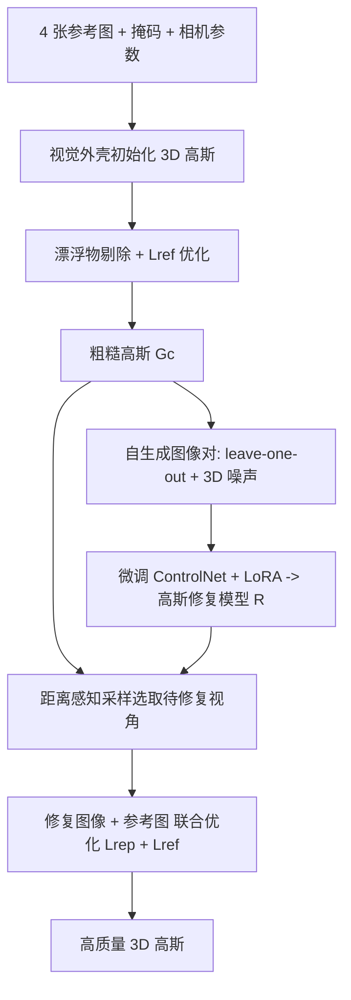

## 一句话总结

GaussianObject 用 3D Gaussian Splatting 表示物体，通过"视觉外壳初始化 + 漂浮物剔除"注入结构先验，再借助基于扩散模型的高斯修复模型补全被遮挡/压缩的信息，仅需 **4 张**输入图像即可在 360° 范围内重建高质量 3D 物体，并提供无需精确相机位姿的 COLMAP-free 变体。

## 研究背景

从 2D 图像重建、渲染 3D 物体是长期的核心问题，但传统方法通常需要数十张多视角图像，采集成本高、对普通用户不友好。作者聚焦"极稀疏视角"（例如 360° 范围内仅 4 张图）这一挑战场景，指出两大核心困难：

1. **多视角一致性难以建立**：可用于匹配的图像太少，3D 表示容易过拟合训练视角，退化成缺乏合理结构的碎片化像素块。
2. **信息缺失或严重压缩**：稀疏采集下，物体的部分内容会被遗漏，或在极端视角（视线接近平行于表面）下被严重压缩，仅凭输入图像难以在 3D 中恢复。

现有稀疏重建方法（NeRF 系正则化方法、扩散先验方法、大重建模型 LRM 等）要么依赖 SfM 点、要么对输入视角分布/物体位置有严格要求、要么需要大规模预训练，难以处理真实世界的极稀疏采集。作者选择 3DGS 作为基础表示，因其快速且显式（点状结构便于注入结构先验）。

## 方法

### 整体框架

GaussianObject 分为三个阶段：先用结构先验做初始优化得到粗糙高斯 $$G_c$$，再用自生成策略训练一个高斯修复模型 $$R$$，最后用该模型对被污染的渲染视角进行修复以精修高斯。

### 关键设计 1：视觉外壳初始化（Visual Hull）

极稀疏视角下 SfM 点常常缺失，无法为 3DGS 提供初始化。作者利用相机视锥与物体掩码构造视觉外壳作为几何脚手架：通过拒绝采样在外壳内随机初始化点（把均匀采样的 3D 点投影到各图像平面，保留落在所有掩码交集内的点），点颜色取各参考图投影处双线性插值像素颜色的平均值，再转成 3D 高斯（位置为 $$\mu$$、颜色转 $$sh$$、相邻点平均距离为尺度 $$s$$、旋转 $$q$$ 设为单位四元数、不透明度 $$\sigma$$ 设常数）。掩码可由 SAM 等分割模型轻松获得，代价远低于稠密 SfM。

### 关键设计 2：漂浮物剔除（Floater Elimination）

视觉外壳会包含不属于物体的区域，表现为漂浮物，损害新视角合成质量且难以被优化修正。作者用 KNN 统计每个高斯到最近 $$\sqrt{P}$$ 个高斯的平均距离，基于均值和标准差建立正常范围，剔除平均邻距超过自适应阈值的高斯：

$$
\tau = \text{mean} + \lambda_e \cdot \text{std}
$$

该过程在优化中周期性重复，$$\lambda_e$$ 线性衰减到 0 以逐步精化。初始优化的整体损失结合颜色（L1 + D-SSIM）、掩码（BCE）与单目深度损失：

$$
L_{ref} = (1-\lambda_{SSIM})L_1 + \lambda_{SSIM}L_{D\text{-}SSIM} + \lambda_m L_m + \lambda_d L_d
$$

得益于高效初始化，在 779×520 分辨率下训练粗糙高斯 $$G_c$$ 仅需约 1 分钟。

### 关键设计 3：高斯修复模型与自生成图像对

粗糙高斯在观测不足、遮挡或未观测区域仍有缺陷。作者构建基于扩散模型的高斯修复模型 $$R$$，输入被污染渲染 $$x'$$、输出高保真图像 $$\hat{x}$$。训练数据对通过两种自生成策略构造：

- **Leave-one-out 训练**：从 $$N$$ 张图构造 $$N$$ 个子集（各含 $$N-1$$ 张参考图 + 1 张留出图），训练后再用留出图继续训练，收集不同迭代下留出视角的渲染，与留出图配对。
- **添加 3D 噪声**：从留出前后高斯属性差异的均值 $$\mu_\Delta$$、方差 $$\sigma_\Delta$$ 派生 3D 噪声 $$\epsilon_s$$，注入高斯属性生成更多退化渲染。

在预训练 ControlNet 上注入 LoRA 权重微调（文本编码器、图像条件分支和 U-Net），损失为：

$$
L_{tune} = \mathbb{E}_{x_{ref},t,\epsilon,x'}\left[\|\epsilon_\theta(x_{ref}^t, t, x', c_{tex}) - \epsilon\|_2^2\right]
$$

其中 $$c_{tex}$$ 是对象特定提示词 "a photo of [V]"（借鉴 Dreambooth）。

### 关键设计 4：距离感知采样修复与 COLMAP-free 变体

修复阶段建立与训练视角对齐的椭圆路径：靠近参考视角的弧为参考路径（渲染质量高），其余弧为待修复路径。对采样视角 $$\pi_j$$ 渲染并编码后，类似 SDEdit 扰动为噪声隐变量再经 DDIM 采样修复，用到参考视角的距离加权修复可靠性：

$$
\lambda(\pi_j) = \frac{2 \cdot \min_{i=1}^{N}(\|\pi_j - \pi_i\|_2)}{d_{max}}
$$

**CF-GaussianObject** 引入 DUSt3R 估计粗糙点云、相机位姿与内参（并令各图共享同一内参 $$\hat{K}$$），无需精确相机参数即可完成 360° 稀疏重建，扩大实际应用范围。整个 GaussianObject 流程在单张 RTX 3090 上处理 4 张图约需 30 分钟。

## 实验结果

在 MipNeRF360 数据集 4 视角设置下，GaussianObject 全面超越各类基线，尤其在感知质量 LPIPS 上优势显著（相比 FSGS 从 0.0951 降到 0.0498）。CF-GaussianObject 在无精确相机参数下仍具竞争力。

| 方法 (MipNeRF360, 4-view) | LPIPS* ↓ | PSNR ↑ | SSIM ↑ |
|---|---|---|---|
| DVGO | 24.43 | 14.39 | 0.7912 |
| 3DGS | 10.80 | 20.31 | 0.8991 |
| DietNeRF | 11.17 | 18.90 | 0.8971 |
| FreeNeRF | 16.83 | 13.71 | 0.8534 |
| SparseNeRF | 17.76 | 12.83 | 0.8454 |
| ZeroRF | 19.88 | 14.17 | 0.8188 |
| FSGS | 9.51 | 21.07 | 0.9097 |
| **GaussianObject (Ours)** | **4.98** | **24.81** | **0.9350** |
| CF-GaussianObject (Ours) | 8.47 | 21.39 | 0.9014 |

（注：LPIPS* = LPIPS × 100，越低越好。）

消融实验（MipNeRF360，4 视角）显示各组件均有贡献：去掉视觉外壳初始化性能急剧下降（LPIPS* 从 4.98 恶化到 12.72，PSNR 从 24.81 降到 15.95）；去掉修复模型微调（Setup）或修复过程会明显损失感知质量；用 SDS 损失替代修复损失反而导致优化不稳定、性能下降（PSNR 22.42）。修复模型结构对比中，本文方法（LPIPS* 5.79 / PSNR 23.55）优于 Dreambooth、深度条件 ControlNet 以及 Zero123-XL 等替代方案。

## 亮点与局限

**亮点**

- 将输入视角需求从 FSGS 的 20+ 张大幅降到仅 4 张，且不依赖 SfM 点。
- 用显式结构先验（视觉外壳 + 漂浮物剔除）替代难以获得的 SfM 初始化，思路直接有效。
- 高斯修复模型通过 leave-one-out 与 3D 噪声自生成训练对，把 2D 扩散先验巧妙迁移到 3D 修复，弥补稀疏视角的信息缺失。
- 提供 COLMAP-free 变体，降低对精确相机参数的依赖，更贴近日常手机拍摄场景。

**局限**

- 修复模型需针对每个物体做 LoRA 微调与多次 leave-one-out 训练，整体流程约 30 分钟，非实时/前馈式。
- 依赖物体掩码（视觉外壳初始化对掩码质量敏感），面向单物体重建场景，未针对复杂场景。
- CF-GaussianObject 的性能会随输入视角数增多而下降，主要受限于 DUSt3R 位姿估计精度的退化。

## 延伸思考

- 这类"结构先验 + 2D 扩散修复"的范式能否推广到更一般的场景级稀疏重建（而非单物体）？掩码依赖是主要瓶颈之一。
- 每物体微调的开销限制了规模化应用，是否可以把修复模型训练成可泛化的前馈式先验，避免逐物体优化？
- 距离感知采样体现了"哪里观测不足就往哪里修"的思想，这种基于几何可靠性的自适应监督权重设计，对其它稀疏监督任务也有借鉴意义。
- 借助 DUSt3R 等匹配/位姿基础模型消除 COLMAP 依赖，是把稀疏重建推向"随手拍即可重建"的关键方向，未来位姿估计精度提升有望进一步缩小与有位姿版本的差距。
