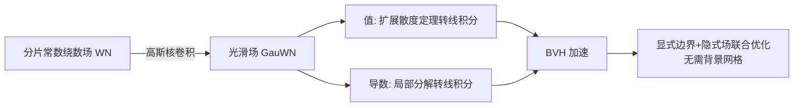

## 一句话总结

通过高斯核对绕数（winding number）场做卷积，得到一个对空间位置和多边形顶点都可微、且能高效计算数值与导数的光滑绕数场 GauWN，从而在无需背景网格的情况下同时耦合显式边界与隐式场来求解几何优化问题。

## 研究背景

绕数是判定二维点在多边形内外的经典工具，也能把边界表示（显式）转成刻画内外标注的场（隐式），并被推广到三维、非封闭边界与点云等，广泛用于边界修补、内外分割、相交消解等任务。

但传统的"两阶段"流程存在痛点：先由边界生成隐式场、再从场中提取显式边界，二者难以同时控制，而且需要精心构造背景网格来存储中间隐式场，用户被迫在效率与鲁棒性之间权衡分辨率。

更根本的困难在于可微性：封闭边界的绕数场是分片常数，梯度在几乎所有位置为零、在边界处为无穷，无法直接用于基于梯度的优化。要想让"限制形变、保持拓扑"（适合显式表示）与"内部绕数为 1、外部为 0"（适合隐式表示）这类目标能被联合优化，就必须让绕数对测试点位置和多边形顶点位置同时可微。

## 方法

整体框架是：对分片常数的绕数场 $$w_\Gamma(x)$$ 做高斯核卷积得到光滑场，定义

$$
W_\Gamma^\sigma(q) := \iint_{\mathbb{R}^2 \setminus \Gamma} w_\Gamma(x)\, G(x - q;\, \sigma^2 I)\, dS,
$$

其中 $$G(x;\sigma^2 I)$$ 是可分离的二维高斯核。直接在网格上做卷积既慢又不准，因此论文推导出对分片线性曲线可高效计算的闭式/线积分形式，并给出两类导数。

**关键设计一：扩展散度定理把面积分转为线积分（值计算）。** 论文提出适用于可能自相交封闭曲线的扩展散度定理：

$$
\iint_{\mathbb{R}^2 \setminus \Gamma} w_\Gamma(x)\, \nabla \cdot F\, dS = \oint_{\Gamma} \langle F, n \rangle\, ds.
$$

构造满足 $$\nabla \cdot F_q(x) = G(x-q;\sigma^2 I)$$ 的向量场 $$F_q$$，就能把卷积化为沿曲线的线积分，无需显式求几何相交；对分片线性曲线，该线积分有以二元正态累积分布函数表达的闭式解。

**关键设计二：局部分解处理导数的奇异性（梯度计算）。** 绕数梯度带有奇异行为。论文利用平移不变性得到 $$\frac{\partial W_\Gamma^\sigma}{\partial q} = -\sum_i \frac{\partial W_\Gamma^\sigma}{\partial v_i}$$，从而只需求对顶点的梯度。在边 $$\gamma = v_i v_j$$ 的邻域内，把绕数局部分解为一个在 $$\gamma$$ 处跳变的 Heaviside 阶跃函数与其它无关项之和：

$$
w_\gamma(x) = H\big(\langle n, x - v_j \rangle\big) + \varepsilon(x),
$$

其导数为 Dirac delta，再借助 delta 的复合性质把面积分消解为沿边的线积分。结合高斯核的径向对称性与正交可分离性，最终得到线性复杂度的闭式导数表达。

**关键设计三：BVH 加速且保持"封闭曲线积分"性质。** 远离查询点 $$q$$ 的曲线部分贡献很小，用 AABB 树聚类简化。关键在于近似曲线必须仍是封闭的，否则会引入显著偏差：论文在节点中存储每个连通分量的两个端点，用连接端点的线段近似该分量，并保证端点是原曲线顶点，从而近似曲线保持封闭。梯度计算更简单，凭高斯核快速衰减性质可直接丢弃足够远节点的贡献。

基于可微性，论文把多个应用统一表述为变分问题，例如消解嵌入问题（相交/翻转）时用一致性能量 $$E_D$$ 配合正则项 $$E_R$$，并采用退火策略：从较大 $$\sigma=0.01$$ 起步、每次迭代乘 0.95 逐步减小，让结果收敛到接近原始绕数。此外还支持基于 in-out brush 的交互式曲线建模，以及用 GauWN 空间梯度定义流来做保特征的曲线偏置。

## 实验结果

在含 426 个二维形状边界多边形的数据集上，对 $$100 \times 100$$ 网格共 10000 个点做值与梯度评估，比较 GauWN 与原始绕数 WN 的耗时（$$\sigma=0.01$$）。

| 计算项 | 相对 WN 的速度 |
| --- | --- |
| GauWN 值（无 BVH） | 约慢 3~4 倍 |
| GauWN 值（有 BVH） | 慢不到 2 倍 |
| GauWN 空间梯度（有 BVH） | 快于值计算（可忽略远处顶点贡献） |

复杂度方面，WN 无 BVH 为 $$O(\|L\|)$$、有 BVH 为 $$O(\log \|L\|)$$（$$\|L\|$$ 为线段数）；实验中把 180 顶点曲线重采样到最多 18000 顶点，GauWN 及其导数的耗时基本随顶点数线性增长。整体成本约为原始绕数的 4~6 倍，且 $$\sigma$$ 对性能影响很小。

## 亮点与局限

亮点：把分片常数、不可微的绕数场变得对空间位置与顶点位置同时可微，实现显式表示与隐式场的双向耦合；用扩展散度定理与局部分解得到线积分闭式，配合 BVH 达到线性/对数复杂度；最关键的是全程无需背景网格，直接在无网格方式下评估隐式场，极大简化了嵌入问题消解、交互建模、保特征偏置等应用的求解。

局限：只在二维实现了高效方法，思路可推广到三维但效率是重大挑战，初步用数值求积做三维积分性能不理想；高斯卷积会"倒角"锐利拐角，尖角附近内外测试可能出错，只能靠减小 $$\sigma$$ 缓解；导数在远离边界处近乎为零，若把 in-out brush 放在离曲线较远处，优化会卡在局部极小、曲线不响应；当高斯核覆盖到局部特征尺寸很小的区域时会过度平滑，空间梯度甚至可能与外法向相反。

## 延伸思考

GauWN 的核心洞见是"先算场再平滑"而非"先平滑核再积分"，这让平滑对象直接是内外标注结果，可微性和高效导数得以兼得。这种"用高斯卷积换可微性、以拓扑保持为代价接受倒角"的取舍，本质上揭示了可微隐式场与锐利特征之间的固有矛盾——精确对齐尖角必然导致场在角点不可微，而论文选择变形显式表示来保留尖锐特征，为需要保特征的场景提供了不同于纯隐式方法的路线。

向三维推广、以及扩展到不完整边界和曲面流形上的可微绕数，是自然的后续方向；如何在三维克服高斯核积分的效率瓶颈，可能需要新的解析近似或分层结构，而非简单数值求积。
