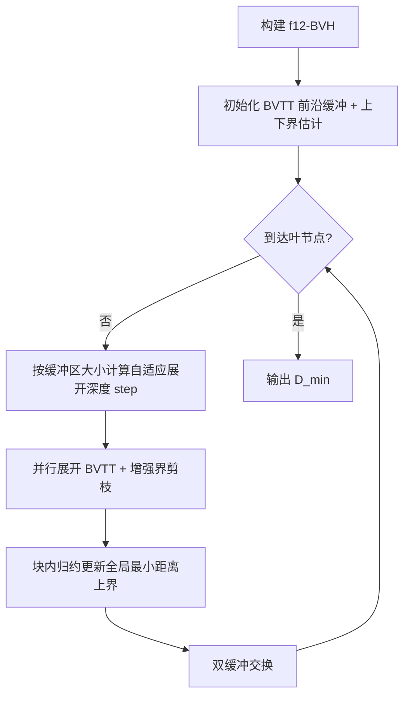

## 一句话总结

gDist 是一套面向 GPU 的高度并行算法，通过增强型 AABB 距离界、自适应 BVTT 展开深度与专为 GPU 设计的 f12-BVH，把两个各含千万级三角形网格之间的最大/最小距离查询压缩到亚毫秒级，相比 CPU 与朴素 GPU 方案取得一到三个数量级的加速。

## 研究背景

3D 网格模型之间的最大/最小距离计算是机器人、CAD、VR/AR 等应用的核心操作，用于干涉检测、碰撞检测等任务。这类查询的效率长期是工业界与学术界的难题。

主流方法基于包围体层次结构（BVH），通过维护一个 BVTT（Bounding Volume Traversal Tree）前沿来加速成对包围体测试。但已有并行方案存在两个痛点：一是 BVTT 前沿会带来巨大的内存开销；二是当串行算法能通过启发式深度优先搜索快速剪枝时，并行算法的缓冲区里只剩少量节点，导致 GPU 资源利用不足。此外，把点到网格的高效查询扩展到网格到网格并不容易。gDist 正是要在保持通用性（对运动方式、相对大小、距离都不敏感，同时支持刚体与可变形体）的前提下，充分释放 GPU 的并行吞吐。

## 方法

整体流程：为两个模型构建 AABB 层次结构（f12-BVH），初始化两个双缓冲的 BVTT 前沿缓冲区，并给出根节点间最小距离的上下界估计 $$upper_{global}$$。随后迭代地展开 BVTT，直到所有节点均为叶节点，最终返回 $$upper_{global}$$ 作为 $$D_{min}$$。最大距离的计算可对称地推导。

**增强型 AABB 距离界。** 常规做法把最小距离的上界直接取为两个 AABB 间的最大距离 $$\hat{d}^{U}_{min} = \max_{P \in V_a, Q \in V_b}\|PQ\| = d^{U}_{max}$$。论文观察到当 AABB 是"紧致"的（模型顶点在其六个包围矩形上各有落点），可得更紧的界：

$$d^{U}_{min} = \min\{\max_{P \in S^{V_a}_i, Q \in S^{V_b}_j}\|PQ\|\}, \quad d^{L}_{max} = \max\{\min_{P \in S^{V_a}_i, Q \in S^{V_b}_j}\|PQ\|\}$$

其中 $$S$$ 表示 AABB 的六个包围矩形。可以证明，只要 BVH 所有叶节点的 AABB 紧致，则所有节点均紧致。更紧的界显著提升剪枝效率，消融实验显示节点数最多可降到常规界的 4%。

**自适应展开深度。** 固定展开层数并不理想：太少会让缓冲区节点不足、GPU 空转并频繁 CPU-GPU 同步；太多则损害剪枝、浪费时空。gDist 根据当前节点数 $$n$$ 动态求最大展开深度 $$k$$，使 $$2^{2k} n < C$$。由于 f12-BVH 是满二叉树，展开 $$n$$ 个节点 $$k$$ 层后节点数少于 $$C$$。实践中 $$C$$ 取 $$1024 \times 256$$，$$k$$ 常取 5。

**f12-BVH 与细粒度并行。** 常用的 lbvh 在 GPU 上查找第 $$k$$ 个后代需要顺序跟随左右孩子指针，难以映射到线程。f12-BVH 是"每个叶节点含 1 或 2 个三角形的满二叉树"，按 Morton 码排列，可用位运算直接定位第 $$k$$ 个后代，并按线程 ID 决定其处理哪个新生成的 BVTT 节点：线程 $$t$$ 处理第 $$\lfloor t / 2^{2k} \rfloor$$ 个 BVTT，低 $$2k$$ 位编码后代组合。它把"一个 BVTT 节点分配给多个线程"，相邻线程访问相邻内存，形成合并访存且缓存友好。最小值维护采用块内归约后用 atomicCAS 手动实现浮点 atomicMin。

## 实验结果

在 NVIDIA GeForce RTX 4090 上与优化的 CPU 算法（PQP、FCL、SSE）及一个朴素 GPU 实现对比，单位为毫秒。

| Benchmark | Our | PQP | FCL | SSE | NaïveGPU | 加速比 |
|---|---|---|---|---|---|---|
| Tools | 0.31 | 463.93 | 733.48 | 541.98 | 2.58 | 8.45 |
| Rings | 0.53 | 14.04 | 34.99 | 12.85 | 39.72 | 75.58 |
| Apples | 0.21 | 7.36 | 15.84 | 7.42 | 2.46 | 11.99 |
| Comet-Tool | 0.80 | 73.49 | 167.96 | 81.27 | 353.53 | 442.60 |
| Balls | 0.49 | 19.62 | 37.46 | 18.47 | 4.54 | 9.29 |
| Penetration | 0.38 | 7.36 | 14.81 | 7.58 | 142.19 | 377.72 |
| Truck | 0.19 | 44.27 | 55.19 | 43.65 | 159.03 | 836.98 |
| Terrains | 0.35 | 106.60 | 239.28 | 122.85 | 4.72 | 13.48 |
| MaxDist | 0.25 | / | / | / | / | / |
| Deformable | 0.51 | / | / | / | / | / |

对含 1500 万三角形的 Rings，查询在 0.53 ms 完成。在极端的 Intersection 场景（每模型 100 万三角形并在指定点相交）中，朴素 GPU 方案需约 3778 秒，而 gDist 仅需 0.59 ms，加速超过 6403 倍。跨 GPU 测试（RTX 4090/3090/2060）显示性能随 CUDA 核心数良好扩展。15M 三角形场景内存开销低于 980 MB。消融实验表明：关闭增强界会使运行时间增加 1.5–2.2 倍，关闭自适应 BVTT 展开在几乎所有场景中都导致性能下降。

## 亮点与局限

亮点：
- 增强型 AABB 距离界从几何上收紧了最小距离上界，剪枝效果显著（节点数最低降至 4%），且不影响正确性。
- 自适应展开深度 + f12-BVH 让"一个节点多线程"的细粒度并行落地，实现负载均衡与合并访存。
- 通用性强：对运动、相对尺寸、距离不敏感，支持刚体与可变形体，可统一处理最大与最小距离。

局限：
- CPU/GPU 同步是最大瓶颈，占总运行时间的 40%–66%，源于每次迭代都要把 BVTT 节点数从 GPU 传回 CPU 以确定线程数与终止条件，打断了异步执行。
- 把三角形数量凑成 2 的幂、相邻图元合并会轻微牺牲 BVH 质量；在极端糟糕的空间划分下性能会有所下降。
- 增强界依赖"扩大包围盒以提升鲁棒性"的常见做法会失效，因为放松包围盒会导致界估计错误、剪枝出错。

## 延伸思考

CPU/GPU 同步成为主导开销，提示后续可探索完全驻留 GPU 的迭代控制（如通过设备端动态并行或持久化内核，避免把节点数回传 CPU 来设定线程数）。增强距离界的思想本质是"用包围面而非包围体极值来估界"，这一几何洞察或可迁移到其他包围体类型（如 OBB、球扫描体）或用于加速 Hausdorff 距离、穿透深度等相关查询。此外，把三角形数补齐到 2 的幂以换取满二叉树的位运算寻址，是一种典型的"用结构规整性换 GPU 友好性"权衡，值得在其他层次结构算法的 GPU 移植中借鉴。
