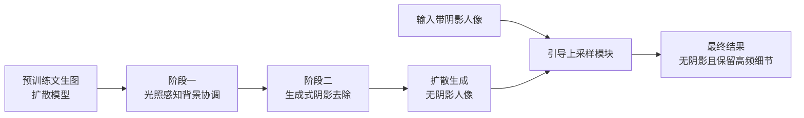

## 一句话总结

把人像阴影去除从传统的"局部残差传播"重新表述为"从零全局重建无阴影人像"的生成任务，用一个经过"组合式重定向（先学背景光照协调、再学阴影去除）"训练的扩散模型，配合引导上采样恢复高频细节，实现对自遮挡与外部遮挡硬阴影的稳健去除。

## 研究背景

人像阴影去除是一个高度病态的问题：单张图像下，被阴影或高光覆盖区域的真实肤色可能对应多个合理解，属于典型的一对多映射。现实场景中动态、彩色的光照进一步加剧了这一难度。

已有方法大多采用**局部传播**思路：网络预测一层残差外观，把邻域像素的信息扩散过去。这类方法存在两个突出问题：

- 容易陷入局部极小，尤其在强阴影的清晰边界处去除不彻底、留下明显残影或模糊。
- 依赖反渲染（如本征反照率分解）的方法往往会大幅改变人像的光照分布，导致前景与原背景光照不一致，合成结果不自然。

本文主张：与其做局部修补，不如让生成式扩散模型以"带阴影人像"为条件，从头全局地重建整张无阴影人像，从而获得全局一致的结果，同时保留原始光照分布与人物身份细节。

## 方法

### 整体框架

方法核心是对一个预训练文本到图像扩散模型做**组合式重定向（compositional repurposing）**，分阶段迁移图像先验，最后用一个引导上采样模块补回高频细节。

扩散模型的前向加噪在潜空间中进行：

$$
z_t = \sqrt{\alpha_t}\, z_0 + \sqrt{1 - \alpha_t}\, \boldsymbol{\epsilon}, \quad \boldsymbol{\epsilon} \sim \mathcal{N}(0, I)
$$

反向去噪同时接受局部条件与全局条件，训练目标为：

$$
\mathcal{L} = \mathbb{E}_{z_0, y, \boldsymbol{\epsilon} \sim \mathcal{N}, t}\left[\left\| \boldsymbol{\epsilon} - \boldsymbol{\epsilon}_{\boldsymbol{\theta}}(\{z_t, L\}, t, \boldsymbol{\tau}(G)) \right\|_2^2\right]
$$

其中 $$L$$ 为与潜噪声空间对齐的局部条件（如输入图像经 VAE 编码后的时不变特征），$$G$$ 为不空间对齐的全局条件（如背景图像），通过交叉注意力注入；$$\boldsymbol{\tau}(\cdot)$$ 是把全局变量投影到嵌入空间的子空间嵌入函数。

### 关键设计 1：光照感知的背景协调（阶段一）

先把预训练文生图模型微调为"让前景人像与给定背景场景在颜色和光照上相协调"的模型：

$$
\mathcal{L} = \mathbb{E}_{z_0, y, \boldsymbol{\epsilon} \sim \mathcal{N}, t}\left[\left\| \boldsymbol{\epsilon} - \boldsymbol{\epsilon}_{\boldsymbol{\theta}}(\{z_t, z_L, M\}, t, \boldsymbol{\tau}(G)) \right\|_2^2\right]
$$

其中 $$M$$ 是下采样前景掩码，直接与潜噪声拼接以引导注意力聚焦前景；$$z_L$$ 是未协调输入图像经 VAE 编码得到的时不变局部条件；$$G$$ 为背景图像，用其下采样版本（32×32）作为光照图，经 DINOv2 投影到嵌入空间引导全局光照。这一步让模型学会大量人像在不同光照下的外观，形成对全局光照分布的先验。

### 关键设计 2：生成式阴影去除（阶段二）

在协调模型基础上继续微调：把带阴影/高光的输入人像作为局部条件 $$z_L$$，把无阴影人像作为监督目标 $$z_0$$，全局条件 $$G$$ 换成输入人像自身的下采样图作为光照图。为缓解顺序学习带来的**灾难性遗忘**，这一阶段使用比协调阶段更小的学习率。作者实验发现"协调+去除联合训练"会让模型陷入次优点、阴影去除质量明显下降，因此必须分解为两步先后进行。

### 关键设计 3：引导上采样恢复高频

潜空间扩散去噪不可避免会丢失毛孔、皱纹、衣物纹理等高频细节。基于"阴影主要体现为图像的低频成分"这一假设，用一个轻量局部预测网络把生成图的低频光照与输入图的高频细节融合：

$$
I_{\text{refined}} = f\big(I_{\text{input}}, l(I_{\text{generation}})\big)
$$

其中 $$l(\cdot)$$ 为低通（高斯）滤波，$$f$$ 用 ResidualNet 实现，采用 L2、VGG 与 GAN 损失训练。

### 数据构建

训练依赖三类专有数据组合：光台（lightstage）采集 150 名对象的 OLAT 图像（4 视角、160 盏 LED），用 HDR 环境图重打光生成协调数据与用能量保持模糊环境图生成的无阴影数据；数百个合成人体用点光线追踪并随机放置遮挡物模拟外部阴影；再用 2.5 万张真实人像通过中间模型生成伪真值、并借助单目深度与法线合成新阴影做增强。

## 实验结果

在含完整真值的验证集上与多种主流架构基线比较，本文方法在结构相似度与感知相似度上均大幅领先：

| 方法 | SSIM ↑ | LPIPS ↓ |
|------|--------|---------|
| GridNet | 0.828 | 0.156 |
| UNet | 0.841 | 0.143 |
| ResNet | 0.838 | 0.150 |
| ResNet$$_p$$ | 0.784 | 0.184 |
| HRNet | 0.829 | 0.156 |
| TFNet | 0.834 | 0.137 |
| **Ours** | **0.883** | **0.093** |

其他关键结论：身份保持（AdaFace 余弦相似度）本文达 0.790，优于最佳基线 TFNet 的 0.754；阴影去除一致性实验中，本文在三名测试对象上不仅 SSIM/LPIPS 最优，且在不同阴影下的标准差最低（如对象 1 的 LPIPS 标准差 0.0187，远低于基线约 0.05），说明对复杂新阴影更稳健。用户研究（27 人）中，本文在"去阴影/保身份/背景协调"三个问题上分别以 82%、75%、75% 的选择率大幅胜过两个 SOTA 基线。消融显示：联合训练会使 LPIPS 从 0.093 退化到 0.136；去掉协调阶段 LPIPS 降为 0.0975；去掉引导上采样 SSIM 从 0.883 降至 0.866。

## 亮点与局限

亮点：

- 把病态的人像阴影去除重新表述为"全局生成重建"，从机制上规避了局部传播在强阴影边界处易陷局部极小的顽疾。
- 组合式重定向（先协调、后去除）巧妙复用大规模图像先验，并让协调阶段学到的全局光照先验显著增强阴影分布建模，保持前景与原背景光照一致。
- 引导上采样在潜扩散丢细节与身份保持之间取得平衡，可满足生产级应用需求。

局限：

- 面对输入人像时有时难以完好保留原始肤色。
- 会被皮肤上的彩色纹理（如化妆）干扰。
- 输入人像存在大面积缺失区域时质量明显下降；虽借助扩散先验能一定程度处理多人，但训练数据以单人像为主，多人场景性能无保障。
- 引导上采样在扩散去除不完美时，偶尔会把阴影边界当作细节复原成伪影，这也是其 LPIPS 略逊于直接生成结果的原因。

## 延伸思考

- "先学协调、再学去除"的分阶段重定向本质上是一种任务先验的课程式注入，这种"用相邻但更易获取监督的任务预热全局先验、再迁移到目标病态任务"的范式，或可推广到去反光、去雾、本征分解等其他病态图像增强任务。
- 方法对全局光照分布保持得较好，天然适合作为人像重打光、人像解析、干净外观建模等下游任务的前处理；论文也展示了文本引导重打光与部件感知阴影编辑等应用。
- 低频=阴影、高频=身份的频域分工假设是引导上采样的核心，但当阴影本身带清晰硬边界（高频）时该假设会失效并产生伪影，如何在生成阶段就更彻底地清除硬边界、减轻对后处理的依赖，是值得深入的方向。
- 训练强依赖光台与合成人体等专有数据，真实数据仅以伪真值形式加入且量化收益有限，说明这类生成式增强对高保真配对数据仍高度敏感，数据可获取性可能是复现与推广的主要门槛。
