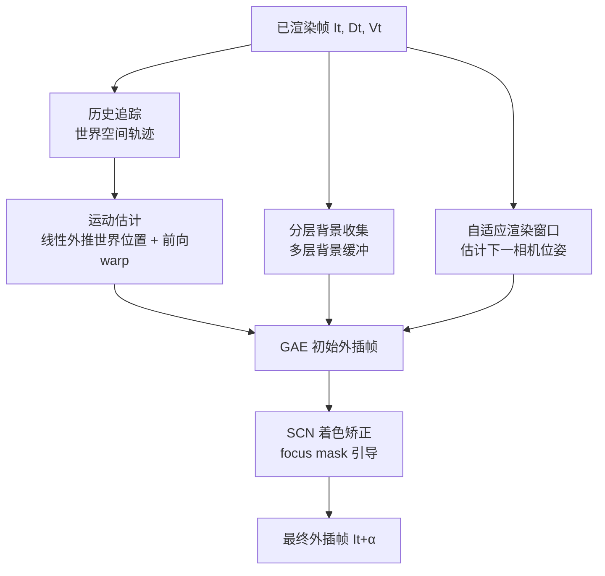

## 一句话总结

GFFE 提出一种不依赖外插帧 G-buffer、也不引入额外延迟的帧外插框架：用启发式运动估计 + 分层背景收集 + 自适应渲染窗口处理几何运动与遮挡消除，再用一个轻量着色矫正网络修正阴影与反射的非几何运动，在实时渲染下把 30 FPS 平滑提升到 60 FPS。

## 研究背景

实时渲染对高分辨率、高帧率的需求日益增长（尤其是实时路径追踪），但即便最强的硬件也难以在固定算力/功耗预算下逐帧渲染所有画面。帧生成技术因此被用来提升帧率，主要分两类：

- **帧插值**（DLSS 3、FSR 3 等）：在两张已渲染帧之间生成中间帧。由于生成帧依赖"下一帧"，必然引入至少一个渲染时间间隔的按键到显示延迟，对竞技游戏、VR 等低延迟场景体验较差。
- **帧外插**：仅基于历史帧生成未来帧，不引入额外延迟，但更困难——缺少未来帧信息，遮挡消除（disocclusion）区域难以填补。现有外插方法（ExtraNet、LMV、ExtraSS）依赖外插帧的 G-buffer 来引导生成，而 G-buffer 在前向渲染引擎、移动端、云游戏客户端等场景并不总是可得，且生成成本不可忽视；不依赖 G-buffer 的视频外插方法（如 DMVFN）质量与性能又难以满足实时要求。

作者的核心洞见是：外插帧缺失的信息大多可从被丢弃的历史帧中近似恢复，且片元运动可从历史帧合理估计，因此无需为外插帧渲染 G-buffer。论文据此定义了"G-buffer free"外插任务——仅使用已渲染帧的颜色、深度和运动矢量（这些通常已有），不使用外插帧的任何 G-buffer。

## 方法

### 整体框架

给定一段已渲染帧序列 $$\{I_t\}$$ 及其深度 $$\{D_t\}$$、运动矢量 $$\{V_t\}$$，框架生成新帧 $$\{\bar{I}_{t+\alpha}\}$$ 及对应的深度 $$\{\bar{D}_{t+\alpha}\}$$ 与运动矢量 $$\{\bar{V}_{t+\alpha}\}$$，其中外插因子 $$\alpha = \frac{j}{n+1}$$（$$n$$ 为每张渲染帧要外插的帧数，$$j$$ 为第几张外插帧）。

框架分为两大部分：在已渲染帧上准备信息（历史追踪、背景收集、自适应渲染窗口），在外插帧上执行几何感知外插（GAE）与着色矫正网络（SCN）。

### 关键设计 1：启发式运动估计

不使用重而慢的神经网络预测运动，而是逐片元在**世界空间**做线性外推。历史追踪递归地为每个像素维护 $$k$$ 个历史世界位置 $$\{P_i[x]\}$$，并用静态测试（比较运动矢量反投影得到的历史屏幕位置距离阈值）避免遮挡带来的错误对应。下一位置按线性运动估计：

$$
NP_{t \to t+\alpha}[x] = \alpha\,(P_0[x] - P_1[x]) + P_0[x]
$$

作者指出世界空间的线性假设比图像空间更可靠（不受透视投影、相机旋转干扰），高阶多项式反而发散。随后按相机视图投影矩阵把片元前向 warp 到外插帧，同一像素多片元时用原子操作保留最小深度。

### 关键设计 2：分层背景收集处理静态/动态遮挡消除

洞见是：当前被遮挡的区域往往在更早的历史帧中出现过。为避免存储大量历史帧，设计**分层背景缓冲** $$B=\{B_l\}$$，共 $$L$$ 层，每层含颜色+深度，越深层分辨率越低（深一层仅为上一层的 1/4）。已渲染帧的静态片元填入第 0 层，逐层按两种情况更新：

- **同层填充**：若同层对应位置无效，用上一帧背景 $$B'_l[x]$$ 填入；
- **更深层下沉**：若同层已有效且 $$B'_l[x]$$ 深度更大，则把它放入下一层 $$B_{l+1}$$，表示当前层背后的更深片元。

外插帧生成时把收集到的背景投影回来，仅填补遮挡消除的无效区域。两层背景既能恢复动态物体背后、也能恢复相机运动导致的静态物体背后的遮挡区。

### 关键设计 3：自适应渲染窗口 + 着色矫正网络（SCN）

- **自适应渲染窗口**处理"出屏遮挡消除"（如相机持续右转露出的从未出现过的边界区域）。相比简单扩大 FOV 带来大量冗余、同等成本下变模糊，作者先按相机位姿线性外推估计下一位姿 $$\bar{C}_{t+\alpha} = C_t + \alpha \cdot (C_t - C_{t-1})$$，再取当前与预估视口的并集作为实际渲染窗口，减少冗余区域。
- **SCN** 处理阴影、反射等"非几何运动"（例如阴影以 30 FPS 移动而物体以 60 FPS 移动会产生滞后）。它先算 focus mask 只聚焦需要矫正的着色区域（用 SMAPE 度量 + 排除动态像素）：

$$
M_{\text{focus}}[x] = \Big(\min_{x'\in N(x)} s(I^{GAE}[x], I^{gt}[x']) > 0.5\Big) \wedge (\hat{M}_{\text{dyn}}[x] = 0)
$$

网络输入为 GAE 输出、投影深度、从 $$t-1$$ 反向 warp 的帧、以及输入 mask，输出经 focus mask 融合：

$$
\bar{I}_{t+\alpha} = \bar{I}^{GAE}_{t+\alpha}\cdot(1-\bar{M}_{\text{focus}}) + \bar{I}'_{t+\alpha}\cdot \bar{M}_{\text{focus}}
$$

这样既矫正非几何运动又保持锐利细节，网络远比 UPR-Net、IFR-Net、DMVFN 之类做全图光流估计的大网络轻量。

## 实验结果

在 Unreal Engine 采集的 8 个场景（4 个训练、8 个测试，其中 4 个训练中从未见过）上，以 1080p/30fps 输入、1080p/60fps 输出评测，对比帧插值方法 UPR-Net / IFR-Net、G-buffer 依赖外插方法 ExtraSS-E、G-buffer free 外插方法 DMVFN。8 场景平均指标（SSIM、LPIPS 已乘 $$10^2$$）：

| 方法 | 类型 | PSNR↑ | SSIM↑ | LPIPS↓ | FvVDP↑ |
|---|---|---|---|---|---|
| IFR-Net | 插值 | 24.24 | 84.39 | 18.01 | 7.17 |
| UPR-Net | 插值 | 24.87 | 84.95 | 28.41 | 7.55 |
| ExtraSS-E | G-buffer 外插 | 24.64 | 87.93 | 15.56 | 7.19 |
| DMVFN | G-buffer free 外插 | 21.73 | 76.09 | 20.78 | 6.80 |
| **GFFE (Ours)** | G-buffer free 外插 | 24.20 | 85.93 | **9.67** | **7.65** |

GFFE 在感知类指标 LPIPS、FvVDP 上全面领先（这两者对模糊、扭曲、时序闪烁更敏感，更贴合实时渲染体验）；PSNR/SSIM 与插值及 G-buffer 依赖方法相当。作者强调这并非公平对比——插值和 G-buffer 依赖方法处于更简单设定（无需处理遮挡消除或运动估计），但 GFFE 仍达到相当或更好的效果，且全面优于同类 G-buffer free 基线 DMVFN。

性能上（RTX 4070Ti Super，1080p），GFFE 全流程 6.62 ms，其中 SCN 2.30 ms、背景收集 1.13 ms、历史追踪 1.04 ms；对比 UPR-Net 43.04 ms、DMVFN 20.57 ms、IFR-Net 19.50 ms。ExtraSS-E 为 4.18 ms 但**不含** G-buffer 生成时间（复杂场景如 Park 需 8.23 ms，产品中甚至可能超 10 ms）。消融实验表明运动估计、分层背景收集、自适应窗口、SCN 与 focus mask 各模块均有贡献，其中去掉 focus mask 后 LPIPS 从 9.67 恶化到 35.63（全图变模糊）。

## 亮点与局限

**亮点**

- 真正意义的"外插帧不需要 G-buffer"，兼具低延迟与低集成成本，适配前向渲染、移动端、云游戏客户端等 G-buffer 不可得的场景。
- 混合式设计（启发式几何模块 + 轻量神经网络）而非单一大网络，因此在仅 4 个训练场景下仍对 8 个（含 4 个未见）场景有良好泛化与鲁棒性。
- 额外产出外插帧的深度与运动矢量，可无缝接入 DLSS/XeSS/FSR 等超分与抗锯齿管线；模块相对独立，低端设备可去掉 SCN 换取更好性能。

**局限**

- **未收集到的遮挡消除**：若某区域从未在历史帧出现且非出屏区域，背景收集会失败。
- **无深度的效果**：UI、粒子等缺深度信息，框架无法为其计算正确位置，需拆分到独立 pass。
- **遮挡区的着色变化**：因视角变化、动态光照，背景片元的着色可能不正确，当前未专门训练处理。
- **着色矫正不完美**：缺少 G-buffer 与未来帧信息，阴影等精细着色的矫正有时偏模糊。

## 延伸思考

- 世界空间线性运动假设是全篇效率的关键——它把"预测运动"从昂贵的图像空间光流降级为廉价的逐片元外推，代价是无法处理任意复杂/加速运动，这也解释了高阶多项式为何反而发散。这种"用几何先验换神经网络算力"的思路对延迟敏感的应用很有借鉴价值。
- 分层背景缓冲本质是一种"时序信息压缩存储"，用递减分辨率的多层结构近似场景的深度分层。它与 G-buffer 依赖方法的差异在于：后者用几何真值填洞，前者用历史观测填洞——前者更省集成成本，但对"从未见过"的区域无能为力，这是外插相比插值的本质短板。
- 论文指出可通过把 $$\alpha$$ 传给 SCN 来支持多帧外插，这暗示该框架天然适合 VR/AR 与云流式渲染中"一次渲染、多次外插"的高倍率帧率提升，是值得关注的延伸方向。
- 评测特意强调 PSNR/SSIM 对模糊与闪烁不敏感、应结合 LPIPS/FvVDP 与视频主观对比——这对帧生成类工作的评价方法学是个提醒：局部像素相似度指标可能高估过度模糊方法的质量。
